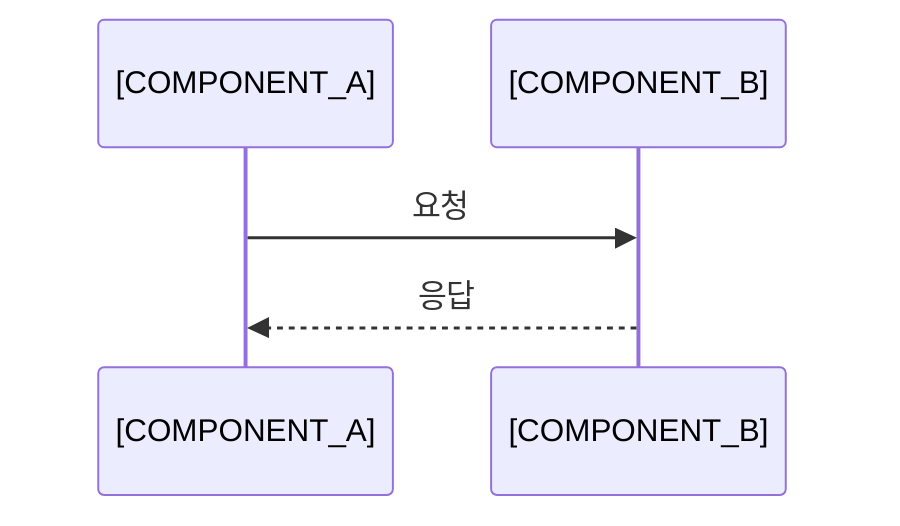

개념이 무엇인지 한두 문장으로 정의하고, 어떤 문제를 풀기 위한 것인지 적습니다. 저자 환경의 버전, 호스트, 설정 값은 적지 않습니다.

- **기준:** 설명의 근거가 된 명세나 공식 문서 이름과 버전 (예: `MQTT 5.0 명세`)

## 왜 필요한가

이 개념이 없을 때 어떤 문제가 생기는지 먼저 적고, 이 개념이 그 문제를 어떻게 푸는지 이어서 적습니다.
설명 중에 다른 개념이 나오면 한 문장으로만 짚고 [개념 글 제목](/posts/N/) 으로 링크합니다.

## 핵심 용어

용어는 본문에 처음 나올 때 굵게 쓰고 여기에 모읍니다. 용어 하나에 한 행입니다.

| 용어 | 뜻 |
| :--- | :--- |
| 용어 하나 | 한 문장 정의 |
| 용어 둘 | 한 문장 정의 |

## 동작 방식

흐름을 다이어그램으로 먼저 보여 주고, 번호 목록으로 한 단계씩 설명합니다.



1. `[COMPONENT_A]` 가 무엇을 하는지
2. `[COMPONENT_B]` 가 무엇을 하는지

예시가 필요하면 특정 환경에 묶이지 않는 작은 예시를 씁니다.

```text
[TOPIC]/[DEVICE_ID]/state
```

## 비슷한 개념과 비교 (선택)

독자가 헷갈리기 쉬운 개념과 차이를 표로 정리합니다.

| 구분 | 이 개념 | 비슷한 개념 |
| :--- | :--- | :--- |
| 목적 | | |
| 동작 방식 | | |
| 알맞은 상황 | | |

## 흔한 오해 (선택)

<details markdown="1">
<summary>잘못 알기 쉬운 내용을 한 줄로 적습니다</summary>

- **실제:** 실제로는 어떻게 동작하는지 적습니다.
- **근거:** 명세나 공식 문서의 해당 부분을 적습니다.

</details>

## 정리

> - 핵심 하나
> - 핵심 둘
> - 핵심 셋
{: .prompt-tip }

## 참고 자료

- [명세 또는 공식 문서 제목](URL)
- [블로그 글 제목](URL)
