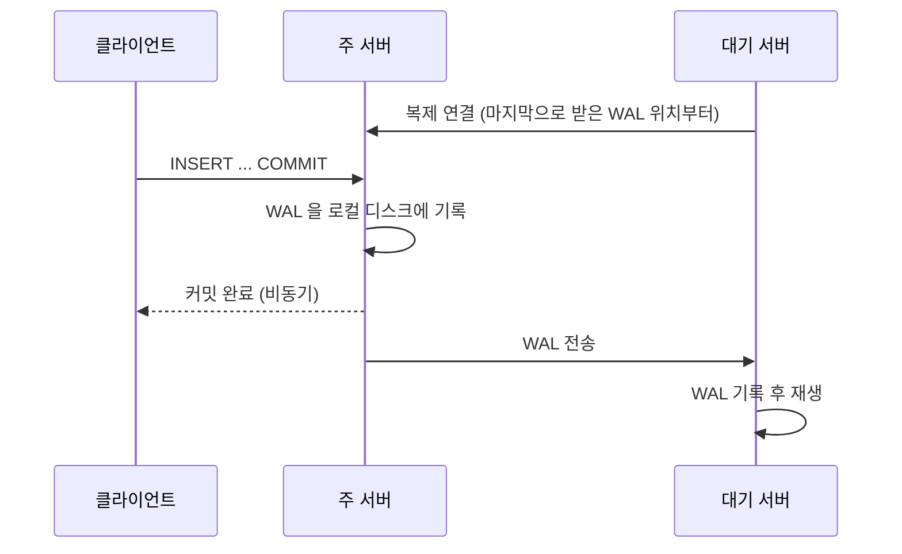
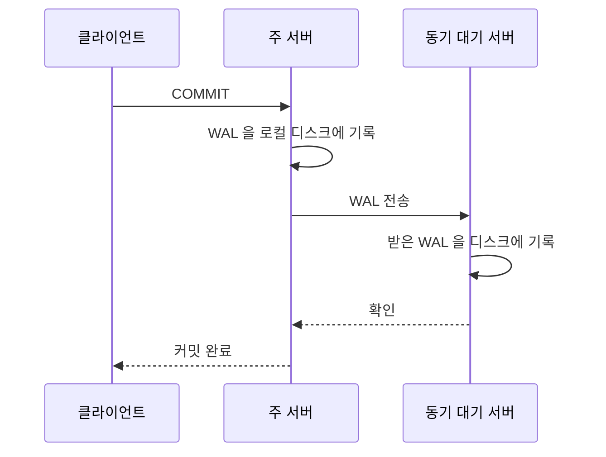
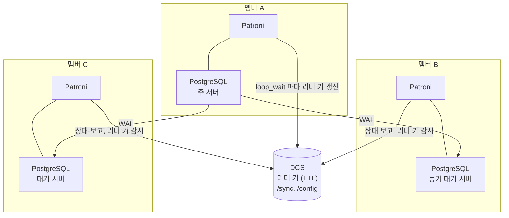

**스트리밍 복제**는 PostgreSQL 주 서버가 만든 WAL 을 대기 서버가 TCP 연결로 계속 받아 재생해, 주 서버와 같은 데이터를 유지하는 방식입니다. 커밋할 때 대기 서버가 WAL 을 받았다는 확인을 기다리지 않으면 **비동기 복제**, 기다리면 **동기 복제**입니다. 비동기는 쓰기가 빠르지만 주 서버가 죽을 때 막 커밋한 트랜잭션을 잃을 수 있고, 동기는 잃지 않는 대신 커밋마다 네트워크 왕복만큼 느려지고 대기 서버가 없으면 쓰기가 멈출 수 있습니다. PostgreSQL 자체는 장애를 감지해 대기 서버를 올리지 않으므로, 이 일은 Patroni 같은 도구가 맡습니다.

- **기준:** PostgreSQL 18 문서(26장 High Availability, Load Balancing, and Replication, 19.5 Write Ahead Log, 19.6 Replication), Patroni 4.1 문서(Replication modes, Dynamic Configuration, YAML Configuration, Watchdog support, DCS Failsafe Mode)

## 왜 필요한가

DB 서버 한 대에만 데이터가 있으면 그 서버가 죽는 동안 서비스가 멈추고, 디스크가 망가지면 마지막 백업 이후의 데이터를 잃습니다. 다른 서버에 같은 데이터를 늘 따라가는 사본을 두면, 주 서버가 죽어도 사본을 새 주 서버로 올려 이어 쓸 수 있습니다.

PostgreSQL 은 이 사본을 WAL 로 만듭니다. PostgreSQL 은 데이터 파일을 바꾸기 전에 변경 내용을 **WAL** 에 먼저 디스크까지 기록하고, 장애가 나면 WAL 을 다시 적용(REDO)해 복구합니다. 복구에 쓰는 이 기록을 다른 서버로 보내 재생하면 그 서버도 같은 데이터를 갖게 됩니다. 블록 스토리지 복제와의 차이는 [블록 스토리지 복제와 데이터베이스 복제의 차이](/posts/72/) 에서 다룹니다.

남는 문제는 두 가지입니다.

- **얼마나 기다릴 것인가:** 대기 서버가 받기 전에 커밋 완료를 알리면 빠르지만 유실될 수 있고, 받을 때까지 기다리면 안전하지만 느립니다. 이것이 동기·비동기의 선택입니다.
- **누가 주 서버인가:** 주 서버가 죽었다고 판단하고 대기 서버를 올리는 일, 그리고 옛 주 서버가 살아나도 둘이 함께 주 서버 노릇을 하지 않게 막는 일이 필요합니다. PostgreSQL 문서는 이 기능을 제공하지 않는다고 밝히고, 두 서버가 모두 자기가 주 서버라고 여기면 결국 데이터를 잃는다고 경고합니다.

## 핵심 용어

| 용어 | 뜻 |
| :--- | :--- |
| WAL(Write-Ahead Log) | 데이터 파일을 바꾸기 전에 먼저 디스크에 남기는 변경 기록. 복구와 복제에 모두 씁니다 |
| 주 서버(primary) | 데이터를 바꿀 수 있는 서버 |
| 대기 서버(standby) | 주 서버의 변경을 따라가는 서버. 승격하기 전에는 쓰기를 받지 않습니다 |
| 핫 스탠바이(hot standby) | 따라가는 동안 읽기 전용 질의를 받는 대기 서버 |
| 스트리밍 복제 | 대기 서버가 주 서버에 TCP 로 붙어 WAL 을 바로 받는 방식 |
| 복제 슬롯(replication slot) | 대기 서버가 받기 전까지 주 서버가 그 WAL 을 지우지 않게 붙잡아 두는 장치 |
| 동기 복제 | 커밋이 동기 대기 서버의 확인을 받은 뒤에 완료되는 방식 |
| 비동기 복제 | 커밋이 대기 서버를 기다리지 않고 완료되는 방식. PostgreSQL 의 기본값입니다 |
| `synchronous_standby_names` | 동기 대기 서버로 삼을 서버 이름 목록. 비어 있으면 비동기입니다 |
| `synchronous_commit` | 커밋이 어디까지 처리된 뒤 완료를 알릴지 정하는 설정 |
| 승격(promote) | 대기 서버를 주 서버로 바꾸는 것 |
| 타임라인(timeline) | 승격할 때마다 새로 갈라지는 WAL 이력의 번호 |
| RPO | 장애 뒤 어느 시점까지의 데이터를 되살려야 하는지. 복제에서는 잃어도 되는 최근 쓰기의 양입니다 |
| DCS | Patroni 가 리더 키와 설정을 두는 분산 저장소. etcd, Consul, ZooKeeper, 쿠버네티스 API 를 쓸 수 있습니다 |
| 리더 키(leader lock) | DCS 에 두는 TTL 이 있는 키. 이 키를 가진 멤버만 주 서버로 돕니다 |
| 스플릿 브레인(split-brain) | 두 서버가 동시에 주 서버로 쓰기를 받아 이력이 갈라지는 상태 |

## 동작 방식

스트리밍 복제는 다음 순서로 WAL 을 옮깁니다.

1. 대기 서버는 시작할 때 WAL 아카이브(설정했다면)와 자기 `pg_wal` 에 있는 WAL 을 먼저 재생하고, 끝에 이르면 주 서버에 복제 연결을 맺어 그 다음 위치부터 WAL 을 받습니다. 연결이 끊기면 이 과정을 되풀이합니다.
2. 주 서버는 커밋할 때 WAL 을 자기 디스크에 기록하고, 대기 서버로 흘려보냅니다.
3. 비동기에서는 WAL 을 보내기 전에 커밋 완료를 알립니다. PostgreSQL 문서는 이 지연이 대기 서버가 부하를 따라갈 수 있다면 보통 1초 미만이라고 적습니다. 주 서버가 그 사이에 완전히 망가지면 아직 보내지 못한 트랜잭션은 잃습니다.
4. 대기 서버는 받은 WAL 을 재생합니다. `hot_standby` 가 켜져 있으면(기본값) 재생하는 동안 읽기 질의를 받습니다.

## 복제 슬롯

주 서버는 오래된 WAL 을 지워 디스크를 비웁니다. 대기 서버가 잠시 끊긴 사이 필요한 WAL 이 지워지면, 다시 붙어도 이어 받을 수 없어 처음부터 새로 복사해야 합니다.

- **복제 슬롯**을 쓰면 주 서버는 모든 대기 서버가 받을 때까지 WAL 을 지우지 않습니다.
- 대신 오래 끊긴 대기 서버 때문에 WAL 이 쌓여 `pg_wal` 이 있는 디스크를 채울 수 있습니다.
- `max_slot_wal_keep_size` 로 슬롯이 붙잡는 WAL 의 크기에 상한을 둡니다. 넘으면 그 슬롯을 쓰는 대기 서버는 필요한 WAL 이 지워져 복제를 이어 가지 못할 수 있습니다. 디스크가 차서 주 서버가 멈추는 대신 대기 서버 하나를 다시 만드는 쪽을 고르는 설정입니다.
- 슬롯 없이 `wal_keep_size` 로 최소한 남길 WAL 크기만 정할 수도 있습니다. 대기 서버가 그보다 뒤처지면 복제 연결이 끊깁니다.

## 동기 복제

`synchronous_standby_names` 를 비어 있지 않게 두면 동기 복제가 됩니다. 커밋은 WAL 이 동기 대기 서버에 도착했다는 확인을 받은 뒤에 완료됩니다.

동기 대기 서버를 고르는 방식은 두 가지입니다.

| 방식 | 예 | 동작 |
| :--- | :--- | :--- |
| `FIRST` (우선순위) | `FIRST 1 (s1, s2)` | 목록 앞쪽에 있는 서버부터 필요한 수만큼 동기 대기 서버로 삼고, 그 서버들의 확인을 기다립니다 |
| `ANY` (쿼럼) | `ANY 1 (s1, s2)` | 목록의 서버 중 아무 서버든 필요한 수만큼 확인하면 커밋합니다 |

`synchronous_commit` 은 동기 대기 서버에서 어디까지 처리되기를 기다릴지 정합니다. 트랜잭션마다 바꿀 수 있어, 중요한 쓰기만 동기로 하고 나머지는 비동기로 할 수 있습니다.

| 값 | 기다리는 것 | 보장 |
| :--- | :--- | :--- |
| `remote_apply` | 대기 서버가 재생까지 마쳐 질의에 보이게 된 것 | 대기 서버 OS 가 죽어도 유지되고, 대기 서버에서 바로 읽을 수 있습니다. 지연이 가장 큽니다 |
| `on` (기본값) | 대기 서버가 받은 WAL 을 디스크까지 기록한 것 | 주 서버와 모든 동기 대기 서버의 저장소가 함께 망가지지 않는 한 잃지 않습니다 |
| `remote_write` | 대기 서버가 받은 WAL 을 OS 에 넘긴 것 | 대기 서버의 PostgreSQL 이 죽어도 유지되지만, 대기 서버 OS 가 죽으면 잃을 수 있습니다 |
| `local` | 주 서버의 로컬 디스크 기록만 | 복제는 기다리지 않습니다 |
| `off` | 아무것도 기다리지 않음 | 서버가 죽으면 최근 커밋을 잃을 수 있지만 DB 가 불일치 상태가 되지는 않습니다 |

`synchronous_standby_names` 가 비어 있으면 `remote_apply`, `remote_write`, `local` 은 모두 `on` 과 같게 동작합니다.

## 동기와 비동기의 트레이드오프

| 구분 | 비동기 복제 | 동기 복제 |
| :--- | :--- | :--- |
| 커밋 지연 | 로컬 디스크 기록만큼 | 로컬 기록 + 대기 서버까지 왕복 |
| 주 서버가 죽을 때 | 아직 보내지 못한 최근 커밋을 잃을 수 있습니다 | 주 서버와 동기 대기 서버가 동시에 죽지 않는 한 잃지 않습니다 |
| RPO | 0 보다 큽니다(복제 지연만큼) | 0 (두 서버가 동시에 망가지는 경우 제외) |
| 대기 서버가 없을 때 | 쓰기가 계속됩니다 | 쓰기 커밋이 끝나지 않고 기다립니다 |
| 알맞은 상황 | 쓰기 지연이 중요하고 최근 몇 건의 유실을 감수할 수 있을 때 | 커밋한 데이터를 잃으면 안 될 때 |

PostgreSQL 문서는 동기 복제에서 다음을 짚습니다.

- 커밋을 기다리는 동안 트랜잭션의 잠금이 유지되므로, 신중하지 않게 쓰면 응답 시간과 경합이 늘어 성능이 떨어집니다.
- 네트워크 대역폭이 WAL 생성 속도보다 커야 합니다.
- 동기 대기 서버가 죽으면 그 서버의 확인을 기다리는 커밋이 끝나지 않을 수 있습니다. 대기 서버 수를 유지할 수 없으면 기다릴 서버 수를 줄이거나 동기 복제를 끄고 설정을 다시 읽혀야 합니다.

즉 동기 복제는 "주 서버가 죽을 때 데이터를 잃지 않는 것" 과 "대기 서버가 죽을 때 쓰기를 멈추지 않는 것" 을 동시에 주지 못합니다. 이 균형을 자동으로 잡아 주는 것이 Patroni 의 `synchronous_mode` 입니다.

## 장애 조치와 스플릿 브레인

PostgreSQL 은 대기 서버를 올리는 명령(`pg_ctl promote`, `pg_promote()`)은 제공하지만, 주 서버의 장애를 알아채고 올리는 판단은 하지 않습니다. 승격된 서버는 새 **타임라인**에서 쓰기 시작합니다. 이때 옛 주 서버가 다시 살아나면 자기가 더는 주 서버가 아니라는 것을 알려 줄 방법이 있어야 합니다. PostgreSQL 문서는 이를 STONITH(Shoot The Other Node In The Head)라 부르며, 없으면 두 서버가 모두 주 서버라고 여겨 결국 데이터를 잃는다고 적습니다. 옛 주 서버를 새 주 서버의 대기 서버로 되돌릴 때는 `pg_rewind` 로 갈라진 부분을 되감아 전체 복사를 줄일 수 있습니다.

## Patroni 가 더하는 것

Patroni 는 PostgreSQL 스트리밍 복제 위에서 리더 선출, 장애 조치, 복제 설정 관리를 맡는 도구입니다. 멤버마다 PostgreSQL 옆에서 Patroni 가 돌고, 모든 멤버가 **DCS** 를 함께 봅니다. DCS 로 쓰는 etcd 같은 저장소는 멤버 과반이 동의한 값만 기록하므로, 네트워크가 갈라져도 리더 키를 두 멤버가 동시에 잡지 못합니다. 합의 방식은 [etcd와 Raft 합의 알고리즘의 동작 원리](/posts/61/) 에서, 과반으로 판정하는 이유는 [클러스터 쿼럼(Quorum)이란 무엇인가](/posts/64/) 에서 다룹니다.

## Patroni 의 리더 선출

- **리더 키:** 주 서버 멤버는 `loop_wait` 초(기본 10초)마다 DCS 의 리더 키를 갱신합니다. 키의 TTL(`ttl`, 기본 30초)이 곧 자동 장애 조치가 시작되기까지의 시간입니다.
- **갱신 실패 시 강등:** 리더 키를 갱신하지 못하면 Patroni 는 네트워크가 갈라졌다고 가정하고, 다른 멤버가 키를 잡기 전에 자기 PostgreSQL 을 읽기 전용으로 내립니다. 리더 키는 한 멤버만 가질 수 있고 PostgreSQL 은 키를 가진 멤버에서만 주 서버로 돌게 하는 것이, 스플릿 브레인을 막는 기본 장치입니다.
- **워치독:** Patroni 가 멈추거나 PostgreSQL 이 늦게 내려가 강등이 제때 안 될 수 있습니다. Patroni 는 리눅스 워치독 장치를 켜 두고, 제시간에 신호를 보내지 못하면 시스템 전체를 재시작하게 합니다. 기본으로 리더 키가 만료되기 5초 전에 워치독이 만료됩니다.
- **DCS 장애:** 한 멤버에서는 DCS 장애와 네트워크 분할을 구별할 수 없으므로, DCS 가 `retry_timeout`(기본 10초)보다 오래 응답하지 않으면 DCS 만 문제여도 주 서버가 내려갑니다. Patroni 문서는 쿠버네티스 API 를 DCS 로 쓸 때 이런 일이 더 자주 보일 수 있다고 적습니다. `failsafe_mode` 를 켜면 DCS 에 닿지 못할 때 주 서버가 모든 멤버에 REST API 로 직접 확인을 받는 동안에는 계속 주 서버로 남습니다. 멤버 하나라도 응답하지 않으면 강등됩니다.

## Patroni 가 승격할 멤버를 고르는 방식

- 리더 키가 만료되면 남은 멤버가 키를 잡으려 경쟁합니다. 주 서버보다 `maximum_lag_on_failover` 바이트 넘게 뒤처진 멤버는 경쟁에 끼지 못합니다.
- 받은·재생한 WAL 위치가 더 앞선 멤버가 먼저 뽑힙니다. 위치가 같으면 태그 `failover_priority` 가 높은 멤버가 뽑히고, 0 이하면 주 서버가 되지 않습니다.
- 비동기에서는 유실량이 `maximum_lag_on_failover` 바이트에 마지막 `ttl` 초 동안 쓰인 양을 더한 것을 넘지 않습니다. 승격된 멤버가 받지 못한 트랜잭션은 옛 주 서버의 갈라진 타임라인에 남아 사실상 되살릴 수 없습니다.

## Patroni 의 synchronous_mode

`synchronous_mode: on` 이면 Patroni 가 `synchronous_standby_names` 를 직접 관리합니다.

- Patroni 는 동기 대기 서버를 고르고, 그 결과를 DCS 의 `/sync` 키에 적습니다. 태그 `sync_priority` 가 높은 멤버를 먼저 고르고, `nosync` 태그를 단 멤버는 고르지 않습니다. 느린 네트워크 너머의 멤버에 `nosync` 를 달아 두면 쓰기가 그 멤버를 기다리지 않습니다.
- 동기 대기 서버 수는 `synchronous_node_count`(기본 1)로 정합니다. `synchronous_mode: quorum` 은 PostgreSQL 의 `ANY` 방식으로 `synchronous_standby_names` 를 적고, 승격할 때 쿼럼에 드는 멤버들의 WAL 위치를 비교해 최신 커밋을 가진 멤버를 고릅니다.
- 자동 장애 조치 때는 마지막 주 서버이거나 `/sync` 에 적힌 동기 대기 서버만 승격될 수 있습니다. 커밋 완료를 알린 트랜잭션을 모두 가진 멤버만 올리는 것입니다.
- Patroni 는 루프마다 동기 대기 서버를 다시 고릅니다. 지금 동기 대기 서버가 연결되어 있으면 그대로 두고, 아니면 동기 후보 중 복제가 가장 앞선 멤버를 고릅니다. 동기 대기 서버가 갑자기 죽으면 다음 루프에서 Patroni 가 다시 고르거나, 후보가 없으면 주 서버를 동기 대기 없는 단독 상태로 바꿀 때까지(최악 `ttl` 초) 커밋이 멈춥니다. 대기 서버를 정상 종료하거나 재시작할 때는 미리 동기 역할을 내려놓아 커밋이 멈추지 않습니다.
- 이렇게 동기 대기 서버 없이 쓰는 동안 주 서버가 죽으면 어떤 대기 서버도 자동으로 승격되지 않고, 옛 주 서버가 돌아오면 다시 주 서버가 됩니다. 이 동작 덕분에 멤버 두 개짜리 클러스터에서도 `synchronous_mode` 를 쓸 수 있습니다.
- `synchronous_mode_strict: true` 를 더하면 동기 대기 서버가 없을 때 동기 복제를 끄지 않고 모든 쓰기를 막습니다. 모든 커밋이 두 멤버 이상에 기록되어야 할 때 씁니다.

Patroni 문서는 `synchronous_mode_strict` 를 써도 잃을 수 있는 경우를 밝힙니다. 복제 확인을 기다리던 트랜잭션이 클라이언트 시간 초과 등으로 취소되면, 아직 복제되지 않은 변경이 다른 세션에 보이게 되고 대기 서버가 승격되면 사라질 수 있습니다. Patroni 의 `synchronous_mode` 없이 PostgreSQL 동기 복제 설정만 쓸 때는, 주 서버와 동기 대기 서버가 동시에 죽으면 모든 트랜잭션을 갖지 않은 세 번째 멤버가 올라갈 수 있습니다.

## Patroni 의 복제 슬롯 관리

Patroni 는 PostgreSQL 11 이상에서 주 서버가 될 수 있는 모든 멤버에 다른 멤버용 물리 복제 슬롯을 만들어 둡니다. 멤버가 없어져 DCS 의 멤버 키가 만료되면 그 슬롯은 `member_slots_ttl`(기본 30분) 뒤에 지웁니다. 그래서 운영자가 슬롯을 직접 만들고 지우지 않아도 되고, 장애 조치 뒤에도 새 주 서버에 슬롯이 이미 있습니다.

## 흔한 오해

동기 복제를 켜면 어떤 경우에도 데이터를 잃지 않는다

- **실제:** 주 서버와 동기 대기 서버가 동시에 망가지면 잃을 수 있습니다. Patroni 의 기본 `synchronous_mode` 는 동기 대기 서버가 없을 때 비동기로 쓰기를 이어 가므로, 그 사이의 쓰기는 한 서버에만 있습니다. 엄격 모드에서도 복제 대기 중 취소된 트랜잭션은 잃을 수 있습니다.
- **근거:** PostgreSQL 26.2.8 Synchronous Replication, Patroni Replication modes

동기 복제면 대기 서버에서 방금 쓴 값을 바로 읽을 수 있다

- **실제:** 기본값 `synchronous_commit = on` 은 대기 서버가 WAL 을 디스크에 기록한 것까지만 기다리고, 재생은 기다리지 않습니다. 대기 서버에서 바로 보이게 하려면 `remote_apply` 를 써야 하고, 그만큼 커밋이 더 느려집니다.
- **근거:** PostgreSQL 19.5 Write Ahead Log 의 `synchronous_commit` 설명과 표 19.1

복제 슬롯은 켜 두기만 하면 안전하다

- **실제:** 대기 서버가 오래 끊기면 슬롯이 WAL 을 붙잡아 주 서버 디스크를 채웁니다. `max_slot_wal_keep_size` 로 상한을 두면 디스크는 지키지만, 상한을 넘긴 대기 서버는 다시 만들어야 할 수 있습니다.
- **근거:** PostgreSQL 26.2.6 Replication Slots, 19.6 Replication 의 `max_slot_wal_keep_size`

## 정리

> - 스트리밍 복제는 대기 서버가 주 서버의 WAL 을 TCP 로 계속 받아 재생하는 방식이고, PostgreSQL 기본값은 비동기입니다.
> - 동기 복제는 커밋이 대기 서버의 확인을 기다려 주 서버 장애 때 유실이 없지만, 커밋이 느려지고 대기 서버가 없으면 쓰기가 멈춥니다.
> - Patroni 는 DCS 의 리더 키로 주 서버를 하나로 유지하고, `synchronous_mode` 로 커밋을 모두 가진 멤버만 승격하면서 대기 서버가 없을 때는 쓰기를 이어 가게 합니다.
{: .prompt-tip }

## 참고 자료

- [PostgreSQL 18 - Chapter 26. High Availability, Load Balancing, and Replication](https://www.postgresql.org/docs/18/high-availability.html)
- [PostgreSQL 18 - 26.2. Log-Shipping Standby Servers](https://www.postgresql.org/docs/18/warm-standby.html)
- [PostgreSQL 18 - 26.3. Failover](https://www.postgresql.org/docs/18/warm-standby-failover.html)
- [PostgreSQL 18 - 28.3. Write-Ahead Logging (WAL)](https://www.postgresql.org/docs/18/wal-intro.html)
- [PostgreSQL 18 - 19.5. Write Ahead Log](https://www.postgresql.org/docs/18/runtime-config-wal.html)
- [PostgreSQL 18 - 19.6. Replication](https://www.postgresql.org/docs/18/runtime-config-replication.html)
- [Patroni - Replication modes](https://patroni.readthedocs.io/en/latest/replication_modes.html)
- [Patroni - Dynamic Configuration Settings](https://patroni.readthedocs.io/en/latest/dynamic_configuration.html)
- [Patroni - YAML Configuration Settings](https://patroni.readthedocs.io/en/latest/yaml_configuration.html)
- [Patroni - Watchdog support](https://patroni.readthedocs.io/en/latest/watchdog.html)
- [Patroni - DCS Failsafe Mode](https://patroni.readthedocs.io/en/latest/dcs_failsafe_mode.html)
- [Patroni - Using Patroni with Kubernetes](https://patroni.readthedocs.io/en/latest/kubernetes.html)
