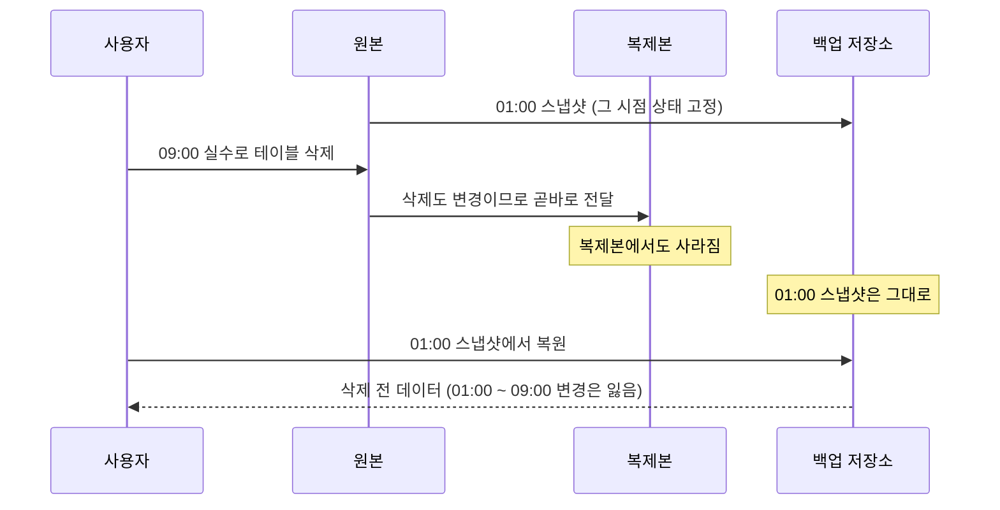
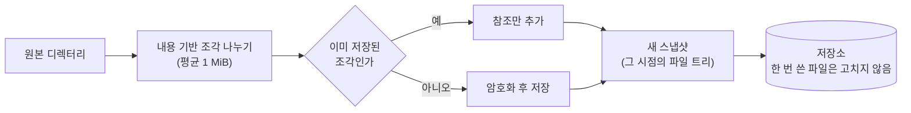

**복제**는 데이터의 살아 있는 사본을 다른 곳에 두고 원본의 변경을 계속 따라가게 하는 것이고, **백업**은 어느 시점의 데이터를 따로 떼어 보관해 나중에 그 시점으로 되돌릴 수 있게 하는 것입니다. 복제는 서버가 죽어도 서비스를 이어 가는 **가용성**을 지키고, 백업은 데이터가 지워지거나 망가진 뒤에도 되살리는 **복구 가능성**을 지킵니다. 복제는 원본의 변경을 그대로 따라가므로 실수로 지운 데이터도 곧바로 사본에서 지워집니다. 그래서 둘은 서로를 대신하지 못합니다.

- **기준:** NIST SP 800-34 Rev. 1 용어 정의, US-CERT(CISA) Data Backup Options(2012), NIST Cybersecurity Framework 2.0, restic 0.19 문서(Design, Removing backup snapshots, Working with repositories), PostgreSQL 18 문서(25장 Backup and Restore, 26장 High Availability, Load Balancing, and Replication)

## 왜 필요한가

데이터를 잃는 원인은 크게 둘로 나눌 수 있습니다.

- **장비 장애:** 서버, 디스크, 전원, 네트워크가 멈춥니다. 데이터 자체는 올바르고, 그 데이터를 가진 장비에 닿을 수 없을 뿐입니다.
- **데이터 자체의 손상:** 사람이 잘못 지우거나 덮어쓰고, 앱 버그가 틀린 값을 쓰고, 랜섬웨어가 파일을 암호화합니다. 이때는 데이터가 "올바르게 저장된 틀린 값" 이 됩니다.

복제는 첫 번째를 풉니다. 사본이 원본을 계속 따라가므로 원본 장비가 죽으면 사본으로 넘어가면 됩니다. 그런데 같은 이유로 두 번째는 풀지 못합니다. 원본에서 일어난 삭제와 덮어쓰기도 변경이므로 사본에 그대로 옮겨집니다. US-CERT 의 백업 안내서도 원본을 주기적으로 덮어쓰는 방식의 사본은 원본의 손상이나 악성 코드를 조용히 사본에 퍼뜨릴 수 있다고 적습니다.

백업은 두 번째를 풉니다. 백업은 어느 시점의 상태를 고정해 두므로, 원본이 망가진 뒤에도 망가지기 전 시점의 사본이 남아 있습니다. 대신 백업에서 되살리는 데는 시간이 걸리고 마지막 백업 이후의 변경은 잃으므로, 장비 장애 때 서비스를 끊김 없이 이어 가는 데는 복제가 알맞습니다.

## 핵심 용어

| 용어 | 뜻 |
| :--- | :--- |
| 복제(replication) | 원본의 변경을 계속 따라가는 살아 있는 사본을 두는 것 |
| 백업(backup) | 어느 시점의 데이터를 원본과 따로 보관해 그 시점으로 되돌릴 수 있게 한 사본 |
| RPO(Recovery Point Objective) | 장애 뒤 데이터를 어느 시점까지 되살려야 하는지. 잃어도 되는 최근 변경의 범위입니다 |
| RTO(Recovery Time Objective) | 시스템이 복구 단계에 머물러도 되는 최대 시간. 이 시간을 넘기면 업무에 영향이 갑니다 |
| 3-2-1 규칙 | 중요한 데이터는 사본 3개, 서로 다른 매체 2종, 그중 1개는 다른 장소에 두라는 원칙 |
| 스냅샷(snapshot) | restic 에서 파일이나 디렉터리의 어느 시점 상태(내용과 이름·수정 시각 같은 메타데이터) |
| 저장소(repository) | restic 이 백업한 데이터와 스냅샷을 암호화해 보관하는 곳 |
| 중복 제거(deduplication) | 같은 내용의 조각을 한 번만 저장하는 것 |
| 보존 정책(retention policy) | 어떤 스냅샷을 얼마나 남길지 정한 규칙 |
| PITR(Point-in-Time Recovery) | DB 를 과거의 원하는 시각으로 되돌리는 복구 |

## 동작 방식

같은 사고가 복제와 백업에 어떻게 전해지는지 비교합니다.

1. 백업은 정해진 시각마다 그 시점의 상태를 스냅샷으로 떼어 둡니다. 한 번 만든 스냅샷은 이후 원본의 변경에 영향을 받지 않습니다.
2. 사용자가 실수로 데이터를 지우면 원본에서 사라집니다.
3. 복제는 이 삭제도 다른 변경과 똑같이 사본으로 옮깁니다. 동기 복제라면 삭제가 사본에 기록된 뒤에야 커밋이 끝납니다. 복제가 빠르고 확실할수록 실수도 빠르고 확실하게 퍼집니다.
4. 백업 스냅샷은 그대로 남아 있으므로, 삭제 전 시점으로 되돌릴 수 있습니다. 다만 마지막 스냅샷 이후의 변경은 잃습니다. 이 범위가 백업 주기로 정해지는 RPO 입니다.

## RPO 와 RTO

두 값은 복구 목표를 정하는 기준이고, 복제와 백업이 서로 다른 값을 맡습니다.

| 구분 | 복제로 지키는 값 | 백업으로 지키는 값 |
| :--- | :--- | :--- |
| 막는 사고 | 장비 장애 | 삭제, 덮어쓰기, 손상, 랜섬웨어, 장소 전체의 재해 |
| RPO | 비동기면 복제 지연만큼, 동기면 0 에 가깝습니다 | 마지막 백업 이후의 변경. 백업 주기가 곧 RPO 입니다 |
| RTO | 대기 사본으로 넘어가는 시간 | 백업을 내려받아 복원하고 서비스를 다시 띄우는 시간 |

PostgreSQL 은 백업의 RPO 를 줄이는 방법도 제공합니다. PostgreSQL 백업에는 SQL 덤프, 파일 시스템 수준 백업, 연속 아카이빙 세 가지가 있고, 연속 아카이빙은 기준 백업에 WAL 을 계속 보관해 두었다가 원하는 시각까지만 WAL 을 재생하는 **PITR** 을 가능하게 합니다. 복제본과 달리 사고 직전 시각에서 재생을 멈출 수 있어서, 실수 직전까지 되돌릴 수 있습니다. 동기·비동기 복제의 RPO 는 [PostgreSQL 스트리밍 복제와 동기·비동기 복제의 차이](/posts/73/) 에서 다룹니다.

## 3-2-1 규칙

US-CERT 의 Data Backup Options 는 데이터를 되살릴 가능성을 높이려면 다음을 지키라고 권합니다.

- **3:** 중요한 파일은 사본 3개를 둡니다. 원본 1개와 백업 2개입니다.
- **2:** 서로 다른 매체 2종에 둡니다. 매체마다 다른 위험을 막기 위해서입니다.
- **1:** 1개는 다른 장소(집이나 사업장 밖)에 둡니다.

같은 건물 안의 복제본은 이 규칙의 "다른 장소" 를 채우지 못합니다. 화재, 침수, 정전, 도난은 건물 안의 모든 장비에 함께 닥칩니다. NIST Cybersecurity Framework 2.0 도 백업을 만들고, 보호하고, 유지하고, **시험하는 것**을 하나의 항목(PR.DS-11)으로 둡니다. 복원해 보지 않은 백업은 실제로 되살릴 수 있는지 모릅니다.

## restic 으로 보는 백업의 구성 요소

restic 은 백업을 스냅샷 단위로 저장소에 쌓는 백업 프로그램입니다. restic 의 설계에서 백업이 복제와 다른 점이 드러납니다.

1. **스냅샷:** 백업할 때마다 그 시점의 파일 내용과 메타데이터를 나타내는 스냅샷이 하나 생깁니다. 스냅샷마다 전체 파일 트리를 가리키므로 어느 스냅샷에서든 전체를 복원할 수 있습니다.
2. **중복 제거:** 파일을 Rabin 지문으로 내용에 따라 나눕니다. 512 KiB 보다 작은 파일은 나누지 않고, 조각은 512 KiB~8 MiB, 평균 1 MiB 를 목표로 합니다. 이미 저장된 조각은 다시 저장하지 않으므로, 다음 백업에서는 바뀐 조각만 저장됩니다. 매일 백업해도 매일 전체 크기만큼 늘지 않습니다.
3. **바꾸지 않는 저장:** 저장소의 파일은 한 번 쓰면 고치지 않습니다. 원본에서 파일이 지워져도 이전 스냅샷이 가리키는 조각은 저장소에 남습니다. 복제와 가장 다른 점입니다.
4. **암호화:** 데이터는 AES-256(카운터 모드)으로 암호화하고 Poly1305-AES 로 인증합니다. 그래서 다른 장소의 저장 공간을 믿을 수 없어도 백업을 둘 수 있습니다.
5. **보존 정책:** 스냅샷을 끝없이 쌓을 수 없으므로 `forget` 으로 스냅샷을 목록에서 지우고, `prune` 으로 지운 스냅샷만 가리키던 데이터를 실제로 지웁니다. 보존 규칙은 `--keep-hourly`, `--keep-daily`, `--keep-weekly`, `--keep-monthly`, `--keep-yearly` 처럼 기간별로 스냅샷 하나씩을 몇 개 남길지로 정합니다. 최근은 촘촘하게, 오래된 것은 드문드문 남기는 방식입니다. `prune` 하는 동안에는 저장소가 잠겨 백업을 할 수 없습니다.
6. **검사:** `check` 는 저장소의 구조가 온전한지 확인하고, `--read-data` 나 `--read-data-subset` 을 붙이면 실제 데이터 조각까지 읽어 확인합니다.

보존 정책은 RPO 와 함께 "얼마나 오래 전까지 되돌릴 수 있는가" 를 정합니다. 예를 들어 일 7개, 주 4개, 월 6개를 남기면 최근 일주일은 하루 단위로, 그보다 오래된 시점은 주나 달 단위로 되돌릴 수 있습니다. 문제를 늦게 알아채도 그보다 앞선 스냅샷이 남아 있어야 하므로, 보존 기간은 사고를 알아채는 데 걸리는 시간보다 길어야 합니다.

## 실행 중인 DB 를 백업할 때

실행 중인 DB 의 데이터 파일을 그대로 복사하면 복사하는 동안 파일이 바뀌어 일관성이 깨질 수 있습니다. PostgreSQL 문서가 제시하는 방법은 다음과 같습니다.

- **SQL 덤프:** `pg_dump` 는 DB 가 도는 중에도 일관된 시점의 내용을 SQL 이나 아카이브 형식으로 내보냅니다. 출력이 하나의 흐름이라 백업 도구에 바로 넘길 수 있습니다.
- **파일 시스템 스냅샷:** 볼륨의 고정된 스냅샷을 떠서 데이터 디렉터리 전체를 복사할 수 있습니다. 이렇게 만든 백업은 서버가 정상 종료되지 않은 상태와 같아서, 복원해 시작하면 WAL 을 재생해 복구합니다. WAL 도 반드시 함께 들어 있어야 하고, 데이터와 WAL 이 서로 다른 볼륨에 있으면 동시에 스냅샷을 뜰 수 없어 이 방법을 쓰지 못할 수 있습니다.
- **연속 아카이빙:** 기준 백업과 계속 보관한 WAL 로 원하는 시각까지 되돌립니다(PITR).

복제본이 여러 벌이어도 이 백업은 따로 있어야 합니다. 스토리지 계층의 복제에 대해서는 [블록 스토리지 복제와 데이터베이스 복제의 차이](/posts/72/) 에서 다룹니다.

## 비슷한 개념과 비교

| 구분 | 복제 | 백업 |
| :--- | :--- | :--- |
| 목적 | 가용성. 장비가 죽어도 서비스를 이어 갑니다 | 복구 가능성. 데이터가 망가져도 되돌립니다 |
| 사본의 상태 | 원본의 최신 상태를 따라갑니다 | 여러 과거 시점의 상태를 고정해 둡니다 |
| 삭제·손상 | 곧바로 사본에 옮겨집니다 | 이전 스냅샷에는 남습니다 |
| 사본의 위치 | 보통 원본 가까이(지연이 짧아야 합니다) | 원본과 떨어진 곳(다른 장소, 다른 매체) |
| RPO | 복제 지연만큼(동기면 0 에 가깝습니다) | 백업 주기만큼 |
| RTO | 짧습니다. 대기 사본으로 넘어가면 됩니다 | 깁니다. 내려받아 복원해야 합니다 |
| 확인 방법 | 복제 지연과 대기 사본의 상태 | 실제로 복원해 봅니다 |

## 흔한 오해

복제본이 있으니 백업은 필요 없다

- **실제:** 복제는 삭제와 덮어쓰기도 변경으로 보고 곧바로 옮깁니다. 실수, 버그, 랜섬웨어에서 되돌리려면 과거 시점의 사본이 필요합니다.
- **근거:** US-CERT Data Backup Options(원본을 주기적으로 덮어쓰는 사본은 원본의 손상과 악성 코드를 사본에 퍼뜨릴 수 있음), PostgreSQL 26장(동기 복제는 모든 서버가 커밋해야 커밋으로 봄)

같은 NAS 나 같은 서버의 다른 디스크에 둔 사본도 백업이다

- **실제:** 시점별로 고정되어 있다면 백업이긴 하지만, 3-2-1 규칙의 다른 장소 사본을 채우지 못합니다. 건물 전체에 닥치는 화재·침수·도난에는 함께 잃습니다.
- **근거:** US-CERT Data Backup Options 의 3-2-1 규칙

백업 작업이 성공으로 끝났으면 복원도 된다

- **실제:** 저장소가 손상되었거나 필요한 파일이 빠져 있으면 복원할 때 알게 됩니다. 저장소를 주기적으로 검사하고, 실제로 복원해 봐야 합니다.
- **근거:** NIST CSF 2.0 PR.DS-11(백업을 만들고, 보호하고, 유지하고, 시험함), restic Working with repositories 의 `check` 설명

## 정리

> - 복제는 장비 장애에서 서비스를 이어 가게 하지만, 삭제와 손상도 곧바로 사본에 옮깁니다.
> - 백업은 과거 시점의 상태를 떨어진 곳에 고정해 두어, 데이터가 망가진 뒤에도 되돌릴 수 있게 합니다.
> - RPO 는 복제에서는 복제 지연, 백업에서는 백업 주기로 정해지고, 보존 정책은 얼마나 오래 전까지 되돌릴 수 있는지를 정합니다.
> - 3-2-1 규칙대로 다른 장소에 사본을 두고, 복원해 봐야 백업을 믿을 수 있습니다.
{: .prompt-tip }

## 참고 자료

- [NIST SP 800-34 Rev. 1 - Contingency Planning Guide for Federal Information Systems](https://csrc.nist.gov/pubs/sp/800/34/r1/upd1/final)
- [NIST Glossary - Recovery Point Objective](https://csrc.nist.gov/glossary/term/recovery_point_objective)
- [NIST Glossary - Recovery Time Objective](https://csrc.nist.gov/glossary/term/recovery_time_objective)
- [US-CERT(CISA) - Data Backup Options](https://www.cisa.gov/sites/default/files/publications/data_backup_options.pdf)
- [NIST Cybersecurity Framework (CSF) 2.0](https://nvlpubs.nist.gov/nistpubs/CSWP/NIST.CSWP.29.pdf)
- [restic - References (Design)](https://restic.readthedocs.io/en/stable/100_references.html)
- [restic - Removing backup snapshots](https://restic.readthedocs.io/en/stable/060_forget.html)
- [restic - Working with repositories](https://restic.readthedocs.io/en/stable/045_working_with_repos.html)
- [PostgreSQL 18 - Chapter 25. Backup and Restore](https://www.postgresql.org/docs/18/backup.html)
- [PostgreSQL 18 - 25.1. SQL Dump](https://www.postgresql.org/docs/18/backup-dump.html)
- [PostgreSQL 18 - 25.2. File System Level Backup](https://www.postgresql.org/docs/18/backup-file.html)
- [PostgreSQL 18 - 25.3. Continuous Archiving and Point-in-Time Recovery (PITR)](https://www.postgresql.org/docs/18/continuous-archiving.html)
- [PostgreSQL 18 - Chapter 26. High Availability, Load Balancing, and Replication](https://www.postgresql.org/docs/18/high-availability.html)
