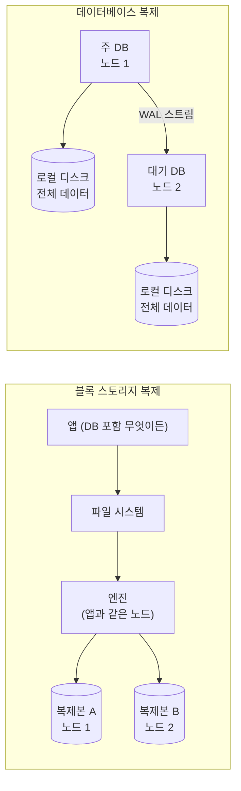
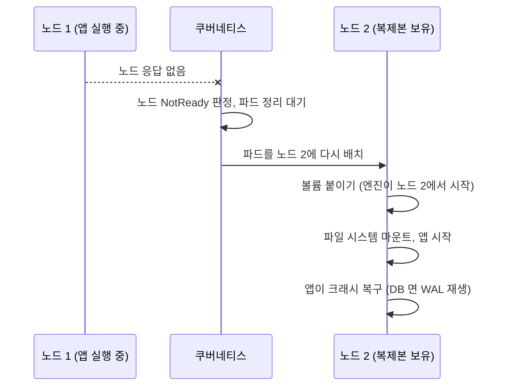
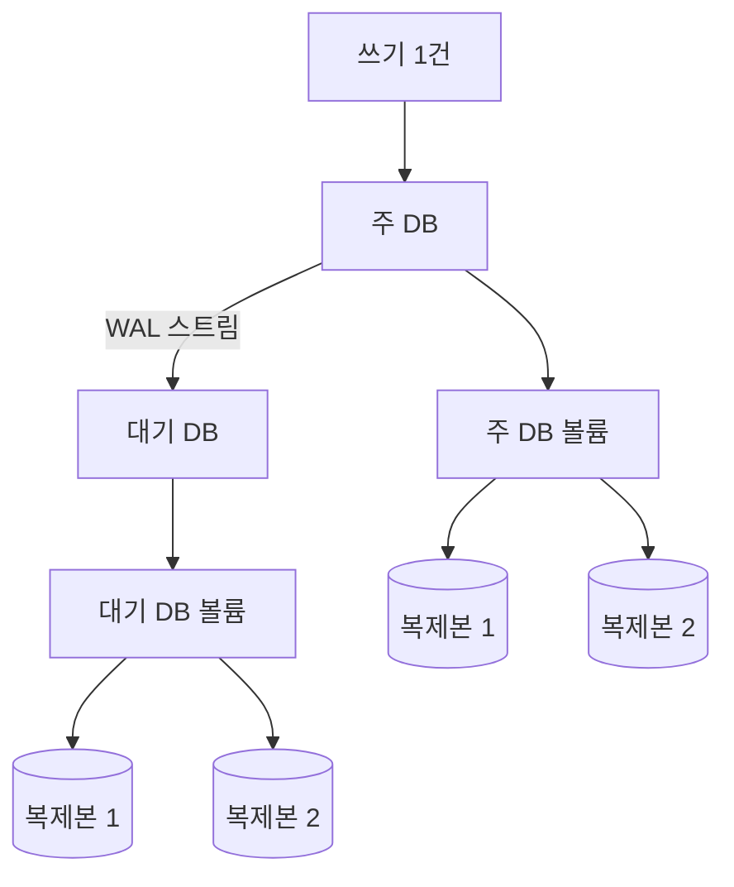

서버 한 대가 죽어도 데이터를 잃지 않으려면 데이터를 다른 서버에 한 벌 더 둬야 합니다. 이 복제를 어느 계층에서 하느냐에 따라 두 가지로 나뉩니다. **블록 스토리지 복제**는 디스크에 쓰이는 블록을 그대로 다른 노드의 디스크에도 쓰는 방식이고, 위에서 어떤 앱이 도는지 모릅니다. **데이터베이스 복제**는 DB 가 자기 변경 기록을 다른 DB 서버에 보내고, 받은 쪽이 그 기록을 재생해 같은 데이터를 만드는 방식입니다. 둘 다 "사본이 여러 벌" 이지만 장애 때 넘어가는 과정과 비용이 다릅니다.

- **기준:** Longhorn 1.12 문서(Architecture and Concepts, Best Practices, Data Locality, Node Failure), DRBD 9.0 사용자 가이드, PostgreSQL 18 문서(26장 High Availability, Load Balancing, and Replication, 28장 Reliability and the Write-Ahead Log), Kubernetes v1.37 Persistent Volumes 문서

## 왜 필요한가

노드의 로컬 디스크에만 있는 데이터는 그 노드가 죽으면 함께 사라집니다. 컨테이너 오케스트레이터가 앱을 다른 노드에서 다시 띄워도 데이터가 없으면 소용이 없습니다. 그래서 데이터를 다른 노드에도 두는데, 방법을 고를 때 두 계층의 차이를 알아야 합니다.

- 블록 복제는 앱을 고치지 않아도 되므로 스스로 복제할 줄 모르는 앱(설정 파일을 쓰는 단일 인스턴스 앱 등)에 알맞습니다.
- 데이터베이스는 대개 스스로 복제하는 기능이 있습니다. 이런 앱을 복제 스토리지에 다시 올리면 같은 데이터를 여러 번 겹쳐 쓰게 됩니다.

PostgreSQL 문서도 고가용성 방식을 나열하면서 **파일 시스템(블록 장치) 복제**와 **WAL 전달**을 별개의 방식으로 나눕니다. 블록 복제는 "파일 시스템의 모든 변경을 다른 컴퓨터의 파일 시스템에 미러링" 하는 것이고, 조건은 대기 서버 쪽에 쓰는 순서가 주 서버와 같아야 한다는 것 하나라고 적습니다. 예로 DRBD 를 듭니다.

## 핵심 용어

| 용어 | 뜻 |
| :--- | :--- |
| 블록 스토리지 복제 | 볼륨에 쓰이는 블록을 여러 노드의 디스크에 똑같이 쓰는 방식. 위 계층(파일 시스템, 앱)을 모릅니다 |
| 복제본(replica) | 블록 복제에서 한 볼륨의 데이터를 담은 사본 하나. 노드마다 하나씩 둡니다 |
| 엔진(engine) | Longhorn 에서 볼륨 하나의 입출력을 받아 모든 복제본에 나눠 쓰는 컨트롤러. 볼륨을 붙인 노드에서 돕니다 |
| 크래시 일관성(crash consistency) | 전원이 갑자기 꺼진 직후의 디스크 상태와 같은 일관성. 앱이 복구 절차를 거쳐야 쓸 수 있습니다 |
| ReadWriteOnce(RWO) | 한 노드만 볼륨을 읽기·쓰기로 마운트할 수 있는 쿠버네티스 접근 모드 |
| 재구축(rebuild) | 망가진 복제본 대신 빈 복제본을 만들고 건강한 복제본에서 데이터를 채우는 과정 |
| 데이터베이스 복제 | DB 가 변경 기록을 다른 DB 서버로 보내고, 받은 서버가 재생해 같은 데이터를 유지하는 방식 |
| WAL(Write-Ahead Log) | PostgreSQL 이 데이터 파일을 바꾸기 전에 먼저 디스크에 남기는 변경 기록 |
| 데이터 지역성(data locality) | 볼륨을 쓰는 파드와 같은 노드에 복제본 하나를 두는 것 |

## 동작 방식

두 방식이 쓰기 하나를 어떻게 복제하는지 먼저 비교합니다.

## 블록 스토리지 복제

1. 볼륨을 쓰는 앱이 파일 시스템에 쓰면, 파일 시스템은 블록 장치에 블록을 씁니다. Longhorn 은 볼륨마다 **엔진**을 두고, 엔진은 그 볼륨을 쓰는 파드와 같은 노드에서 돕니다.
2. 엔진은 받은 쓰기를 여러 노드에 있는 **복제본**에 동기로 복제합니다. 복제본이 `N` 벌이면 `N-1` 벌이 망가져도 볼륨을 쓸 수 있습니다.
3. 복제본 하나가 망가지면 Longhorn 이 빈 복제본을 새로 만들고 건강한 복제본에서 데이터를 채웁니다(**재구축**).
4. 이 계층은 블록만 봅니다. DRBD 문서는 DRBD 가 "위 계층을 모른다" 고 밝히고, 그래서 파일 시스템 손상을 알아채는 것처럼 파일 시스템에 없는 기능을 더할 수 없다고 적습니다. 잘못 쓰인 블록도 올바른 블록과 똑같이 복제됩니다.

볼륨은 한 번에 한 노드에만 붙습니다. 쿠버네티스의 **ReadWriteOnce** 는 한 노드만 읽기·쓰기로 마운트할 수 있는 모드이고, 블록 볼륨 위에 ext4·XFS 같은 일반 파일 시스템을 올리면 두 노드가 동시에 마운트할 수 없습니다. DRBD 도 일반 파일 시스템은 한 노드만 주 역할을 맡는 단일 주 모드로 씁니다. PostgreSQL 문서의 공유 디스크 방식에도 같은 제약이 있어, 주 서버가 도는 동안 대기 서버가 저장소에 접근하면 안 된다고 적혀 있습니다.

장애 때는 볼륨을 새 노드로 옮겨 붙입니다.

1. 노드가 죽으면 쿠버네티스가 노드를 `NotReady` 로 판정하고 파드를 정리한 뒤 다른 노드에 다시 띄웁니다. Longhorn 문서에 따르면 RWO 볼륨을 쓰는 StatefulSet 파드는 `Terminating` 에, Deployment 의 새 파드는 `ContainerCreating` 에 멈출 수 있어서, 죽은 노드의 파드를 강제로 지우는 설정을 따로 둡니다.
2. 새 노드에서 볼륨이 붙고 앱이 시작됩니다. 복제본은 전원이 꺼진 직후의 디스크와 같은 상태입니다. Longhorn 문서는 스스로를 **크래시 일관성** 블록 스토리지라고 설명합니다.
3. 앱은 비정상 종료 뒤처럼 복구 절차를 거칩니다. PostgreSQL 은 이런 상태의 데이터 디렉터리로 시작하면 이전 인스턴스가 죽었다고 보고 WAL 을 재생합니다.

그래서 블록 복제의 장애 조치 시간은 "노드 장애 판정 + 파드 재배치 + 볼륨 붙이기 + 앱 시작과 복구" 를 더한 값입니다.

## 데이터베이스 복제

1. 주 DB 는 데이터 파일을 바꾸기 전에 변경 내용을 **WAL** 에 먼저 기록합니다. 장애가 나도 WAL 로 다시 적용(REDO)할 수 있어서입니다.
2. 대기 DB 는 주 DB 에 접속해 WAL 을 계속 받아 재생합니다. 이것이 스트리밍 복제입니다. 자세한 동작과 동기·비동기의 차이는 [PostgreSQL 스트리밍 복제와 동기·비동기 복제의 차이](/posts/73/) 에서 다룹니다.
3. 멤버마다 자기 디스크에 **전체 데이터**를 따로 가집니다. 멤버끼리 디스크를 나눠 쓰지 않으므로 각 멤버가 자기 노드의 로컬 디스크를 씁니다.
4. 대기 DB 는 이미 실행 중인 프로세스입니다. 읽기 전용 질의를 받는 핫 스탠바이로 쓸 수 있고, 주 DB 가 죽으면 볼륨을 옮길 필요 없이 승격만 하면 됩니다.

PostgreSQL 은 주 DB 장애를 알아채고 대기 DB 를 승격하는 기능을 직접 제공하지 않으므로, 자동 장애 조치에는 Patroni 같은 별도 도구를 씁니다.

## 복제하는 DB 를 복제 스토리지에 올리면

데이터베이스 복제를 쓰는 DB 멤버의 볼륨을 다시 블록 복제 스토리지에 두면 복제가 두 겹이 됩니다.

- **디스크:** DB 멤버 `M` 개가 각각 `N` 벌짜리 볼륨을 쓰면 같은 데이터가 `M × N` 벌 저장됩니다. 멤버 2개에 복제본 2벌이면 4벌입니다.
- **쓰기 지연:** 블록 복제는 쓰기마다 모든 복제본을 거칩니다. Longhorn 문서는 스스로 복제하는 앱에 복제본을 한 벌만 두면 볼륨 복제에 따르는 추가 디스크 사용과 IO 성능 부담을 줄일 수 있다고 적습니다.
- **배치 문제:** Longhorn 은 두 볼륨이 같은 데이터를 담고 있다는 것을 모릅니다. 그래서 서로 다른 멤버의 복제본을 같은 노드에 둘 수 있고, 그러면 그 노드 하나가 죽을 때 두 멤버가 함께 영향을 받습니다.
- **얻는 것이 적습니다:** 멤버 한 노드가 죽으면 데이터베이스 복제가 다른 멤버를 승격합니다. 죽은 멤버의 볼륨을 다른 노드로 옮겨 살릴 필요가 없고, 그 멤버는 새로 만들어 다시 복제받으면 됩니다.

그래서 Longhorn 은 분산 DB 처럼 스스로 복제하는 앱에는 볼륨마다 복제본을 하나만 두라고 권합니다. 이때 **데이터 지역성**을 함께 씁니다.

| 설정 | 동작 |
| :--- | :--- |
| `disabled` | 파드가 있는 노드에 복제본이 있을 수도 없을 수도 있습니다(기본값) |
| `best-effort` | 파드가 있는 노드에 복제본 하나를 두려고 하지만, 못 두더라도 볼륨을 멈추지 않습니다 |
| `strict-local` | 파드가 있는 노드에 복제본을 딱 하나만 두도록 강제합니다. IOPS 가 높고 지연이 낮습니다. RWX 볼륨에는 쓸 수 없습니다 |

복제본이 파드와 같은 노드에 있으면 읽기와 쓰기가 네트워크를 거치지 않습니다. 복제본이 한 벌뿐이면 그 노드가 죽을 때 그 멤버의 데이터도 사라지지만, 데이터는 다른 멤버에 온전히 남아 있으므로 DB 쪽에서 멤버를 새로 채웁니다. 같은 이유로 스토리지 시스템 없이 노드 로컬 디스크를 멤버 볼륨으로 쓰기도 합니다.

## 비슷한 개념과 비교

| 구분 | 블록 스토리지 복제 | 데이터베이스 복제 |
| :--- | :--- | :--- |
| 복제 단위 | 디스크 블록 | WAL 레코드(DB 의 변경 기록) |
| 앱이 알아야 하는가 | 몰라도 됩니다 | DB 가 직접 합니다 |
| 사본을 가진 곳 | 볼륨 하나의 복제본들. 한 번에 한 노드만 씁니다 | 멤버마다 자기 디스크에 전체 데이터 |
| 대기 쪽 상태 | 볼륨이 붙어 있지 않아 앱이 돌지 않습니다 | DB 가 실행 중이고 읽기 질의를 받을 수 있습니다 |
| 장애 조치 | 볼륨을 새 노드에 붙이고 앱을 크래시 복구로 시작합니다 | 대기 DB 를 승격합니다 |
| 사본 하나를 잃으면 | 스토리지가 복제본을 재구축합니다 | 멤버를 새로 만들어 다시 복제받습니다 |
| 알맞은 앱 | 스스로 복제하지 못하는 앱 | 복제 기능이 있는 DB |

## 흔한 오해

복제 스토리지에 두면 DB 도 이중화된 것이다

- **실제:** 데이터가 다른 노드에 남는다는 점은 맞지만, 한 번에 한 노드에서만 DB 가 돌고, 장애 때는 볼륨을 옮긴 뒤 크래시 복구를 거쳐야 다시 씁니다. 읽기를 나눠 받을 대기 DB 도 없습니다.
- **근거:** Longhorn Architecture and Concepts(엔진은 파드와 같은 노드에서 돌고, 크래시 일관성 스토리지), Kubernetes Persistent Volumes 의 ReadWriteOnce 정의, PostgreSQL 25.2 File System Level Backup(크래시 상태의 데이터 디렉터리는 WAL 재생으로 복구)

복제는 여러 겹일수록 안전하다

- **실제:** DB 복제 위에 블록 복제를 겹치면 사본 수와 쓰기 부담만 곱해지고, 스토리지가 같은 데이터인 줄 몰라 복제본을 한 노드에 모아 둘 수도 있습니다. 스스로 복제하는 앱에는 볼륨 복제본을 하나만 두는 것이 권장됩니다.
- **근거:** Longhorn Best Practices(스스로 복제하는 앱에는 `strict-local` 로 볼륨마다 복제본 하나), Longhorn Data Locality

복제본이 여러 벌이면 백업은 없어도 된다

- **실제:** 블록 복제는 잘못 쓰인 블록과 지운 파일도 그대로 복제합니다. 실수나 삭제에서 되돌리려면 시점별 사본인 백업이 따로 있어야 합니다. 자세한 차이는 [백업과 복제의 차이](/posts/71/) 에서 다룹니다.
- **근거:** DRBD 9.0 사용자 가이드(DRBD 는 위 계층을 모르며 파일 시스템 손상을 감지하지 못함)

## 정리

> - 블록 스토리지 복제는 앱을 모르는 채 블록을 여러 노드에 쓰고, 장애 때는 볼륨을 옮겨 붙인 뒤 앱이 크래시 복구로 시작합니다.
> - 데이터베이스 복제는 멤버마다 전체 데이터를 따로 가지며 WAL 로 따라가고, 장애 때는 이미 돌고 있는 대기 DB 를 승격합니다.
> - 스스로 복제하는 DB 를 복제 스토리지에 올리면 사본과 쓰기 부담이 곱해지므로, 볼륨 복제본은 한 벌만 두고 파드와 같은 노드에 둡니다.
{: .prompt-tip }

## 참고 자료

- [Longhorn - Architecture and Concepts](https://longhorn.io/docs/1.12.1/concepts/)
- [Longhorn - Best Practices](https://longhorn.io/docs/1.12.1/best-practices/)
- [Longhorn - Data Locality](https://longhorn.io/docs/1.12.1/high-availability/data-locality/)
- [Longhorn - Node Failure Handling with Longhorn](https://longhorn.io/docs/1.12.1/high-availability/node-failure/)
- [DRBD 9.0 User's Guide](https://linbit.com/drbd-user-guide/drbd-guide-9_0-en/)
- [PostgreSQL 18 - 26.1. Comparison of Different Solutions](https://www.postgresql.org/docs/18/different-replication-solutions.html)
- [PostgreSQL 18 - 26.2. Log-Shipping Standby Servers](https://www.postgresql.org/docs/18/warm-standby.html)
- [PostgreSQL 18 - 28.3. Write-Ahead Logging (WAL)](https://www.postgresql.org/docs/18/wal-intro.html)
- [PostgreSQL 18 - 25.2. File System Level Backup](https://www.postgresql.org/docs/18/backup-file.html)
- [Kubernetes - Persistent Volumes](https://kubernetes.io/docs/concepts/storage/persistent-volumes/)
