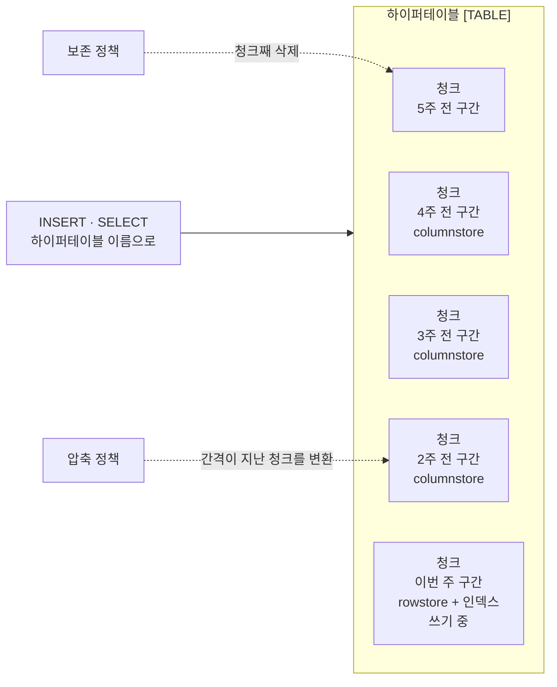
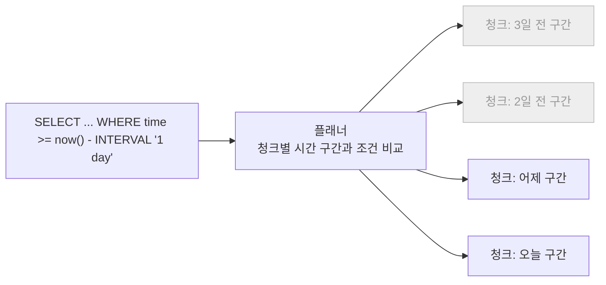
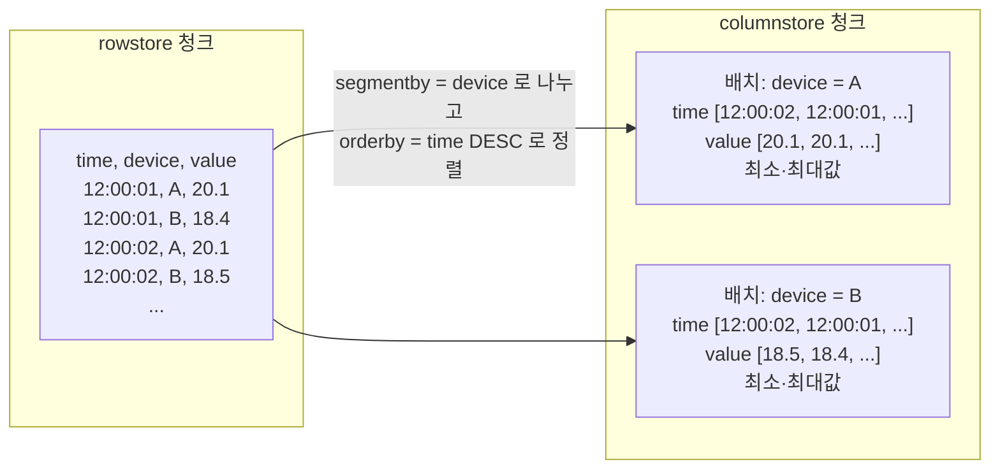
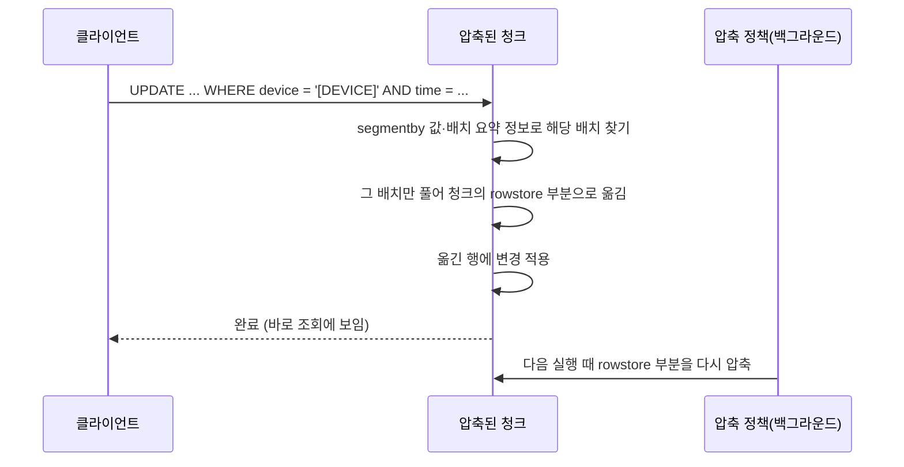
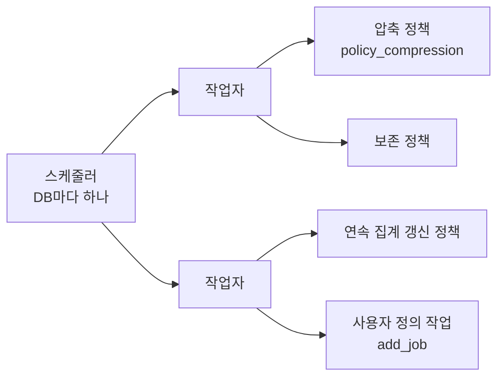

**하이퍼테이블(hypertable)**은 TimescaleDB 가 시간 컬럼(파티션 컬럼)을 기준으로 **청크(chunk)**라는 작은 테이블들로 자동으로 나누어 저장하는 PostgreSQL 테이블입니다. 사용자는 하이퍼테이블 이름으로 쓰고 읽기만 하고, 어느 청크에 넣고 어느 청크를 읽을지는 TimescaleDB 가 정합니다. 청크 단위로 나뉘어 있으므로 시간 조건이 있는 조회는 관계없는 청크를 건너뛰고, 오래된 데이터는 행을 지우는 대신 청크를 통째로 버리며, 더 쓰지 않는 청크는 **압축**해 열 단위로 모아 둡니다. 압축은 2.18.0 부터 공식 문서와 API 에서 **columnstore**(엔진 이름은 **hypercore**)라고 부르며, 예전 compression 이름의 API 도 아직 동작합니다.

- **기준:** TimescaleDB 2.30.1(2026-09-17 공개) 시점의 Tiger Data 공식 문서(Hypertables, Chunks, Hypercore, Data retention, Jobs and automation, time_bucket, Continuous aggregates), TimescaleDB CHANGELOG, PostgreSQL 18 문서 5.12 Table Partitioning

## 왜 필요한가

센서 값, 서버 지표, 이벤트 기록 같은 시계열 데이터는 다음과 같은 특징이 있습니다.

- 대부분 새 행 추가. 이미 쓴 행을 고치는 일은 드묾
- 새 행의 시각이 거의 늘 현재 근처
- 조회 대부분이 "최근 1시간", "지난달" 같은 시간 범위 조건
- 일정 기간이 지난 데이터는 요약만 남기거나 통째로 지움
- 같은 기기, 같은 속성의 값이 시간 순서로 되풀이되어 비슷한 값이 많음

이런 데이터를 일반 테이블 하나에 계속 쌓으면 다음 문제가 생깁니다.

- **인덱스가 계속 커짐:** 테이블 전체에 걸친 인덱스가 데이터와 함께 커집니다. PostgreSQL 은 행을 넣을 때마다 인덱스를 갱신하는데, 인덱스가 메모리에 다 들어가지 않으면 디스크에서 읽고 쓰기를 되풀이해 쓰기 속도가 떨어집니다.
- **오래된 데이터 삭제 비용:** 보존 기간이 지난 행을 `DELETE` 로 지우면 행마다 삭제 표시가 남고, 이를 치우는 `VACUUM` 이 필요하며 테이블과 인덱스가 부풀기 쉽습니다.
- **범위 조회 비용:** 최근 하루치만 읽어도 큰 인덱스를 거치거나 테이블 전체를 훑습니다.
- **저장 공간:** 비슷한 값이 행마다 반복 저장됩니다.

PostgreSQL 의 선언적 파티셔닝으로 테이블을 시간 구간별로 나누면 앞의 세 가지가 줄어듭니다. PostgreSQL 문서는 파티셔닝이 인덱스의 상위 단계를 대신해 자주 쓰는 인덱스 부분이 메모리에 들어갈 가능성을 높이고, 파티션을 `DROP TABLE` 로 지우는 것이 대량 `DELETE` 보다 훨씬 빠르며 `VACUUM` 부담도 없다고 설명합니다. 대신 파티션은 미리 만들어 두어야 하고, 들어갈 파티션이 없는 행을 넣으면 오류가 납니다.

하이퍼테이블은 이 파티셔닝을 자동으로 해 줍니다. 새 시간 구간의 행이 들어오면 그 구간의 청크를 알아서 만들고, 오래된 청크를 지우는 일과 압축하는 일을 정책으로 걸어 두면 백그라운드 작업이 때마다 처리합니다. 저장 공간 문제는 오래된 청크를 열 저장으로 바꾸는 압축이 맡습니다.

## 핵심 용어

| 용어 | 뜻 |
| :--- | :--- |
| 하이퍼테이블(hypertable) | 파티션 컬럼 기준으로 청크들로 자동으로 나뉘는 논리 테이블. 쓰고 읽을 때는 이 이름을 씀 |
| 청크(chunk) | 하이퍼테이블의 한 시간 구간을 맡는 실제 테이블. `_timescaledb_internal` 스키마에 만들어짐 |
| 파티션 컬럼(차원, dimension) | 청크를 나누는 기준 컬럼. 보통 `timestamptz` 시간 컬럼이며 정수 컬럼도 가능 |
| 청크 간격(chunk interval) | 청크 하나가 맡는 시간 폭. `CREATE TABLE` 옵션 `chunk_interval`, 함수 `set_chunk_time_interval()` 로 정함. 기본 7일 |
| 청크 제외(chunk exclusion) | 조회 조건의 시간 범위와 겹치지 않는 청크를 읽지 않고 건너뛰는 최적화 |
| 보존 정책(retention policy) | 일정 기간보다 오래된 청크를 주기적으로 지우는 작업 |
| rowstore / columnstore | 청크의 두 저장 방식. 행 단위로 저장하는 rowstore, 행을 묶어 열 단위 배열로 압축한 columnstore |
| hypercore | rowstore 와 columnstore 를 함께 쓰는 TimescaleDB 의 저장 엔진 이름 |
| 배치(batch) | columnstore 에서 한 행으로 묶여 압축되는 행 묶음. 최대 1,000행 |
| segmentby | 같은 값끼리 한 배치로 묶을 컬럼. 보통 기기 ID 처럼 데이터 출처를 나타내는 컬럼 |
| orderby | 배치 안에서 행을 늘어놓는 순서. 기본은 시간 컬럼 내림차순 |
| 압축 정책(columnstore policy) | 일정 기간보다 오래된 청크를 주기적으로 columnstore 로 바꾸는 작업 |
| 작업(job) | TimescaleDB 스케줄러가 DB 안에서 주기적으로 실행하는 함수나 프로시저. 정책도 작업의 하나 |
| `time_bucket()` | 시각을 일정한 폭의 구간 시작 시각으로 내려 묶는 함수. `GROUP BY` 와 함께 집계에 씀 |
| 연속 집계(continuous aggregate) | `time_bucket` 집계 결과를 저장해 두고 백그라운드에서 새 데이터만큼 갱신하는 구체화 뷰 |

## 하이퍼테이블과 청크의 구조

하이퍼테이블 하나가 시간 순서로 이어진 청크 여러 개로 이루어집니다. 청크 간격이 1주인 하이퍼테이블의 예입니다.



1. 행을 하이퍼테이블에 넣으면 TimescaleDB 가 파티션 컬럼 값을 보고 그 시각이 속한 청크에 넣습니다.
2. 그 시각의 청크가 아직 없으면 새로 만듭니다. 청크 경계는 청크 간격으로 미리 나뉜 칸을 따르므로, 첫 청크의 시작이 데이터의 가장 이른 시각과 같지 않을 수 있습니다.
3. 인덱스는 청크마다 따로 있습니다. 하이퍼테이블을 만들면 시간 컬럼 내림차순 B-tree 인덱스가 기본으로 생기고, 사용자가 만든 인덱스도 청크마다 만들어집니다. 쓰기는 주로 최근 청크 하나에 몰리므로 갱신되는 인덱스도 그 청크의 작은 인덱스뿐입니다.
4. 청크 간격이 지난 청크는 압축 정책이 columnstore 로 바꾸고, 보존 기간이 지난 청크는 보존 정책이 통째로 지웁니다.

하이퍼테이블에는 다음 제약이 따릅니다.

- **파티션 컬럼 `NOT NULL`:** TimescaleDB 가 자동으로 겁니다.
- **유니크 제약·기본 키에 파티션 컬럼 포함:** 유니크 여부를 청크 안에서만 검사하기 때문입니다. 시간 컬럼이 빠진 `id` 만의 기본 키는 만들 수 없습니다.
- **공간 파티셔닝:** `add_dimension()` 으로 해시 차원을 더해 청크를 다시 나눌 수 있지만, 공식 문서는 청크 수와 계획 비용이 늘어나므로 충분히 시험하지 않았으면 쓰지 말고 청크 간격과 인덱스로 먼저 풀라고 권합니다.

2.20.0 부터는 `CREATE TABLE ... WITH (tsdb.hypertable)` 로 처음부터 하이퍼테이블을 만들 수 있고, 이미 있는 일반 테이블은 `create_hypertable()` 로 바꿉니다.

```sql
CREATE TABLE [TABLE] (
    time   TIMESTAMPTZ NOT NULL,
    device TEXT        NOT NULL,
    value  DOUBLE PRECISION
) WITH (
    tsdb.hypertable,
    tsdb.chunk_interval = '1 day'
);
```

## 청크 간격을 정하는 기준

청크 간격은 청크 하나가 맡는 시간 폭이며, 기본값은 `timestamptz` 같은 시간 컬럼에서 7일입니다. 공식 문서의 권고는 **지금 쓰기가 들어가는 청크들의 인덱스가 주 메모리의 25%(`shared_buffers`) 안에 들어가도록** 간격을 정하는 것입니다. 인덱스가 메모리에 들어가지 않으면 행을 넣을 때마다 인덱스를 디스크에서 읽고 다시 쓰느라 쓰기에 쓸 I/O 를 낭비하기 때문입니다.

- **문서의 예:** 메모리 64 GB, `shared_buffers` 가 약 16 GB 인 서버에서 인덱스가 하루 2 GB 씩 늘면 7일 간격(14 GB), 하루 10 GB 씩 늘면 1일 간격(10 GB)
- **너무 작을 때:** 청크 수가 많아져 계획 단계에서 청크마다 포함 여부를 따지는 시간이 늘고, 청크마다 데이터가 적어 압축률이 떨어짐. 문서는 하이퍼테이블 하나에 청크가 1,000개를 넘는 것을 이미 너무 잘게 나뉜 징후로 듦
- **너무 클 때:** 쓰기 중인 청크와 인덱스가 메모리를 넘고, 압축과 삭제의 단위가 커져 최근 데이터가 오래 압축되지 않고 오래된 데이터가 늦게 지워짐
- **바꿀 때:** `set_chunk_time_interval()` 은 이후에 만들어지는 청크에만 적용. 이미 있는 청크의 경계는 그대로라, 잘못 정한 간격을 과거 데이터까지 고치려면 새 하이퍼테이블로 옮겨야 함

압축 정책의 기준 기간과도 맞물립니다. 압축 정책은 청크 단위로 동작하므로, 청크 간격이 7일인데 1일 지난 데이터부터 압축하도록 정해도 청크 하나가 통째로 기준보다 오래되어야 바뀝니다. `CREATE TABLE ... WITH` 로 만든 하이퍼테이블에는 청크 간격만큼 지난 청크를 압축하는 정책이 자동으로 붙습니다(자체 설치 기준 2.23.0 이상. 2.20.0~2.22.1 은 정책을 직접 추가).

## 청크 제외로 시간 조건 조회가 빨라지는 원리

청크마다 맡은 시간 구간이 정해져 있으므로, 조회 조건에 파티션 컬럼의 범위가 있으면 그 범위와 겹치지 않는 청크는 볼 필요가 없습니다.



1. 플래너가 `WHERE` 의 파티션 컬럼 조건을 각 청크의 시간 구간과 비교합니다.
2. 겹치지 않는 청크(그림의 회색)는 실행 계획에서 빠지고, 겹치는 청크만 그 청크의 인덱스나 순차 스캔으로 읽습니다.
3. 조건 값이 상수이면 계획 단계에서 제외합니다. `now()` 도 2.7.0 부터 계획 단계 제외에 쓸 수 있습니다. 하위 질의 결과처럼 실행해 봐야 알 수 있는 값은 실행 단계에서 제외합니다(`ChunkAppend` 노드의 runtime exclusion).

청크 제외는 파티션 컬럼에 대한 조건에서만 동작합니다. 시간 조건 없이 `device = '[DEVICE]'` 만 주면 모든 청크를 봅니다. 파티션 컬럼이 아닌 컬럼(예: 시간과 함께 늘어나는 주문 번호)으로 청크를 건너뛰는 **chunk skipping** 도 있지만 2.17.1 에 들어온 기술 미리보기이고(설정 `timescaledb.enable_chunk_skipping` 기본값 꺼짐), `enable_chunk_skipping()` 을 부른 뒤 columnstore 로 바뀐 청크에만 적용됩니다.

```sql
-- 최근 하루와 겹치는 청크만 읽습니다
SELECT time, value
FROM [TABLE]
WHERE device = '[DEVICE]'
  AND time >= now() - INTERVAL '1 day';
```

## 청크 단위 삭제와 보존 정책

오래된 데이터는 `DELETE` 대신 청크를 통째로 지웁니다. 청크는 파일 단위로 지워지므로 행마다 삭제 표시를 남기지 않고, `VACUUM` 으로 치울 것도 없습니다.

- **`drop_chunks()`:** 지정한 시각보다 **구간 전체가** 오래된 청크만 지움. 일부라도 기준보다 새로운 행이 있는 청크는 남음
- **`add_retention_policy()`:** `drop_chunks` 를 백그라운드 작업으로 주기적으로 실행. 하이퍼테이블 하나에 하나만 둘 수 있음
- **`drop_after` 와 `drop_created_before`:** 앞의 것은 청크의 데이터 시간 구간, 뒤의 것은 청크가 만들어진 시각을 기준으로 고름
- **해시 차원으로는 지울 수 없음:** 청크는 시간 구간 기준으로만 지움

공식 문서의 예로 보면, 36시간보다 오래된 청크, 12~36시간 전 청크, 최근 12시간 청크가 있을 때 24시간보다 오래된 청크를 지우면 첫 번째만 지워집니다. 두 번째 청크에는 24시간보다 새로운 행이 섞여 있기 때문입니다.

```sql
-- 한 번 지우기: 구간 전체가 30일보다 오래된 청크
SELECT drop_chunks('[TABLE]', older_than => INTERVAL '30 days');

-- 정책으로 걸기: 매일 같은 기준으로 지움
SELECT add_retention_policy('[TABLE]', drop_after => INTERVAL '30 days');
```

## 압축: compression 과 columnstore(hypercore)

TimescaleDB 의 압축은 오래된 청크를 행 단위 저장(rowstore)에서 열 단위 저장(columnstore)으로 바꾸는 것입니다. 2.18.0 에서 이 기능의 이름이 "compression" 에서 "columnstore" 로 바뀌었고, rowstore 와 columnstore 를 함께 쓰는 저장 엔진 전체를 **hypercore** 라고 부릅니다. 지금 공식 문서는 새 이름만 쓰고, 예전 이름은 폐기 예정(deprecated)으로 표시하며 다음 메이저 버전에서 없앤다고 밝힙니다. 2.x 에서는 두 이름이 모두 동작하므로, 오래된 글이나 설정에서 예전 이름을 보면 아래 표로 바꿔 읽으면 됩니다.

| 예전 이름(compression) | 지금 이름(columnstore) | 종류 |
| :--- | :--- | :--- |
| `timescaledb.compress` | `timescaledb.enable_columnstore` | 테이블 옵션 |
| `timescaledb.compress_segmentby` | `timescaledb.segmentby` | 테이블 옵션 |
| `timescaledb.compress_orderby` | `timescaledb.orderby` | 테이블 옵션 |
| `add_compression_policy()` | `add_columnstore_policy()` | 정책 추가 |
| `remove_compression_policy()` | `remove_columnstore_policy()` | 정책 제거 |
| `compress_chunk()` | `convert_to_columnstore()` | 청크 하나 압축 |
| `decompress_chunk()` | `convert_to_rowstore()` | 청크 하나 압축 해제 |
| `hypertable_compression_stats()` | `hypertable_columnstore_stats()` | 압축 통계 |
| `chunk_compression_stats()` | `chunk_columnstore_stats()` | 청크별 압축 통계 |

새 이름으로 만든 정책도 `timescaledb_information.jobs` 뷰에서는 `proc_name` 이 `policy_compression` 으로 보입니다.

2.18.0 에는 "hypercore 테이블 접근 방식(hypercore TAM)" 이라는 별도 실험 기능도 들어왔는데, 이것은 2.21.0 에서 폐기 예정이 되고 2.22.0 에서 제거되었습니다. 제거된 것은 이 TAM 이고, columnstore 와 엔진 이름으로서의 hypercore 는 그대로입니다.

## 행 저장에서 열 저장으로

columnstore 로 바꿀 때 TimescaleDB 는 청크의 행을 **배치**로 묶고, 배치 하나를 열마다 값 배열을 가진 한 행으로 저장합니다.



1. segmentby 컬럼 값이 같은 행끼리 모읍니다. 배치 하나에는 segmentby 값이 하나뿐입니다.
2. 모은 행을 orderby 순서로 늘어놓고, 최대 1,000행씩 배치로 자릅니다.
3. 배치 안의 각 열을 배열로 만들고 자료형에 맞는 방식으로 압축합니다. 정수·시각·불리언은 델타, 델타의 델타, simple-8b, 런 렝스 부호화를 섞어 쓰고, 실수는 XOR 기반(Gorilla) 압축, 그 밖의 자료형은 사전(dictionary) 압축을 씁니다.
4. orderby 컬럼의 최소·최대값 같은 배치 요약 정보(희소 인덱스)를 함께 둡니다. 2.28.0 부터 orderby 에 자동으로 붙는 희소 인덱스는 `firstlast` 이고, 그 전에는 `minmax` 입니다.

조회할 때는 필요한 열만 풀고, segmentby 값과 배치 요약 정보로 조건에 맞지 않는 배치는 풀지 않고 건너뜁니다. `COUNT`, `MIN`, `MAX`, `FIRST`, `LAST` 같은 요약 질의는 배치 요약 정보에서 바로 답하기도 합니다. 새 데이터는 먼저 쓰기에 맞춘 rowstore 에 들어가고, 쓰기가 끝난 오래된 청크만 columnstore 로 바뀝니다.

## segmentby 와 orderby 고르기

| 구분 | segmentby | orderby |
| :--- | :--- | :--- |
| 뜻 | 같은 값끼리 한 배치로 묶을 컬럼 | 배치 안에서 행을 늘어놓는 순서 |
| 기본값 | `pg_stats` 의 카디널리티와 분포를 보고 TimescaleDB 가 고름 | 시간 컬럼 내림차순 |
| 고르는 기준 | 조회에서 가장 자주 `=` 로 거르는 컬럼. 기기 ID 처럼 데이터 출처를 나타내는 컬럼 | 값이 그 순서를 따라 조금씩 변하는 컬럼. 시계열에서는 시간 |
| 잘 고르면 | 한 기기만 읽는 조회가 그 기기의 배치만 풂. 비슷한 값끼리 모여 압축이 잘 됨 | 인접한 값의 차이가 작아 압축이 잘 되고, 시간 범위 조회와 정렬이 빨라짐 |
| 잘못 고르면 | 서로 다른 값이 너무 많으면 한 값당 행이 적어 배치가 작아지고 압축률이 떨어짐 | 시간과 관계없는 컬럼이면 값이 뒤섞여 압축률과 범위 조회 효율이 떨어짐 |

segmentby 는 여러 컬럼을 함께 적을 수 있으며, 그러면 그 컬럼들의 값 조합 하나가 배치 묶음 하나가 됩니다. 기준은 "청크 하나 안에서 segmentby 값 하나당 행이 넉넉히 모이는가" 입니다. 배치는 최대 1,000행이므로, 청크 간격 동안 한 조합에 쌓이는 행이 몇 개뿐이면 배치가 작아져 압축 효과가 줄어듭니다. 공식 문서도 낮은 압축률의 흔한 원인으로 카디널리티가 높은 segmentby 를 듭니다.

segmentby·orderby 를 바꾸면 아직 columnstore 로 바뀌지 않은 청크에만 적용됩니다. 이미 압축된 청크는 예전 설정 그대로 남으므로, 한 하이퍼테이블 안에 설정이 다른 청크가 섞일 수 있습니다.

```sql
-- 예전 이름(2.18.0 이전 문서의 표기, 2.x 에서 동작)
ALTER TABLE [TABLE] SET (
    timescaledb.compress,
    timescaledb.compress_segmentby = 'device',
    timescaledb.compress_orderby   = 'time DESC'
);

-- 지금 이름
ALTER TABLE [TABLE] SET (
    timescaledb.enable_columnstore,
    timescaledb.segmentby = 'device',
    timescaledb.orderby   = 'time DESC'
);
```

## 압축 정책

압축 정책은 일정 기간보다 오래된 청크를 주기적으로 columnstore 로 바꾸는 백그라운드 작업입니다.

```sql
-- 7일보다 오래된 청크를 columnstore 로 바꾸는 정책
CALL add_columnstore_policy('[TABLE]', after => INTERVAL '7 days');
```

- **청크 단위:** 정책이 고르는 대상은 행이 아니라 청크. `show_chunks(older_than => ...)` 로 `drop_chunks` 와 같은 기준의 청크를 고르므로, 구간이 기준 시각에 걸친 청크는 다음 실행으로 미뤄짐
- **단일 스레드:** 정책 작업은 청크를 하나씩 바꾸므로 처음 켤 때 밀린 청크가 많으면 따라잡는 데 오래 걸림. 문서는 이때 `convert_to_columnstore()` 를 여러 세션에서 서로 다른 청크에 나눠 부르라고 안내함
- **잠금 경합:** 청크를 바꾸는 동안 그 청크에 배타적 잠금을 잡음. 같은 청크에 오래된 데이터를 대량으로 채워 넣는(백필) 작업과 겹치면 서로 기다리거나 한쪽이 실패할 수 있어, 문서는 백필 동안 정책을 멈추고(`alter_job(..., scheduled => false)`) 끝난 뒤 다시 켜라고 권함
- **설정 변경:** `after`, 압축 설정, 대상 테이블을 바꾸려면 정책을 지우고 다시 만듦. 실행 주기 같은 일정은 `alter_job()` 으로 바꿈

## 압축된 청크의 INSERT·UPDATE·DELETE

현재 버전에서는 압축된 청크에도 일반 SQL 로 `INSERT`, `UPDATE`, `DELETE`, upsert(`INSERT ... ON CONFLICT`)를 그대로 쓸 수 있습니다. 청크 전체를 풀지 않고, 문장이 건드리는 배치만 풉니다.



1. 문장의 조건(segmentby 값, orderby 컬럼의 최소·최대값, 블룸 필터)으로 바뀔 수 있는 배치만 고릅니다.
2. 고른 배치를 풀어 그 청크의 rowstore 부분으로 옮긴 뒤 변경을 적용합니다. 트랜잭션이 끝나면 바로 조회에 보입니다.
3. 이렇게 rowstore 로 나온 행은 압축 정책이 다음 실행 때 다시 압축합니다(정책 설정 `recompress` 의 기본값이 켜짐). 압축 정책이 없으면 `convert_to_columnstore('[CHUNK]', recompress => true)` 로 직접 다시 압축합니다.

이 동작은 버전에 따라 달라졌습니다.

| 버전 | 바뀐 점 |
| :--- | :--- |
| 2.3.0 | 압축된 청크에 `INSERT` 지원 |
| 2.11.0 | 압축된 청크에 `UPDATE`·`DELETE`, 유니크 제약, `ON CONFLICT DO UPDATE`·`DO NOTHING` 지원 |
| 2.14.0 | 문장 하나가 풀 수 있는 행 수에 상한(기본 100,000행, `timescaledb.max_tuples_decompressed_per_dml_transaction`). 넘으면 오류가 나고 트랜잭션이 롤백됨. 0 이면 무제한 |
| 2.16.0 | 압축된 상태에서 먼저 거른 뒤 필요한 배치만 풀어 `UPDATE`·`DELETE`·upsert 가 크게 빨라짐 |
| 2.18.0 | 이름이 columnstore 로 바뀜. 기능은 같음 |
| 2.28.0 | 압축 청크에서 유니크 제약에 든 컬럼 값을 바꾸는 `UPDATE` 를 오류로 막음 |

많은 행을 한꺼번에 고쳐야 하면 상한에 걸리거나 풀어 놓는 공간이 커질 수 있습니다. 공식 문서는 이럴 때 압축 정책을 멈추고, 청크를 `convert_to_rowstore()` 로 되돌려 고친 뒤, `convert_to_columnstore()` 로 다시 압축하고 정책을 켜는 순서를 안내합니다. 2.11.0 보다 오래된 버전에서는 `UPDATE`·`DELETE` 가 지원되지 않으므로 이 순서로만 고칠 수 있습니다.

연결이 끊긴 동안 수집기 버퍼에 쌓였다가 늦게 도착하는 데이터는 이미 압축된 청크에 들어갈 수 있습니다. 2.3.0 이상이면 막히지 않고, 해당 배치를 푸는 만큼 느려질 뿐입니다. 이런 데이터가 생기는 구조는 [허브-엣지 구조와 지역 자립(오프라인 우선) 설계란 무엇인가](/posts/62/) 와 [Telegraf 플러그인 파이프라인과 출력 버퍼의 동작 원리](/posts/82/) 에서 다룹니다.

## 유니크 제약과 ON CONFLICT

압축된 청크에서도 유니크 제약과 `ON CONFLICT` 가 동작합니다(2.11.0 이상). 다만 몇 가지 조건과 비용이 있습니다.

- **파티션 컬럼 포함:** 유니크 제약과 기본 키는 하이퍼테이블의 모든 파티션 컬럼을 포함해야 함. rowstore·columnstore 와 관계없는 하이퍼테이블 규칙
- **검사 비용:** 유니크 제약이 있는 테이블에 행을 넣으면, 압축된 청크에서는 충돌할 수 있는 키를 가진 배치를 풀어 검사함. 유니크 제약이 없으면 이 검사를 건너뛰므로 압축 청크 쓰기가 더 빠름. 공식 문서는 중복이 없는 추가 전용 데이터라면 유니크 제약이 꼭 필요한지 따져 보라고 권함
- **블룸 희소 인덱스:** 충돌 검사 컬럼에 블룸 희소 인덱스가 있으면 그 값이 있을 수 없는 배치를 건너뛰어 upsert 가 빨라짐. 2.30.1 에서 유니크 제약이 여럿일 때 이 과정에서 충돌을 놓치던 문제가 고쳐짐
- **키 컬럼 변경 금지:** 2.28.0 부터 압축 청크에서 유니크 제약 컬럼의 값을 바꾸는 `UPDATE` 는 오류. 풀리지 않은 배치에 같은 키가 있어도 유니크 인덱스가 보지 못해 중복이 생길 수 있기 때문. 청크를 먼저 풀고 바꿈
- **`COPY` 는 `ON CONFLICT` 불가:** PostgreSQL `COPY` 자체의 제약. 문서는 임시 테이블에 `COPY` 한 뒤 `INSERT ... SELECT ... ON CONFLICT` 로 옮기는 방식을 안내함
- **direct compress 불가:** 쓰는 순간 바로 압축하는 direct compress(기술 미리보기)는 유니크·배타 제약이 있는 테이블에서 쓸 수 없음

```sql
-- (time, device) 가 같은 행이 이미 있으면 건너뜀
ALTER TABLE [TABLE] ADD CONSTRAINT [TABLE]_time_device_key UNIQUE (time, device);

INSERT INTO [TABLE] (time, device, value)
VALUES ('[TIMESTAMP]', '[DEVICE]', 21.5)
ON CONFLICT (time, device) DO NOTHING;
```

## 백그라운드 작업(jobs)

압축 정책, 보존 정책, 연속 집계 갱신 정책은 모두 TimescaleDB 의 **작업(job)** 으로 돕니다. 같은 틀에 사용자가 만든 함수나 프로시저도 `add_job()` 으로 올려 주기적으로 실행할 수 있습니다.



- **작업자 수:** DB 마다 스케줄러용 백그라운드 작업자 하나가 필요하고, 작업을 실제로 돌릴 작업자가 따로 필요함. `timescaledb.max_background_workers` 는 DB 수와 동시에 돌 작업 수를 더한 값으로 잡음. PostgreSQL 의 `max_worker_processes` 는 이 값과 `max_parallel_workers` 의 합 이상이어야 함
- **사용자 정의 작업의 모양:** `(job_id INT, config JSONB)` 두 인자를 받는 함수나 프로시저. 실행할 때 작업 번호와 `config` 가 넘어옴
- **일정:** `schedule_interval`(기본 24시간)마다 실행. 기본은 고정 일정(`fixed_schedule => true`)으로 지난 시작 시각 기준, `false` 면 지난 종료 시각 기준
- **확인:** `timescaledb_information.jobs`(등록된 작업), `timescaledb_information.job_stats`(최근 실행 결과·다음 실행 시각), `timescaledb_information.job_errors`(실행 오류, 2.12.0 이상)
- **조작:** `alter_job()` 으로 일정과 설정을 바꾸고 `scheduled => false` 로 멈춤. `CALL run_job([JOB_ID])` 로 즉시 한 번 실행, `delete_job()` 으로 삭제

```sql
-- 사용자 정의 작업: 1시간마다 실행
CREATE OR REPLACE PROCEDURE [JOB_NAME](job_id INT, config JSONB)
LANGUAGE plpgsql AS $$
BEGIN
    RAISE NOTICE 'job % config %', job_id, config;
END
$$;

SELECT add_job('[JOB_NAME]', INTERVAL '1 hour', config => '{"table": "[TABLE]"}');
```

작업은 DB 안에서 돌기 때문에 외부 스케줄러나 접속 정보가 필요 없습니다. 정책으로 해결되지 않는 정기 작업(중복 행 정리, 사용자 정의 보존 규칙 등)을 같은 방식으로 붙일 수 있습니다.

## time_bucket 으로 시간 구간 집계

`time_bucket()` 은 시각을 정해진 폭의 구간 시작 시각으로 내립니다. PostgreSQL 의 `date_bin()` 과 비슷하지만 월이나 연 단위 폭도 쓸 수 있습니다. `GROUP BY` 와 함께 쓰면 구간별 평균, 최대, 합계를 구합니다.

```sql
-- 최근 하루의 5분 평균
SELECT time_bucket(INTERVAL '5 minutes', time) AS bucket,
       device,
       avg(value) AS avg_value
FROM [TABLE]
WHERE time >= now() - INTERVAL '1 day'
GROUP BY bucket, device
ORDER BY bucket;

-- 하루 단위 구간을 [TIMEZONE] 의 자정에 맞춤
SELECT time_bucket(INTERVAL '1 day', time, '[TIMEZONE]') AS day,
       avg(value)
FROM [TABLE]
GROUP BY day
ORDER BY day;
```

- **구간 경계:** 구간은 데이터의 첫 시각이 아니라 기준 시각(origin)에서 폭만큼씩 센 자리에서 시작. 기본 origin 은 월 미만 폭이면 2000-01-03(월요일), 월·연 폭이면 2000-01-01. 그래서 주 단위 구간은 월요일에 시작
- **시간대:** `timestamptz` 는 기본으로 UTC 자정에 맞춰 나뉨. 현지 날짜 기준으로 하루씩 묶으려면 세 번째 인자로 시간대(예: `Asia/Seoul`)를 줌. 이때 일광 절약 시간이 바뀌는 날의 구간은 길이가 달라질 수 있음
- **시간 조건과 함께:** `time_bucket` 은 집계를 묶을 뿐이고, 읽을 청크를 줄이는 것은 `WHERE` 의 시간 조건

## 연속 집계

같은 `time_bucket` 집계를 자주 조회한다면 **연속 집계(continuous aggregate)** 로 결과를 저장해 둘 수 있습니다. 연속 집계는 그 자체로 하이퍼테이블의 일종이며, 갱신 정책이라는 백그라운드 작업이 원본의 새로 들어오거나 바뀐 구간만 다시 계산해 채웁니다. 매번 전부 다시 만드는 PostgreSQL 구체화 뷰보다 유지 비용이 작고, 결과도 columnstore 로 압축하거나 보존 정책을 걸 수 있습니다. 원본에는 짧은 보존 정책을, 연속 집계에는 긴 보존 정책을 걸면 오래된 기간은 요약만 남기는 다운샘플링이 됩니다. 아직 집계되지 않은 최근 원본까지 합쳐 보여 주는 실시간 집계는 2.13 부터 기본으로 꺼져 있습니다.

## 비슷한 개념과 비교

| 구분 | PostgreSQL 선언적 파티셔닝 | TimescaleDB 하이퍼테이블 |
| :--- | :--- | :--- |
| 파티션 만들기 | 미리 직접 만듦. 맞는 파티션이 없는 행은 오류 | 새 시간 구간의 행이 들어오면 청크를 자동으로 만듦 |
| 조회 시 건너뛰기 | 파티션 프루닝 | 청크 제외(`now()` 계획 단계 제외, 실행 단계 제외 포함) |
| 오래된 데이터 삭제 | 파티션을 `DROP TABLE`·`DETACH PARTITION` | `drop_chunks()`, 보존 정책으로 자동화 |
| 압축 | 없음(PostgreSQL TOAST 압축만) | 청크 단위 columnstore 변환과 압축 정책 |
| 주기 작업 | 외부 스케줄러가 필요 | DB 안의 작업 스케줄러 |

## 흔한 오해

<details markdown="1">
<summary>압축된 청크는 읽기 전용이라 늦게 온 데이터를 넣을 수 없다</summary>

- **실제:** 2.3.0 부터 압축된 청크에 `INSERT`, 2.11.0 부터 `UPDATE`·`DELETE`·`ON CONFLICT` 가 됩니다. 건드리는 배치만 풀어서 처리하므로 느려질 뿐 막히지 않습니다. 다만 한 문장이 푸는 행 수에 상한(기본 100,000행)이 있고, 2.28.0 부터는 유니크 제약 컬럼을 바꾸는 `UPDATE` 가 막힙니다.
- **근거:** TimescaleDB CHANGELOG 2.3.0, 2.11.0, 2.14.0, 2.28.0, Tiger Data 문서 Update data·Delete data·Upsert data

</details>

<details markdown="1">
<summary><code>drop_chunks</code> 로 30일을 주면 30일보다 오래된 행이 모두 지워진다</summary>

- **실제:** 구간 전체가 기준보다 오래된 청크만 지워집니다. 기준 시각이 걸친 청크는 통째로 남으므로 기준보다 오래된 행이 청크 간격만큼 남을 수 있습니다.
- **근거:** Tiger Data 문서 drop_chunks(), Understand data retention

</details>

<details markdown="1">
<summary>hypercore 는 2.22.0 에서 없어졌으니 columnstore 도 쓰면 안 된다</summary>

- **실제:** 2.22.0 에서 제거된 것은 2.18.0 에 실험으로 들어온 hypercore 테이블 접근 방식(TAM)입니다. columnstore 와 저장 엔진 이름으로서의 hypercore 는 지금도 기본 기능입니다.
- **근거:** TimescaleDB CHANGELOG 2.21.0, 2.22.0, Tiger Data 문서 Understand hypercore

</details>

<details markdown="1">
<summary>청크 간격을 바꾸면 이미 있는 청크도 새 간격으로 다시 나뉜다</summary>

- **실제:** `set_chunk_time_interval()` 은 이후에 만들어지는 청크에만 적용됩니다. 과거 청크까지 고치려면 새 하이퍼테이블을 만들어 데이터를 옮겨야 합니다. segmentby·orderby 변경도 아직 압축되지 않은 청크에만 적용됩니다.
- **근거:** Tiger Data 문서 Size hypertable chunks, ALTER TABLE (hypercore)

</details>

<details markdown="1">
<summary><code>time_bucket('1 day', time)</code> 은 현지 날짜 기준으로 하루씩 묶는다</summary>

- **실제:** `timestamptz` 는 기본으로 UTC 자정에 맞춰 나뉩니다. UTC 가 아닌 시간대에서 날짜별로 묶으려면 시간대 인자를 줘야 합니다.
- **근거:** Tiger Data 문서 time_bucket(), Understand time buckets

</details>

## 정리

> - 하이퍼테이블은 시간 컬럼 기준으로 청크를 자동으로 만들어 나누는 테이블이고, 청크마다 인덱스가 따로 있어 쓰기 중인 최근 청크만 메모리에 두면 됩니다.
> - 청크 간격은 쓰기 중인 청크의 인덱스가 메모리의 25%(`shared_buffers`) 안에 들어가게 잡고, 바꾸면 새 청크에만 적용됩니다.
> - 시간 조건이 있는 조회는 겹치지 않는 청크를 건너뛰고, 오래된 데이터는 청크째 지웁니다.
> - 압축은 2.18.0 부터 columnstore 라고 부르며, segmentby 로 같은 출처의 행을 묶고 orderby 로 정렬해 최대 1,000행 배치를 열 단위로 압축합니다.
> - 압축된 청크도 `INSERT`(2.3.0~), `UPDATE`·`DELETE`·`ON CONFLICT`(2.11.0~)가 되며, 정책과 사용자 정의 작업은 DB 안의 작업 스케줄러가 돌립니다.
{: .prompt-tip }

## 참고 자료

- [Tiger Data Docs - Understand hypertables](https://www.tigerdata.com/docs/learn/hypertables/understand-hypertables)
- [Tiger Data Docs - Understand chunks](https://www.tigerdata.com/docs/learn/chunks/understanding-chunks)
- [Tiger Data Docs - Size hypertable chunks](https://www.tigerdata.com/docs/learn/hypertables/sizing-hypertable-chunks)
- [Tiger Data Docs - Partition a hypertable](https://www.tigerdata.com/docs/learn/hypertables/partitioning-hypertables)
- [Tiger Data Docs - Hypertable indexes](https://www.tigerdata.com/docs/learn/hypertables/hypertable-indexes)
- [Tiger Data Docs - Primary keys, time columns, and uniqueness for hypertables](https://www.tigerdata.com/docs/learn/data-model/primary-keys-time-and-uniqueness)
- [Tiger Data Docs - CREATE TABLE](https://www.tigerdata.com/docs/reference/timescaledb/hypertables/create_table)
- [Tiger Data Docs - Improve hypertable and query performance](https://www.tigerdata.com/docs/build/performance-optimization/improve-hypertable-performance)
- [Tiger Data Docs - Understand data retention](https://www.tigerdata.com/docs/learn/data-lifecycle/data-retention/about-data-retention)
- [Tiger Data Docs - drop_chunks()](https://www.tigerdata.com/docs/reference/timescaledb/hypertables/drop_chunks)
- [Tiger Data Docs - add_retention_policy()](https://www.tigerdata.com/docs/reference/timescaledb/data-retention/add_retention_policy)
- [Tiger Data Docs - Understand hypercore](https://www.tigerdata.com/docs/learn/columnar-storage/understand-hypercore)
- [Tiger Data Docs - Set up hypercore](https://www.tigerdata.com/docs/build/columnar-storage/setup-hypercore)
- [Tiger Data Docs - Compression methods in hypercore](https://www.tigerdata.com/docs/learn/columnar-storage/compression-methods)
- [Tiger Data Docs - Improve query and upsert performance](https://www.tigerdata.com/docs/build/performance-optimization/secondary-indexes)
- [Tiger Data Docs - ALTER TABLE (hypercore)](https://www.tigerdata.com/docs/reference/timescaledb/hypercore/alter_table)
- [Tiger Data Docs - add_columnstore_policy()](https://www.tigerdata.com/docs/reference/timescaledb/hypercore/add_columnstore_policy)
- [Tiger Data Docs - convert_to_rowstore()](https://www.tigerdata.com/docs/reference/timescaledb/hypercore/convert_to_rowstore)
- [Tiger Data Docs - Troubleshoot hypercore](https://www.tigerdata.com/docs/build/tips-and-tricks/troubleshoot-hypercore)
- [Tiger Data Docs - Upsert data](https://www.tigerdata.com/docs/build/data-management/write-data/upsert)
- [Tiger Data Docs - Tiger Data architecture for real-time analytics](https://www.tigerdata.com/docs/learn/deep-dive/whitepaper)
- [Tiger Data Docs - Jobs and automation overview](https://www.tigerdata.com/docs/reference/timescaledb/jobs-automation)
- [Tiger Data Docs - add_job()](https://www.tigerdata.com/docs/reference/timescaledb/jobs-automation/add_job)
- [Tiger Data Docs - timescaledb_information.job_errors](https://www.tigerdata.com/docs/reference/timescaledb/informational-views/job_errors)
- [Tiger Data Docs - About configuration in TimescaleDB](https://www.tigerdata.com/docs/deploy/self-hosted/configuration/about-configuration)
- [Tiger Data Docs - time_bucket()](https://www.tigerdata.com/docs/reference/timescaledb/hyperfunctions/time-series-utilities/time_bucket)
- [Tiger Data Docs - Understand time buckets](https://www.tigerdata.com/docs/learn/data-lifecycle/time-buckets/about-time-buckets)
- [Tiger Data Docs - Understand continuous aggregates](https://www.tigerdata.com/docs/learn/continuous-aggregates)
- [TimescaleDB CHANGELOG](https://github.com/timescale/timescaledb/blob/main/CHANGELOG.md)
- [PostgreSQL 18 - 5.12. Table Partitioning](https://www.postgresql.org/docs/18/ddl-partitioning.html)
