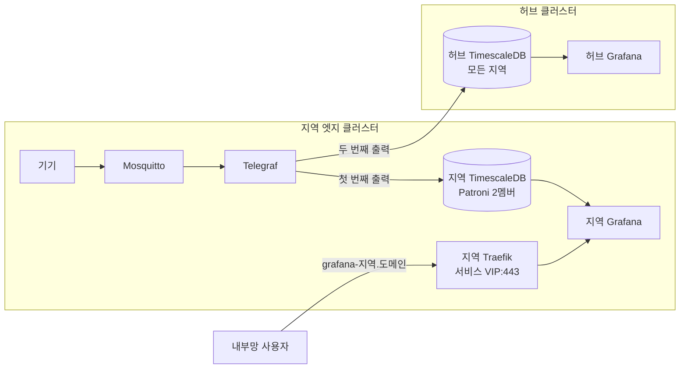

지역 엣지 클러스터에 **지역 TimescaleDB**와 **지역 Grafana**, 내부망 전용 **지역 인그레스**를 두어, 인터넷이나 허브가 끊겨도 그 지역의 기록과 조회가 지역 안에서 이어지게 합니다. 엣지 Telegraf 는 같은 행을 지역 DB 에 먼저, 허브 DB 에 두 번째로 쓰므로 허브는 지금처럼 모든 지역을 모아 보고, 지역 DB 에는 그 지역 데이터만 쌓입니다. 두 DB 는 테이블 정의와 계정이 같고 대시보드 파일도 하나를 함께 써서, 어느 Grafana 에서 보든 같은 화면이 나옵니다.



1. 지역 DB 비밀 값 만들기
2. 지역 TimescaleDB 배포
3. 지역 DB 에 과거 기록 채우기
4. 지역 Grafana 배포
5. 지역 인그레스 배포
6. 확인

## 사전 준비

> 이미 준비되어 있는 경우 건너뛰셔도 됩니다.
{: .prompt-info }

아래 환경을 기준으로 작성했습니다.

| 항목 | 버전 |
| :--- | :--- |
| 허브·엣지 Kubernetes | `v1.37` (kubeadm) |
| Argo CD | `v3.5.3` |
| timescale/timescaledb-ha | `pg17.11-ts2.30.1` (Patroni `4.1.5`) |
| Longhorn | `1.12.1` |
| Grafana | `13.2.2` |
| Traefik | `v3.7` (Helm 차트 `41.6.0`) |
| cert-manager | `v1.21.2` |
| 작성 기준일 | `2026-09-27` |

다음 항목이 준비되어 있어야 합니다.

- 서비스 VIP·Longhorn 기본 StorageClass·내부망 DNS 지역 서비스 이름(`lan_dns_names`)까지 갖춘 지역 엣지 클러스터와 ApplicationSet `iot-edge` ([Proxmox에 Ansible로 kubeadm 엣지 클러스터 만들고 Argo CD 원격 클러스터로 등록하는 방법](/posts/42/))
- 허브 TimescaleDB Patroni 클러스터와, 그때 비밀번호 파일(`~/.config/iot/secrets.env`)을 만든 작업 PC ([쿠버네티스에 Longhorn과 Patroni로 볼륨과 TimescaleDB 이중화하는 방법](/posts/54/))
- 같은 행을 지역 DB 와 허브 DB 에 함께 쓰는 엣지 Telegraf 와 공용 대시보드 폴더 `iot/shared/dashboards` ([엣지 Mosquitto와 Telegraf 디스크 버퍼로 중앙 TimescaleDB에 유실 없이 IoT 데이터 모으는 방법](/posts/43/)). Telegraf 의 출력 구성과 출력별 디스크 버퍼는 그 글에서 다룹니다.
- 허브 cert-manager 와 Cloudflare API 토큰 Secret `cert-manager/cloudflare-api-token` ([쿠버네티스 서비스를 VPN 없이 외부에서 https로 접속하는 방법](/posts/40/))
- 허브 control plane 에 엣지 kubeconfig 파일(`k8s-[SITE].yaml`)

## 1. 지역 DB 비밀 값 만들기

지역 DB 는 허브 DB 와 같은 비밀번호를 씁니다. Patroni 의 superuser·replication 비밀번호는 허브 DB 를 만들 때 쓴 `timescaledb-ha-secrets.sh` 에 엣지 kubeconfig 를 붙여 다시 실행하면, 엣지의 `timescaledb/timescaledb-patroni` Secret 이 허브와 같은 값으로 만들어집니다. 스크립트는 작업 PC 에서 허브 control plane 에 ssh 로 kubectl 을 실행하므로, kubeconfig 경로는 허브 control plane 기준으로 줍니다.

```bash
# 작업 PC: Patroni 비밀번호 Secret (SUFFIX 는 허브 DB 를 만들 때와 같게)
wget https://eu4ng.github.io/assets/scripts/kubernetes/timescaledb-ha-secrets.sh
bash timescaledb-ha-secrets.sh [SUFFIX] /home/ubuntu/k8s-[SITE].yaml
```

> 스크립트는 비밀번호를 작업 PC 의 `~/.config/iot/secrets.env` 에서 읽고, 파일에 없으면 새로 만들어 허브 Secret 까지 그 값으로 덮어씁니다. 허브 DB 는 처음 만들 때의 비밀번호로 이미 초기화되어 있으므로, 반드시 허브 DB 를 만든 작업 PC(또는 그 파일을 옮긴 PC)에서 실행합니다.
{: .prompt-warning }

`iot`·`grafana` 계정 비밀번호와 지역 Grafana 의 Secret 은 `create-iot-secrets.sh` 가 만듭니다. Telegraf 글의 1단계에서 이미 실행했다면 없는 Secret 만 새로 만들어집니다. 스크립트는 모든 비밀번호를 다시 입력받지만 이미 있는 Secret 은 건너뛰므로, 기존과 같은 값을 넣습니다. 특히 `iot`·`grafana` 비밀번호는 허브 DB 와 같아야 합니다.

```bash
# 허브 control plane: 지역 DB·지역 Grafana Secret (스크립트 전문은 Telegraf 글 1단계)
wget https://eu4ng.github.io/assets/scripts/iot/create-iot-secrets.sh
bash create-iot-secrets.sh k8s-[SITE].yaml
```

- **확인:** 엣지에 Secret 4개가 있습니다. `kubectl --kubeconfig k8s-[SITE].yaml -n timescaledb get secret` 에 `timescaledb-patroni`, `timescaledb-credentials`, `-n grafana get secret` 에 `grafana-admin`, `grafana-timescale` 이 보입니다.

## 2. 지역 TimescaleDB 배포

엣지 공통 베이스 `iot/edge/timescaledb/` 에 지역 DB 를 두고, 지역 폴더에서 그대로 가져다 씁니다. 허브 DB 와 같은 이미지와 Patroni 방식이지만, 지역 DB 는 그 지역 데이터만 담고 멤버도 지역 안에만 둡니다.

- **멤버 두 개:** worker 마다 하나씩 StatefulSet 파드로 둡니다(`podAntiAffinity`). 리더 선출은 Patroni 가 쿠버네티스 API(DCS)로 하므로, 멤버가 둘뿐이어도 판정은 엣지 etcd 의 과반이 맡습니다.
- **동기 복제, 엄격하지 않게:** 쓰기는 다른 멤버가 받아야 완료되지만(`synchronous_mode`), 그 멤버가 죽으면 멈추지 않고 비동기로 이어 씁니다(`synchronous_mode_strict: false`).
- **접속 주소:** selector 가 없는 Service `timescaledb` 의 Endpoints 에 Patroni 가 지금 주 DB 의 파드 주소를 적습니다. Telegraf 와 Grafana 는 `timescaledb.timescaledb.svc.cluster.local:5432` 로 붙습니다.
- **스토리지 `longhorn-local`:** DB 는 스스로 복제하므로 Longhorn 볼륨은 한 벌만 두고, 파드가 있는 노드에 복제본을 둡니다(`dataLocality: best-effort`). 기본 StorageClass(2벌)에 두면 같은 데이터를 네 번 쓰게 됩니다.
- **계정:** 처음 만들 때 bootstrap 스크립트가 허브와 같은 역할(`iot` 소유자, `grafana` 읽기 전용)과 권한을 만듭니다. 테이블은 Telegraf 가 첫 행을 쓸 때 허브와 같은 정의로 만듭니다.

```yaml
# 지역 시계열 저장소. 그 지역의 Telegraf·날씨 수집기가 여기에 먼저 쓰고(허브 DB 는 두 번째), 지역 Grafana 가 여기를 봅니다.
# 스키마는 허브 DB 와 같습니다(테이블은 Telegraf 가 같은 create_templates 로 만듦). 비밀값은 GitOps 밖에서 만듭니다(statefulset.yaml 주석).
resources:
  - storageclass.yaml
  - patroni-rbac.yaml
  - service.yaml
  - statefulset.yaml
configMapGenerator:
  - name: timescaledb-patroni
    files:
      - patroni/patroni.yml
      - patroni/post-bootstrap.sh
```
{: file="iot/edge/timescaledb/kustomization.yaml" }

```yaml
# DB 멤버처럼 스스로 복제하는 앱용 Longhorn StorageClass. 볼륨마다 한 벌만 두고, 파드가 있는 노드에 복제본을 옮겨 둡니다(best-effort).
# 기본 StorageClass(longhorn, 2벌)에 두면 DB 복제 2벌 × Longhorn 2벌로 같은 데이터를 네 번 쓰게 됩니다.
apiVersion: storage.k8s.io/v1
kind: StorageClass
metadata:
  name: longhorn-local
provisioner: driver.longhorn.io
allowVolumeExpansion: true
reclaimPolicy: Delete
volumeBindingMode: Immediate
parameters:
  numberOfReplicas: "1"
  dataLocality: best-effort
  staleReplicaTimeout: "30"
  fsType: ext4
```
{: file="iot/edge/timescaledb/storageclass.yaml" }

```yaml
# Patroni 가 쿠버네티스를 DCS(리더 선출·설정 저장)로 씁니다. 권한은 이 네임스페이스 안으로만 한정합니다.
apiVersion: v1
kind: ServiceAccount
metadata: { name: patroni }
---
apiVersion: rbac.authorization.k8s.io/v1
kind: Role
metadata: { name: patroni }
rules:
  - apiGroups: [""]
    resources: [endpoints]
    verbs: [get, list, watch, create, update, patch, delete, deletecollection]
  - apiGroups: [""]
    resources: [pods]
    verbs: [get, list, watch, patch, update]
  - apiGroups: [""]
    resources: [services]
    verbs: [create]
---
apiVersion: rbac.authorization.k8s.io/v1
kind: RoleBinding
metadata: { name: patroni }
roleRef: { apiGroup: rbac.authorization.k8s.io, kind: Role, name: patroni }
subjects:
  - { kind: ServiceAccount, name: patroni }
```
{: file="iot/edge/timescaledb/patroni-rbac.yaml" }

```yaml
# 주 DB 로 가는 주소(timescaledb.timescaledb.svc). selector 가 없고 Patroni 가 Endpoints 에 지금 주 DB 의 파드 주소를 씁니다. 이름은 Patroni scope 와 같아야 합니다.
# 지역 Telegraf·날씨 수집기·Grafana 가 씁니다.
apiVersion: v1
kind: Service
metadata:
  name: timescaledb
spec:
  ports:
    - { name: postgresql, port: 5432, targetPort: 5432 }   # 이름은 Patroni kubernetes.ports 와 같아야 합니다
```
{: file="iot/edge/timescaledb/service.yaml" }

<details markdown="1">
<summary>iot/edge/timescaledb/statefulset.yaml</summary>

```yaml
# 지역 TimescaleDB 멤버 두 개(worker 마다 하나). Patroni 가 주 DB 하나를 고르고 다른 하나는 스트리밍 복제로 따라갑니다.
# 인터넷·허브와 끊겨도 지역 안에서 기록과 조회가 이어지게 하는 지역 전용 DB 입니다(그 지역 데이터만). 허브 DB 에는 Telegraf 가 따로 보냅니다.
apiVersion: apps/v1
kind: StatefulSet
metadata:
  name: timescaledb
spec:
  replicas: 2
  serviceName: timescaledb-config
  podManagementPolicy: Parallel
  selector:
    matchLabels: { application: patroni, cluster-name: timescaledb }
  template:
    metadata:
      labels: { application: patroni, cluster-name: timescaledb }
    spec:
      serviceAccountName: patroni
      securityContext: { fsGroup: 1000 }
      affinity:
        podAntiAffinity:                            # 서버마다 하나
          requiredDuringSchedulingIgnoredDuringExecution:
            - labelSelector: { matchLabels: { application: patroni, cluster-name: timescaledb } }
              topologyKey: kubernetes.io/hostname
      terminationGracePeriodSeconds: 30
      containers:
        - name: timescaledb
          image: timescale/timescaledb-ha:pg17.11-ts2.30.1   # 허브와 같은 이미지
          command: [patroni, /etc/patroni/patroni.yml]
          ports:
            - { name: postgresql, containerPort: 5432 }
            - { name: patroni, containerPort: 8008 }
          env:
            - { name: POD_IP, valueFrom: { fieldRef: { fieldPath: status.podIP } } }
            - { name: PATRONI_NAME, valueFrom: { fieldRef: { fieldPath: metadata.name } } }
            - { name: PATRONI_KUBERNETES_NAMESPACE, valueFrom: { fieldRef: { fieldPath: metadata.namespace } } }
            - { name: PATRONI_KUBERNETES_POD_IP, value: $(POD_IP) }
            - { name: PATRONI_RESTAPI_CONNECT_ADDRESS, value: $(POD_IP):8008 }
            - { name: PATRONI_POSTGRESQL_CONNECT_ADDRESS, value: $(POD_IP):5432 }
            # GitOps 밖에서 만듭니다: timescaledb-patroni(k8s-gitops scripts/timescaledb-ha-secrets.sh), timescaledb-credentials(blog create-iot-secrets.sh)
            - { name: PATRONI_SUPERUSER_PASSWORD, valueFrom: { secretKeyRef: { name: timescaledb-patroni, key: PATRONI_SUPERUSER_PASSWORD } } }
            - { name: PATRONI_REPLICATION_PASSWORD, valueFrom: { secretKeyRef: { name: timescaledb-patroni, key: PATRONI_REPLICATION_PASSWORD } } }
            - { name: IOT_PASSWORD, valueFrom: { secretKeyRef: { name: timescaledb-credentials, key: POSTGRES_PASSWORD } } }
            - { name: GRAFANA_PASSWORD, valueFrom: { secretKeyRef: { name: timescaledb-credentials, key: GRAFANA_PASSWORD } } }
          volumeMounts:
            - { name: pgdata, mountPath: /home/postgres/pgdata }
            - { name: config, mountPath: /etc/patroni }
          readinessProbe:
            httpGet: { path: /readiness, port: 8008 }
            periodSeconds: 10
          livenessProbe:
            httpGet: { path: /liveness, port: 8008 }
            periodSeconds: 10
            failureThreshold: 6
          resources:
            requests: { cpu: 100m, memory: 256Mi }
            limits:   { cpu: "1", memory: 768Mi }
      volumes:
        - name: config
          configMap: { name: timescaledb-patroni, defaultMode: 0755 }
  volumeClaimTemplates:                             # API 서버가 채우는 값(kind·volumeMode·status)까지 적어 Argo CD 가 차이로 보지 않게 합니다
    - apiVersion: v1
      kind: PersistentVolumeClaim
      metadata:
        name: pgdata
      spec:
        accessModes: [ReadWriteOnce]
        storageClassName: longhorn-local            # storageclass.yaml. 한 벌만 두고 이중화는 DB 복제가 맡습니다
        volumeMode: Filesystem
        resources: { requests: { storage: 5Gi } }   # Longhorn 은 온라인으로 늘릴 수 있습니다
      status: { phase: Pending }
```
{: file="iot/edge/timescaledb/statefulset.yaml" }

</details>

<details markdown="1">
<summary>iot/edge/timescaledb/patroni/patroni.yml</summary>

```yaml
# Patroni 설정(지역 DB). 허브 iot/hub/timescaledb/patroni/patroni.yml 과 같은 방식이고, 멤버가 지역 worker 두 대뿐이라 작게 잡습니다.
# 멤버 이름·주소는 환경 변수(PATRONI_NAME, PATRONI_KUBERNETES_POD_IP, *_CONNECT_ADDRESS)로 채웁니다.
scope: timescaledb                # 주 DB 를 가리키는 Service·Endpoints 이름. Patroni 가 Endpoints 에 주 DB 주소를 씁니다
kubernetes:
  use_endpoints: true
  labels: { application: patroni, cluster-name: timescaledb }
  ports: [{ name: postgresql, port: 5432 }]
restapi:
  listen: 0.0.0.0:8008
bootstrap:
  dcs:
    ttl: 30
    loop_wait: 10
    retry_timeout: 10
    maximum_lag_on_failover: 1048576
    # 쓰기는 다른 멤버가 받아야 완료됩니다. 그 멤버가 없으면 멈추지 않고 비동기로 씁니다
    synchronous_mode: true
    synchronous_node_count: 1
    synchronous_mode_strict: false
    postgresql:
      use_pg_rewind: true
      use_slots: true
      parameters:
        shared_preload_libraries: timescaledb
        timescaledb.telemetry_level: "off"
        timescaledb.max_background_workers: 4
        max_worker_processes: 10
        max_connections: 50
        shared_buffers: 128MB
        effective_cache_size: 384MB
        max_wal_size: 512MB          # 볼륨이 작습니다(statefulset.yaml)
        wal_level: replica
        wal_log_hints: "on"
        hot_standby: "on"
        max_wal_senders: 5
        max_replication_slots: 5
        max_slot_wal_keep_size: 1GB  # 오래 끊긴 멤버가 주 DB 디스크를 채우지 않게. 넘으면 그 멤버는 다시 받아야 합니다
        timezone: UTC
        log_timezone: UTC
  initdb: [{ encoding: UTF8 }, { locale: C.UTF-8 }, data-checksums]
  post_bootstrap: /etc/patroni/post-bootstrap.sh
postgresql:
  listen: 0.0.0.0:5432
  data_dir: /home/postgres/pgdata/data
  pgpass: /tmp/pgpass
  authentication:                 # 비밀번호는 PATRONI_SUPERUSER_PASSWORD, PATRONI_REPLICATION_PASSWORD
    superuser: { username: postgres }
    replication: { username: replicator }
    rewind: { username: postgres }
  pg_hba:
    - local all all trust
    - host replication replicator 0.0.0.0/0 scram-sha-256
    - host all all 0.0.0.0/0 scram-sha-256
```
{: file="iot/edge/timescaledb/patroni/patroni.yml" }

</details>

```bash
#!/bin/sh
# 허브 iot/hub/timescaledb/patroni/post-bootstrap.sh 와 같게 둡니다(역할·권한이 같아야 대시보드·Telegraf 가 두 DB 에서 똑같이 동작).
# 새 클러스터를 처음 만들 때 한 번 실행됩니다(Patroni bootstrap.post_bootstrap). $1 은 superuser 접속 문자열입니다.
# Telegraf 는 DB 소유자 iot 로 쓰고(테이블·컬럼을 만들어야 함), Grafana 는 읽기 전용 role grafana 로 봅니다.
# IOT_LOGIN=NOLOGIN 이면 iot 가 로그인하지 못하게 만듭니다(기존 DB 를 복원하기 전에 Telegraf 가 먼저 테이블을 만들지 않게).
set -e
psql -v ON_ERROR_STOP=1 "$1" <<EOSQL
  CREATE ROLE iot SUPERUSER ${IOT_LOGIN:-LOGIN} PASSWORD '$IOT_PASSWORD';
  CREATE DATABASE iot OWNER iot;
  CREATE ROLE grafana LOGIN PASSWORD '$GRAFANA_PASSWORD';
  \connect iot
  CREATE EXTENSION IF NOT EXISTS timescaledb;
  GRANT CONNECT ON DATABASE iot TO grafana;
  GRANT USAGE ON SCHEMA public TO grafana;
  ALTER DEFAULT PRIVILEGES FOR ROLE iot IN SCHEMA public GRANT SELECT ON TABLES TO grafana;
EOSQL
```
{: file="iot/edge/timescaledb/patroni/post-bootstrap.sh" }

지역 폴더는 베이스만 가져옵니다.

```yaml
# [SITE] 엣지의 지역 DB. 베이스 그대로 씁니다.
resources:
  - ../../../edge/timescaledb
```
{: file="iot/clusters/[SITE]/timescaledb/kustomization.yaml" }

```bash
# 커밋하고 push
git add iot/edge/timescaledb iot/clusters/[SITE]/timescaledb
git commit -m "feat(iot): [SITE] 엣지에 지역 TimescaleDB(Patroni 2멤버) 추가"
git push
```

- **확인:** Argo CD 에 `[SITE]-timescaledb` Application 이 생겨 `Synced`·`Healthy` 가 되고, `kubectl --kubeconfig k8s-[SITE].yaml -n timescaledb get pods,pvc` 에 `timescaledb-0`, `timescaledb-1` 이 서로 다른 worker 에서 `Running`, PVC 두 개가 `longhorn-local` 로 `Bound` 입니다. Telegraf 가 이미 떠 있었다면 지역 DB 출력의 디스크 버퍼에 쌓인 행이 이때 들어가며 테이블이 만들어집니다.

## 3. 지역 DB 에 과거 기록 채우기

지역 DB 에는 만든 뒤에 들어온 행만 있으므로, 그 전의 기록은 허브 DB 에서 그 지역(`site`) 행을 가져와 채웁니다. 스크립트는 허브 주 DB 에서 `COPY ... TO STDOUT` 으로 받은 행을 지역 주 DB 의 임시 테이블에 넣고, 지역에 없는 행만 옮깁니다. 두 DB 에 모두 있는 컬럼만 옮기고, 지역 DB 에 아직 없는 테이블(Telegraf 가 첫 행을 쓰기 전)은 건너뛰므로 여러 번 실행해도 됩니다. 작업 PC 에서 허브 control plane 에 ssh 로 실행합니다.

```bash
# 작업 PC 에서 스크립트 내려받기
wget https://eu4ng.github.io/assets/scripts/iot/timescaledb-seed-site.sh
```

<details markdown="1">
<summary>timescaledb-seed-site.sh 전문</summary>

```bash
#!/usr/bin/env bash
#
# 허브 DB 에 있는 한 지역의 기록(readings, events)을 그 지역 DB(iot/edge/timescaledb)로 채웁니다. 여러 번 실행해도 됩니다.
# 지역 DB 를 새로 만들었을 때(지역 DB 가 생기기 전의 기록, 지역 DB 를 다시 만든 경우) 실행합니다.
# 지역 DB 에 이미 있는 행(모든 컬럼이 같은 행)은 넣지 않습니다. 테이블이 아직 없으면(Telegraf 가 아직 안 만듦) 그 테이블은 건너뜁니다.
#
# 사용법: bash scripts/timescaledb-seed-site.sh <SITE> <EDGE_KUBECONFIG>
#   EDGE_KUBECONFIG 는 허브 kubectl 호스트 기준 경로. 예: bash scripts/timescaledb-seed-site.sh daejeon /home/ubuntu/k8s-daejeon.yaml

set -euo pipefail

# ---------- 환경에 맞게 수정 ----------
KUBECTL_HOST=ubuntu@[CONTROL_PLANE_IP]      # 허브 kubectl 을 실행하는 곳(내부망 DNS 의 역할 이름)
TABLES="readings events"
# --------------------------------------

log() { echo -e "\n\033[1;32m==>\033[0m $*"; }
die() { echo -e "\033[1;31m[오류]\033[0m $*" >&2; exit 1; }
SITE=${1:-}; EDGE_KUBECONFIG=${2:-}
[[ "$SITE" =~ ^[a-z0-9-]+$ && -n "$EDGE_KUBECONFIG" ]] || die "사용법: bash scripts/timescaledb-seed-site.sh <SITE> <EDGE_KUBECONFIG>"

# 주 DB 파드(Patroni 가 role=primary 라벨을 붙임)
primary() { ssh "$KUBECTL_HOST" "kubectl $1 -n timescaledb get pod -l role=primary -o jsonpath='{.items[0].metadata.name}'"; }
HUB_POD=$(primary "") ; EDGE_POD=$(primary "--kubeconfig $EDGE_KUBECONFIG")
[ -n "$HUB_POD" ] && [ -n "$EDGE_POD" ] || die "주 DB 파드를 찾지 못했습니다 (허브: '$HUB_POD', 지역: '$EDGE_POD')"
HUB_PSQL="kubectl -n timescaledb exec -i $HUB_POD -c timescaledb -- psql -X -q -v ON_ERROR_STOP=1 -U postgres -d iot"
EDGE_PSQL="kubectl --kubeconfig $EDGE_KUBECONFIG -n timescaledb exec -i $EDGE_POD -- psql -X -q -v ON_ERROR_STOP=1 -U postgres -d iot"
echo "허브 $HUB_POD → 지역 $EDGE_POD ($SITE)"

for t in $TABLES; do
  log "$t"
  # 두 DB 에 모두 있는 컬럼만, 지역 테이블의 순서로 옮깁니다(Telegraf 가 나중에 붙인 컬럼이 한쪽에만 있을 수 있음)
  q="SELECT string_agg(quote_ident(column_name), ',' ORDER BY ordinal_position) FROM information_schema.columns WHERE table_schema = 'public' AND table_name = '$t'"
  edge_cols=$(ssh "$KUBECTL_HOST" "$EDGE_PSQL -At" <<<"$q")
  hub_cols=$(ssh "$KUBECTL_HOST" "$HUB_PSQL -At" <<<"$q")
  [ -n "$edge_cols" ] || { echo "  지역 DB 에 $t 가 아직 없어 건너뜁니다(Telegraf 가 첫 행을 쓸 때 만듭니다)"; continue; }
  cols=$(python3 -c 'import sys; h=set(sys.argv[2].split(",")); print(",".join(c for c in sys.argv[1].split(",") if c in h))' "$edge_cols" "$hub_cols")
  before=$(ssh "$KUBECTL_HOST" "$EDGE_PSQL -At" <<<"SELECT count(*) FROM $t WHERE site = '$SITE'")
  # 허브에서 COPY TO STDOUT 으로 받은 행을 지역의 임시 테이블에 COPY FROM STDIN 으로 넣고, 지역에 없는 행만 옮깁니다.
  # EXCEPT 는 NULL 끼리도 같다고 보므로 비어 있는 태그 컬럼이 있어도 같은 행을 걸러 냅니다.
  {
    echo "BEGIN; CREATE TEMP TABLE s AS SELECT $cols FROM $t WITH NO DATA; COPY s FROM STDIN;"
    ssh "$KUBECTL_HOST" "$HUB_PSQL" <<<"COPY (SELECT $cols FROM $t WHERE site = '$SITE') TO STDOUT"
    echo '\.'
    echo "INSERT INTO $t ($cols) SELECT * FROM s EXCEPT SELECT $cols FROM $t WHERE site = '$SITE' AND time >= (SELECT min(time) FROM s); COMMIT;"
  } | ssh "$KUBECTL_HOST" "$EDGE_PSQL"
  after=$(ssh "$KUBECTL_HOST" "$EDGE_PSQL -At" <<<"SELECT count(*) FROM $t WHERE site = '$SITE'")
  hub=$(ssh "$KUBECTL_HOST" "$HUB_PSQL -At" <<<"SELECT count(*) FROM $t WHERE site = '$SITE'")
  echo "  지역 $before → $after 행 (허브 $hub 행)"
done
log "완료"
```
{: file="timescaledb-seed-site.sh" }

</details>

```bash
# 허브 DB 의 [SITE] 행을 지역 DB 로 채우기 (kubeconfig 는 허브 control plane 기준 경로)
bash timescaledb-seed-site.sh [SITE] /home/ubuntu/k8s-[SITE].yaml
```

- **확인:** 테이블마다 `지역 [N] → [M] 행 (허브 [K] 행)` 이 출력됩니다. 허브에 모든 컬럼이 같은 행이 중복되어 있으면(MQTT QoS 1 재전송) 한 번만 옮기므로 `M` 이 `K` 보다 조금 작을 수 있습니다. 이 글을 쓰며 확인했을 때 지역 DB 의 중복을 뺀 행 수는 허브 DB 의 같은 지역 중복을 뺀 행 수와 같았습니다. 지역 DB 에 아직 없는 테이블은 `건너뜁니다` 로 표시됩니다.

## 4. 지역 Grafana 배포

지역 Grafana 는 지역 DB 를 데이터 소스로 두고, 허브 Grafana 와 같은 대시보드 파일(`iot/shared/dashboards/iot.json`)을 파일 프로비저닝으로 불러옵니다. 데이터 소스 `uid` 를 허브와 같은 `timescaledb` 로 두어야 같은 대시보드가 고치지 않고 동작합니다. 인터넷 없이 뜨고 돌도록 시작할 때 받는 기본 플러그인, 업데이트 확인, 사용 통계, 뉴스를 끄고, 관리자 계정은 1단계에서 허브 것을 복사한 Secret 을 씁니다.

```yaml
# 지역 Grafana. 지역 DB(iot/edge/timescaledb)를 데이터 소스로, 허브와 같은 IoT 대시보드(iot/shared/dashboards)를 봅니다.
resources:
  - deployment.yaml
  - pvc.yaml
  - service.yaml
  - ../../shared/dashboards
configMapGenerator:
  - name: grafana-provisioning
    files:
      - provisioning/datasources.yaml
      - provisioning/dashboards.yaml
```
{: file="iot/edge/grafana/kustomization.yaml" }

<details markdown="1">
<summary>iot/edge/grafana/deployment.yaml</summary>

```yaml
# 지역 Grafana. 지역 DB 를 보는 IoT 대시보드(허브와 같은 파일)를 인터넷 없이도 볼 수 있게 지역 안에 둡니다.
# 설정은 모두 파일(provisioning)로 넣고, PVC 에는 사용자 설정(즐겨찾기 등)만 남습니다.
apiVersion: apps/v1
kind: Deployment
metadata:
  name: grafana
spec:
  replicas: 1
  strategy:
    type: Recreate           # 데이터 PVC 가 ReadWriteOnce 입니다
  selector:
    matchLabels: { app: grafana }
  template:
    metadata:
      labels: { app: grafana }
    spec:
      securityContext:
        runAsUser: 472       # 이미지의 grafana 계정
        runAsGroup: 472
        fsGroup: 472
      containers:
        - name: grafana
          image: grafana/grafana:13.2.2   # 허브 Grafana 와 같은 버전
          ports: [{ name: http, containerPort: 3000 }]
          env:
            # GitOps 밖에서 만듭니다 (create-iot-secrets.sh): grafana-admin(허브 관리자 계정 복사), grafana-timescale(지역 DB 읽기 전용 grafana 계정)
            - { name: GF_SECURITY_ADMIN_USER, valueFrom: { secretKeyRef: { name: grafana-admin, key: admin-user } } }
            - { name: GF_SECURITY_ADMIN_PASSWORD, valueFrom: { secretKeyRef: { name: grafana-admin, key: admin-password } } }
            - { name: TIMESCALE_PASSWORD, valueFrom: { secretKeyRef: { name: grafana-timescale, key: TIMESCALE_PASSWORD } } }
            - { name: GF_DATE_FORMATS_DEFAULT_TIMEZONE, value: Asia/Seoul }
            # 인터넷 없이 뜨고 돌도록 바깥에 묻는 기능을 끕니다(시작할 때 받는 기본 플러그인, 업데이트 확인, 사용 통계, 뉴스)
            - { name: GF_PLUGINS_PREINSTALL_DISABLED, value: "true" }
            - { name: GF_ANALYTICS_REPORTING_ENABLED, value: "false" }
            - { name: GF_ANALYTICS_CHECK_FOR_UPDATES, value: "false" }
            - { name: GF_ANALYTICS_CHECK_FOR_PLUGIN_UPDATES, value: "false" }
            - { name: GF_NEWS_NEWS_FEED_ENABLED, value: "false" }
            # 지역 오버레이가 외부 주소로 바꿉니다(리다이렉트·링크)
            - { name: GF_SERVER_ROOT_URL, value: "http://localhost:3000" }
          volumeMounts:
            - { name: data, mountPath: /var/lib/grafana }
            - { name: provisioning, mountPath: /etc/grafana/provisioning/datasources/datasources.yaml, subPath: datasources.yaml }
            - { name: provisioning, mountPath: /etc/grafana/provisioning/dashboards/dashboards.yaml, subPath: dashboards.yaml }
            - { name: dashboards, mountPath: /var/lib/grafana-dashboards }
          readinessProbe:
            httpGet: { path: /api/health, port: 3000 }
            periodSeconds: 10
          resources:
            requests: { cpu: 50m, memory: 128Mi }
            limits:   { cpu: "1", memory: 512Mi }
      volumes:
        - name: data
          persistentVolumeClaim: { claimName: grafana-data }
        - name: provisioning
          configMap: { name: grafana-provisioning }
        - name: dashboards
          configMap: { name: grafana-dashboard-iot }   # iot/shared/dashboards
```
{: file="iot/edge/grafana/deployment.yaml" }

</details>

```yaml
apiVersion: v1
kind: PersistentVolumeClaim
metadata:
  name: grafana-data
  annotations:
    argocd.argoproj.io/sync-options: Prune=false   # 사용자 설정(즐겨찾기, 직접 만든 대시보드)
spec:
  accessModes: [ReadWriteOnce]
  resources:
    requests:
      storage: 1Gi           # 기본 StorageClass(Longhorn 2벌)
```
{: file="iot/edge/grafana/pvc.yaml" }

```yaml
# 지역 오버레이가 kube-vip.io/loadbalancerIPs 로 지역 서비스 VIP 를 줍니다(HA·Z2M 과 같은 주소, 포트 3000).
apiVersion: v1
kind: Service
metadata:
  name: grafana
spec:
  type: LoadBalancer
  selector: { app: grafana }
  ports:
    - { name: http, port: 3000, targetPort: 3000 }
```
{: file="iot/edge/grafana/service.yaml" }

```yaml
# 지역 DB. uid 는 허브 Grafana 의 TimescaleDB 데이터 소스(services/monitoring/values.yaml)와 같아야 같은 대시보드가 그대로 동작합니다.
# $TIMESCALE_PASSWORD 는 Grafana 가 읽을 때 컨테이너 env 로 채웁니다.
apiVersion: 1
datasources:
  - name: TimescaleDB
    uid: timescaledb
    type: grafana-postgresql-datasource
    access: proxy
    url: timescaledb.timescaledb.svc.cluster.local:5432   # iot/edge/timescaledb
    user: grafana
    secureJsonData: { password: "$TIMESCALE_PASSWORD" }
    jsonData: { database: iot, sslmode: disable, timescaledb: true, postgresVersion: 1700 }
    isDefault: true
    editable: false
```
{: file="iot/edge/grafana/provisioning/datasources.yaml" }

```yaml
# 대시보드 파일(iot/shared/dashboards 의 ConfigMap 을 마운트한 폴더)을 불러옵니다. 원본은 저장소이므로 화면에서 고친 내용은 저장하지 않습니다.
apiVersion: 1
providers:
  - name: iot
    type: file
    disableDeletion: true
    allowUiUpdates: false
    options: { path: /var/lib/grafana-dashboards }
```
{: file="iot/edge/grafana/provisioning/dashboards.yaml" }

지역 폴더에서는 서비스 VIP 와 외부 주소만 넣습니다. 서비스 VIP 는 엣지 글 1단계의 `service_vip` 와 같은 값이고, 다른 지역 서비스와 포트만 달리해 같은 주소를 씁니다.

```yaml
# [SITE] 엣지의 Grafana. 서비스 VIP 와 외부 주소만 넣습니다.
resources:
  - ../../../edge/grafana
patches:
  # [SITE] 엣지의 서비스 VIP(kube-vip). HA·Z2M·Matter·Mosquitto 와 포트만 달리해 같은 주소를 씁니다
  - patch: |
      apiVersion: v1
      kind: Service
      metadata:
        name: grafana
        annotations:
          kube-vip.io/loadbalancerIPs: "[EDGE_SERVICE_VIP]"
  - patch: |
      apiVersion: apps/v1
      kind: Deployment
      metadata:
        name: grafana
      spec:
        template:
          spec:
            containers:
              - name: grafana
                env:
                  - { name: GF_SERVER_ROOT_URL, value: "https://grafana-[SITE_SHORT].[DOMAIN]" }   # 허브 Traefik 경유 주소(iot/hub/edge-web-[SITE])
```
{: file="iot/clusters/[SITE]/grafana/kustomization.yaml" }

```bash
# 커밋하고 push
git add iot/edge/grafana iot/clusters/[SITE]/grafana
git commit -m "feat(iot): [SITE] 엣지에 지역 Grafana 추가"
git push
```

- **확인:** `[SITE]-grafana` Application 이 `Synced`·`Healthy` 이고, `kubectl --kubeconfig k8s-[SITE].yaml -n grafana get svc grafana` 의 `EXTERNAL-IP` 가 `[EDGE_SERVICE_VIP]` 입니다. 내부망에서 `http://[EDGE_SERVICE_VIP]:3000` 에 허브 Grafana 관리자 계정으로 로그인하면 **Dashboards** 에 **IoT 기록** 이 있고, `site` 변수에 이 지역만 보입니다.

## 5. 지역 인그레스 배포

밖에서 오는 지역 서비스 접속은 허브 Traefik 이 Google 로그인 뒤 지역으로 넘기지만, 인터넷이나 허브가 끊기면 그 경로도 끊깁니다. 내부망에서는 같은 이름(`grafana-[SITE_SHORT].[DOMAIN]` 등)으로 허브를 거치지 않고 붙도록 지역에 Traefik 과 cert-manager 를 둡니다. 흐름은 다음과 같습니다.

- 내부망 DNS 가 `lan_dns_names` 의 이름을 지역 서비스 VIP 로 답합니다(엣지 글 1~2단계).
- 서비스 VIP 는 kube-vip 리더인 control plane 한 대가 가집니다. Traefik 을 control plane 두 대에 DaemonSet 으로 두고 `hostPort` 443 으로 받으므로, VIP 를 가진 노드의 Traefik 이 요청을 받습니다.
- Traefik 은 내부망 대역이 아닌 접속을 403 으로 막고, 이름별로 각 네임스페이스의 Service 로 넘깁니다. 인증은 앱 자체 로그인만 씁니다.
- 와일드카드 인증서는 지역 cert-manager 가 DNS-01 로 직접 발급·갱신합니다. 인터넷은 갱신할 때만 필요하고, 90일짜리 인증서를 60일째에 갱신하므로 인터넷이 끊겨도 약 30일은 그대로 씁니다.

cert-manager 가 Cloudflare 에 DNS 레코드를 쓰려면 엣지에도 API 토큰 Secret 이 있어야 합니다. 허브의 Secret 을 엣지로 복사합니다.

```bash
# 허브 control plane: 허브의 Cloudflare 토큰 Secret 을 엣지 cert-manager 네임스페이스로 복사
E="--kubeconfig k8s-[SITE].yaml"
kubectl $E create namespace cert-manager --dry-run=client -o yaml | kubectl $E apply -f -
kubectl -n cert-manager get secret cloudflare-api-token -o jsonpath='{.data.token}' | base64 -d \
  | kubectl $E -n cert-manager create secret generic cloudflare-api-token --from-file=token=/dev/stdin --dry-run=client -o yaml \
  | kubectl $E apply -f -
```

지역 cert-manager 는 허브의 `services/cert-manager` 와 같은 차트·설정을 복제한 Helm 폴더입니다.

```yaml
apiVersion: v2
name: [SITE]-cert-manager
version: 0.1.0
dependencies:
  - name: cert-manager
    version: v1.21.2
    repository: https://charts.jetstack.io
```
{: file="iot/clusters/[SITE]/cert-manager/Chart.yaml" }

```yaml
cert-manager:
  crds: { enabled: true }                        # CRD 를 차트와 함께 관리합니다 (ApplicationSet 의 ServerSideApply 로 큰 CRD 도 적용됩니다)
```
{: file="iot/clusters/[SITE]/cert-manager/values.yaml" }

```yaml
# Let's Encrypt 에 DNS-01 로 소유권을 증명합니다. 80 포트를 열지 않아도 되고 와일드카드 인증서가 됩니다.
# Cloudflare API 토큰(권한: Zone.DNS Edit, Zone.Zone Read)은 GitOps 밖에서 만듭니다:
#   kubectl -n cert-manager create secret generic cloudflare-api-token --from-literal=token=<토큰>
apiVersion: cert-manager.io/v1
kind: ClusterIssuer
metadata:
  name: letsencrypt
spec:
  acme:
    server: https://acme-v02.api.letsencrypt.org/directory
    privateKeySecretRef: { name: letsencrypt-account }
    solvers:
      - dns01:
          cloudflare:
            apiTokenSecretRef: { name: cloudflare-api-token, key: token }
```
{: file="iot/clusters/[SITE]/cert-manager/templates/clusterissuer.yaml" }

지역 Traefik 도 허브의 `services/traefik` 과 같은 차트 버전을 쓰는 Helm 폴더입니다. `templates/` 에 와일드카드 인증서, 내부망 외 차단, 지역 서비스 경로를 둡니다.

```yaml
apiVersion: v2
name: [SITE]-traefik
version: 0.1.0
dependencies:
  - name: traefik
    version: 41.6.0
    repository: https://traefik.github.io/charts
```
{: file="iot/clusters/[SITE]/traefik/Chart.yaml" }

```yaml
# 내부망 전용. 공유기는 이 지역으로 포트를 넘기지 않으므로 LAN 접속만 받습니다(templates/middleware.yaml).
lanIPv4:
  - [LAN_CIDR]

traefik:
  deployment:
    kind: DaemonSet                              # control plane 두 대에서 받습니다. 서비스 VIP 를 가진 쪽으로 요청이 옵니다
  nodeSelector: { node-role.kubernetes.io/control-plane: "" }
  tolerations:
    - { key: node-role.kubernetes.io/control-plane, operator: Exists, effect: NoSchedule }
  updateStrategy:
    rollingUpdate: { maxSurge: 0, maxUnavailable: 1 }   # hostPort 를 쓰므로 옛 파드를 먼저 내려야 새 파드가 뜹니다
  service:
    spec:
      type: ClusterIP                            # VIP:443 → hostPort 로 들어오므로 NodePort·LoadBalancer 가 필요 없습니다
  ports:
    web:
      hostPort: 80
      http:
        redirections:
          entryPoint: { to: websecure, scheme: https, permanent: true }
    websecure:
      hostPort: 443                              # CNI portmap 이 DNAT 만 하므로 접속자 IP 가 보존됩니다(HA 의 로그인 실패 차단이 실제 접속자에게 걸림)
      http:
        middlewares: [traefik-lan-only@kubernetescrd]
  providers:
    kubernetesCRD:
      allowCrossNamespace: true                  # 경로(templates/ingressroutes.yaml)가 각 앱 네임스페이스의 Service 를 가리킵니다
    kubernetesIngress:
      enabled: false                             # Ingress 는 쓰지 않습니다
  tlsStore:
    default:
      defaultCertificate: { secretName: wildcard-tls }
  resources:
    requests: { cpu: 25m, memory: 64Mi }
    limits: { memory: 256Mi }
  accessLog: { enabled: true }
```
{: file="iot/clusters/[SITE]/traefik/values.yaml" }

```yaml
# *.[DOMAIN] 와일드카드 인증서. 지역 cert-manager([SITE]/cert-manager)가 발급해 Secret wildcard-tls 에 넣고 Traefik 이 기본 인증서로 씁니다.
apiVersion: cert-manager.io/v1
kind: Certificate
metadata:
  name: wildcard-tls
spec:
  secretName: wildcard-tls
  dnsNames: ["*.[DOMAIN]"]
  issuerRef: { kind: ClusterIssuer, name: letsencrypt }
```
{: file="iot/clusters/[SITE]/traefik/templates/certificate.yaml" }


```yaml
# 진입점(websecure) 기본 미들웨어. 내부망이 아닌 접속은 403 입니다.
apiVersion: traefik.io/v1alpha1
kind: Middleware
metadata:
  name: lan-only
spec:
  ipAllowList:
    sourceRange:
{{- range .Values.lanIPv4 }}
      - {{ . }}
{{- end }}
```
{: file="iot/clusters/[SITE]/traefik/templates/middleware.yaml" }



```yaml
# 지역 서비스 경로(내부망 전용). 이름은 <서비스>-<지역약자>.[DOMAIN] 이고 허브의 iot/hub/edge-web-[SITE] 과 같은 이름입니다.
# 인증은 앱 자체 것만 씁니다: HA 로그인 + OTP, Z2M 프런트엔드 토큰, Grafana 로그인. Matter 대시보드는 로그인이 없어 내부망에서만 엽니다.
{{- range $r := list
  (dict "name" "ha-[SITE_SHORT]"      "ns" "home-assistant" "svc" "home-assistant" "port" 8123)
  (dict "name" "z2m-[SITE_SHORT]"     "ns" "zigbee2mqtt"    "svc" "zigbee2mqtt"    "port" 30083)
  (dict "name" "matter-[SITE_SHORT]"  "ns" "matter"         "svc" "matter-server"  "port" 5580)
  (dict "name" "grafana-[SITE_SHORT]" "ns" "grafana"        "svc" "grafana"        "port" 3000) }}
---
apiVersion: traefik.io/v1alpha1
kind: IngressRoute
metadata:
  name: {{ $r.name }}
spec:
  entryPoints: [websecure]
  routes:
    - match: Host(`{{ $r.name }}.[DOMAIN]`)
      kind: Rule
      services:
        - { name: {{ $r.svc }}, namespace: {{ $r.ns }}, port: {{ $r.port }} }
{{- end }}
```
{: file="iot/clusters/[SITE]/traefik/templates/ingressroutes.yaml" }


```bash
# 커밋하고 push
git add iot/clusters/[SITE]/cert-manager iot/clusters/[SITE]/traefik
git commit -m "feat(iot): [SITE] 엣지에 지역 인그레스(Traefik)와 인증서(cert-manager) 추가"
git push
```

지역 서비스 이름을 엣지 클러스터를 만든 뒤에 `lan_dns_names` 에 더했다면, `proxmox-ansible` 에서 내부망 DNS 플레이북을 다시 실행합니다([Proxmox에 Ansible로 내부망 DNS 컨테이너 만드는 방법](/posts/41/)).

```bash
# 내부망 DNS 에 지역 서비스 이름 반영 (필요할 때만)
ansible-playbook playbooks/lan-dns.yml
```

- **확인:** `[SITE]-cert-manager`, `[SITE]-traefik` Application 이 `Synced`·`Healthy` 이고, `kubectl --kubeconfig k8s-[SITE].yaml get certificate -A` 의 `wildcard-tls` 가 `READY True` 입니다. 내부망 PC 에서 `getent hosts grafana-[SITE_SHORT].[DOMAIN]` 이 `[EDGE_SERVICE_VIP]` 를, `curl -s -o /dev/null -w '%{http_code}\n' https://grafana-[SITE_SHORT].[DOMAIN]/api/health` 가 인증서 오류 없이 `200` 을 출력합니다.

## 6. 확인

지역 DB 의 복제 상태, 두 DB 에 같은 행이 들어오는지, 지역 Grafana 가 지역 DB 를 조회하는지를 차례로 봅니다.

```bash
# 허브 control plane: 지역 DB 멤버 상태
kubectl --kubeconfig k8s-[SITE].yaml -n timescaledb exec timescaledb-0 -- patronictl -c /etc/patroni/patroni.yml list
```

```text
+ Cluster: timescaledb (7690216639023079456) --+-----------+----+-------------+-----+------------+-----+
| Member        | Host          | Role         | State     | TL | Receive LSN | Lag | Replay LSN | Lag |
+---------------+---------------+--------------+-----------+----+-------------+-----+------------+-----+
| timescaledb-0 | [POD_IP_0]    | Leader       | running   |  2 |             |     |            |     |
| timescaledb-1 | [POD_IP_1]    | Sync Standby | streaming |  2 |   0/BFC6BA0 |   0 |  0/BFC6BA0 |   0 |
+---------------+---------------+--------------+-----------+----+-------------+-----+------------+-----+
```

```bash
# 허브 control plane: 최근 10분 동안 두 DB 에 들어온 [SITE] 행 (주 DB 파드는 Patroni 가 role=primary 라벨을 붙임)
Q="SELECT count(*), max(time) FROM readings WHERE site = '[SITE]' AND time > now() - interval '10 minutes'"
E="--kubeconfig k8s-[SITE].yaml"
LP=$(kubectl $E -n timescaledb get pod -l role=primary -o jsonpath='{.items[0].metadata.name}')
HP=$(kubectl -n timescaledb get pod -l role=primary -o jsonpath='{.items[0].metadata.name}')
echo "$Q" | kubectl $E -n timescaledb exec -i "$LP" -- psql -U postgres -d iot -At
echo "$Q" | kubectl -n timescaledb exec -i "$HP" -c timescaledb -- psql -U postgres -d iot -At
```

지역 Grafana 는 API 로 대시보드가 프로비저닝되었는지와, 데이터 소스 `timescaledb` 로 쿼리가 실행되는지를 봅니다. 관리자 비밀번호는 명령 안에서만 씁니다.

```bash
# 허브 control plane: 지역 Grafana API 로 대시보드와 데이터 소스 쿼리 확인
PW=$(kubectl --kubeconfig k8s-[SITE].yaml -n grafana get secret grafana-admin -o jsonpath='{.data.admin-password}' | base64 -d)
AU=$(kubectl --kubeconfig k8s-[SITE].yaml -n grafana get secret grafana-admin -o jsonpath='{.data.admin-user}' | base64 -d)
G=https://grafana-[SITE_SHORT].[DOMAIN]
curl -s -u "$AU:$PW" $G/api/dashboards/uid/iot-records | python3 -c 'import sys,json; d=json.load(sys.stdin); print(d["dashboard"]["title"], d["meta"]["provisioned"])'
curl -s -u "$AU:$PW" -H 'Content-Type: application/json' $G/api/ds/query \
  -d '{"from":"now-10m","to":"now","queries":[{"refId":"A","datasource":{"uid":"timescaledb"},"format":"table","rawSql":"SELECT site, count(*) AS rows FROM readings WHERE $__timeFilter(time) GROUP BY site"}]}'
```

- **확인:** `patronictl list` 에 `Leader` 하나와 `Sync Standby` 하나(`streaming`, `Lag` 0)가 보입니다. 두 DB 쿼리의 행 수와 마지막 시각이 같거나, 방금 들어온 몇 행 차이입니다. Grafana 는 `IoT 기록 True` 를 출력하고, 데이터 소스 쿼리 결과의 `values` 에 이 지역 이름 하나와 행 수가 들어 있습니다(`"values":[["[SITE]"],[4071]]` 형태). 이 글을 쓰며 확인했을 때 최근 10분 행 수와 마지막 시각이 두 DB 에서 같았습니다.

## 마무리

지역 엣지에 Patroni 2멤버 TimescaleDB, 허브와 같은 대시보드를 쓰는 Grafana, 내부망 전용 Traefik 과 cert-manager 를 GitOps 폴더로 배포해, 인터넷이나 허브가 끊겨도 그 지역 안에서 기록과 조회가 이어지고 허브는 모든 지역을 모아 보는 구성을 완성했습니다. 지역을 추가할 때는 `iot/clusters/[SITE]/` 아래에 같은 오버레이와 Helm 폴더를 만들고, 비밀 값 스크립트를 그 엣지에 실행한 뒤 과거 기록을 채우면 됩니다. 지역 DB 와 지역 Grafana 볼륨의 백업은 [restic과 Cloudflare Tunnel로 쿠버네티스 볼륨과 DB를 원격 NAS에 백업하는 방법](/posts/50/)에서 다룹니다.

## 참고 자료

- [Patroni - Kubernetes](https://patroni.readthedocs.io/en/latest/kubernetes.html)
- [Patroni - YAML Configuration Settings](https://patroni.readthedocs.io/en/latest/yaml_configuration.html)
- [Longhorn - Settings Reference](https://longhorn.io/docs/1.12.1/references/settings/)
- [Grafana - Provision Grafana](https://grafana.com/docs/grafana/latest/administration/provisioning/)
- [Grafana - Data source HTTP API](https://grafana.com/docs/grafana/latest/developers/http_api/data_source/)
- [Traefik - Kubernetes IngressRoute](https://doc.traefik.io/traefik/routing/providers/kubernetes-crd/)
- [cert-manager - Cloudflare DNS-01](https://cert-manager.io/docs/configuration/acme/dns01/cloudflare/)
- [kube-vip - Kubernetes Services](https://kube-vip.io/docs/usage/kubernetes-services/)
