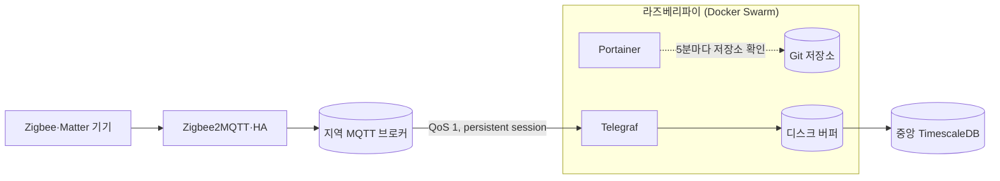

새 지역에 수집망을 가볍게 시작할 때, [쿠버네티스 엣지 클러스터](/posts/42/) 대신 라즈베리파이 한 대에 Docker Swarm 과 Portainer 를 올리고 수집기(Telegraf)를 GitOps 로 배포합니다. Git 저장소의 `swarm/<지역>/<스택>/stack.yml` 을 Pi 의 Portainer 가 5분마다 읽어 반영하고, Telegraf 는 [대전 엣지와 같은 설정](/posts/43/)으로 브로커의 기기 메시지를 받아 디스크 버퍼를 거쳐 중앙 TimescaleDB 에 씁니다. 이 글은 수집기까지 다루고, Zigbee2MQTT·Home Assistant 같은 제어 쪽을 Pi 로 옮기는 것은 다루지 않습니다.

1. Pi 준비
2. 저장소 폴더 만들기
3. Docker·Swarm·Portainer 부트스트랩
4. 비밀 값 준비
5. Telegraf 스택 작성과 등록
6. 확인



## 사전 준비

> 이미 준비되어 있는 경우 건너뛰셔도 됩니다.
{: .prompt-info }

아래 환경을 기준으로 작성했습니다.

| 항목 | 버전 |
| :--- | :--- |
| 하드웨어 | Raspberry Pi 4 Model B 4GB, SD 카드 32GB |
| 운영체제 | Raspberry Pi OS (Debian 13 trixie, arm64) |
| Docker | `29.8.1` (Swarm 단일 노드) |
| Portainer CE | `2.45.1` |
| telegraf | `1.40.1` |
| 작성 기준일 | `2026-09-28` |

다음 항목이 준비되어 있어야 합니다.

- 작업 PC 에서 Pi 에 SSH 키로 접속할 수 있는 상태. 작업 PC 에는 `git`, `curl`, `python3`(PyYAML) 이 필요합니다.
- 기기 메시지가 들어오는 MQTT 브로커와 Telegraf 계정, 그리고 Telegraf 가 쓸 중앙 TimescaleDB ([엣지 Mosquitto와 Telegraf 디스크 버퍼로 중앙 TimescaleDB에 유실 없이 IoT 데이터 모으는 방법](/posts/43/))
- 스택 파일을 둘 비공개 GitHub 저장소(이 글에서는 `project-iot`)
- 지역과 허브의 역할 나눔은 [허브-엣지 구조와 지역 자립(오프라인 우선) 설계란 무엇인가](/posts/62/)를 참고합니다.

```bash
# 작업 PC (Debian·Ubuntu)
sudo apt install -y git curl python3-yaml
```

## 1. Pi 준비

부트스트랩 스크립트가 Pi 에서 `sudo` 를 비밀번호 없이 써야 하고, Swarm 의 메모리 제한이 동작하려면 memory cgroup 이 켜져 있어야 합니다. Raspberry Pi OS 는 memory cgroup 이 기본으로 꺼져 있습니다. 둘 다 한 번만 합니다.

```bash
# 작업 PC: pi 계정이 비밀번호 없이 sudo (Pi 의 sudo 비밀번호를 한 번 묻습니다)
ssh -t pi@[PI_IP] 'echo "pi ALL=(ALL) NOPASSWD: ALL" | sudo tee /etc/sudoers.d/010_pi-nopasswd >/dev/null && sudo chmod 440 /etc/sudoers.d/010_pi-nopasswd && sudo -n true && echo OK'

# 작업 PC: memory cgroup 켜기(원본은 .bak 으로 남김) 후 재부팅
ssh pi@[PI_IP] 'F=/boot/firmware/cmdline.txt; sudo cp -n $F $F.bak; grep -q cgroup_enable=memory $F || sudo sed -i "1 s/\$/ cgroup_enable=memory/" $F; sudo systemctl reboot'
```

> 비밀번호 없는 sudo 는 SSH 키가 있는 사람에게 root 권한을 주는 것과 같습니다. Pi 의 SSH 비밀번호 로그인이 꺼져 있는지(`ssh -o PubkeyAuthentication=no pi@[PI_IP]` 가 `Permission denied (publickey)` 로 끝나는지) 먼저 확인합니다.
{: .prompt-warning }

- **확인:** 재부팅 뒤 `ssh pi@[PI_IP] cat /sys/fs/cgroup/cgroup.controllers` 에 `memory` 가 보입니다.

## 2. 저장소 폴더 만들기

스택 파일은 쿠버네티스 GitOps 경로와 섞이지 않게 `swarm/` 아래에 지역별로 둡니다. 지역 하나에 Portainer 한 대가 있고, Portainer 자신은 부트스트랩이 한 번 띄우므로 GitOps 대상이 아닙니다.

```text
swarm/[SITE]/portainer/stack.yml   # 배포기 자신. 부트스트랩이 docker stack deploy 로 띄움
swarm/[SITE]/telegraf/stack.yml    # 이후 스택들. Portainer 가 저장소에서 읽어 배포
swarm/[SITE]/telegraf/telegraf.conf
scripts/pi-bootstrap.sh
scripts/portainer-stack.sh
```

Portainer 스택은 공식 `portainer-agent-stack.yml` 에 버전을 고정하고, 스크립트가 LAN 안에서 API 를 부를 HTTP 포트 9000 을 연 것입니다.

```yaml
# Portainer CE + Agent. 이 지역 Swarm 의 GitOps 배포기입니다: 아래 폴더의 다른 스택을 Portainer 가 이 저장소에서 주기적으로 읽어 배포합니다.
# 자기 자신은 GitOps 대상이 아니라 scripts/pi-bootstrap.sh 가 docker stack deploy 로 한 번 띄웁니다(관리자·API 토큰도 그 스크립트가 API 로 만듭니다).
# 공식 portainer-agent-stack.yml 기준. 9000(HTTP)은 LAN 안 스크립트용이고 9443 은 자체 서명 HTTPS 입니다.
version: "3.8"
services:
  agent:
    image: portainer/agent:2.45.1             # lts
    volumes:
      - /var/run/docker.sock:/var/run/docker.sock
      - /var/lib/docker/volumes:/var/lib/docker/volumes
    networks:
      - agent_network
    deploy:
      mode: global
      placement:
        constraints: [node.platform.os == linux]

  portainer:
    image: portainer/portainer-ce:2.45.1      # lts
    command: -H tcp://tasks.agent:9001 --tlsskipverify   # 관리자를 만들면 이 Agent 로 Swarm 환경(primary)이 자동으로 생깁니다
    ports:
      - "9000:9000"
      - "9443:9443"
    volumes:
      - portainer_data:/data
    networks:
      - agent_network
    deploy:
      mode: replicated
      replicas: 1
      placement:
        constraints: [node.role == manager]

networks:
  agent_network:
    driver: overlay
    attachable: true

volumes:
  portainer_data:
```
{: file="swarm/[SITE]/portainer/stack.yml" }

- **확인:** 이 단계는 파일만 만듭니다.

## 3. Docker·Swarm·Portainer 부트스트랩

작업 PC 에서 스크립트 하나로 Pi 에 Docker 공식 저장소의 `docker-ce` 를 설치하고, Swarm 을 시작하고, Portainer 스택을 띄운 뒤 관리자와 API 토큰을 API 로 만듭니다. 관리자 비밀번호와 토큰은 작업 PC 의 `~/.config/portainer-<프로필>/` 에 권한 600 으로 남습니다. 여러 번 실행해도 결과가 같습니다.

```bash
# 저장소 루트에서 스크립트 내려받기
curl -fsSL https://eu4ng.github.io/assets/scripts/iot/pi-bootstrap.sh -o scripts/pi-bootstrap.sh
```

<details markdown="1">
<summary>scripts/pi-bootstrap.sh 전문</summary>


```bash
#!/usr/bin/env bash
#
# 지역 호스트(라즈베리파이 등 Debian)에 Docker 와 Swarm 을 올리고, GitOps 배포기인 Portainer 를 띄운 뒤 관리자와 API 토큰을 API 로 만듭니다.
# 작업 PC 에서 실행합니다(ssh 키로 대상에 접속, 대상의 sudo 는 비밀번호 없이 되어야 함). 여러 번 실행해도 결과가 같습니다.
#
# 사용법: bash scripts/pi-bootstrap.sh <프로필> <ssh 대상> <지역>
#   예: bash scripts/pi-bootstrap.sh pi pi@[PI_IP] [SITE]
# 결과(작업 PC, 권한 600): ~/.config/portainer-<프로필>/url, admin-password, api-key
# 다음 단계: bash scripts/portainer-stack.sh <프로필> swarm/<지역>/<스택>/stack.yml

set -euo pipefail

# ---------- 환경에 맞게 수정 ----------
PORTAINER_PORT=9000              # swarm/<지역>/portainer/stack.yml 의 HTTP 게시 포트
PORTAINER_ADMIN=admin
TOKEN_DESCRIPTION=project-iot    # API 토큰 이름
# --------------------------------------

log() { echo -e "\n\033[1;32m==>\033[0m $*"; }
die() { echo -e "\033[1;31m[오류]\033[0m $*" >&2; exit 1; }
trap 'echo -e "\033[1;31m[오류]\033[0m ${LINENO}번째 줄에서 중단되었습니다." >&2' ERR

# ---------- 1. 사전 검사 ----------
log "사전 검사"
PROFILE=${1:-}; TARGET=${2:-}; SITE=${3:-}
[[ "$PROFILE" =~ ^[a-z0-9-]+$ && -n "$TARGET" && "$SITE" =~ ^[a-z0-9-]+$ ]] \
  || die "사용법: bash scripts/pi-bootstrap.sh <프로필> <ssh 대상> <지역>"
REPO_ROOT=$(git -C "$(dirname "$0")" rev-parse --show-toplevel)
PORTAINER_STACK=$REPO_ROOT/swarm/$SITE/portainer/stack.yml
[ -f "$PORTAINER_STACK" ] || die "$PORTAINER_STACK 이 없습니다."
HOST=${TARGET#*@}
CONF=$HOME/.config/portainer-$PROFILE
mkdir -p "$CONF/secrets" && chmod 700 "$CONF" "$CONF/secrets"
ssh -o BatchMode=yes "$TARGET" 'sudo -n true' 2>/dev/null \
  || die "$TARGET 에서 sudo 가 비밀번호를 요구합니다. 한 번만: ssh -t $TARGET 'echo \"\$USER ALL=(ALL) NOPASSWD: ALL\" | sudo tee /etc/sudoers.d/010_\$USER-nopasswd && sudo chmod 440 /etc/sudoers.d/010_\$USER-nopasswd'"
command -v curl >/dev/null && command -v python3 >/dev/null || die "작업 PC 에 curl, python3 이 필요합니다."

# ---------- 2. Docker ----------
# Docker 공식 apt 저장소(Debian). 이미 있으면 설치를 건너뜁니다.
log "$TARGET: Docker"
ssh "$TARGET" 'bash -s' <<'EOF'
set -euo pipefail
if ! command -v docker >/dev/null; then
  . /etc/os-release
  sudo install -m 0755 -d /etc/apt/keyrings
  sudo curl -fsSL "https://download.docker.com/linux/$ID/gpg" -o /etc/apt/keyrings/docker.asc
  sudo chmod a+r /etc/apt/keyrings/docker.asc
  echo "deb [arch=$(dpkg --print-architecture) signed-by=/etc/apt/keyrings/docker.asc] https://download.docker.com/linux/$ID $VERSION_CODENAME stable" \
    | sudo tee /etc/apt/sources.list.d/docker.list >/dev/null
  sudo apt-get update -qq
  sudo DEBIAN_FRONTEND=noninteractive apt-get install -y -qq docker-ce docker-ce-cli containerd.io docker-compose-plugin
fi
sudo systemctl enable --now docker >/dev/null
id -nG | grep -qw docker || sudo usermod -aG docker "$USER"
sudo docker version --format 'Docker {{.Server.Version}}'
EOF

# ---------- 3. Swarm ----------
log "$TARGET: Swarm"
ssh "$TARGET" "sudo docker info --format '{{.Swarm.LocalNodeState}}' | grep -qx active || sudo docker swarm init --advertise-addr $HOST >/dev/null; sudo docker node ls"

# ---------- 4. Portainer ----------
log "$TARGET: Portainer 스택"
scp -q "$PORTAINER_STACK" "$TARGET:/tmp/portainer-stack.yml"
ssh "$TARGET" 'sudo docker stack deploy -c /tmp/portainer-stack.yml portainer >/dev/null && rm /tmp/portainer-stack.yml'
URL=http://$HOST:$PORTAINER_PORT
for _ in $(seq 60); do curl -fs -o /dev/null "$URL/api/system/status" && break; sleep 5; done
curl -fs -o /dev/null "$URL/api/system/status" || die "Portainer 가 $URL 에서 응답하지 않습니다."
echo "$URL" > "$CONF/url"; chmod 600 "$CONF/url"

# ---------- 5. 관리자와 API 토큰 ----------
# 관리자는 Portainer 가 뜬 뒤 5분 안에, 시작 로그에 찍히는 설정 토큰(X-Setup-Token)을 붙여 만들어야 합니다(2.45 부터).
# 관리자가 아직 없으면 portainer 서비스를 다시 띄워 새 5분과 새 토큰을 받은 뒤 바로 만듭니다.
log "Portainer 관리자와 API 토큰"
[ -s "$CONF/admin-password" ] || (umask 077; python3 -c 'import secrets; print(secrets.token_urlsafe(24))' > "$CONF/admin-password")
SETUP_TOKEN=
if [ "$(curl -s -o /dev/null -w '%{http_code}' "$URL/api/users/admin/check")" = 404 ]; then
  RESTARTED=$(ssh "$TARGET" 'date -u +%Y-%m-%dT%H:%M:%SZ; sudo docker service update --force --quiet portainer_portainer >/dev/null' | head -1)
  for _ in $(seq 60); do
    SETUP_TOKEN=$(ssh "$TARGET" "sudo docker service logs --raw --since $RESTARTED portainer_portainer 2>&1" | sed -n 's/.*setup_token=\([A-Za-z0-9_-]*\).*/\1/p' | tail -1)
    [ -n "$SETUP_TOKEN" ] && curl -fs -o /dev/null "$URL/api/system/status" && break
    sleep 5
  done
  [ -n "$SETUP_TOKEN" ] || die "Portainer 로그에서 설정 토큰을 찾지 못했습니다."
fi
export URL CONF PORTAINER_ADMIN TOKEN_DESCRIPTION SETUP_TOKEN
python3 - <<'PY'
import json, os, sys, urllib.error, urllib.request

url, conf = os.environ["URL"], os.environ["CONF"]
user, password = os.environ["PORTAINER_ADMIN"], open(f"{conf}/admin-password").read().strip()

def api(method, path, body=None, headers=None):
    req = urllib.request.Request(url + path, method=method, data=None if body is None else json.dumps(body).encode(),
                                 headers={"Content-Type": "application/json", **(headers or {})})
    try:
        with urllib.request.urlopen(req, timeout=60) as r:
            raw = r.read()
            return r.status, (json.loads(raw) if raw else None)
    except urllib.error.HTTPError as e:
        return e.code, e.read().decode()[:300]

status, _ = api("GET", "/api/users/admin/check")
if status == 404:
    status, body = api("POST", "/api/users/admin/init", {"Username": user, "Password": password},
                       {"X-Setup-Token": os.environ["SETUP_TOKEN"]})
    if status != 200:
        sys.exit(f"관리자 초기화 실패 {status}: {body}")
    print("- 관리자 만듦")
else:
    print("- 관리자 있음")

key_file = f"{conf}/api-key"
if not (os.path.isfile(key_file) and os.path.getsize(key_file)):
    status, body = api("POST", "/api/auth", {"Username": user, "Password": password})
    if status != 200:
        sys.exit(f"로그인 실패 {status}: {body} (관리자 비밀번호가 {conf}/admin-password 와 다르면 Portainer 볼륨을 지우고 다시 시작)")
    auth = {"Authorization": f"Bearer {body['jwt']}"}
    _, me = api("GET", "/api/users/me", headers=auth)
    status, body = api("POST", f"/api/users/{me['Id']}/tokens", {"description": os.environ["TOKEN_DESCRIPTION"], "password": password}, auth)
    if status not in (200, 201):
        sys.exit(f"API 토큰 발급 실패 {status}: {body}")
    old = os.umask(0o077)
    open(key_file, "w").write(body["rawAPIKey"] + "\n")
    os.umask(old)
    print("- API 토큰 만듦")
else:
    print("- API 토큰 있음")

key = open(key_file).read().strip()
for _ in range(30):
    status, eps = api("GET", "/api/endpoints", headers={"X-API-Key": key})
    if status == 200 and eps:
        break
    import time; time.sleep(2)
if status != 200 or not eps:
    sys.exit(f"Swarm 환경이 생기지 않았습니다: {status} {eps}")
for e in eps:
    print(f"- 환경: {e['Name']} (id {e['Id']}, {e['URL']})")
PY

log "완료. 다음: bash scripts/portainer-stack.sh $PROFILE swarm/$SITE/<스택>/stack.yml"
```
{: file="scripts/pi-bootstrap.sh" }


</details>

```bash
# 저장소 루트: 프로필 pi, 지역 [SITE] 로 부트스트랩 (Docker 설치 포함 5분 안팎)
bash scripts/pi-bootstrap.sh pi pi@[PI_IP] [SITE]
```

Portainer 2.45 부터는 관리자를 만들 때 시작 로그에 찍히는 설정 토큰(`X-Setup-Token`)이 필요하고, 뜬 뒤 5분이 지나면 초기화가 잠깁니다. 스크립트는 관리자가 없으면 Portainer 를 다시 띄워 새 토큰을 받고 곧바로 관리자를 만듭니다.

- **확인:** 마지막에 `- 관리자 만듦`, `- API 토큰 만듦`, `- 환경: primary (id 1, tcp://tasks.agent:9001)` 가 보입니다. 다시 실행하면 `있음` 으로 바뀌고 Portainer 는 재시작되지 않습니다. Pi 의 `docker node ls` 에 노드 하나가 `Ready`·`Leader` 입니다.

## 4. 비밀 값 준비

비밀 값은 저장소에 넣지 않고 Swarm secret 으로 넣습니다. 등록 스크립트가 작업 PC 의 값 파일로 secret 을 만들기 때문에 값 파일 두 개와, Portainer 가 비공개 저장소를 읽을 GitHub 토큰 하나를 준비합니다.

1. GitHub 의 **Settings** > **Developer settings** > **Fine-grained tokens** 에서 이 저장소만 고르고 **Contents** 를 **Read-only** 로 준 토큰을 만듭니다.
2. 작업 PC 에서 토큰과 비밀 값을 파일로 저장합니다. 값은 화면에 나오지 않습니다.

```bash
# GitHub 토큰 (Portainer 의 Git 인증)
mkdir -p ~/.config/github && (umask 077; read -rsp "GitHub 토큰: " T && printf '%s\n' "$T" > ~/.config/github/project-iot-pat); echo

# Swarm secret 값: 브로커의 Telegraf 계정 비밀번호, 중앙 DB 의 iot 비밀번호
for s in mqtt_password hub_pg_password; do (umask 077; read -rsp "$s: " V && printf '%s' "$V" > ~/.config/portainer-pi/secrets/$s); echo; done
```

- **확인:** `ls -l ~/.config/github/project-iot-pat ~/.config/portainer-pi/secrets/` 가 모두 `-rw-------` 이고, `curl -s -o /dev/null -w '%{http_code}\n' -H "Authorization: Bearer $(cat ~/.config/github/project-iot-pat)" https://api.github.com/repos/[OWNER]/project-iot` 가 `200` 입니다.

## 5. Telegraf 스택 작성과 등록

Telegraf 설정은 [대전 엣지의 telegraf.conf](/posts/43/) 를 그대로 쓰고, 두 곳만 env 로 뺍니다. 브로커 주소(`servers`)와 client_id 앞머리입니다. 브로커를 다른 수집기와 함께 쓸 때 client_id 가 겹치면 브로커가 먼저 붙은 연결을 끊으므로, 앞머리로 구분합니다.

```bash
# 저장소 루트: 엣지 telegraf.conf 에서 두 곳만 바꿔 사본 만들기
sed -e 's|servers = \["tcp://mosquitto.mosquitto.svc.cluster.local:1883"\]|servers = ["${MQTT_URL}"]|' \
    -e 's|client_id = "telegraf-|client_id = "${MQTT_CLIENT_PREFIX}telegraf-|' \
    [K8S_GITOPS]/iot/edge/telegraf/telegraf.conf > swarm/[SITE]/telegraf/telegraf.conf
```

스택 파일에서 신경 쓸 곳은 세 군데입니다.

- 이미지 엔트리포인트는 root 로 시작해 `telegraf`(uid 100) 계정으로 내려갑니다. 새 명명 볼륨은 root 소유로 만들어지므로, 내려가기 전에 버퍼 폴더의 주인을 바꿉니다. secret 도 이때 env 로 읽습니다.
- Swarm config 는 고칠 수 없습니다. `telegraf.conf` 를 바꾸면 `configs.telegraf_conf.name` 끝 번호를 올려야 다시 배포됩니다.
- 버퍼는 명명 볼륨이라 컨테이너가 바뀌거나 Pi 가 재부팅해도 남습니다.

```yaml
# 지역 Telegraf. 브로커의 기기 메시지를 받아 중앙 DB 로 보내고, DB 가 안 닿으면 디스크 버퍼(명명 볼륨)에 쌓았다가 원래 시각으로 밀어 넣습니다.
# 설정은 엣지 Telegraf 와 같고(telegraf.conf) 지역 값만 env 로 넣습니다. 비밀 값은 Swarm secret 을 엔트리포인트에서 env 로 읽습니다.
version: "3.8"
services:
  telegraf:
    image: telegraf:1.40.1-alpine
    # 이미지 엔트리포인트(/entrypoint.sh)는 root 로 시작해 telegraf 계정으로 내려갑니다. 그 전에 secret 을 env 로 읽고,
    # 새 명명 볼륨(root 소유)을 telegraf 계정이 쓸 수 있게 맞춥니다.
    entrypoint: ["/sbin/tini", "--", "/bin/sh", "-c"]
    command:
      - |
        export MQTT_PASSWORD="$$(cat /run/secrets/mqtt_password)" HUB_PG_PASSWORD="$$(cat /run/secrets/hub_pg_password)"
        chown telegraf:telegraf /var/lib/telegraf/buffer
        exec /entrypoint.sh telegraf --config /etc/telegraf/telegraf.conf
    environment:
      - SITE=[SITE]
      - MQTT_URL=tcp://[BROKER_IP]:1883
      - MQTT_CLIENT_PREFIX=                     # 브로커를 다른 Telegraf 와 함께 쓰면 겹치지 않는 앞머리(예: [SITE]-)
      - MQTT_USER=telegraf
      - HUB_PG_HOST=[HUB_DB_HOST]
      - HUB_PG_PORT=[HUB_DB_PORT]
    configs:
      - source: telegraf_conf
        target: /etc/telegraf/telegraf.conf
    secrets:
      - mqtt_password
      - hub_pg_password
    volumes:
      - buffer:/var/lib/telegraf/buffer
    deploy:
      replicas: 1
      labels:
        iot.site: [SITE]
      restart_policy:
        condition: any

configs:
  telegraf_conf:
    name: telegraf_conf_v1                      # config 는 고칠 수 없어서, telegraf.conf 를 바꾸면 이 번호를 올립니다
    file: ./telegraf.conf

secrets:
  mqtt_password:
    external: true
  hub_pg_password:
    external: true

volumes:
  buffer:
```
{: file="swarm/[SITE]/telegraf/stack.yml" }

등록은 [서울 NAS 에서 쓰던 스크립트](/posts/51/)를 지역이 여럿이어도 되게 프로필(`~/.config/portainer-<프로필>/`)을 받도록 고친 판입니다. 스택이 쓰는 external secret 을 값 파일로 만들고, Portainer 에 Git 저장소 스택으로 등록한 뒤 자동 반영 주기를 설정합니다. 이미 등록된 스택이면 저장소의 최신 파일로 다시 배포만 합니다.

```bash
# 저장소 루트에서 스크립트 내려받기
curl -fsSL https://eu4ng.github.io/assets/scripts/iot/portainer-stack.sh -o scripts/portainer-stack.sh
```

<details markdown="1">
<summary>scripts/portainer-stack.sh 전문</summary>

```bash
#!/usr/bin/env bash
#
# 이 저장소의 Swarm 스택 파일(swarm/<지역>/<이름>/stack.yml)을 그 지역 Portainer 에 "Git 저장소 스택"으로 등록하거나 다시 배포합니다.
# 원본은 k8s-gitops 의 scripts/portainer-stack.sh 이고, 지역(Portainer)이 여럿이라 설정 폴더를 프로필로 고르게 바꿨습니다.
# Portainer Community Edition 은 Git 인증 정보를 저장해 두는 기능이 없어, 스택마다 폼에 토큰을 넣는 대신 이 스크립트가 API 로 등록합니다.
# 스택 파일이 external secret 을 쓰면 값 파일에서 Swarm secret 을 먼저 만듭니다(이미 있으면 건너뜀). 여러 번 실행해도 됩니다.
#
# 사용법: bash scripts/portainer-stack.sh <프로필> <stack.yml 경로> [스택 이름]     (스택 이름 기본값: 폴더 이름)
# 준비(저장소 밖, 권한 600):
#   ~/.config/portainer-<프로필>/url, api-key   scripts/pi-bootstrap.sh 가 만듭니다
#   ~/.config/github/project-iot-pat           GitHub fine-grained 토큰 (이 저장소만, Contents: Read-only)
#   ~/.config/portainer-<프로필>/secrets/<이름>  external secret 의 값 (스택이 쓰는 것만)
# 필요: curl, python3(PyYAML)

set -euo pipefail

# ---------- 환경에 맞게 수정 ----------
REPO_URL=https://github.com/[OWNER]/project-iot
REPO_REF=refs/heads/main
REPO_USER=[OWNER]
AUTO_UPDATE=5m                           # Portainer 가 저장소를 확인하는 주기 (GitOps updates)
ENDPOINT_NAME=                           # Portainer 환경 이름. 비우면 첫 Swarm 환경
# --------------------------------------

CONF=$HOME/.config
log() { echo -e "\n\033[1;32m==>\033[0m $*"; }
die() { echo -e "\033[1;31m[오류]\033[0m $*" >&2; exit 1; }
trap 'echo -e "\033[1;31m[오류]\033[0m ${LINENO}번째 줄에서 중단되었습니다." >&2' ERR

PROFILE=${1:-}
STACK_FILE=${2:-}
[[ "$PROFILE" =~ ^[a-z0-9-]+$ && -f "$STACK_FILE" ]] || die "사용법: bash scripts/portainer-stack.sh <프로필> <stack.yml 경로> [스택 이름]"
STACK_NAME=${3:-$(basename "$(dirname "$STACK_FILE")")}
PCONF=$CONF/portainer-$PROFILE
for f in $PCONF/url $PCONF/api-key $CONF/github/project-iot-pat; do [ -s "$f" ] || die "$f 가 없습니다."; done
# 저장소 루트 기준 경로 (Portainer 가 저장소를 받아 이 경로의 파일을 씁니다)
REPO_ROOT=$(git -C "$(dirname "$STACK_FILE")" rev-parse --show-toplevel)
COMPOSE_PATH=$(realpath --relative-to="$REPO_ROOT" "$STACK_FILE")
git -C "$REPO_ROOT" diff --quiet "origin/main" -- "$COMPOSE_PATH" 2>/dev/null \
  || echo "주의: $COMPOSE_PATH 가 원격 main 과 다릅니다. Portainer 는 원격 저장소의 파일을 씁니다(먼저 push)."

export PORTAINER_URL=$(cat "$PCONF/url") PORTAINER_KEY=$(cat "$PCONF/api-key") GITHUB_PAT=$(cat "$CONF/github/project-iot-pat")
export STACK_FILE STACK_NAME COMPOSE_PATH REPO_URL REPO_REF REPO_USER AUTO_UPDATE ENDPOINT_NAME SECRETS_DIR=$PCONF/secrets

python3 - <<'PY'
import base64, json, os, sys, urllib.error, urllib.request
import yaml

url, key = os.environ["PORTAINER_URL"].rstrip("/"), os.environ["PORTAINER_KEY"]

def api(method, path, body=None):
    req = urllib.request.Request(url + path, method=method, data=None if body is None else json.dumps(body).encode(),
                                 headers={"X-API-Key": key, "Content-Type": "application/json",
                                          # Cloudflare 가 파이썬 기본 User-Agent 를 봇으로 막으므로(error 1010) 이름을 붙입니다
                                          "User-Agent": "project-iot-portainer-stack/1"})
    try:
        with urllib.request.urlopen(req, timeout=120) as r:
            raw = r.read()
            return json.loads(raw) if raw else None
    except urllib.error.HTTPError as e:
        sys.exit(f"API 오류 {method} {path}: {e.code} {e.read().decode()[:300]}")

# 1. Swarm 환경
eps = api("GET", "/api/endpoints")
name = os.environ["ENDPOINT_NAME"]
cands = [e for e in eps if (e["Name"] == name if name else True)]
ep = None
for e in cands:
    try:
        swarm = api("GET", f"/api/endpoints/{e['Id']}/docker/swarm")
        ep = e; break
    except SystemExit:
        continue
if not ep: sys.exit("Swarm 환경을 찾지 못했습니다. ENDPOINT_NAME 을 확인하세요.")
eid, swarm_id = ep["Id"], swarm["ID"]
print(f"- 환경: {ep['Name']} (id {eid}), Swarm {swarm_id[:12]}")

# 2. external secret
doc = yaml.safe_load(open(os.environ["STACK_FILE"]))
wanted = [(k, (v or {}).get("name", k)) for k, v in (doc.get("secrets") or {}).items() if (v or {}).get("external")]
have = {s["Spec"]["Name"] for s in api("GET", f"/api/endpoints/{eid}/docker/secrets")}
for key_name, sec_name in wanted:
    if sec_name in have:
        print(f"- secret {sec_name}: 있음, 건너뜀"); continue
    path = os.path.join(os.environ["SECRETS_DIR"], sec_name)
    if not os.path.isfile(path):
        sys.exit(f"secret {sec_name} 이 Portainer 에 없고 값 파일 {path} 도 없습니다.")
    data = open(path, "rb").read().strip()
    api("POST", f"/api/endpoints/{eid}/docker/secrets/create", {"Name": sec_name, "Data": base64.b64encode(data).decode()})
    print(f"- secret {sec_name}: 만듦")

# 3. 스택 등록 또는 재배포
stack_name = os.environ["STACK_NAME"]
git = {"RepositoryReferenceName": os.environ["REPO_REF"], "RepositoryAuthentication": True,
       "RepositoryUsername": os.environ["REPO_USER"], "RepositoryPassword": os.environ["GITHUB_PAT"]}
existing = [s for s in api("GET", "/api/stacks") if s["Name"] == stack_name and s.get("EndpointId") == eid]
if existing:
    sid = existing[0]["Id"]
    api("PUT", f"/api/stacks/{sid}/git/redeploy?endpointId={eid}", {**git, "Prune": True, "RepullImageAndRedeploy": False})
    print(f"- 스택 {stack_name}: 있음, 저장소의 최신 파일로 다시 배포 (id {sid})")
else:
    body = {"Name": stack_name, "SwarmID": swarm_id, "RepositoryURL": os.environ["REPO_URL"], **git,
            "ComposeFile": os.environ["COMPOSE_PATH"], "AutoUpdate": {"Interval": os.environ["AUTO_UPDATE"]}}
    s = api("POST", f"/api/stacks/create/swarm/repository?endpointId={eid}", body)
    sid = s["Id"]
    print(f"- 스택 {stack_name}: 만듦 (id {sid})")

# 4. 자동 반영 주기
# Portainer 2.44 부터 저장소 확인 주기는 스택이 아니라 스택이 가리키는 Git Source 에 둡니다. 스택의 AutoUpdate.Interval 만
# 주면 Source 는 주기 없이 만들어져 자동 반영이 일어나지 않습니다. 그보다 옛 버전(Source 가 없음)은 스택 설정으로 충분합니다.
source_id = api("GET", f"/api/stacks/{sid}").get("GitSourceId")
if source_id:
    api("PUT", f"/api/gitops/sources/{source_id}", {"interval": os.environ["AUTO_UPDATE"]})
    print(f"- Git Source {source_id}: {os.environ['AUTO_UPDATE']} 마다 저장소 확인")
else:
    print(f"- 스택 설정으로 {os.environ['AUTO_UPDATE']} 마다 저장소 확인 (Git Source 없는 버전)")
PY

log "완료. Portainer 의 Stacks 에서 $STACK_NAME 을 확인합니다."
```
{: file="scripts/portainer-stack.sh" }

</details>

```bash
# 커밋하고 push 한 뒤(Portainer 는 원격 저장소의 파일을 씁니다) 등록
git add swarm/[SITE]/telegraf scripts && git commit -m "feat([SITE]): 지역 Telegraf 스택 추가" && git push
bash scripts/portainer-stack.sh pi swarm/[SITE]/telegraf/stack.yml
```

> Portainer 2.44 부터 저장소를 확인하는 주기가 스택이 아니라 스택이 가리키는 **Git Source** 에 있습니다. 옛 방식대로 스택에만 주기를 주면 스택은 만들어지지만 push 가 반영되지 않습니다. 스크립트의 4번 절이 Source 에 주기를 넣습니다.
{: .prompt-warning }

- **확인:** 출력에 `- secret mqtt_password: 만듦`, `- 스택 telegraf: 만듦`, `- Git Source 1: 5m 마다 저장소 확인` 이 보입니다. Pi 의 `docker service ls` 에 `telegraf_telegraf 1/1`, `docker service logs telegraf_telegraf` 에 `Connected [tcp://[BROKER_IP]:1883]` 가 입력 수만큼(6줄) 찍힙니다.

## 6. 확인

이 글을 쓰며 대전 브로커를 함께 구독하는 시험 Telegraf 를 Pi 에 띄우고, Pi 안에 둔 임시 DB 에 기록한 결과를 운영 DB(같은 메시지를 받는 대전 엣지 Telegraf)와 비교했습니다. 행 수는 원본 측정값만 대상으로 하고, 두 DB 모두 `where site = ...` 로 지역을 나눠 봤습니다.

| 확인 | 방법 | 결과 |
| :--- | :--- | :--- |
| GitOps 반영 | 스택 파일에 서비스 라벨을 추가해 push | 4분 46초 만에 반영. 라벨만 바뀌어 컨테이너는 재시작하지 않음 |
| 기록 | 10분 동안 기기·속성별 행 수 비교 | Zigbee 1,166 = 1,166, HA 915 = 915. 86개 시계열 모두 같음 |
| DB 단절 + Telegraf 재시작 | DB 를 2분 내리고 그 사이 Telegraf 서비스를 강제 재시작 | 6분 구간의 측정값 1,492개가 운영 DB 와 같음 |
| Pi 재부팅 | DB 를 내린 채 `sudo systemctl reboot`, 2분 뒤 DB 를 올림 | Pi 가 꺼져 있던 약 80초는 브로커 세션이, DB 가 없던 동안은 버퍼(543KB)가 채움. 7분 구간 1,672개가 같음 |
| 자원 | `docker stats` (memory cgroup 을 켠 뒤) | Telegraf 52MiB, Portainer 96MiB + Agent 99MiB, Pi 전체 586MiB / 3.7GiB |

Telegraf 가 재시작하면 기기 정의(`device_*` 행)가 한 번 다시 들어오고, 브로커에 유지된 availability·HA 상태 메시지가 한 번 더 들어옵니다. 시각과 값이 같은 중복이라 조회할 때 `select distinct on (time, site, device, property) ...` 로 거릅니다.


```bash
# 스택 파일을 고쳐 push 한 뒤 반영 확인 (Pi)
ssh pi@[PI_IP] 'docker service inspect telegraf_telegraf --format "{{json .Spec.Labels}} {{.UpdatedAt}}"'

# DB 단절 드릴: 중앙 DB 쪽 포트를 막거나 내린 상태에서 Telegraf 를 재시작해도 종료하지 않고 버퍼에 쌓는지
ssh pi@[PI_IP] 'docker service update -d --force telegraf_telegraf; sleep 30; docker service logs --raw --since 1m telegraf_telegraf 2>&1 | grep "not connected" | tail -2'
```


- **확인:** 재시작한 Telegraf 가 `Running` 으로 유지되고 로그에 `Error writing to outputs.postgresql: not connected` 가 반복되며, DB 가 돌아오면 빈 구간이 원래 시각으로 채워집니다.

## 한 대 구성의 장단점

| | 라즈베리파이 1대 + Swarm (이 글) | Proxmox VM + 쿠버네티스 ([대전 엣지](/posts/42/)) |
| :--- | :--- | :--- |
| 장비 | Pi 한 대. 서버 없이 시작 | Proxmox 서버와 VM. 이중화하면 서버 여러 대 |
| 배포 | Portainer 가 Git 저장소를 5분마다 읽음 | Argo CD 가 허브에서 원격 클러스터로 배포 |
| 설정 재사용 | Telegraf 설정은 그대로, 매니페스트는 스택 파일로 다시 씀 | 공통 베이스와 지역 오버레이 |
| 자원 | 수집기와 배포기 합쳐 약 250MiB(측정) | 쿠버네티스 컨트롤플레인·CNI·스토리지가 추가로 필요 |
| 호스트 장치 | Swarm 서비스는 `privileged` 를 지원하지 않음 | `privileged`, `hostNetwork` 모두 됨 |

## 한계

- **단일 장애점:** Pi 가 멈추면 그 지역의 수집이 멈춥니다. 브로커의 persistent session 이 보관하는 동안(Mosquitto `max_queued_messages`)은 되살아난 뒤 채워지지만, 그보다 길거나 SD 카드가 손상되면 그 사이 값은 잃습니다.
- **SD 카드:** 디스크 버퍼는 연결이 살아 있어도 모든 값이 한 번 디스크를 거치는 방식(`disk-write-through`)입니다. 이 글에서는 정상 재부팅까지 확인했고, 전원을 뽑는 경우는 시험하지 않았습니다. 이 때문에 DB 는 Pi 에 두지 않고 중앙에 둡니다.
- **지역 자립과의 차이:** DB 를 중앙에 두므로 인터넷이 끊기면 그동안 이력은 중앙이 돌아온 뒤에 보입니다. 끊긴 동안에도 지역에서 조회해야 하면 [지역 DB 를 두는 방식](/posts/56/)이 필요하고, SD 카드 대신 SSD 가 맞습니다.
- **제어 쪽:** Zigbee2MQTT, Home Assistant, Matter 서버, OTBR 을 Pi 로 옮기는 것은 이 글에서 시험하지 않았습니다. OTBR 은 `privileged` 가 필요해서 Swarm 서비스로는 그대로 띄울 수 없습니다.
- **Raspberry Pi OS 기본값:** memory cgroup 이 꺼져 있어 1단계를 하지 않으면 스택의 메모리 제한이 조용히 무시됩니다.

## 세 대 구성 (향후 과제)

Pi 한 대가 멈춰도 수집과 제어가 이어지려면 세 대가 필요합니다. Swarm 매니저는 Raft 과반으로 동작해서, 두 대로는 한 대가 멈추면 과반을 잃고 서비스를 옮기지 못합니다(Docker 문서의 매니저 수별 허용 장애: 1대 0, 2대 0, 3대 1). 세 대 구성에서 확인할 것은 아래와 같고, 모두 아직 시험하지 않았습니다.

- 제어 서비스(Zigbee2MQTT 등)의 상태를 노드 사이에 공유하는 방법. Swarm 에는 볼륨 복제 기능이 없습니다.
- 한 코디네이터에 명령을 보내는 Zigbee2MQTT 가 동시에 둘이 되지 않게 하는 장치. 네트워크만 끊긴 노드의 컨테이너는 Swarm 이 내려 주지 않습니다.
- 서비스가 다른 Pi 로 옮겨 가는 데 걸리는 시간과 그동안의 유실 건수.

## 트러블슈팅

<details markdown="1">
<summary><code>Invalid or missing setup token</code> — 관리자 초기화</summary>

```text
관리자 초기화 실패 403: {"message":"Invalid or missing setup token. Provide the X-Setup-Token header with the token printed in the server logs at startup.","details":"Invalid or missing setup token"}
```

- **원인:** Portainer 2.45 부터 관리자 초기화에 시작 로그의 설정 토큰이 필요합니다.
- **해결:** 스크립트가 Portainer 를 다시 띄운 뒤 `docker service logs` 에서 `setup_token=` 을 읽어 `X-Setup-Token` 헤더로 보냅니다.

</details>

<details markdown="1">
<summary>push 해도 스택이 바뀌지 않음 (스택의 <code>AutoUpdate.JobID</code> 가 비어 있음)</summary>

- **원인:** Portainer 2.44 부터 저장소 확인 주기가 Git Source 에 있습니다. 스택에만 `AutoUpdate.Interval` 을 주면 Source 에 주기가 없어 확인이 일어나지 않고, Portainer 를 재시작해도 그대로입니다.
- **해결:** `PUT /api/gitops/sources/<id>` 에 `{"interval": "5m"}` 을 넣습니다. 스택의 `GitSourceId` 가 그 id 입니다. 이 글의 등록 스크립트는 이 과정을 포함합니다.

</details>

<details markdown="1">
<summary><code>docker stats</code> 의 메모리가 <code>0B / 0B</code></summary>

- **원인:** Raspberry Pi OS 는 memory cgroup 이 꺼져 있습니다. `docker info` 에 `WARNING: No memory limit support` 가 나옵니다.
- **해결:** 1단계처럼 `/boot/firmware/cmdline.txt` 에 `cgroup_enable=memory` 를 넣고 재부팅합니다.

</details>

<details markdown="1">
<summary><code>connection reset by peer</code> 가 10~30초마다 — MQTT 입력</summary>

```text
E! [inputs.mqtt_consumer] Error in plugin: connection lost: read tcp ...->[BROKER_IP]:1883: read: connection reset by peer
```

- **원인:** 브로커 로그에 `Client ... already connected, closing old connection` 이 함께 찍히면 같은 client_id 로 연결이 두 개 생긴 것입니다. 이 글을 쓸 때는 브로커 앞의 서비스 VIP 가 두 노드에 동시에 올라가 있어, Pi 에서 본 VIP 의 MAC 이 두 노드 사이를 오갔습니다(`ip neigh show [BROKER_IP]` 를 몇 초 간격으로 보면 드러납니다). 다른 수집기와 client_id 가 같아도 같은 증상이 납니다.
- **해결:** VIP 가 한 노드에만 있게 고치고, 브로커를 함께 쓰는 수집기끼리는 `MQTT_CLIENT_PREFIX` 로 client_id 를 나눕니다.

</details>

## 마무리

라즈베리파이 한 대에 Docker Swarm 과 Portainer 를 올리고, Git 저장소의 스택 파일로 Telegraf 수집기를 배포해 디스크 버퍼를 거쳐 중앙 DB 에 기록하는 구성을 만들었습니다. push 한 변경은 5분 안에 Pi 에 반영되고, DB 단절·Telegraf 재시작·Pi 재부팅 중에도 운영 DB 와 같은 값이 빠짐없이 들어왔습니다. 지역을 늘릴 때는 `swarm/<지역>/` 폴더를 만들고 부트스트랩과 등록 스크립트를 그 지역의 프로필로 한 번씩 실행합니다.

## 참고 자료

- [Docker - Administer and maintain a swarm of Docker Engines](https://docs.docker.com/engine/swarm/admin_guide/)
- [Docker - Install Docker Engine on Debian](https://docs.docker.com/engine/install/debian/)
- [Portainer - Install Portainer CE on Docker Swarm](https://docs.portainer.io/start/install-ce/server/swarm/linux)
- [Portainer - How do automatic updates for stacks/applications work?](https://docs.portainer.io/faqs/troubleshooting/stacks-deployments-and-updates/how-do-automatic-updates-for-stacks-applications-work)
- [Telegraf - Configuration (agent, buffer_strategy)](https://docs.influxdata.com/telegraf/v1/configuration/agent/)
- [Eclipse Mosquitto - mosquitto.conf](https://mosquitto.org/man/mosquitto-conf-5.html)
- [Raspberry Pi - Configure the kernel command line](https://www.raspberrypi.com/documentation/computers/configuration.html#cmdline)
