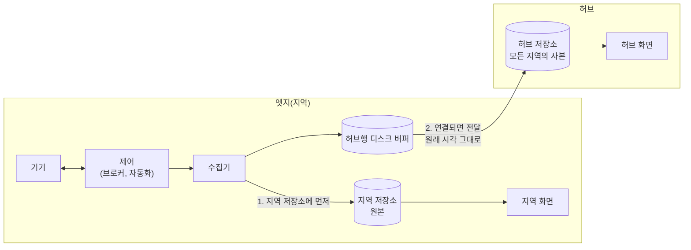
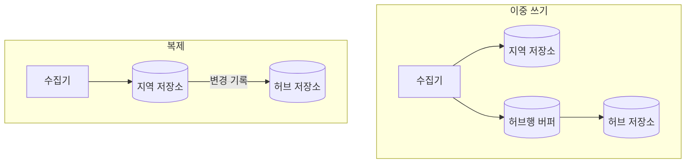

**허브-엣지 구조**는 여러 지역에 **엣지**를 두어 그 지역의 기기 데이터를 받고 기기를 제어하게 하고, 중앙의 **허브**가 모든 지역의 데이터를 모아 보게 하는 구조입니다. **지역 자립**(오프라인 우선) 설계는 여기에 한 가지 조건을 더합니다. 인터넷이나 허브와의 연결이 끊겨도 지역의 수집, 제어, 기록, 조회가 지역 안에서 그대로 이어지도록, 그 일에 필요한 것을 모두 지역에 둡니다. 허브는 지역이 가진 데이터를 모아 둔 사본이고, 지역이 허브에 기대지 않습니다.

- **기준:** Microsoft Learn "Operate Azure IoT Edge devices offline"(IoT Edge 1.6), AWS IoT Greengrass V2 개발자 안내서의 stream manager, Telegraf 에이전트 설정 문서(디스크 버퍼는 v1.32.0 이상), PostgreSQL 18 문서(논리 복제, 복제 슬롯), Kleppmann 외 "Local-first software"(Onward! 2019)

## 왜 필요한가

기기가 데이터를 곧바로 중앙(클라우드나 한곳의 서버)에 보내고, 제어와 화면도 중앙에서 하는 구조는 단순합니다. 대신 지역과 중앙 사이의 연결 하나에 모든 기능이 걸립니다.

- 연결이 끊긴 동안의 데이터는 보낼 곳이 없어 사라집니다.
- 자동화가 중앙에서 돌면, 같은 방에 있는 센서와 조명이라도 인터넷이 끊기면 서로 반응하지 못합니다.
- 지역 안에 있는 사람도 지역의 기록을 볼 수 없습니다.
- 중앙 서버를 옮기거나 다시 만들면 모든 지역이 함께 멈춥니다.

반대로 지역마다 따로 두기만 하면 여러 지역을 한 화면에서 비교하거나 한데 모아 분석하기 어렵습니다.

허브-엣지 구조는 두 가지를 나눠 맡깁니다. 지역에서 즉시 필요한 일(제어, 기록, 조회)은 엣지가 하고, 여러 지역을 모아 보는 일은 허브가 합니다. 연결은 "있으면 허브까지 데이터가 가는 통로" 로만 쓰이므로, 끊겨도 지역 기능은 멈추지 않고 허브에 도착하는 시점만 늦어집니다. Kleppmann 등이 제안한 local-first 소프트웨어의 이상 가운데 "네트워크는 선택 사항이다(The network is optional)" 와 같은 생각을 지역 단위 인프라에 적용한 것입니다.

Azure IoT Edge 와 AWS IoT Greengrass 같은 상용 엣지 플랫폼도 같은 원칙을 따릅니다. Azure IoT Edge 문서는 한 번 동기화한 엣지 장치가 연결 없이 무기한 동작하고, 그동안 올려 보낼 메시지를 저장했다가 다시 연결되면 저장한 순서대로 전달한다고 설명합니다.

## 핵심 용어

| 용어 | 뜻 |
| :--- | :--- |
| 엣지(지역) | 기기 가까이에서 수집, 제어, 기록, 조회를 스스로 하는 한 지역의 시스템입니다. 그 지역 데이터의 원본을 가집니다. |
| 허브 | 모든 지역의 데이터를 모아 두고 함께 보는 중앙 시스템입니다. 지역 데이터의 사본을 가집니다. |
| 지역 자립 | 인터넷과 허브 없이도 지역 기능이 지역 안에서 이어지는 성질입니다. |
| 저장 후 전달(store-and-forward) | 보낼 곳에 닿지 않는 동안 데이터를 지역에 쌓아 두었다가, 다시 닿으면 보내는 방식입니다. |
| 디스크 버퍼 | 저장 후 전달에서 쌓아 둔 데이터를 메모리가 아니라 디스크에 두는 버퍼입니다. 프로세스가 재시작해도 남습니다. |
| 이중 쓰기(dual write) | 수집기가 같은 데이터를 지역 저장소와 허브 저장소에 각각 쓰는 방식입니다. |
| 복제(replication) | 지역 저장소에만 쓰고, 허브 저장소가 그 변경을 받아 따라가는 방식입니다. |
| 지역 우선 읽기 | 지역의 화면과 자동화가 허브가 아니라 지역 저장소를 읽는 것입니다. |
| 백필(backfill) | 비어 있는 구간의 데이터를 나중에 채워 넣는 일입니다. |

## 동작 방식

평소와 연결이 끊겼을 때의 데이터 흐름입니다.

1. 기기와 제어(메시지 브로커, 자동화)는 지역 안에서 주고받습니다. 제어 명령이 지역 밖을 거치지 않으므로 연결이 끊겨도 자동화가 동작합니다.
2. 수집기는 받은 데이터를 지역 저장소에 먼저 씁니다. 지역 저장소가 그 지역 데이터의 원본입니다.
3. 같은 데이터를 허브로 보낼 때는 허브행 버퍼를 거칩니다. 허브에 닿으면 버퍼는 곧바로 비워집니다.
4. 허브나 인터넷이 끊기면 허브행 데이터는 버퍼에 쌓이고, 지역 저장소 쓰기와 지역 화면은 그대로 동작합니다.
5. 연결이 돌아오면 버퍼에 쌓인 데이터가 허브로 전달됩니다. 데이터마다 발생 시각이 들어 있으므로 늦게 도착해도 허브에는 원래 시각으로 기록됩니다.

## 저장 후 전달과 디스크 버퍼

저장 후 전달이 유실을 막는 범위는 버퍼의 성질이 정합니다.

| 항목 | 알아야 할 것 |
| :--- | :--- |
| 버퍼 위치 | 메모리 버퍼는 프로세스가 재시작하면 비워집니다. 끊긴 동안 재시작이 있어도 남기려면 디스크 버퍼가 필요합니다. Telegraf 는 `buffer_strategy = "disk"` 로 출력마다 디스크 버퍼를 둘 수 있고, 문서는 아직 실험적 기능이라고 표시합니다. |
| 용량과 넘칠 때 | 버퍼에는 한도가 있습니다. Telegraf 는 출력별 한도(`metric_buffer_limit`)가 차면 가장 오래된 데이터를 새 데이터로 덮어씁니다. AWS Greengrass stream manager 는 스트림마다 저장 크기와 보존 정책을 정하고, Azure IoT Edge 는 메시지 보존 시간(TTL, 기본 7,200초)과 디스크 여유 공간이 저장 기간을 정합니다. 견뎌야 하는 단절 시간 × 데이터 발생량으로 한도를 잡습니다. |
| 디스크 동기화 | 디스크 버퍼라도 쓰기를 디스크에 확정(sync)하지 않으면 정전 때 마지막 부분이 사라질 수 있습니다. Telegraf 문서는 `buffer_disk_sync` 를 끄면 쓰기가 빨라지는 대신 정전 때 마지막 `flush_interval` 동안 버퍼에 들어온 데이터를 잃을 수 있다고 설명합니다. |
| 시각 | 데이터에 발생 시각을 담아 보내고 받는 쪽이 그 시각으로 기록해야 합니다. 받은 시각으로 기록하면 끊긴 동안의 데이터가 모두 다시 연결된 순간에 몰립니다. |
| 중복 | 전달이 실패하면 다시 보내므로, 도구에 따라 같은 데이터가 두 번 도착할 수 있습니다. 받는 쪽이 중복을 견디게(고유 키, 중복 무시) 만들어 두면 안전합니다. |
| 출력별 분리 | 보낼 곳마다 버퍼를 따로 두어야 한쪽이 끊겼을 때 다른 쪽까지 막히지 않습니다. Telegraf 의 버퍼는 출력마다 따로 있습니다. |

## 이중 쓰기와 복제

허브에 데이터를 보내는 방법은 크게 두 가지입니다.

| 구분 | 이중 쓰기 | 복제 |
| :--- | :--- | :--- |
| 쓰는 곳 | 수집기가 지역과 허브에 각각 씀 | 지역 저장소에만 쓰고 허브가 따라감 |
| 끊긴 동안 쌓이는 곳 | 수집기의 허브행 버퍼 | 지역 저장소의 변경 기록(예: PostgreSQL 은 복제 슬롯이 WAL 을 지우지 않고 남김) |
| 두 사본의 일치 | 한쪽 쓰기만 실패하거나 버퍼가 넘치면 어긋날 수 있어, 백필이나 대조가 필요함 | 허브가 지역의 변경을 그대로 따라가므로 어긋나기 어려움 |
| 지역 저장소 장애 | 허브 쪽 쓰기는 영향을 받지 않음 | 허브로 가는 흐름도 함께 멈춤 |
| 스키마 변경 | 양쪽에 각각 적용 | 도구에 따라 따로 맞춰야 함(PostgreSQL 논리 복제는 스키마와 DDL 을 복제하지 않음) |
| 허브와 지역 사이 연결 | 수집기가 허브 저장소에 닿으면 됨 | 두 저장소가 서로 닿아야 함 |
| 오래 끊겼을 때의 위험 | 버퍼가 넘치면 오래된 데이터부터 유실 | 변경 기록이 지역 디스크를 채울 수 있음. PostgreSQL 은 `max_slot_wal_keep_size` 로 한도를 둠 |

PostgreSQL 문서는 여러 데이터베이스를 하나로 모으는 것을 논리 복제의 대표적인 쓰임으로 들고 있어, 여러 지역을 허브 하나로 모으는 구조에도 맞습니다. 이중 쓰기는 수집기만 고치면 되고 저장소끼리 연결할 필요가 없어 단순하지만, 두 사본이 어긋날 수 있다는 것을 전제로 빈 구간을 찾아 채우는 방법(백필)을 함께 마련해야 합니다.

## 지역 우선 읽기

지역의 화면과 자동화는 허브가 아니라 지역 저장소를 읽습니다. 그래야 연결이 끊겨도 지역 사람은 지역의 기록을 보고, 자동화는 최근 값을 기준으로 판단합니다. 허브 화면은 여러 지역을 비교하거나 모아 볼 때 씁니다.

지역 저장소와 허브 저장소의 테이블 정의를 같게 두면 같은 화면 정의(대시보드)를 양쪽에서 함께 쓸 수 있습니다. 어느 쪽에서 보든 같은 화면이 나오고, 화면을 한 곳만 고치면 됩니다. 허브에는 지역을 구분하는 값(지역 이름 컬럼 등)이 더 필요하고, 지역 저장소에서는 그 값이 늘 한 가지일 뿐입니다.

## 인터넷 없이 돌아가려면 지역에 있어야 하는 것

기기와 수집기를 지역에 두어도, 눈에 잘 띄지 않는 의존성이 인터넷 너머에 남아 있으면 끊겼을 때 멈춥니다. 지역 기능 하나하나에 대해 "이 일을 하려면 어디에 닿아야 하는가" 를 따라가 보면 지역에 있어야 할 것이 드러납니다.

| 영역 | 지역에 있어야 하는 것 | 없으면 끊겼을 때 |
| :--- | :--- | :--- |
| 제어 | 메시지 브로커, 자동화 엔진, 무선 게이트웨이(Zigbee, Thread 등) | 센서와 기기가 서로 반응하지 못함 |
| 저장 | 지역 저장소, 허브행 버퍼용 디스크 | 기록이 멈추거나 사라짐 |
| 조회 | 지역 화면(대시보드, 제어 UI) | 지역 기록을 볼 수 없음 |
| 이름 | 지역 서비스 이름을 푸는 내부 DNS | 이름을 공개 DNS 에서만 풀면 주소를 찾지 못함. 같은 이름을 안팎에서 다르게 푸는 방법은 (/posts/67/) |
| 입구 | 지역 안에서 요청을 받는 인그레스(리버스 프록시) | 허브나 클라우드를 거치는 입구만 있으면 지역 안에서도 접속하지 못함 |
| 인증서 | 지역 입구가 쓰는 인증서와 키를 지역에 보관 | 인증서를 허브에서 받아 오면 끊긴 동안 새로 받을 수 없음. 갱신은 인터넷이 필요하므로 만료 전 여유 기간만큼만 견딤(/posts/57/) |
| 로그인 | 지역에서 확인할 수 있는 계정이나 인증 수단 | 외부 로그인 서비스에만 기대면 화면에 들어가지 못함 |
| 시각 | 지역 시각 원천(내부 NTP 서버, RTC 가 있는 장비 등) | 시계가 어긋나면 기록 시각과 인증서 유효 기간 검사가 함께 틀어짐 |
| 실행 파일 | 컨테이너 이미지가 노드에 있거나 지역 레지스트리에 있음 | 재시작이나 재배치 때 이미지를 받지 못하면 시작하지 못함 |

마지막 항목은 쿠버네티스에서 특히 눈여겨볼 만합니다. 태그를 적지 않거나 `latest` 태그를 쓰면 기본 `imagePullPolicy` 가 `Always` 가 되어 컨테이너를 시작할 때마다 레지스트리에 확인합니다. 특정 태그를 쓰면 기본값이 `IfNotPresent` 라 노드에 이미 있는 이미지로 시작합니다.

배포 도구도 같은 기준으로 봅니다. 배포 도구(예: GitOps 컨트롤러, (/posts/58/))가 허브에 있으면 끊긴 동안 지역에 새 변경을 적용할 수 없지만, 지역 클러스터는 마지막으로 적용된 상태를 자기 API 서버에 가지고 있어 그 상태대로 계속 돕니다. 변경이 늦어질 뿐 동작이 멈추지는 않습니다. Azure IoT Edge 도 처음 한 번은 연결되어 설정을 받아야 하고, 그 뒤로는 연결 없이 무기한 동작한다고 설명합니다.

## 옮길 수 있는 허브

지역 자립을 지키면 허브를 다른 곳으로 옮기거나 새로 만드는 일도 쉬워집니다. 허브가 가진 데이터는 모두 어느 지역에서 온 사본이므로, 허브만 가진 데이터가 없습니다. 이 성질을 지키려면 다음 조건이 필요합니다.

- 지역이 동작하는 데 허브가 필요 없습니다. 지역은 허브에 쓰기만 하고, 허브에서 설정이나 데이터를 받아 와야 돌아가는 부분이 없습니다.
- 지역은 허브를 주소(IP)가 아니라 이름으로 찾습니다. 허브를 옮기면 이름이 가리키는 곳만 바꿉니다.
- 허브의 구성은 저장소의 코드와 스크립트로 다시 만들 수 있습니다.
- 허브 저장소의 데이터는 지역 저장소에서 다시 채울 수 있습니다. 새 허브를 만든 뒤 지역에서 백필하면 이전 기록이 돌아옵니다.
- 허브와 지역이 같은 물리 서버에 있더라도 소프트웨어는 따로 둡니다. 서버를 나눌 때 지역이 허브의 부품을 끌고 가지 않게 하기 위해서입니다.

## 흔한 오해

버퍼가 있으면 끊긴 동안의 데이터는 절대 잃지 않는다

- **실제:** 버퍼에는 한도가 있고, 차면 데이터를 잃습니다. Telegraf 는 가장 오래된 데이터를 덮어쓰고, Azure IoT Edge 는 TTL 이 지난 메시지를 버리는 등 무엇을 잃는지는 도구마다 다릅니다. 메모리 버퍼는 재시작하면 비워지고, 디스크 버퍼도 동기화 설정에 따라 정전 때 마지막 부분을 잃을 수 있습니다.
- **근거:** Telegraf 에이전트 설정 문서(`metric_buffer_limit`, `buffer_strategy`, `buffer_disk_sync`), Azure IoT Edge 오프라인 문서(TTL 과 디스크 공간)

허브가 원본이고 엣지는 캐시일 뿐이다

- **실제:** 지역 자립 설계에서는 지역 저장소가 그 지역 데이터의 원본이고 허브는 사본입니다. 허브를 잃어도 지역에서 다시 채울 수 있지만, 지역 저장소를 잃으면 허브에 도착하지 않은 데이터는 되살릴 곳이 없습니다.
- **근거:** local-first 소프트웨어의 "각 장치의 로컬 파일 시스템에 데이터의 기본 사본을 둔다" 는 원칙

기기와 서버가 지역에 있으면 인터넷이 끊겨도 당연히 동작한다

- **실제:** 이름 풀이(공개 DNS), 인증서 발급, 외부 로그인, 이미지 내려받기, 시각 동기화처럼 드러나지 않는 의존성이 인터넷 너머에 있으면 그 기능이 멈춥니다. 실제로 연결을 끊어 보고 확인해야 합니다.
- **근거:** 쿠버네티스 Images 문서(`imagePullPolicy` 기본값), Azure IoT Edge 오프라인 문서(DNS 서버 지정 권고)

## 정리

> - 엣지는 제어·기록·조회를 스스로 하는 지역 데이터의 원본이고, 허브는 모든 지역을 모아 보는 사본입니다.
> - 허브로 가는 데이터는 디스크 버퍼로 저장 후 전달하고, 발생 시각을 담아 늦게 도착해도 원래 시각으로 기록합니다.
> - 이중 쓰기는 단순하지만 백필이 필요하고, 복제는 사본이 어긋나기 어렵지만 저장소끼리 연결과 변경 기록 관리가 필요합니다.
> - 이름, 입구, 인증서, 로그인, 시각, 이미지까지 지역에 있어야 인터넷 없이 돌아가고, 그래야 허브도 옮길 수 있습니다.
{: .prompt-tip }

## 참고 자료

- [Microsoft Learn - Operate Azure IoT Edge devices offline](https://learn.microsoft.com/en-us/azure/iot-edge/offline-capabilities)
- [AWS IoT Greengrass V2 Developer Guide - Manage data streams on Greengrass core devices](https://docs.aws.amazon.com/greengrass/v2/developerguide/manage-data-streams.html)
- [Telegraf - Configuration (agent buffer settings)](https://github.com/influxdata/telegraf/blob/master/docs/CONFIGURATION.md)
- [PostgreSQL 18 - Logical Replication](https://www.postgresql.org/docs/18/logical-replication.html)
- [PostgreSQL 18 - Logical Replication Restrictions](https://www.postgresql.org/docs/18/logical-replication-restrictions.html)
- [PostgreSQL 18 - Log-Shipping Standby Servers (Replication Slots)](https://www.postgresql.org/docs/18/warm-standby.html)
- [Kubernetes - Images](https://kubernetes.io/docs/concepts/containers/images/)
- [Kleppmann et al. - Local-first software: You own your data, in spite of the cloud](https://www.inkandswitch.com/essay/local-first/)
