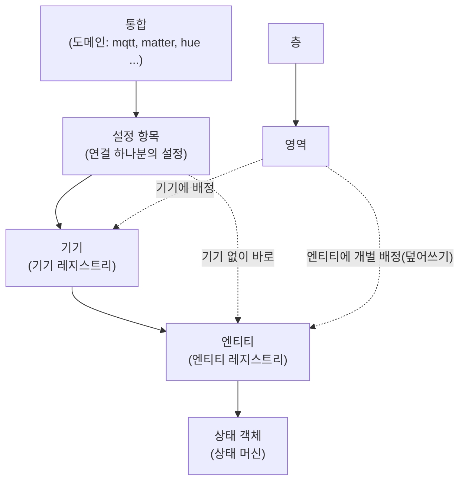
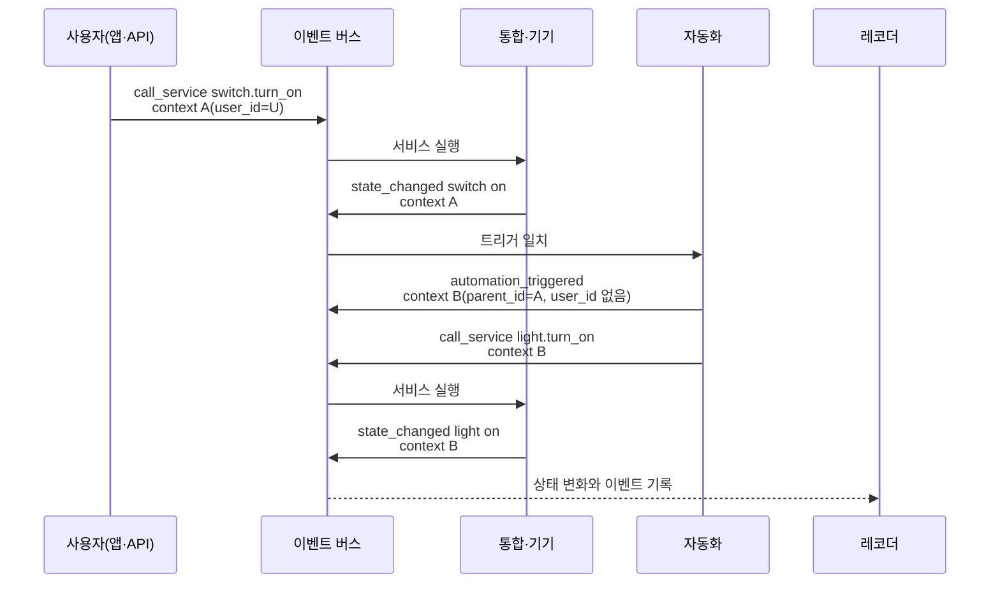
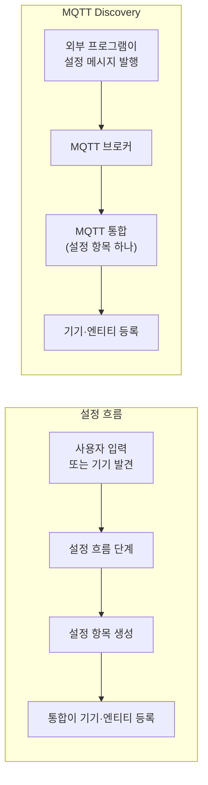

Home Assistant(HA)는 바깥의 기기와 서비스를 **통합**(integration)으로 연결하고, 연결 하나분의 설정을 **설정 항목**(config entry)으로 저장합니다. 설정 항목은 **기기**(device)를 등록하고, 기기는 온도, 스위치처럼 값 하나나 기능 하나를 맡는 **엔티티**(entity)를 가집니다. 엔티티의 현재 값은 **상태 객체**(state object)로 표현하고, 기기와 엔티티는 방에 해당하는 **영역**(area)에, 영역은 **층**(floor)에 묶습니다. 이 계층을 알아야 엔티티 ID 가 왜 그렇게 붙었는지, 이름을 바꾸면 무엇이 따라 바뀌는지, 기록이 어디에 얼마나 남는지를 예측할 수 있습니다.

- **기준:** Home Assistant 개발자 문서(Architecture, Entity, Entity registry, Device registry, Area registry, Config entries, Config flow, Sensor entity. 2026-09-29 `master`), 사용자 문서(State and state object, Events, Areas, Floors, MQTT, MQTT Sensor, Recorder. 2026-09-29 `current`), 데이터 문서(Context, States, Statistics), Home Assistant Core `2026.9.4` 소스(엔티티 ID 생성, 대상 확장)

## 왜 필요한가

기기 하나는 여러 값을 냅니다. 온습도 센서 하나에서 온도, 습도, 배터리, 신호 세기가 나오고, 스마트 플러그 하나에서 전원 스위치와 소비 전력이 나옵니다. 이 값을 모두 평평한 목록 하나로만 다루면 다음 문제가 생깁니다.

- 같은 기기에서 나온 값인지 알 수 없어, 기기를 바꾸거나 지울 때 관련 값을 하나하나 찾아야 합니다.
- 값의 이름을 바꾸면 그 이름을 쓰던 자동화와 기록이 끊깁니다.
- "거실 조명 모두 끄기" 처럼 위치로 묶어 명령하려면 대상을 일일이 나열해야 합니다.
- 누가(사람, 자동화, 기기 자체) 값을 바꿨는지 알 수 없습니다.

HA 는 이것을 역할이 다른 레지스트리 여러 개로 나눠 풉니다. 설정 항목, 기기, 엔티티, 영역, 층이 각자 레지스트리에 고유 ID 로 저장되고 서로 ID 로 가리킵니다. 사람이 읽는 이름과 시스템이 쓰는 ID 를 나눠 두었기 때문에 이름을 바꿔도 연결이 유지되고, 위치나 기기 단위로 묶어 명령할 수 있습니다. 레지스트리는 HA 설정 디렉터리의 `.storage/` 아래(`core.config_entries`, `core.device_registry`, `core.entity_registry`, `core.area_registry`, `core.floor_registry`)에 저장되므로 HA 인스턴스마다 따로 있습니다. 여러 지역에 HA 를 따로 두는 구조는 [허브-엣지 구조와 지역 자립(오프라인 우선) 설계란 무엇인가](/posts/62/)에서 다룹니다.

## 핵심 용어

| 용어 | 뜻 |
| :--- | :--- |
| 통합(integration) | HA 를 기기나 서비스와 연결하는 코드 묶음입니다. 고유 식별자인 도메인(`hue`, `mqtt` 등)을 가집니다. |
| 엔티티 통합 | `light`, `sensor`, `switch` 처럼 엔티티의 종류와 그 종류에 공통인 서비스 액션을 정의하는 통합입니다. 엔티티 ID 앞부분이 이 도메인입니다. |
| 플랫폼(platform) | 한 엔티티를 실제로 제공하는 통합입니다. `light.hue` 는 `hue` 통합이 제공하는 `light` 엔티티입니다. |
| 설정 항목(config entry) | 통합이 연결 하나를 맺는 데 필요한 설정을 HA 가 저장해 둔 것입니다. 같은 통합에 설정 항목이 여럿 있을 수 있습니다. |
| 설정 흐름(config flow) | 사용자 입력이나 기기 발견을 단계별로 받아 설정 항목을 만드는 절차입니다. |
| 기기(device) | 자체 제어 장치를 가진 물리 기기나 서비스 하나를 나타냅니다. 엔티티를 여럿 가집니다. |
| 기기 레지스트리 | 기기의 ID, 이름, 제조사, 모델, 영역, 소속 설정 항목을 저장하는 곳입니다. |
| 엔티티(entity) | 센서 값, 스위치, 기능 하나처럼 상태를 가지는 데이터 지점 하나입니다. |
| 엔티티 레지스트리 | `unique_id` 가 있는 엔티티의 엔티티 ID, 사용자가 정한 이름, 영역, 비활성 여부 등을 저장하는 곳입니다. |
| 엔티티 ID(`entity_id`) | `<도메인>.<object_id>` 형식의 사람이 읽을 수 있는 ID 입니다. 자동화와 템플릿이 엔티티를 가리킬 때 씁니다. |
| `unique_id` | 통합이 엔티티에 붙이는 바뀌지 않는 ID 입니다. 사용자가 바꿀 수 없고, 레지스트리가 엔티티를 알아보는 기준입니다. |
| 상태 머신(state machine) | 모든 엔티티의 현재 상태 객체를 들고 있고, 상태가 바뀌면 `state_changed` 이벤트를 내는 코어 부품입니다. |
| 상태 객체(state object) | 한 시점의 엔티티 스냅샷입니다. 상태 값, 속성, 시각 세 개, context 를 담습니다. |
| 속성(attributes) | 상태 값을 보충하는 정보(밝기, 단위, 표시 이름 등)입니다. 엔티티당 여러 개입니다. |
| 영역(area) | 방처럼 실제 공간에 대응하는 기기와 엔티티의 묶음입니다. |
| 층(floor) | 영역의 묶음입니다. 기기와 엔티티는 층에 직접 배정할 수 없습니다. |
| 이벤트 버스(event bus) | 이벤트를 내고 듣는 코어 부품입니다. HA 안의 모든 변화가 이벤트로 흐릅니다. |
| context | 한 원인에서 이어진 이벤트와 상태 변화를 묶는 값입니다. `id`, `parent_id`, `user_id` 를 가집니다. |
| 레코더(recorder) | 상태 변화와 이벤트를 데이터베이스에 기록하는 통합입니다. |
| 장기 통계(long-term statistics) | 센서 값을 1시간 단위로 요약해 지우지 않고 남기는 기록입니다. |
| MQTT Discovery | MQTT 로 설정 메시지를 발행해 HA 에 기기와 엔티티를 만드는 방식입니다. |

## 동작 방식

레지스트리 사이의 관계를 먼저 봅니다.



1. 사용자가 통합을 추가하면 설정 흐름을 거쳐 설정 항목이 저장됩니다. 설정 항목은 통합이 기기나 서비스에 연결하는 데 쓰는 값(주소, 인증 정보, 옵션)을 담습니다.
2. 통합은 설정 항목으로 기기에 연결하고, 기기에서 나오는 데이터 지점을 `sensor`, `light` 같은 엔티티 통합의 엔티티로 만듭니다. 엔티티를 추가할 때 엔티티 레지스트리와 기기 레지스트리에 함께 등록합니다.
3. 엔티티는 값을 읽거나 받으면 상태 머신에 상태 객체를 씁니다. 상태 머신은 상태나 속성이 바뀌면 이벤트 버스에 `state_changed` 이벤트를 냅니다.
4. 영역은 기기에 배정하고, 기기의 엔티티는 그 영역을 물려받습니다. 엔티티마다 따로 영역을 정해 덮어쓸 수 있습니다.
5. 개발자 문서는 이 계층에서 한 객체를 지우거나 비활성화하거나 다시 활성화하면 그 아래 객체가 모두 함께 맞춰진다고 설명합니다. 설정 항목을 지우면 그 설정 항목의 기기와 엔티티도 정리됩니다.

## 통합과 설정 항목

통합에는 두 종류의 역할이 있습니다. `light`, `sensor` 같은 **엔티티 통합**은 엔티티의 종류와 공통 서비스 액션(`light.turn_on` 등)을 정의합니다. `hue`, `mqtt`, `matter` 같은 기기 쪽 통합은 실제 기기와 통신하고, 엔티티 통합의 형식에 맞춘 엔티티를 제공합니다. 이때 엔티티를 제공한 통합을 그 엔티티의 **플랫폼**이라고 합니다. 표준화되지 않은 기능은 기기 쪽 통합이 자기 도메인으로 서비스 액션을 따로 등록합니다(예: `hue.activate_scene`). Zigbee, Thread, Matter 기기도 해당 통합을 거쳐 같은 기기·엔티티 구조로 들어옵니다. 세 기술의 차이는 [Zigbee, Thread, Matter의 차이](/posts/77/)에서 다룹니다.

설정 항목은 통합이 쓸 설정을 HA 가 저장한 것입니다. 개발자 문서는 설정 항목을 사용자가 화면에서 만들고, 그 화면의 흐름은 통합이 정의한 설정 흐름이 이끈다고 설명합니다. `configuration.yaml` 로 설정하는 방식은 특수하거나 예전 방식인 경우에만 남아 있습니다.

| 항목 | 설명 |
| :--- | :--- |
| 저장 내용 | 도메인, 제목, 연결 설정(`data`), 사용자가 나중에 바꾸는 옵션(`options`), 고유 ID(`unique_id`) 등 |
| 개수 | 같은 통합이라도 연결 대상마다 하나씩 만듭니다. 허브 두 대면 설정 항목도 둘입니다. |
| 하위 항목(subentry) | 설정 항목 하나 안에서 설정을 다시 나눌 수 있습니다. 예를 들어 인증 정보는 설정 항목에, 날씨를 받을 지역은 하위 항목에 둡니다. |
| 수명 주기 상태 | `not loaded`, `setup in progress`, `loaded`, `setup error`, `setup retry`, `migration error` 등. `setup retry` 는 의존하는 대상이 아직 준비되지 않은 상태로, HA 가 간격을 늘려 가며 다시 시도합니다. |
| 새 엔티티 비활성화 | 설정 항목 옵션 `disable_new_entities` 를 켜면 그 설정 항목에서 새로 생기는 엔티티가 꺼진 채로 등록됩니다. |

HA 에 기본으로 들어 있지 않은 통합은 **커스텀 통합**으로 설치합니다. HA 는 통합을 찾을 때 `<설정 디렉터리>/custom_components/<도메인>` 을 기본 통합(`homeassistant/components/<도메인>`)보다 먼저 봅니다. 그래서 기본 통합과 같은 도메인으로 두면 기본 통합을 덮어쓰고, 그 경우 기본 통합의 업데이트를 받지 못합니다. 커스텀 통합의 `manifest.json` 에는 `version` 이 반드시 있어야 하고, HA 는 커스텀 통합을 불러올 때 HA 가 시험하지 않은 통합이라는 경고를 로그에 남깁니다. **HACS**(Home Assistant Community Store)는 이런 커스텀 통합, 대시보드 카드, 테마를 찾고 내려받고 업데이트하는 화면을 제공하는 커스텀 통합입니다. HACS 로 설치하든 파일을 직접 두든, 결과는 `custom_components/` 아래의 같은 통합이고 설정 항목, 기기, 엔티티로 들어오는 구조도 같습니다.

## 기기와 기기 레지스트리

개발자 문서의 정의로 기기는 자체 제어 장치가 있는 물리 기기 하나이거나 서비스 하나입니다. 방마다 센서를 따로 둔 온도 조절기라면, 온도 조절기 본체 하나와 방 센서마다 하나씩 기기가 생깁니다. 멀티탭처럼 한 제품에 독립된 채널이 여럿이면 부모 기기와 채널별 **자식 기기**(child device)로 나눠, 채널마다 다른 영역에 배정할 수 있게 합니다.

| 필드 | 뜻 |
| :--- | :--- |
| `id` | HA 가 만든 기기 ID 입니다. 자동화와 템플릿의 `device_id` 가 이것입니다. |
| `identifiers` | 바깥에서 기기를 알아보는 `(도메인, 식별자)` 묶음입니다(시리얼 번호 등). 같은 설정 항목 안에서 같은 기기를 다시 등록하면 이 값으로 기존 기기를 찾습니다. |
| `connections` | MAC 주소 같은 연결 식별자입니다. `identifiers` 와 함께 기기를 찾는 데 씁니다. |
| `config_entry_id` | 기기를 가진 설정 항목입니다. 기기 하나는 설정 항목 하나에 속합니다. |
| `name` | 통합이 붙인 기기 이름입니다. |
| `name_by_user` | 사용자가 정한 기기 이름입니다. 값이 있으면 `name` 대신 쓰입니다. |
| `area_id` | 기기가 놓인 영역입니다. |
| `via_device_id` | 이 기기와 HA 사이에서 메시지를 전달하는 기기(허브, 브리지)입니다. 연결 경로를 나타냅니다. |
| `manufacturer`, `model`, `sw_version`, `serial_number` | 제조사, 모델, 펌웨어 버전, 시리얼 번호입니다. |
| `disabled_by` | 기기가 꺼져 있으면 누가 껐는지 담습니다. |

기기는 대개 따로 만들지 않습니다. 통합이 엔티티를 추가할 때 엔티티의 `device_info` 를 읽어 기기를 자동으로 등록하고, 이 자동 등록은 엔티티가 설정 항목으로 추가되고 `unique_id` 가 있을 때만 일어납니다. 개발자 문서 기준으로 같은 물리 기기를 통합 두 개가 등록하면 설정 항목마다 기기 항목이 하나씩, 모두 두 개 생깁니다.

## 엔티티와 엔티티 레지스트리

엔티티는 HA 안에서 값 하나나 기능 하나를 맡습니다. 엔티티마다 두 가지 ID 가 있습니다.

- **`unique_id`**: 통합이 정하고 사용자가 바꿀 수 없는 ID 입니다. 개발자 문서는 시리얼 번호, 문서에 정해진 형식의 MAC 주소, 기기에 새겨진 식별자를 알맞은 출처로 들고, IP 주소, 기기 이름, 호스트 이름, URL 은 바뀔 수 있어 쓰면 안 된다고 합니다. 기기 하나가 여러 엔티티를 내면 `[DEVICE_SERIAL]-[SENSOR_TYPE]` 처럼 기기 ID 에 값 종류를 붙입니다.
- **엔티티 ID**: `sensor.[ROOM]_[MEASUREMENT]` 처럼 사람이 읽는 ID 입니다. 처음 등록할 때 이름에서 만들어지고, 사용자가 바꿀 수 있습니다.

엔티티 레지스트리는 `unique_id` 가 있는 엔티티만 저장합니다. 레지스트리는 엔티티를 `(엔티티 통합 도메인, 플랫폼, unique_id)` 조합으로 찾습니다. 그래서 `unique_id` 가 같으면 HA 를 다시 시작하거나 통합을 다시 불러와도 같은 레지스트리 항목에 연결되고, 사용자가 바꾼 엔티티 ID, 이름, 영역, 비활성 설정이 그대로 이어집니다. `unique_id` 가 없는 엔티티는 레지스트리에 들어가지 않아 이런 설정을 저장할 곳이 없습니다.

| 레지스트리 필드 | 뜻 |
| :--- | :--- |
| `entity_id` | 현재 엔티티 ID 입니다. |
| `unique_id`, `platform` | 엔티티를 알아보는 기준입니다. |
| `device_id`, `config_entry_id` | 소속 기기와 설정 항목입니다. |
| `original_name` | 통합이 붙인 엔티티 이름입니다. |
| `name` | 사용자가 정한 엔티티 이름입니다. 값이 있으면 `original_name` 대신 쓰입니다. 기기의 `name_by_user` 에 해당합니다. |
| `area_id` | 엔티티에 따로 정한 영역입니다. 비어 있으면 기기의 영역을 따릅니다. |
| `disabled_by` | 꺼진 엔티티면 누가 껐는지(`user`, `integration`, `config_entry` 등) 담습니다. 꺼진 엔티티는 HA 에 추가되지 않아 상태도 기록도 생기지 않습니다. |
| `hidden_by` | 숨긴 엔티티면 누가 숨겼는지 담습니다. 숨긴 엔티티는 동작하지만 영역이나 기기 단위 명령에서 빠집니다. |
| `entity_category` | 주 기능이 아닌 엔티티의 분류입니다. `config` 는 기기 설정을 바꾸는 엔티티(스위치 뒷불 켜기 등), `diagnostic` 은 바꿀 수 없는 진단 값(신호 세기, MAC 주소 등)입니다. |

통합은 엔티티를 처음 등록할 때 켜 둘지 정할 수 있습니다. 개발자 문서는 신호 세기나 배터리 전압처럼 자주 바뀌지만 잘 보지 않는 진단 엔티티를 꺼 둔 채 등록하라고 권합니다. 불필요한 상태 변화가 기록되고 화면이 복잡해지는 것을 막기 위해서입니다. 이렇게 꺼진 엔티티는 `disabled_by` 가 `integration` 이고, 사용자가 켜야 값이 들어옵니다.

엔티티 ID 는 처음 등록할 때 다음 순서로 만들어집니다(Core `2026.9.4` 소스 기준).

1. 이름 부분을 모읍니다. 기본 조합은 영역 이름, 기기 이름(`name_by_user` 가 있으면 그것), 엔티티 이름 순서이고, 없는 부분은 건너뜁니다. 엔티티를 등록하는 시점에 기기에 영역이 없으면 기기 이름과 엔티티 이름만 남습니다. 조합은 엔티티 레지스트리 전역 설정(`entity_id_parts`)으로 바꿀 수 있고, 층을 넣을 수도 있습니다.
2. 엔티티 이름이 없으면(기기의 주 기능인 엔티티) 기기 이름만 씁니다. 이름이 하나도 없으면 `<플랫폼>_<unique_id>` 를 씁니다.
3. 이어 붙인 이름을 `slugify` 로 바꿉니다. 소문자로 바꾸고 공백과 기호를 밑줄 하나로 바꾸며, 로마자가 아닌 글자는 로마자로 옮깁니다. 결과가 비면 `unknown` 이 됩니다.
4. 앞에 엔티티 통합 도메인과 점을 붙입니다. 같은 엔티티 ID 가 이미 있으면 뒤에 `_2`, `_3` 을 붙입니다. 길이는 255자로 자릅니다.

| 영역 | 기기 이름 | 엔티티 이름 | 엔티티 ID |
| :--- | :--- | :--- | :--- |
| 없음 | `Multisensor` | `Temperature` | `sensor.multisensor_temperature` |
| `Living Room` | `Multisensor` | `Temperature` | `sensor.living_room_multisensor_temperature` |
| 없음 | `Nightlight` | 없음(주 기능) | `light.nightlight` |
| 없음 | `거실 센서`(사용자가 지은 이름) | 통합의 번역 이름(화면에는 `온도`) | `sensor.geosil_senseo_temperature` |

엔티티 이름은 통합이 번역 키나 `device_class` 로 정하는 경우가 많습니다. 표시 이름은 엔티티를 만들 때의 서버 언어 번역을 따르지만, 엔티티 ID 를 만들 때 쓰는 번역은 독일어, 프랑스어처럼 로마자를 쓰는 일부 언어만 그 언어를 쓰고 한국어를 포함한 나머지 언어는 영어를 씁니다(Core `2026.9.4` `generated/languages.py` 의 `NATIVE_ENTITY_IDS`). 그래서 서버 언어가 한국어여도 통합이 붙인 엔티티 이름 부분은 영어로 들어갑니다. 반면 사용자가 한글로 지은 기기 이름이나 영역 이름, MQTT 발견 메시지에 한글로 적은 이름은 마지막 행처럼 로마자로 옮겨집니다(HA `2026.9.4` 가 고정한 `python-slugify 8.0.4` 로 확인한 결과).

표시 이름(`friendly_name` 속성)은 엔티티 ID 와 따로 계산됩니다. 기기에 속한 엔티티면 "기기 이름 + 엔티티 이름" 이고, 엔티티 이름이 없으면 기기 이름만 씁니다. 그래서 기기 이름을 바꾸면 표시 이름은 곧바로 따라 바뀌지만 **엔티티 ID 는 바뀌지 않습니다.** 엔티티 ID 는 사용자가 새 ID 를 직접 줄 때만 바뀌고, HA 는 현재 이름으로 다시 계산한 ID 를 알려 주는 WebSocket 명령(`config/entity_registry/get_automatic_entity_ids`)만 제공합니다. 엔티티 ID 가 바뀌면 레코더는 기존 이력과 통계를 새 ID 로 옮깁니다. 반면 엔티티 ID 를 문자열로 받아 간 바깥 시스템(외부 DB, MQTT 토픽 등)은 따라 바뀌지 않습니다.

`unique_id` 는 엔티티가 사라졌다가 돌아올 때도 연결을 이어 줍니다. 레지스트리는 지운 엔티티의 엔티티 ID 와 사용자 설정(이름, 영역, 비활성 여부 등)을 따로 보관해 두었다가, 같은 `unique_id` 로 엔티티가 다시 등록되면 되살립니다. 엔티티 ID 는 그사이 다른 엔티티가 가져가지 않았을 때만 되살아납니다.

## 상태 객체

상태 객체는 한 시점의 엔티티 스냅샷입니다. 자동화, 템플릿, 화면이 모두 이 객체를 읽습니다. 기기나 영역 같은 레지스트리 정보는 상태 객체에 들어 있지 않습니다.

| 필드 | 뜻 |
| :--- | :--- |
| `state` | 현재 값입니다. 늘 문자열이고 최대 255자입니다(예: `on`, `21.5`). |
| `attributes` | 보충 정보 사전입니다. `friendly_name`, `unit_of_measurement`, `device_class`, 밝기 등 |
| `entity_id` | `<도메인>.<object_id>` 형식의 엔티티 ID 입니다. |
| `last_changed` | 상태 값이 마지막으로 바뀐 시각(UTC)입니다. 속성만 바뀌면 그대로입니다. |
| `last_updated` | 상태 값이나 속성이 마지막으로 바뀐 시각(UTC)입니다. |
| `last_reported` | 통합이 마지막으로 상태를 보고한 시각(UTC)입니다. 값이 같아도 갱신됩니다. |
| `context` | 이 상태를 만든 원인의 context 입니다. |

두 상태 값은 특별한 뜻이 있습니다.

- **`unavailable`**: 엔티티가 지금 상태를 줄 수 없습니다. 기기나 서비스에 닿지 않거나 통합이 설정되지 않은 경우입니다. 통합이 아직 불러오지 못한 등록 엔티티도 레지스트리가 `unavailable` 로 채워 두고, 이때 속성에 `restored: true` 가 붙습니다.
- **`unknown`**: 엔티티는 사용할 수 있지만 상태 값이 없습니다. 통합이 엔티티를 사용 가능으로 두고 값을 `None` 으로 쓰면 이 값이 됩니다.

같은 값이 다시 보고되면 `last_reported` 만 갱신되고 `state_changed` 대신 `state_reported` 이벤트가 납니다. 값이 같아도 매번 바뀐 것으로 치는 `force_update` 를 켠 엔티티는 예외입니다. MQTT 처럼 값이 바뀔 때만 상태를 쓰는 통합은 같은 값이 다시 와도 `last_reported` 가 바뀌지 않습니다. 그래서 "센서가 살아 있는지" 는 `last_changed` 가 아니라 가용성(`unavailable`)이나 통합이 제공하는 연결 상태로 판단합니다.

## 영역과 층

영역은 기기와 엔티티를 실제 방에 맞춰 묶는 논리 단위이고, 층은 영역을 묶습니다.

| 구분 | 영역 | 층 |
| :--- | :--- | :--- |
| 묶는 대상 | 기기, 엔티티 | 영역 |
| ID | 만들 때 이름을 `slugify` 한 `area_id`. 이름을 바꿔도 ID 는 그대로 | `floor_id` |
| 주요 필드 | 이름, 별칭, 아이콘, 소속 `floor_id`, 대표 온도·습도 엔티티 | 이름, 별칭, 아이콘, 층 번호(`level`, 음수 가능) |
| 배정 규칙 | 기기에 배정하면 그 엔티티가 모두 물려받고, 엔티티마다 덮어쓸 수 있음. 자식 기기는 영역이 없으면 부모 기기의 영역을 따름 | 기기와 엔티티는 층에 직접 배정할 수 없음 |

영역과 층은 서비스 액션의 대상이 됩니다. `area_id` 나 `floor_id` 로 명령하면 HA 가 그 안의 엔티티로 대상을 넓힙니다. 이때 숨긴 엔티티와 `entity_category` 가 있는 엔티티(설정, 진단)는 기본으로 빠집니다(Core `2026.9.4` 소스 기준). 영역을 지우면 그 영역에 있던 기기는 영역 없음이 되고, 그 영역을 대상으로 적은 자동화와 스크립트는 더 이상 동작하지 않습니다. 영역 하나에 넣기 어려운 묶음(예: "야간 조명")은 영역이 아니라 라벨로 만듭니다. 라벨은 영역, 기기, 엔티티, 자동화에 여러 개 붙일 수 있습니다.

## 이벤트 버스와 context

HA 코어는 이벤트 버스, 상태 머신, 서비스 레지스트리, 타이머 네 부분으로 이뤄집니다. 상태가 바뀌면 상태 머신이 `state_changed` 를, 서비스 액션을 실행하면 `call_service` 를 이벤트 버스에 냅니다. 자동화의 트리거 대부분과 레코더가 이 이벤트를 듣고 움직입니다.

모든 이벤트는 `event_type`, `time_fired`, `origin`, `context` 를 가지고, 이벤트마다 `data` 가 다릅니다.

| 이벤트 | 언제 | `data` 주요 필드 |
| :--- | :--- | :--- |
| `state_changed` | 상태 값이나 속성이 바뀔 때 | `entity_id`, `old_state`(처음이면 `null`), `new_state`(지워지면 `null`) |
| `call_service` | 서비스 액션을 실행할 때 | `domain`, `service`, `service_data` |
| `automation_triggered` | 자동화가 트리거될 때 | `name`, `entity_id`, `source` |
| `script_started` | 스크립트가 시작될 때 | `name`, `entity_id` |
| `entity_registry_updated` | 엔티티 레지스트리가 바뀔 때 | `action`, `entity_id`, `changes`, `old_entity_id`(ID 가 바뀐 경우) |

**context** 는 한 원인에서 이어진 이벤트와 상태 변화를 하나로 묶습니다. 무언가가 새 변화를 일으킬 때마다 새 context 가 만들어지고, 그 결과로 생긴 이벤트와 상태 변화가 같은 context 를 가집니다.

| 필드 | 뜻 |
| :--- | :--- |
| `id` | context 의 고유 ID 입니다(ULID). |
| `user_id` | 변화를 시작한 HA 사용자 ID 입니다. 사용자가 시작하지 않았으면 `None` 입니다. |
| `parent_id` | 이 context 를 일으킨 부모 context 의 `id` 입니다. 자동화가 트리거되면 트리거의 context 가 부모가 됩니다. |

사용자가 앱에서 스위치를 켜고, 그 상태 변화가 자동화를 트리거해 조명을 켜는 흐름입니다.



1. 사용자의 명령은 `user_id` 가 들어간 context A 로 시작하고, 서비스 호출과 스위치의 상태 변화가 모두 context A 를 가집니다.
2. 자동화는 트리거에 이미 context 가 있어도 새 context B 를 만들고 `parent_id` 에 A 를 넣습니다. 데이터 문서는 트리거에 딸린 사용자 권한과 자동화의 동작을 떼어 놓기 위해서라고 설명합니다. 그래서 context B 에는 `user_id` 가 없습니다.
3. 자동화가 일으킨 서비스 호출과 조명의 상태 변화는 context B 를 가집니다. 조명을 켠 원인을 거슬러 올라가려면 B 의 `parent_id` 를 따라 A 로 갑니다. `script_started` 이벤트도 문서상 스크립트가 일으킨 이벤트와 같은 context 를 가집니다.

누가 바꿨는지는 상태 객체나 이벤트의 context 로 다음처럼 가릅니다.

- `user_id` 가 있으면 사람이 HA(화면, 앱, API)를 통해 바꾼 것입니다. `person` 엔티티의 `user_id` 속성과 맞춰 보면 사람 이름을 얻습니다.
- `user_id` 가 없고 `parent_id` 가 있으면 다른 변화에 이어 자동화나 스크립트가 바꾼 것입니다.
- 둘 다 없으면 사용자 명령도 자동화도 아닌 새 원인입니다. 기기 버튼을 눌러 기기에서 바로 바뀐 값을 통합이 받아 쓴 경우가 여기에 속합니다.

엔티티는 서비스 호출을 받으면 그 호출의 context 를 기억하고, 그 뒤 5초 안에 쓰는 상태에 그 context 를 붙입니다(Core `2026.9.4` `helpers/entity.py`). 그래서 명령에 대한 기기의 응답이 조금 늦게 와도 명령과 같은 context 로 묶이고, 반대로 명령 직후 5초 안에 기기 버튼으로 바꾼 값도 그 명령의 context 로 기록될 수 있습니다.


```yaml
# 조명 상태가 바뀔 때 원인을 user / automation / other 로 나누는 예시
triggers:
  - trigger: state
    entity_id: light.[ROOM]_[NAME]
actions:
  - variables:
      cause: >-
        
        {{ 'user' if c.user_id else ('automation' if c.parent_id else 'other') }}
```


## 레코더와 장기 통계

**레코더**는 상태 변화와 이벤트를 데이터베이스에 기록합니다. 기록 화면, 활동(로그북) 화면, 대시보드 그래프, 장기 통계가 모두 이 데이터베이스를 읽습니다. 활동 화면이 "누가 켰는지" 를 보여 줄 수 있는 것도 기록된 context 덕분입니다.

| 항목 | 기본 동작 |
| :--- | :--- |
| 저장소 | SQLite, 설정 디렉터리의 `home-assistant_v2.db`. `db_url` 로 MariaDB, PostgreSQL 로 바꿀 수 있음 |
| 보관 기간 | `purge_keep_days` 기본 10일. `auto_purge` 가 매일 밤 04:12(지역 시각)에 오래된 기록을 지움 |
| 쓰기 주기 | `commit_interval` 기본 5초마다 모아서 씀 |
| 대상 | 기본으로 모든 엔티티. `include`, `exclude` 로 도메인, 엔티티, 이벤트 종류를 거름 |
| 저장 방식 | 상태는 `states` 테이블에, 자주 반복되는 속성과 엔티티 ID 는 `state_attributes`, `states_meta` 테이블에 한 번만 두고 가리킴 |

10일이 지나면 상태 기록은 지워지지만, 센서 값의 요약은 **통계**로 따로 남습니다.

| 구분 | 단기 통계 | 장기 통계 |
| :--- | :--- | :--- |
| 주기 | 5분마다 | 1시간 단위 요약 |
| 테이블 | `statistics_short_term` | `statistics` |
| 보관 | 레코더가 지움(기본 10일) | 지우지 않음 |
| 값 | `measurement`: 평균, 최솟값, 최댓값. `total`, `total_increasing`: 구간 끝 상태, 누적 합계(`sum`), 마지막 초기화 시각 |

통계는 `sensor` 엔티티에 **`state_class`** 가 있을 때만 만들어집니다. 현재 측정값(온도, 습도, 전력)은 `measurement`, 누적량(에너지 사용량)은 `total` 이나 `total_increasing` 입니다. `state_class` 가 없는 센서는 10일이 지나면 기록이 모두 사라집니다. 통계를 모으는 도중 단위가 바뀌면 HA 는 변환 관계를 모르는 한 그 센서의 통계 수집을 멈추고 경고를 남깁니다.

## 엔티티가 생기는 두 경로

엔티티가 생기는 흔한 경로는 두 가지입니다. 통합을 설정 흐름으로 추가하는 경로와, MQTT 로 설정 메시지를 발행하는 경로입니다.



**설정 흐름**은 단계별 입력 양식으로 설정 항목을 만듭니다. 사용자가 직접 시작할 수도 있고, 통합이 mDNS(Zeroconf), SSDP, DHCP, USB, Bluetooth 등으로 기기를 발견해 시작할 수도 있습니다. 흐름에 고유 ID 를 정하면 같은 대상에 이미 설정 항목이 있을 때 흐름을 중단해 중복을 막습니다. 웹 화면이 쓰는 것과 같은 흐름이 HTTP 엔드포인트(`/api/config/config_entries/flow`)로도 열려 있어, 화면 대신 스크립트로 같은 단계를 밟을 수 있습니다. 흐름이 끝나 설정 항목이 생기면 통합이 기기와 엔티티를 등록합니다.

**MQTT Discovery** 는 기기나 수집 프로그램이 MQTT 로 설정 메시지를 발행해 HA 에 엔티티를 만드는 방식입니다. 이렇게 생긴 기기와 엔티티는 모두 MQTT 통합의 설정 항목에 속합니다. 설정 메시지는 다음 형식의 토픽에 JSON 으로 발행합니다.

```text
<discovery_prefix>/<component>/[<node_id>/]<object_id>/config
```

- `<discovery_prefix>` 는 기본 `homeassistant` 이고 MQTT 통합 옵션에서 바꿀 수 있습니다.
- `<component>` 는 `sensor`, `binary_sensor`, `switch` 같은 엔티티 종류이고, 기기 하나의 여러 엔티티를 한 메시지로 보내는 기기 단위 발견에서는 `device` 입니다.
- `<node_id>` 는 HA 가 쓰지 않는 선택 부분입니다. `<object_id>` 와 함께 영문자, 숫자, 밑줄, 하이픈만 쓸 수 있습니다.
- 토픽의 `<object_id>` 는 엔티티 ID 에 영향을 주지 않습니다. 엔티티 ID 를 정하려면 메시지에 `default_entity_id` 를 넣습니다. 문서는 `<object_id>` 를 `unique_id` 와 같게 두고 `<node_id>` 를 생략하기를 권합니다.

온도 센서 하나를 만드는 메시지 예시입니다. 토픽은 `homeassistant/sensor/[DEVICE_ID]_temperature/config` 입니다.


```json
{
  "name": "Temperature",
  "unique_id": "[DEVICE_ID]_temperature",
  "state_topic": "[BASE_TOPIC]/[DEVICE_ID]/state",
  "value_template": "{{ value_json.temperature }}",
  "device_class": "temperature",
  "state_class": "measurement",
  "unit_of_measurement": "°C",
  "availability": [
    { "topic": "[BASE_TOPIC]/[DEVICE_ID]/availability" }
  ],
  "expire_after": 300,
  "device": {
    "identifiers": ["[DEVICE_ID]"],
    "name": "[DEVICE_NAME]"
  },
  "origin": { "name": "[PUBLISHER_NAME]" }
}
```


| 키 | 없으면 생기는 일 |
| :--- | :--- |
| `unique_id` | 엔티티 레지스트리에 들어가지 않아 엔티티 ID, 이름, 영역을 바꿀 수 없고, `device` 를 적어도 기기에 묶이지 않습니다. 기기 단위 발견에서는 필수입니다. |
| `device` | 엔티티가 기기 없이 따로 생겨 기기 단위로 영역을 배정하거나 묶어 볼 수 없습니다. `identifiers` 나 `connections` 중 하나가 있어야 하고, 문서는 `name` 도 필수 항목으로 듭니다. |
| `device_class` | 값의 종류(온도, 습도 등)를 알 수 없어 화면이 종류에 맞는 아이콘을 고르지 못합니다. `name` 을 빼고 `device_class` 만 두면 엔티티 이름이 `device_class` 에서 정해집니다. |
| `state_class` | 장기 통계가 만들어지지 않아 기본 10일이 지나면 기록이 모두 사라집니다. |
| `unit_of_measurement` | 값이 무엇의 몇인지 알 수 없고, 문서가 설명하는 단위별 그래프 묶기에도 쓰이지 않습니다. |
| `availability` | 값을 보내는 쪽이 끊겨도 엔티티가 마지막 값을 계속 보여 줍니다. 지정한 토픽에 `online`, `offline`(기본값)이 오면 엔티티가 사용 가능, `unavailable` 로 바뀝니다. 끊김을 알리는 메시지는 보통 발행 측의 Last Will 로 만듭니다. |
| `expire_after` | 연결은 살아 있는데 값만 멈춘 경우를 잡지 못합니다. 지정한 초 동안 새 값이 없으면 `unavailable` 이 됩니다. |
| `origin` | 기기 단위 발견에서는 필수이고, 한 엔티티 발견에서도 어디서 온 설정인지 로그에 남기려면 넣습니다. |

발견 메시지는 다음 규칙으로 다룹니다. 유지 메시지(retain)와 Last Will 자체는 [MQTT의 동작 원리](/posts/80/)에서 다룹니다.

1. HA 의 MQTT 통합이 시작되면 발견된 기기와 엔티티는 발견 메시지를 다시 받을 때까지 사용할 수 없는 상태입니다. 그래서 설정 메시지를 유지 메시지로 발행해 브로커가 HA 에 바로 다시 주게 하거나, HA 가 `homeassistant/status` 에 내는 시작 메시지(`online`)를 듣고 다시 발행합니다. 문서는 시작 메시지를 듣고 다시 보내는 쪽을 더 낫다고 봅니다.
2. 같은 토픽에 새 설정을 보내면 설정 갱신으로 처리됩니다.
3. 같은 토픽에 빈 메시지를 보내면 그 엔티티가 지워지고, 그 기기를 가리키는 다른 엔티티가 없으면 기기도 지워집니다. 설정을 유지 메시지로 보냈다면 빈 메시지도 유지 메시지로 보내야 브로커에 남은 설정까지 지워집니다.
4. `expire_after` 를 쓰는 센서의 값(상태 메시지)은 유지 메시지로 보내지 않습니다. HA 가 다시 시작할 때 브로커가 오래된 값을 되돌려 주면 만료된 값이 다시 살아나기 때문입니다. HA 는 만료까지 남은 시간을 스스로 저장했다가 되살립니다.

Telegraf 처럼 이미 MQTT 로 값을 발행하는 수집기의 값을 HA 엔티티로 받을 때도, 같은 상태 토픽을 가리키는 발견 메시지를 따로 발행하면 됩니다. Telegraf 의 동작은 [Telegraf 플러그인 파이프라인과 출력 버퍼의 동작 원리](/posts/82/)에서 다룹니다.

## 흔한 오해

<details markdown="1">
<summary>엔티티나 기기 이름을 바꾸면 엔티티 ID 도 바뀐다</summary>

- **실제:** 엔티티 ID 는 처음 등록할 때 이름에서 한 번 만들어지고, 그 뒤로는 사용자가 새 ID 를 직접 줄 때만 바뀝니다. 이름을 바꾸면 표시 이름(`friendly_name`)만 바뀝니다. 엔티티 ID 가 바뀌면 레코더는 이력과 통계를 새 ID 로 옮기지만, ID 를 문자열로 받아 간 바깥 시스템은 따라 바뀌지 않습니다.
- **근거:** Core `2026.9.4` `helpers/entity_registry.py`(`new_entity_id` 로만 바뀜), `components/recorder/entity_registry.py`(`old_entity_id` 가 있는 갱신 이벤트에서 메타데이터 이전)

</details>

<details markdown="1">
<summary>MQTT 발견 토픽의 object_id 가 엔티티 ID 가 된다</summary>

- **실제:** 토픽의 `<object_id>` 는 엔티티 ID 에 영향을 주지 않습니다. 엔티티 ID 는 기기 이름과 엔티티 이름에서 만들어지고, 원하는 ID 를 쓰려면 메시지에 `default_entity_id` 를 넣습니다. 그 ID 가 이미 있으면 `_2` 가 붙습니다.
- **근거:** 사용자 문서 MQTT 의 Discovery topic, Naming of MQTT Entities

</details>

<details markdown="1">
<summary>unique_id 가 없어도 엔티티 이름을 바꾸거나 영역에 넣을 수 있다</summary>

- **실제:** 엔티티 레지스트리는 `unique_id` 가 있는 엔티티만 저장합니다. `unique_id` 가 없으면 엔티티 ID, 이름, 영역 같은 사용자 설정을 저장할 곳이 없고, 기기 정보(`device_info`, MQTT 의 `device`)도 읽히지 않아 기기에 묶이지 않습니다.
- **근거:** 개발자 문서 Entity registry, Device registry(자동 등록 조건), 사용자 문서 MQTT Sensor 의 `device` 설명

</details>

<details markdown="1">
<summary>레코더가 모든 이력을 계속 보관한다</summary>

- **실제:** 상태 기록과 이벤트는 기본 10일이 지나면 매일 밤 자동으로 지워집니다. 오래 남는 것은 `state_class` 가 있는 센서의 1시간 단위 장기 통계뿐이고, 원래 값 하나하나가 아니라 평균, 최솟값, 최댓값이나 누적 합계입니다.
- **근거:** 사용자 문서 Recorder(`purge_keep_days`, `auto_purge`), 데이터 문서 Statistics, 개발자 문서 Sensor entity 의 Long-term Statistics

</details>

<details markdown="1">
<summary>영역을 대상으로 명령하면 그 영역의 엔티티가 모두 움직인다</summary>

- **실제:** 영역, 층, 기기를 대상으로 하면 숨긴 엔티티와 `entity_category` 가 있는 설정·진단 엔티티는 기본으로 빠집니다. 이런 엔티티를 움직이려면 엔티티 ID 로 직접 가리킵니다.
- **근거:** Core `2026.9.4` `helpers/target.py`(`primary_entities_only` 기본값에서 `entity_category` 와 `hidden_by` 제외)

</details>

<details markdown="1">
<summary>같은 물리 기기는 통합이 여러 개여도 HA 에서 기기 하나로 보인다</summary>

- **실제:** 기기 항목은 설정 항목 하나에 속하므로, 같은 기기를 통합 두 개가 등록하면 기기 항목도 두 개 생깁니다. 영역 배정도 각각 따로 해야 합니다.
- **근거:** 개발자 문서 Device registry 의 What is a device?, `config_entry_id` 설명

</details>

## 정리

> - 통합이 설정 항목으로 연결을 맺고, 설정 항목이 기기를, 기기가 엔티티를 가지며, 엔티티의 현재 값은 상태 객체입니다. 영역은 기기와 엔티티를, 층은 영역을 묶습니다.
> - 엔티티는 바뀌지 않는 `unique_id` 로 레지스트리에 연결되고, 엔티티 ID 는 처음 등록할 때 영역·기기·엔티티 이름을 `slugify` 해 한 번 만들어집니다. 이름을 바꿔도 엔티티 ID 는 그대로입니다.
> - 모든 변화는 이벤트 버스에 흐르고, context 의 `user_id` 와 `parent_id` 로 사람, 자동화, 기기 중 누가 바꿨는지 가립니다.
> - 레코더는 기본 10일만 보관하고, 오래 남기려면 센서에 `state_class` 를 주어 장기 통계를 만듭니다.
> - MQTT Discovery 로 만드는 엔티티에는 `unique_id`, `device`, `device_class`, `state_class`, `unit_of_measurement`, `availability` 를 함께 넣어야 레지스트리, 통계, 가용성이 모두 제대로 동작합니다.
{: .prompt-tip }

## 참고 자료

- [Home Assistant Developer Docs - Core architecture](https://developers.home-assistant.io/docs/architecture/core/)
- [Home Assistant Developer Docs - Entities: integrating devices & services](https://developers.home-assistant.io/docs/architecture/devices-and-services/)
- [Home Assistant Developer Docs - Entity](https://developers.home-assistant.io/docs/core/entity/)
- [Home Assistant Developer Docs - Entity registry](https://developers.home-assistant.io/docs/entity_registry_index/)
- [Home Assistant Developer Docs - Entity registry and disabling entities](https://developers.home-assistant.io/docs/entity_registry_disabled_by/)
- [Home Assistant Developer Docs - Device registry](https://developers.home-assistant.io/docs/device_registry_index/)
- [Home Assistant Developer Docs - Area registry](https://developers.home-assistant.io/docs/area_registry_index/)
- [Home Assistant Developer Docs - Config entries](https://developers.home-assistant.io/docs/config_entries_index/)
- [Home Assistant Developer Docs - Config flow](https://developers.home-assistant.io/docs/core/integration/config_flow/)
- [Home Assistant Developer Docs - Sensor entity (Long-term Statistics)](https://developers.home-assistant.io/docs/core/entity/sensor/)
- [Home Assistant Developer Docs - Integration file structure](https://developers.home-assistant.io/docs/creating_integration_file_structure/)
- [Home Assistant Developer Docs - Integration manifest](https://developers.home-assistant.io/docs/creating_integration_manifest/)
- [Home Assistant - State and state object](https://www.home-assistant.io/docs/configuration/state_object/)
- [Home Assistant - Events](https://www.home-assistant.io/docs/configuration/events/)
- [Home Assistant - Areas](https://www.home-assistant.io/docs/organizing/areas/)
- [Home Assistant - Floors](https://www.home-assistant.io/docs/organizing/floors/)
- [Home Assistant - Organizing](https://www.home-assistant.io/docs/organizing/)
- [Home Assistant - MQTT (MQTT Discovery)](https://www.home-assistant.io/integrations/mqtt/)
- [Home Assistant - MQTT Sensor](https://www.home-assistant.io/integrations/sensor.mqtt/)
- [Home Assistant - Recorder](https://www.home-assistant.io/integrations/recorder/)
- [Home Assistant Data Science Portal - Context](https://data.home-assistant.io/docs/context/)
- [Home Assistant Data Science Portal - States](https://data.home-assistant.io/docs/states/)
- [Home Assistant Data Science Portal - Statistics](https://data.home-assistant.io/docs/statistics/)
- [Home Assistant Core 2026.9.4 - helpers/entity_registry.py](https://github.com/home-assistant/core/blob/2026.9.4/homeassistant/helpers/entity_registry.py)
- [Home Assistant Core 2026.9.4 - helpers/target.py](https://github.com/home-assistant/core/blob/2026.9.4/homeassistant/helpers/target.py)
- [HACS - Home Assistant Community Store](https://www.hacs.xyz/)
