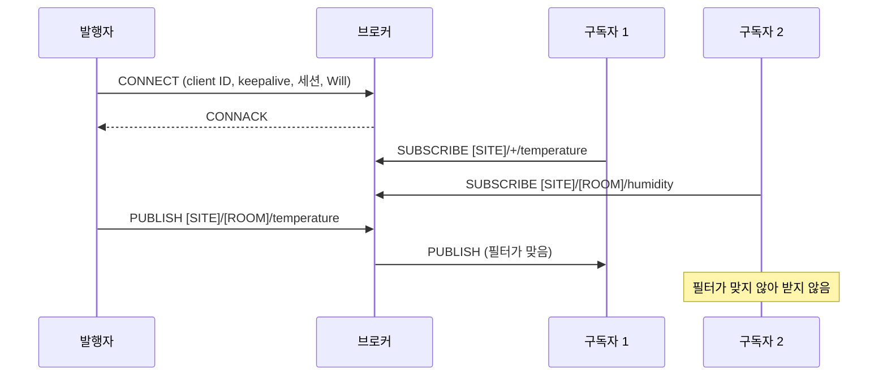
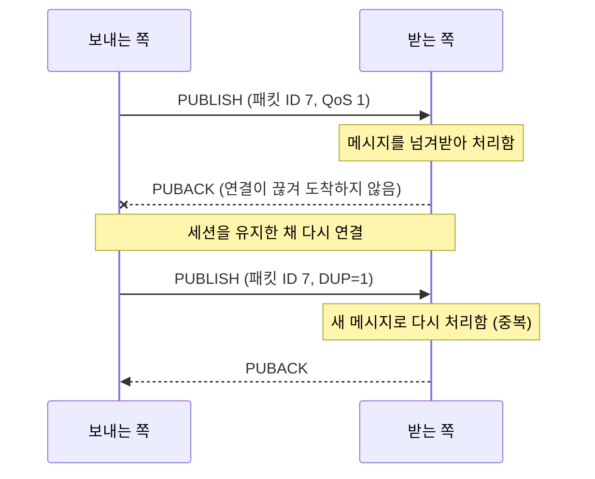
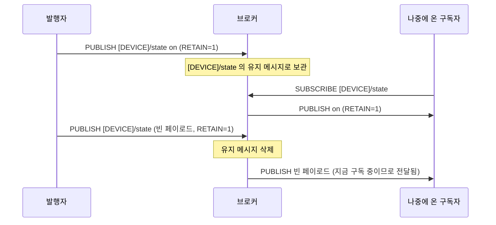
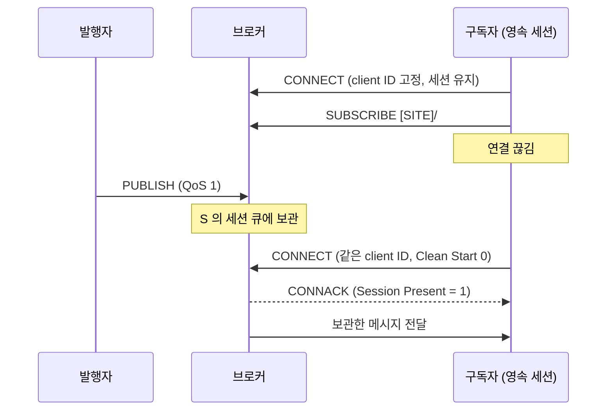
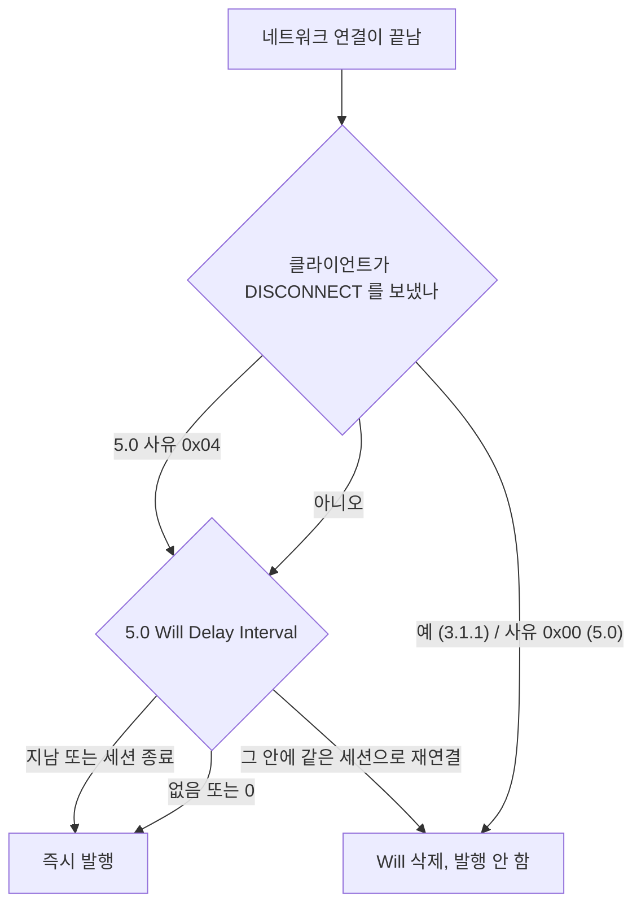
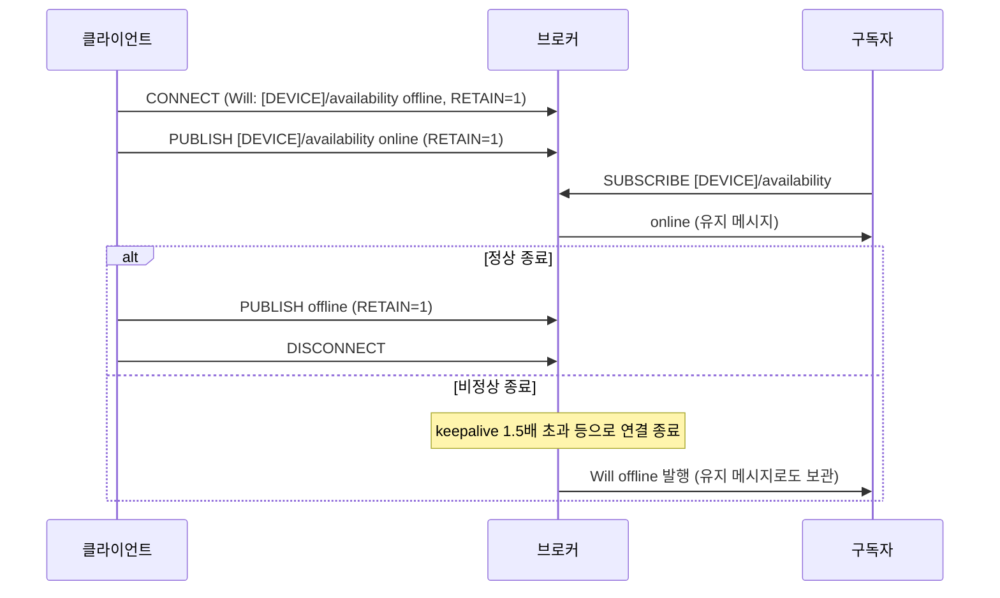

**MQTT** 는 클라이언트끼리 직접 연결하지 않고 가운데의 **브로커**를 거쳐 메시지를 주고받는 발행/구독 메시징 프로토콜입니다. 보내는 쪽은 메시지에 **토픽**을 붙여 브로커에 발행하고, 받는 쪽은 관심 있는 토픽을 브로커에 구독해 두면 브로커가 맞는 메시지를 나눠 줍니다. 명세는 MQTT 가 가볍고 구현하기 쉽게 설계되어, 코드 크기나 네트워크 대역폭이 제한된 M2M·IoT 환경에 알맞다고 설명합니다.

- **기준:** OASIS MQTT Version 3.1.1 (OASIS Standard, 2014-10-29), OASIS MQTT Version 5.0 (OASIS Standard, 2019-03-07), `mosquitto.conf(5)` 매뉴얼(Mosquitto 2.1 문서), Home Assistant MQTT 통합 문서, Zigbee2MQTT 문서. 명세의 **서버(Server)** 가 이 글의 브로커입니다.

## 왜 필요한가

기기가 데이터를 받는 쪽에 직접 보내면 다음 문제가 생깁니다.

- 보내는 쪽이 받는 쪽의 주소와 수를 모두 알아야 하고, 받는 쪽이 하나 늘 때마다 보내는 쪽을 고쳐야 합니다.
- 받는 쪽이 꺼져 있으면 보낼 곳이 없습니다.
- 새로 켜진 쪽은 다음 값이 올 때까지 현재 상태를 모릅니다.
- 상대가 죽었는지, 단지 보낼 값이 없어 조용한지 구분하기 어렵습니다.

MQTT 는 이 문제를 브로커 한 곳에 모아 풉니다. 보내는 쪽은 브로커 주소와 토픽만 알고, 누가 받는지는 모릅니다. 명세는 이것을 "일대다 배포와 애플리케이션 간 결합 해소" 라고 표현합니다. 그 위에 전달 보장 단계(QoS), 마지막 값을 보관하는 유지 메시지, 끊긴 동안 메시지를 모아 두는 세션, 비정상 종료를 알리는 Last Will 이 더해집니다.

## 핵심 용어

| 용어 | 뜻 |
| :--- | :--- |
| 브로커(서버) | 발행된 메시지를 받아 구독이 맞는 클라이언트에게 나눠 주는 중개자입니다. |
| 클라이언트 | 브로커에 연결해 발행하거나 구독하는 프로그램이나 기기입니다. 발행자와 구독자는 역할일 뿐, 모두 클라이언트입니다. |
| 토픽 이름 | 발행하는 메시지에 붙이는 이름입니다. `/` 로 계층을 나눕니다. |
| 토픽 필터 | 구독할 때 쓰는 표현식입니다. 와일드카드 `+`, `#` 를 쓸 수 있습니다. |
| QoS | 메시지 하나를 보내는 쪽과 받는 쪽 사이의 전달 보장 단계(0, 1, 2)입니다. |
| 유지 메시지(retained message) | 브로커가 토픽마다 마지막 하나를 보관했다가 새 구독자에게 바로 보내 주는 메시지입니다. |
| 세션 | 브로커와 클라이언트가 client ID 로 묶어 보관하는 상태(구독 목록, 확인되지 않은 메시지, 보낼 메시지)입니다. |
| 영속 세션 | 연결이 끊긴 뒤에도 남아 있는 세션입니다. 3.1.1 은 CleanSession 으로, 5.0 은 Clean Start 와 Session Expiry Interval 로 정합니다. |
| client ID | 브로커가 클라이언트와 그 세션을 구분하는 식별자입니다. |
| keepalive | 클라이언트가 패킷을 보내지 않고 지낼 수 있는 최대 시간(초)입니다. |
| Last Will(유언 메시지) | 연결할 때 브로커에 맡겨 두고, 연결이 비정상으로 끝나면 브로커가 대신 발행하는 메시지입니다. |
| birth·availability | 유지 메시지와 Last Will 로 클라이언트의 `online`/`offline` 상태를 알리는 관례입니다. 명세에 있는 기능은 아닙니다. |

## 동작 방식

연결, 구독, 발행의 기본 흐름입니다.

1. 모든 참여자는 클라이언트로서 브로커와 TCP 연결을 열고 CONNECT 패킷을 보냅니다. 여기에 client ID, keepalive, 세션을 이어 쓸지 여부, Last Will 이 들어갑니다.
2. 구독자는 SUBSCRIBE 로 토픽 필터와 받고 싶은 최대 QoS 를 알립니다.
3. 발행자는 PUBLISH 에 토픽 이름과 페이로드를 담아 브로커에 보냅니다. 명세는 페이로드의 내용과 형식을 정하지 않으므로, JSON 이든 숫자 하나든 애플리케이션이 정합니다.
4. 브로커는 토픽 이름과 맞는 구독마다 메시지 사본을 보냅니다. 맞는 구독이 하나도 없으면 그 메시지는 누구에게도 가지 않습니다(유지 메시지로 보관하는 경우는 아래에서 다룹니다).

## 토픽과 와일드카드

토픽 이름은 `/` 로 계층(level)을 나눈 문자열입니다. 대소문자를 구분하고, 앞에 `/` 를 붙이면 다른 토픽이 됩니다(`/[SITE]` 와 `[SITE]` 는 다름). 와일드카드는 구독할 때의 토픽 필터에만 쓸 수 있고, 발행하는 토픽 이름에는 쓸 수 없습니다.

| 필터 | 뜻 | 맞는 예 | 맞지 않는 예 |
| :--- | :--- | :--- | :--- |
| `[SITE]/+/temperature` | `+` 는 정확히 한 계층 | `[SITE]/[ROOM]/temperature` | `[SITE]/[ROOM]/[SENSOR]/temperature` |
| `[SITE]/+` | `+` 는 빈 계층에도 맞음 | `[SITE]/` | `[SITE]` |
| `[SITE]/#` | `#` 는 그 아래 모든 계층과 부모 자신 | `[SITE]`, `[SITE]/[ROOM]/temperature` | `[OTHER]/[ROOM]` |
| `#` | 모든 토픽 | `$` 로 시작하지 않는 모든 토픽 | `$SYS/...` |

- `#` 는 필터의 마지막에 한 계층을 통째로 차지해야 합니다. `[SITE]/#/temperature` 나 `[SITE]#` 는 잘못된 필터입니다.
- `+` 도 한 계층을 통째로 차지해야 하며, 여러 계층에 쓸 수 있습니다.
- `$` 로 시작하는 토픽은 와일드카드로 시작하는 필터에 맞지 않습니다. 브로커 상태를 알리는 `$SYS/` 같은 토픽을 받으려면 `$SYS/#` 처럼 따로 구독합니다.

## QoS 와 중복

QoS 는 "보내는 쪽 하나와 받는 쪽 하나" 사이의 약속입니다. 발행자 → 브로커, 브로커 → 구독자가 각각 따로 QoS 흐름을 가집니다.

| QoS | 명세의 이름 | 확인 패킷 | 결과 |
| :--- | :--- | :--- | :--- |
| 0 | 최대 한 번(at most once) | 없음 | 한 번 도착하거나 도착하지 않음. 재전송 없음 |
| 1 | 최소 한 번(at least once) | PUBACK | 적어도 한 번 도착. 중복될 수 있음 |
| 2 | 정확히 한 번(exactly once) | PUBREC, PUBREL, PUBCOMP | 유실도 중복도 없음. 왕복이 두 번 필요함 |

구독자가 받는 QoS 는 발행된 메시지의 QoS 와 브로커가 구독에 허락한 최대 QoS 가운데 **작은 쪽**입니다. QoS 2 로 발행해도 구독이 QoS 0 이면 그 구독자에게는 QoS 0 으로 갑니다.

QoS 1 에서 중복이 생기는 흐름은 다음과 같습니다.

- 보내는 쪽은 PUBACK 을 받을 때까지 메시지를 "확인되지 않음" 으로 들고 있다가, 세션을 이어 다시 연결하면 같은 패킷 ID 로 다시 보냅니다.
- 받는 쪽은 PUBACK 을 보낸 뒤에는 같은 패킷 ID 의 PUBLISH 를 DUP 플래그와 상관없이 **새 메시지**로 다뤄야 합니다. 그래서 받는 쪽 애플리케이션은 같은 메시지를 두 번 받아도 결과가 같게(같은 키와 시각이면 덮어쓰기 등) 만들어 두는 것이 안전합니다.
- 명세상 재전송이 반드시 일어나는 경우는 세션을 이어 다시 연결할 때뿐입니다. 연결이 끊긴 동안의 메시지까지 QoS 1·2 로 보장받으려면 아래의 영속 세션이 함께 필요합니다.

받는 쪽이 메시지를 "넘겨받았다" 고 확인하는 시점을 애플리케이션 처리와 묶는 예로, Telegraf 의 MQTT 입력은 메시지가 출력에 쓰인 뒤에 확인합니다. 자세한 내용은 [Telegraf 플러그인 파이프라인과 출력 버퍼의 동작 원리](/posts/82/)에서 다룹니다.

## 유지 메시지

RETAIN 플래그를 켜고 발행한 메시지는 브로커가 토픽마다 마지막 하나를 보관합니다. 드문드문 바뀌는 상태 값(스위치가 켜졌는지, 설정 값이 무엇인지)을 새 구독자가 곧바로 알 수 있게 하는 것이 목적입니다.

- 같은 토픽에 새 유지 메시지가 오면 이전 것을 바꿉니다. 토픽마다 하나만 남습니다.
- 새 구독이 생기면 브로커는 필터에 맞는 유지 메시지를 RETAIN=1 로 보냅니다. 이미 구독 중인 클라이언트에게 실시간으로 전달할 때는 3.1.1 에서 RETAIN 을 0 으로 바꿔 보냅니다. 5.0 에서는 구독 옵션 Retain As Published 로 원래 플래그를 그대로 받을 수 있습니다.
- 같은 필터로 다시 구독하면 3.1.1 은 유지 메시지를 다시 보냅니다. 5.0 은 구독 옵션 Retain Handling 으로 정합니다(0: 늘 보냄, 1: 새 구독일 때만 보냄, 2: 보내지 않음).
- **빈 페이로드(0바이트)에 RETAIN=1 로 발행하면 그 토픽의 유지 메시지가 지워집니다.** 이 빈 메시지 자체도 지금 구독 중인 클라이언트에게는 보통 메시지처럼 전달되므로, 구독하는 쪽은 빈 페이로드를 받을 수 있다고 가정해야 합니다.
- 유지 메시지는 세션의 일부가 아니어서 세션이 끝나도 지워지지 않습니다. 발행한 클라이언트가 사라져도 남으므로, 유지 메시지만으로는 그 값이 지금도 유효한지 알 수 없습니다. 이 문제를 아래의 availability 관례가 보완합니다.
- 5.0 에서는 Message Expiry Interval 을 붙여 발행하면 유지 메시지도 그 시간이 지나 사라집니다.
- 브로커가 유지 메시지와 세션을 디스크에 두는지는 구현이 정합니다. Mosquitto 는 `persistence` 기본값이 `false` 라 연결·구독·메시지 데이터를 메모리에만 두고, 켜면 종료할 때와 `autosave_interval`(기본 1,800초)마다 파일에 씁니다.

## 세션과 오프라인 동안 쌓이는 메시지

브로커의 세션에는 구독 목록, 확인되지 않은 QoS 1·2 메시지, 아직 보내지 못한 QoS 1·2 메시지가 들어갑니다. QoS 0 메시지는 선택 사항입니다. 이 세션을 연결이 끊긴 뒤에도 남기는지를 버전마다 다르게 정합니다.

| 버전 | 설정 | 동작 |
| :--- | :--- | :--- |
| 3.1.1 | CleanSession = 1 | 이전 세션을 버리고 새로 시작. 세션은 연결이 끝나면 끝남 |
| 3.1.1 | CleanSession = 0 | 같은 client ID 의 세션을 이어 씀. 끊긴 뒤에도 세션을 보관 |
| 5.0 | Clean Start = 1 | 연결할 때 이전 세션을 버림 |
| 5.0 | Clean Start = 0 | 이전 세션이 있으면 이어 씀 |
| 5.0 | Session Expiry Interval = 0 또는 생략 | 연결이 끝나면 세션도 끝남 |
| 5.0 | Session Expiry Interval > 0 | 끊긴 뒤 그 시간(초) 동안 세션을 보관. `0xFFFFFFFF` 는 만료 없음 |

5.0 은 3.1.1 의 CleanSession 한 비트를 "시작할 때 버릴지(Clean Start)" 와 "끊긴 뒤 얼마나 남길지(Session Expiry Interval)" 둘로 나눴습니다.

끊긴 동안의 메시지를 나중에 받으려면 다음 조건이 모두 맞아야 합니다.

- 구독자가 같은 client ID 로 다시 연결합니다. 3.1.1 은 client ID 를 비워 보내면 CleanSession 을 1 로 두어야 하므로, 빈 ID 로는 영속 세션을 쓸 수 없습니다.
- 세션을 남기도록 연결합니다(3.1.1 CleanSession 0, 5.0 Session Expiry Interval > 0).
- 발행과 구독이 모두 QoS 1 이상입니다. QoS 0 메시지를 쌓을지는 명세상 선택 사항이라 브로커가 정합니다.
- 끊기기 전에 이미 있던 구독에 맞는 메시지만 쌓입니다.

명세는 브로커의 저장 능력에 한계가 있고, 관리 정책에 따라 세션이 버려질 수 있다고 적어 둡니다. 실제로 얼마나 쌓이는지는 브로커 설정이 정합니다. Mosquitto 의 관련 설정은 다음과 같습니다.

| 설정 | 기본값 | 뜻 |
| :--- | :--- | :--- |
| `max_queued_messages` | 1000 | 클라이언트마다 전송 중인 것 외에 큐에 둘 QoS 1·2 메시지 수. 0 은 제한 없음(권장하지 않음) |
| `max_queued_bytes` | 0 (제한 없음) | 클라이언트마다 큐에 둘 QoS 1·2 메시지의 바이트 수 |
| `queue_qos0_messages` | `false` | 영속 세션 클라이언트가 끊긴 동안 QoS 0 메시지도 큐에 둘지. 명세 밖 동작 |
| `persistent_client_expiration` | 설정 안 함(만료 없음) | 다시 연결하지 않는 영속 세션을 지우기까지의 시간 |

- `max_queued_messages` 와 `max_queued_bytes` 를 함께 두면 먼저 닿는 한도까지 쌓고, 한도에 닿은 뒤 들어오는 메시지는 조용히 버린다고 매뉴얼이 설명합니다.
- 따라서 영속 세션은 "끊긴 시간 × 메시지 발생량" 이 브로커 큐 한도 안에 들 때만 유실을 막습니다.

## client ID 와 세션 가로채기

client ID 는 브로커가 세션을 찾는 열쇠입니다. 이미 연결된 클라이언트와 같은 client ID 로 누군가 새로 연결하면, 브로커는 **기존 연결을 끊어야** 합니다. 5.0 에서는 기존 클라이언트에게 사유 코드 0x8E(Session taken over)를 담은 DISCONNECT 를 보낸 뒤 끊습니다.

- 끊긴 기존 클라이언트는 정상 DISCONNECT 를 보내지 않았으므로, Last Will 이 있으면 발행됩니다(5.0 은 Will Delay Interval 과 세션 처리에 따라 달라집니다).
- 같은 client ID 를 쓰는 두 인스턴스가 모두 자동으로 다시 연결하면 서로를 번갈아 끊게 됩니다. 이때 연결 끊김과 재연결 로그가 반복되고, Last Will 을 쓰는 경우 `offline` 과 `online` 이 번갈아 발행될 수 있습니다.
- client ID 는 인스턴스마다 고유하게 정합니다(예: `[SERVICE]-[HOST]`). 영속 세션을 쓰려면 재시작해도 바뀌지 않는 값이어야 하므로, 무작위 ID 는 영속 세션과 함께 쓰지 않습니다.

## keepalive 와 Last Will

**keepalive** 는 클라이언트가 패킷 사이에 비워 둘 수 있는 최대 시간입니다. 보낼 것이 없으면 클라이언트가 PINGREQ 를 보내고, 브로커가 PINGRESP 로 답합니다. 브로커는 keepalive 의 **1.5배** 동안 클라이언트에게서 아무 패킷도 받지 못하면 네트워크가 끊긴 것으로 보고 연결을 닫습니다. 0 이면 이 검사를 하지 않습니다. 5.0 에서는 브로커가 CONNACK 의 Server Keep Alive 로 클라이언트 값을 덮어쓸 수 있고, Mosquitto 의 `max_keepalive` 가 이 기능을 씁니다(5.0 클라이언트에만 적용).

**Last Will** 은 CONNECT 에 토픽, 페이로드, QoS, RETAIN 과 함께 맡겨 둡니다. 브로커는 네트워크 연결이 정상 종료 절차 없이 끝났을 때 이 메시지를 대신 발행합니다.

- **발행되는 경우:** 브로커가 I/O 오류나 네트워크 장애를 감지했을 때, keepalive 시간 안에 통신이 없을 때, 클라이언트가 DISCONNECT 없이 연결을 닫았을 때, 프로토콜 오류로 브로커가 연결을 닫았을 때입니다.
- **발행되지 않는 경우:** 클라이언트가 DISCONNECT 를 보내고 끊으면(5.0 은 사유 0x00) 브로커는 Will 을 발행하지 않고 지웁니다. 5.0 에서는 사유 0x04(Disconnect with Will Message)로 끊으면 정상 종료여도 Will 이 발행됩니다.
- **늦게 발행되는 경우:** 전원이 나가거나 선이 빠져 TCP 연결이 조용히 죽으면, 브로커는 keepalive 의 1.5배가 지나서야 끊김을 알아채고 Will 을 발행합니다. 5.0 의 Will Delay Interval 을 두면 그만큼 더 기다리고, 그 사이에 다시 연결하면 발행하지 않습니다. 브로커 자신이 멈춘 경우 명세는 재시작 뒤로 Will 발행을 미룰 수 있게 허용합니다.

## birth·availability 관례

명세에는 Last Will 만 있고, 클라이언트가 지금 살아 있는지를 알리는 기능은 따로 없습니다. 그래서 **유지 메시지와 Last Will 을 같은 토픽에 함께 쓰는 관례**가 널리 쓰입니다. 연결 직후 알리는 `online` 을 흔히 birth 메시지라고 부르고, 이 상태 토픽을 availability 토픽이라고 부릅니다. 이름과 페이로드는 제품마다 정하는 것이지 명세가 정한 것이 아닙니다.

1. 연결할 때 Last Will 을 `[DEVICE]/availability` 토픽, 페이로드 `offline`, RETAIN=1 로 맡깁니다.
2. 연결되면 같은 토픽에 `online` 을 RETAIN=1 로 발행합니다.
3. 정상 종료할 때는 DISCONNECT 전에 `offline` 을 직접 발행합니다. 정상 DISCONNECT 에는 Will 이 나가지 않기 때문입니다.
4. 비정상 종료하면 브로커가 Will 로 `offline` 을 발행하고, RETAIN=1 이므로 유지 메시지도 `offline` 으로 바뀝니다.
5. 나중에 구독한 쪽도 유지 메시지로 현재 상태를 바로 받습니다.

두 가지 중 하나라도 빠지면 관례가 깨집니다. `online` 만 유지 메시지로 두고 Will 이 없으면 클라이언트가 죽은 뒤에도 `online` 이 계속 남습니다. Will 에 RETAIN 을 켜지 않으면 그 순간 구독 중이던 쪽만 `offline` 을 알고, 나중에 구독한 쪽은 이전의 `online` 유지 메시지를 받습니다.

제품 문서에서도 같은 모양을 볼 수 있습니다.

- Home Assistant 의 MQTT 통합은 birth 메시지와 Last Will 을 지원하고, 기본으로 `homeassistant/status` 에 `online`/`offline` 을 보낸다고 설명합니다. MQTT 엔티티의 availability 페이로드 기본값도 `online`/`offline` 입니다. 문서는 정상 종료 때도 `offline` 이 나간다고 설명하는데, 명세상 정상 DISCONNECT 에는 Will 이 나가지 않으므로 이는 클라이언트 쪽에서 따로 처리한 결과입니다. Home Assistant 의 엔티티 구조는 [Home Assistant의 통합·기기·엔티티·영역 구조란 무엇인가](/posts/78/)에서 다룹니다.
- Zigbee 기기를 MQTT 로 잇는 Zigbee2MQTT 의 문서는 브리지 상태 토픽을 유지 메시지로 발행하며, 시작할 때 `online`, 멈추기 직전에 `offline` 을 보낸다고 설명합니다. Zigbee 자체는 [Zigbee, Thread, Matter의 차이](/posts/77/)에서 다룹니다.

## 3.1.1 과 5.0 의 차이

이 글에 나온 범위에서 달라지는 부분만 모았습니다.

| 항목 | 3.1.1 | 5.0 |
| :--- | :--- | :--- |
| 세션 수명 | CleanSession 한 비트 | Clean Start + Session Expiry Interval |
| 정상 종료 때 Will | 발행 안 함 | 사유 0x00 이면 발행 안 함, 0x04 면 발행 |
| Will 지연 | 없음 | Will Delay Interval |
| 재구독 때 유지 메시지 | 늘 다시 보냄 | Retain Handling 으로 선택 |
| 실시간 전달의 RETAIN 플래그 | 늘 0 | Retain As Published 로 원래 값 유지 가능 |
| 메시지 만료 | 없음 | Message Expiry Interval |
| keepalive | 클라이언트 값 | 브로커가 Server Keep Alive 로 덮어쓸 수 있음 |
| 같은 client ID 로 새 연결 | 기존 연결을 끊음 | 사유 0x8E 로 DISCONNECT 를 보내고 끊음 |

## 흔한 오해

QoS 2 로 발행하면 모든 구독자에게 정확히 한 번 간다

- **실제:** QoS 는 보내는 쪽 하나와 받는 쪽 하나 사이의 약속이고, 구독자가 받는 QoS 는 발행 QoS 와 구독에 허락된 QoS 가운데 작은 쪽입니다. 구독이 QoS 0 이면 그 구독자에게는 QoS 0 으로 갑니다. 끊긴 동안의 메시지는 영속 세션과 브로커 큐 한도에도 달려 있습니다.
- **근거:** MQTT 3.1.1 4.3절(QoS 는 한 송신자와 한 수신자 사이), 3.8.4절(전달 QoS 는 둘 중 작은 값)

영속 세션을 쓰면 끊긴 동안의 메시지를 모두 받는다

- **실제:** 브로커가 반드시 보관하는 것은 끊기기 전 구독에 맞는 QoS 1·2 메시지뿐이고, 그것도 브로커의 큐 한도 안에서입니다. Mosquitto 는 기본으로 클라이언트마다 1,000개까지 쌓고 그 뒤로는 버립니다. `persistence` 를 켜지 않은 Mosquitto 가 재시작하면 메모리에 있던 세션도 남지 않습니다.
- **근거:** MQTT 3.1.1 3.1.2.4절(CleanSession 0 일 때 QoS 1·2 보관, QoS 0 은 선택), 4.1절(저장 한계), `mosquitto.conf(5)` 의 `max_queued_messages`, `max_queued_bytes`, `persistence`

연결이 끊기면 Last Will 이 곧바로 나간다

- **실제:** 정상 DISCONNECT 로 끊으면 나가지 않습니다(5.0 의 사유 0x04 는 예외). 전원 차단처럼 조용히 끊기면 브로커가 keepalive 의 1.5배가 지나 알아챈 뒤에 나가고, 5.0 의 Will Delay Interval 이 있으면 더 늦게 나가거나 그 사이 재연결로 취소됩니다.
- **근거:** MQTT 3.1.1 3.1.2.5절·3.1.2.10절, MQTT 5.0 3.1.2.5절·3.1.3.2.2절

빈 메시지로 유지 메시지를 지우면 아무에게도 전달되지 않는다

- **실제:** 빈 페이로드의 RETAIN 메시지는 유지 메시지를 지우는 동시에, 지금 구독 중인 클라이언트에게는 보통 메시지처럼 전달됩니다. 구독하는 쪽이 빈 페이로드를 파싱하다 오류를 낼 수 있습니다.
- **근거:** MQTT 3.1.1 3.3.1.3절(0바이트 RETAIN 메시지는 보통처럼 처리되어 구독자에게 전달되고, 유지 메시지는 지워짐)

## 정리

> - MQTT 는 브로커를 가운데 둔 발행/구독 프로토콜이고, 토픽 필터의 `+` 는 한 계층, `#` 는 그 아래 전부와 부모 자신에 맞습니다.
> - QoS 는 구간마다 따로 적용되고, QoS 1 은 중복될 수 있으므로 받는 쪽이 중복을 견뎌야 합니다.
> - 유지 메시지는 토픽마다 마지막 하나를 새 구독자에게 주고, 빈 페이로드로 지웁니다. 발행자가 사라져도 남습니다.
> - 끊긴 동안의 메시지는 고정 client ID, 영속 세션, QoS 1 이상이 모두 있어야 쌓이고, 브로커 큐 한도를 넘으면 버려집니다.
> - Last Will 은 비정상 종료에만 나가므로, availability 관례는 Will 과 유지 메시지를 함께 쓰고 정상 종료 때 `offline` 을 직접 발행합니다.
{: .prompt-tip }

## 참고 자료

- [OASIS - MQTT Version 3.1.1](https://docs.oasis-open.org/mqtt/mqtt/v3.1.1/os/mqtt-v3.1.1-os.html)
- [OASIS - MQTT Version 5.0](https://docs.oasis-open.org/mqtt/mqtt/v5.0/os/mqtt-v5.0-os.html)
- [Eclipse Mosquitto - mosquitto.conf man page](https://mosquitto.org/man/mosquitto-conf-5.html)
- [Home Assistant - MQTT](https://www.home-assistant.io/integrations/mqtt/)
- [Zigbee2MQTT - MQTT Topics and Messages](https://www.zigbee2mqtt.io/guide/usage/mqtt_topics_and_messages.html)
