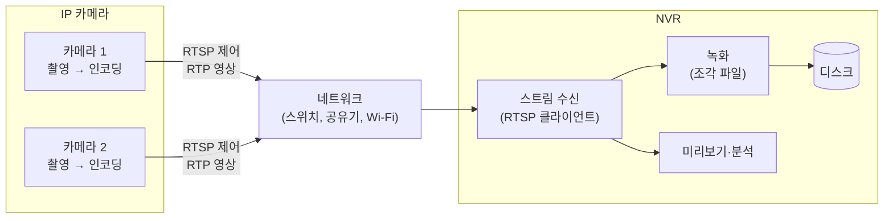
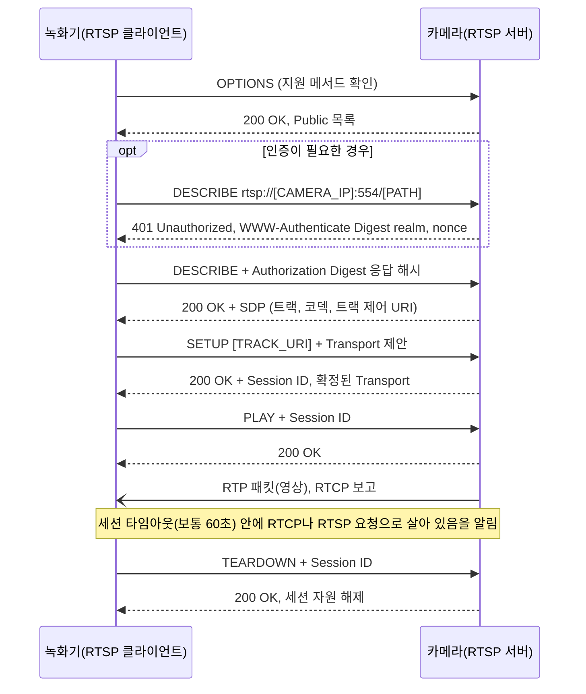
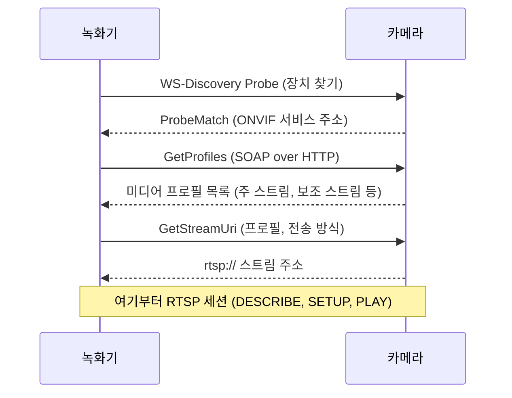
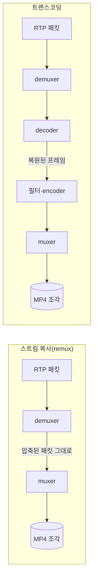
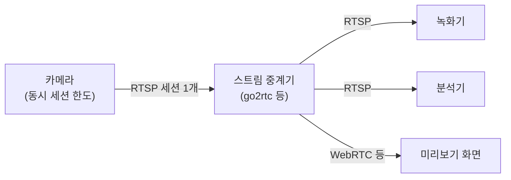

**NVR**(Network Video Recorder)은 네트워크로 연결된 IP 카메라에서 영상을 받아 디스크에 저장하는 녹화기입니다. NVR 자체에는 카메라가 없고, 영상의 인코딩(압축)은 카메라가 이미 마친 상태로 도착합니다. 카메라와 NVR 사이에서 "어떤 영상을 어떤 방식으로 보내라" 를 정하는 규약이 **RTSP**(Real-Time Streaming Protocol)이고, 실제 영상 데이터는 대개 **RTP**(Real-time Transport Protocol)에 실려 흐릅니다. 이 글은 이 흐름과, 녹화기를 설계할 때 만나는 스트림·코덱·녹화 방식의 선택지를 다룹니다.

- **기준:** RFC 7826(RTSP 2.0), RFC 2326(RTSP 1.0), RFC 3550(RTP), RFC 8866(SDP), RFC 7616(HTTP Digest 인증), RFC 6184·RFC 7798(H.264·H.265 의 RTP 페이로드 형식), ONVIF Core Specification 26.06·Media Service Specification 24.12·Profile S 공개 자료, FFmpeg 문서(ffmpeg, Formats, Protocols, Codecs), Frigate 문서

## 왜 필요한가

카메라 영상을 녹화하는 방법은 크게 세 가지입니다.

- 카메라 안의 메모리 카드에 저장
- 제조사 클라우드에 올려 저장
- 같은 네트워크의 녹화기가 받아 저장

메모리 카드는 용량이 작고 카메라를 잃으면 기록도 함께 잃습니다. 클라우드는 인터넷이 끊기면 녹화가 멈추고, 영상이 집 밖으로 나갑니다. 녹화기를 카메라와 같은 지역 네트워크에 두면 인터넷 없이도 녹화가 이어지고 영상이 밖으로 나가지 않습니다. 지역 안에서 필요한 일을 지역에서 하는 설계는 [허브-엣지 구조와 지역 자립(오프라인 우선) 설계란 무엇인가](/posts/62/) 에서 다룹니다.

녹화기가 제조사와 상관없이 여러 카메라를 받으려면 공통 규약이 필요합니다. RTSP 는 스트림을 열고 멈추고 닫는 제어를, RTP 는 영상 패킷 전달을, **SDP**(Session Description Protocol)는 스트림의 코덱과 트랙 설명을, **ONVIF** 는 카메라 탐색과 설정을 맡습니다. 녹화기는 이 규약만 맞으면 어느 제조사 카메라든 같은 방식으로 받을 수 있습니다.

## 핵심 용어

| 용어 | 뜻 |
| :--- | :--- |
| NVR | 네트워크로 IP 카메라의 인코딩된 영상을 받아 저장하는 녹화기입니다. |
| DVR | 아날로그 카메라를 동축 케이블로 직접 연결하고, 녹화기에서 영상을 디지털로 바꿔(인코딩해) 저장하는 녹화기입니다. |
| RTSP | 스트리밍 서버(카메라)에 스트림 설정, 재생, 정지, 종료를 요청하는 제어 프로토콜입니다. 기본 포트는 554입니다. |
| RTP | 영상·음성 패킷에 페이로드 종류, 순서 번호, 타임스탬프를 붙여 실어 나르는 전송 프로토콜입니다. |
| RTCP | RTP 와 함께 쓰여 수신 품질 보고와 스트림 간 동기화 정보를 주고받는 제어 프로토콜입니다. |
| SDP | 세션에 어떤 미디어가 어떤 코덱과 형식으로 있는지 적는 텍스트 형식입니다. 전송 프로토콜이 아닙니다. |
| 세션 | SETUP 으로 만들어져 TEARDOWN 까지 이어지는, 서버가 상태를 기억하는 스트리밍 단위입니다. |
| 인터리브(interleaved) | RTP 패킷을 별도 UDP 포트가 아니라 RTSP 의 TCP 연결 안에 끼워 보내는 방식입니다. |
| Digest 인증 | 비밀번호 대신 비밀번호가 들어간 해시값을 보내는 HTTP 인증 방식으로, RTSP 도 그대로 씁니다. |
| realm | Digest 인증에서 서버가 알려 주는 보호 영역 이름입니다. 해시 계산에 들어갑니다. |
| ONVIF | IP 카메라의 탐색, 설정, 스트림 주소 조회 등을 웹 서비스로 표준화한 업계 규격입니다. |
| 미디어 프로필 | ONVIF 에서 영상 소스와 인코더 설정 등을 하나로 묶은 스트림 구성 단위입니다. |
| 주 스트림 / 보조 스트림 | 한 카메라가 동시에 내보내는 고해상도 스트림과 저해상도 스트림입니다. |
| 코덱 | 영상을 압축하고 푸는 방식입니다. H.264, H.265 가 대표적입니다. |
| 컨테이너 | 압축된 영상·음성 스트림과 시간 정보를 한 파일에 담는 형식입니다. MP4 가 대표적입니다. |
| 키프레임(I 프레임) | 다른 프레임을 참조하지 않고 그 자체로 복원되는 프레임입니다. |
| GOP | 키프레임 하나와 그 뒤에 이어지는, 앞 프레임을 참조하는 프레임들의 묶음입니다. |
| 스트림 복사(stream copy, remux) | 디코딩·인코딩 없이 압축된 패킷을 그대로 다른 컨테이너에 옮겨 담는 것입니다. |
| 트랜스코딩 | 영상을 디코딩한 뒤 다시 인코딩하는 것입니다. |
| 스트림 중계기 | 카메라에서 스트림 하나를 받아 여러 소비자에게 나눠 주는 프로그램입니다. RTSP 프록시, 리스트리머라고도 합니다. |

## 동작 방식

카메라에서 녹화기까지의 구조입니다.



1. 카메라가 영상을 찍고 H.264 나 H.265 로 압축합니다. 카메라는 RTSP 서버 역할을 합니다.
2. 녹화기가 RTSP 클라이언트로서 카메라에 스트림을 요청합니다.
3. 카메라가 압축된 영상을 RTP 패킷으로 녹화기에 보냅니다.
4. 녹화기는 받은 영상을 일정 길이의 파일 조각으로 디스크에 쓰고, 필요하면 같은 영상을 미리보기나 분석에도 씁니다.

## NVR과 DVR의 차이

둘 다 영상을 디스크에 저장하지만 인코딩이 어디서 일어나는지가 다릅니다.

| 구분 | NVR | DVR |
| :--- | :--- | :--- |
| 카메라 | IP 카메라 | 아날로그 카메라 |
| 연결 | 이더넷, Wi-Fi 같은 IP 네트워크 | 카메라마다 동축 케이블 |
| 인코딩하는 곳 | 카메라 | 녹화기 |
| 녹화기에 도착하는 것 | 이미 압축된 스트림 | 아날로그 영상 신호 |
| 녹화기 위치 | 네트워크 어디에 있어도 됨 | 케이블이 닿는 곳 |

아날로그 카메라에 영상 인코더를 붙이면 영상을 디지털 스트림으로 바꿔 네트워크로 보낼 수 있어 NVR 에 연결할 수 있습니다. 두 방식을 섞은 하이브리드 녹화기도 있습니다. NVR 은 전용 장비일 수도 있고, 일반 컴퓨터에서 도는 소프트웨어일 수도 있습니다.

## RTSP 세션의 흐름

RTSP 는 영상 자체를 보내는 프로토콜이 아니라 스트리밍 서버를 원격으로 조작하는 "리모컨" 입니다. RFC 2326 은 RTSP 가 연속 스트림을 직접 보내지 않는 것이 보통이라고 설명합니다. 문법은 HTTP 와 비슷하지만, HTTP 와 달리 서버가 세션 상태를 기억합니다.

아래 흐름은 RTSP 1.0 과 2.0 에 공통입니다. RTSP 2.0(RFC 7826)은 1.0(RFC 2326)을 대체하는 규격이지만 기본 버전 협상 외에는 하위 호환되지 않으며, 1.0 에 있던 RECORD·ANNOUNCE 메서드는 2.0 에서 빠졌습니다. 서버가 어느 버전으로 답하는지는 응답 첫 줄(`RTSP/1.0 200 OK` 등)에 드러납니다.



1. **OPTIONS** 로 서버가 지원하는 메서드를 확인합니다.
2. **DESCRIBE** 로 스트림 설명을 받습니다. 응답 본문은 보통 `application/sdp` 형식입니다. 인증이 필요하면 먼저 401 이 오고, 클라이언트가 인증 정보를 담아 다시 요청합니다(아래 Digest 인증 참고).
3. **SETUP** 으로 트랙마다 전송 방식을 정합니다. 클라이언트가 `Transport` 헤더로 원하는 방식을 제안하면 서버가 하나를 골라 응답하고, 이때 세션 ID 를 만들어 `Session` 헤더로 돌려줍니다. 영상과 음성이 따로 있으면 트랙마다 SETUP 을 보냅니다.
4. **PLAY** 로 전송을 시작합니다. 이때부터 영상이 SETUP 에서 정한 경로로 RTP 패킷에 실려 옵니다.
5. 세션을 유지하는 동안 클라이언트는 세션 타임아웃 안에 살아 있음을 보여야 합니다. RTP 를 쓰면 RTCP 보고가, 그 밖에는 세션 ID 를 담은 아무 RTSP 요청(예: 본문 없는 `GET_PARAMETER`)이 그 역할을 합니다. 타임아웃은 보통 60초이고 서버가 `Session` 헤더의 `timeout` 으로 다른 값을 알릴 수 있습니다. 살아 있음을 보이지 않으면 서버가 세션을 정리할 수 있습니다.
6. **TEARDOWN** 으로 전송을 멈추고 서버의 세션 자원을 해제합니다. 잠깐 멈추기만 할 때는 자원을 유지하는 **PAUSE** 를 씁니다.

DESCRIBE 응답의 SDP 는 다음과 같은 모양입니다. `m=` 줄이 미디어 하나(여기서는 영상 트랙)를, `a=rtpmap` 이 RTP 페이로드 번호와 코덱·클록을, `a=control` 이 그 트랙을 SETUP 할 때 쓸 URI 를 알려 줍니다.

```text
v=0
o=- [SESSION_ID] [SESSION_VERSION] IN IP4 [CAMERA_IP]
s=[SESSION_NAME]
t=0 0
a=control:*
m=video 0 RTP/AVP 96
a=rtpmap:96 H265/90000
a=control:[TRACK_URI]
```

- `m=` 줄의 포트가 0이면 서버가 선호하는 포트가 없다는 뜻이고, 실제 포트는 SETUP 에서 정합니다.
- H.264·H.265 를 RTP 로 보낼 때 클록은 90000(90kHz)으로 정해져 있습니다. H.264 는 해상도 같은 디코딩 정보(파라미터 세트)를 `a=fmtp` 의 `sprop-parameter-sets` 로 미리 알려 줄 수도 있습니다.

녹화기 설정에 넣는 RTSP 주소는 보통 다음 형태입니다. 경로(`[PATH]`)는 제조사마다 다르고, ONVIF 를 지원하는 카메라라면 ONVIF 로 조회할 수 있습니다.

```text
rtsp://[USER]:[PASSWORD]@[CAMERA_IP]:554/[PATH]
```

## RTP 가 흐르는 길: UDP와 TCP 인터리브

SETUP 의 `Transport` 헤더가 RTP 패킷이 다닐 길을 정합니다.

| 구분 | RTP over UDP | RTP over RTSP(TCP 인터리브) |
| :--- | :--- | :--- |
| `Transport` 예 | `RTP/AVP;unicast;client_port=[RTP_PORT]-[RTCP_PORT]` | `RTP/AVP/TCP;unicast;interleaved=0-1` |
| 연결 | RTSP 는 TCP, 영상은 별도 UDP 포트 | RTSP 의 TCP 연결 하나에 제어와 영상을 함께 |
| 패킷 손실 | 잃은 패킷은 다시 오지 않음. 받는 쪽이 순서 번호로 손실과 뒤바뀐 순서를 알아내 재정렬 | TCP 가 재전송하므로 잃지 않는 대신, 앞 패킷이 늦으면 뒤 패킷도 함께 기다림(head-of-line blocking) |
| NAT·방화벽 | 별도 UDP 포트가 막히면 영상이 오지 않음 | 제어 연결이 통하면 영상도 통함 |
| 규격상 위치 | RTP/AVP 의 기본 하위 전송 | 필요할 때만 쓰도록 권고(구현이 복잡하고 오버헤드가 있음) |

인터리브 방식은 각 RTP 패킷 앞에 `$` 문자(0x24), 1바이트 채널 번호, 2바이트 길이를 붙여 RTSP 메시지 사이에 끼워 넣습니다. 채널 번호는 SETUP 의 `interleaved=0-1` 처럼 범위로 정하며, 첫 채널이 RTP, 그다음 채널이 RTCP 입니다. FFmpeg 에서는 `rtsp_transport` 옵션의 `udp` 와 `tcp` 가 이 두 방식에 해당합니다.

RTP 자체는 전달이나 순서를 보장하지 않습니다. RTP 가 주는 것은 페이로드 종류, 순서 번호, 타임스탬프, 전달 상태 감시이고, 손실을 메우거나 품질을 보장하는 일은 하지 않습니다. 그래서 무선처럼 손실이 잦은 구간에서는 UDP 로 받으면 잃은 패킷만큼 화면이 깨질 수 있고, TCP 로 받으면 재전송으로 채우는 대신 지연이 생길 수 있습니다.

## Digest 인증

RTSP 는 인증을 따로 만들지 않고 HTTP 의 인증 틀을 그대로 가져다 씁니다. 상태 코드 401 과 `WWW-Authenticate`, `Authorization` 헤더도 같습니다.

```text
# 1. 인증 없이 요청하면 서버가 도전 값을 보냄
RTSP/1.0 401 Unauthorized
WWW-Authenticate: Digest realm="[REALM]", nonce="[NONCE]"

# 2. 클라이언트가 해시를 계산해 다시 요청
DESCRIBE rtsp://[CAMERA_IP]:554/[PATH] RTSP/1.0
Authorization: Digest username="[USER]", realm="[REALM]", nonce="[NONCE]",
    uri="rtsp://[CAMERA_IP]:554/[PATH]", response="[HASH]"
```

- 서버는 401 응답에 **realm** 과 일회용 값 **nonce** 를 담아 보냅니다. realm 은 "어느 사용자 이름과 비밀번호를 써야 하는지" 알려 주는 보호 영역 이름입니다.
- 클라이언트는 사용자 이름, realm, 비밀번호, nonce, 메서드, 요청 URI 로 해시를 계산해 `response` 에 담습니다. 비밀번호 자체는 네트워크로 나가지 않습니다.
- RFC 7616 은 SHA-256 을 필수 구현 알고리즘으로, MD5 는 하위 호환용으로만 둡니다. 알고리즘을 적지 않으면 MD5 로 간주합니다.
- **Basic 인증**은 비밀번호를 사실상 평문으로 보냅니다. RTSP 2.0 은 Basic 인증을 쓰는 메시지는 반드시 TLS 로 보내도록 정했습니다.

> Digest 인증이 지키는 것은 사용자 이름과 비밀번호뿐입니다. RFC 7616 은 그 밖의 요청과 응답은 엿보는 사람에게 그대로 보인다고 명시합니다. `RTP/AVP` 로 보내는 영상도 암호화되지 않으므로, 카메라와 녹화기 사이 네트워크를 다른 기기와 분리하거나 TLS(`rtsps`, 기본 포트 322)를 쓰는 것이 안전합니다.
{: .prompt-danger }

## ONVIF와 RTSP의 차이

ONVIF 는 RTSP 를 대신하는 규격이 아니라 그 앞 단계를 표준화한 규격입니다. 카메라를 찾고, 설정을 바꾸고, "이 설정의 스트림은 어느 RTSP 주소로 받으면 되는지" 를 알려 줍니다. 실제 영상은 여전히 RTSP 와 RTP 로 받습니다.



| 구분 | ONVIF | RTSP |
| :--- | :--- | :--- |
| 만든 곳 | ONVIF(업계 단체) | IETF(RFC) |
| 하는 일 | 장치 탐색, 장치 관리, 미디어 프로필 설정, PTZ·이벤트 등, 스트림 주소 조회 | 스트림의 설정, 재생, 정지, 종료 |
| 통신 방식 | SOAP 웹 서비스(HTTP), 탐색은 WS-Discovery | 텍스트 요청·응답(기본 포트 554) |
| 영상 전달 | 직접 하지 않음. RTSP 주소를 알려 줌 | 제어만 함. 영상은 RTP |
| 없으면 | 스트림 경로를 제조사 문서에서 찾아 직접 입력 | 스트림을 받을 수 없음 |

- **미디어 프로필**은 영상 소스와 인코더 설정(해상도, 코덱, 프레임 수) 등을 하나로 묶은 단위입니다. 장치는 부팅할 때 프로필을 하나 이상 제공합니다.
- `GetStreamUri` 는 프로필 하나를 지정받아 "RTSP 를 제어 프로토콜로 쓰는 실시간 스트림을 시작할 URI" 를 돌려줍니다. 카메라가 스트림을 여러 개 내보내면 `GetProfiles` 로 받은 프로필마다 호출해 각 스트림의 주소를 얻습니다. 전송 방식으로 UDP, RTSP 위 TCP, HTTP 터널 중 하나를 고를 수 있습니다.
- **Profile S** 는 IP 카메라와 영상 인코더의 기본 영상 스트리밍과 설정을 다루는 ONVIF 프로필입니다. ONVIF 는 Profile S 의 폐지 절차를 진행 중이며, 제품 적합성 제출 마감이 2027년 3월 31일이라고 공지하고 있습니다.

## 주 스트림과 보조 스트림

많은 IP 카메라는 같은 장면을 해상도와 프레임 수가 다른 스트림 두 개 이상으로 동시에 내보냅니다. 용도가 다르기 때문입니다.

| 구분 | 주 스트림 | 보조 스트림 |
| :--- | :--- | :--- |
| 해상도·비트레이트 | 높음 | 낮음 |
| 주된 용도 | 녹화(나중에 자세히 봐야 하는 기록) | 실시간 분석, 미리보기, 여러 화면 동시 보기 |
| 디코딩 비용 | 큼 | 작음 |
| 네트워크 사용량 | 큼 | 작음 |

- 분석에는 원본 해상도가 필요 없는 경우가 많습니다. Frigate 문서는 감지에는 찾으려는 대상이 모델 입력 크기(320x320) 안에 들어오는 정도의 해상도가 알맞고, 카메라 대신 Frigate 에서 프레임 수를 줄이면 버릴 프레임까지 디코딩하느라 CPU 를 낭비한다고 설명합니다. 그래서 분석용 해상도와 프레임 수는 카메라의 보조 스트림 설정으로 맞추는 것이 좋습니다.
- 녹화는 나중에 확인할 해상도로 해야 하므로 주 스트림을 씁니다.
- 반대로 작은 대상이나 먼 거리의 사람을 놓치지 않아야 하면 분석에도 주 스트림을 쓰고 디코딩 비용을 감수합니다. 어느 쪽이 맞는지는 대상 크기와 장비 성능에 따라 정합니다.

## 코덱, 컨테이너, 키프레임

**코덱**과 **컨테이너**는 층이 다릅니다. 코덱은 영상을 어떻게 압축하는지이고, 컨테이너는 압축된 결과를 어떤 파일 구조에 담는지입니다.

| 구분 | 코덱 | 컨테이너 |
| :--- | :--- | :--- |
| 예 | H.264(AVC), H.265(HEVC) | MP4, MPEG-TS, Matroska |
| 정하는 것 | 화면을 압축·복원하는 방법 | 스트림 배치, 시간 정보, 탐색용 색인 |
| 바꾸려면 | 디코딩 후 다시 인코딩(트랜스코딩) | 패킷을 그대로 옮겨 담기(스트림 복사) |

- H.265 는 H.264 를 잇는 ITU-T·ISO/IEC 공동 표준으로, 더 높은 압축을 목표로 만들어졌습니다. 같은 저장 공간에 더 오래 녹화할 수 있는 대신, 재생·디코딩하는 쪽이 H.265 를 지원해야 합니다.
- 같은 H.265 영상이 RTP 패킷으로도, MP4 파일로도 담길 수 있습니다. 카메라에서 RTP 로 받은 영상을 MP4 에 담는 것은 컨테이너만 바꾸는 일입니다.

압축된 영상은 모든 프레임이 독립적이지 않습니다. **키프레임**(I 프레임)은 그 자체로 복원되지만, 나머지 프레임(P·B 프레임)은 다른 프레임을 참조해 그 차이만 담는 방식(인터 예측)으로 크기를 줄입니다. 키프레임 하나부터 다음 키프레임 직전까지를 **GOP**(Group of Pictures)라고 부르고, 키프레임 간격을 GOP 크기라고 합니다.

```text
frame : I P P P P P I P P P P P I P P ...
GOP   : |--- GOP ---|--- GOP ---|-- ...
cut   : ^           ^           ^        <- 조각을 자를 수 있는 곳
```

H.264 의 IDR 프레임은 디코딩을 "초기화" 하는 키프레임입니다. IDR 뒤의 프레임들은 IDR 이전 프레임을 참조하지 않고 복원됩니다. 그래서 녹화를 조각 파일로 나눌 때는 키프레임에서 자릅니다.

- 키프레임이 아닌 곳에서 자르면 다음 조각의 앞부분은 참조할 프레임이 앞 조각에 있어 제대로 복원되지 않습니다.
- FFmpeg 의 segment muxer 는 모든 조각을 기준 스트림의 키프레임으로 시작하고, 정해진 시각에 키프레임이 없으면 그 뒤 첫 키프레임에서 새 조각을 엽니다. 그래서 조각 길이는 GOP 크기만큼 들쭉날쭉할 수 있습니다.
- GOP 가 길수록 자를 수 있는 곳이 드물어지고, 스트림을 중간부터 받기 시작했을 때 첫 키프레임이 올 때까지 화면을 온전히 복원하지 못하는 시간도 길어집니다. 키프레임 간격은 보통 카메라 설정(I 프레임 간격)에서 정합니다.

조각으로 나눠 쓰는 이유는 하나 더 있습니다. FFmpeg 문서에 따르면 일반 MP4 파일은 모든 패킷의 색인을 보통 파일 끝에 쓰므로, 쓰는 도중에 멈추면 파일 전체를 디코딩할 수 없습니다. 녹화를 짧은 조각으로 나누면 전원이 나가도 잃는 것은 마지막 조각뿐입니다. 색인을 조각마다 함께 쓰는 fragmented MP4 도 같은 문제를 줄이는 방법입니다.

## 재인코딩 없는 저장과 트랜스코딩

카메라가 이미 압축한 영상을 녹화기에 저장하는 방법은 두 가지입니다.



| 구분 | 스트림 복사 | 트랜스코딩 |
| :--- | :--- | :--- |
| 하는 일 | 압축된 패킷을 디코딩 없이 다른 컨테이너로 옮김 | 디코딩 → (필요하면 크기 변경 등) → 다시 인코딩 |
| CPU | 매우 적음 | 해상도·프레임 수에 비례해 큼 |
| 화질 | 손실 없음(카메라 원본 그대로) | 다시 압축하므로 대개 손실 |
| 할 수 있는 것 | 컨테이너 변경, 스트림 선택, 조각 나누기 | 해상도·코덱·프레임 수 변경, 글자·박스 덧그리기 |
| 할 수 없는 것 | 필터 적용(필터는 디코딩된 프레임에 동작) | 없음(비용만 큼) |
| FFmpeg 옵션 | `-c copy` | `-c:v [ENCODER]` 등 |

FFmpeg 문서는 인코딩이 계산 비용이 크고 대부분 화질을 떨어뜨리므로 필요할 때만 트랜스코딩하고 나머지는 스트림 복사를 쓰라고 권합니다. 트랜스코딩이 필요한 전형적인 경우는 두 가지입니다.

- 필터를 적용해야 할 때(크기 변경, 박스나 글자 덧그리기 등)
- 받는 쪽이 원래 코덱을 디코딩하지 못할 때

그래서 녹화기는 보통 원본 녹화를 스트림 복사로 저장하고, 분석이나 검수용 영상처럼 가공이 필요한 것만 따로 트랜스코딩합니다. 분석은 프레임을 봐야 하므로 디코딩은 필요하지만, 결과를 영상으로 다시 저장하지 않으면 인코딩은 필요 없습니다.

## 스트림 중계기

저가형 카메라는 동시에 열 수 있는 RTSP 세션 수가 적은 경우가 많습니다. Frigate 문서는 한 번에 연결 하나만 받는 카메라도 있다고 설명합니다. 녹화기, 분석기, 미리보기 화면이 각자 카메라에 접속하면 세션 한도를 넘거나 카메라의 부담과 네트워크 사용량이 소비자 수만큼 늘어납니다.

**스트림 중계기**는 카메라와 세션 하나만 맺고, 받은 스트림을 자신이 연 RTSP 서버(또는 WebRTC 등)로 여러 소비자에게 다시 내보냅니다.



- 카메라 쪽에서는 소비자가 몇이든 세션이 하나입니다. 소비자가 늘어도 카메라의 세션 한도와 카메라→녹화기 구간의 대역폭은 그대로입니다.
- 소비자는 카메라 대신 중계기 주소(`rtsp://[RELAY_HOST]:[RELAY_PORT]/[STREAM_NAME]`)에 접속합니다. 카메라 비밀번호는 중계기 설정에만 두면 됩니다.
- 중계기는 받은 패킷을 그대로 나눠 주는 것이 기본이고, 트랜스코딩은 필요할 때만 합니다. go2rtc 는 트랜스코딩을 필요할 때만 FFmpeg 로 한다고 설명합니다.
- 중계기가 멈추면 모든 소비자가 함께 끊깁니다. 중계기와 녹화기를 같은 곳(같은 호스트나 같은 파드)에 두면 네트워크 구간이 하나 줄어듭니다.
- Frigate 도 go2rtc 를 써서 감지와 Home Assistant 실시간 화면이 카메라에 따로 접속하지 않고 스트림 하나를 나눠 쓰게 합니다.

> 중계기가 다시 내보내는 스트림은 카메라 인증과 별개이므로 중계기 쪽에서 따로 보호해야 합니다. go2rtc 문서는 기본 설정에서 웹 화면과 RTSP 포트가 지역 네트워크에 열려 있어 누구나 인증 없이 영상을 볼 수 있다고 경고합니다. 중계기의 포트를 녹화기에서만 닿게 하거나 중계기 쪽 인증을 켭니다.
{: .prompt-warning }

## 모션 기반 녹화와 연속 녹화

녹화와 분석을 언제 할지에 따라 두 방식으로 나뉩니다. 감지와 추적 자체의 원리는 [객체 감지와 다중 객체 추적(MOT)의 차이](/posts/84/) 에서 다룹니다.

| 구분 | 모션 기반 | 연속(전 프레임) |
| :--- | :--- | :--- |
| 녹화 | 움직임이 있는 구간만 남김 | 모든 구간을 남김 |
| 분석 | 움직임을 먼저 찾고, 움직임이 있을 때 감지 모델을 돌림 | 움직임과 관계없이 정해진 프레임마다 감지 모델을 돌림 |
| 저장 공간 | 적음 | 많음 |
| CPU·가속기 | 장면이 조용하면 적음 | 늘 일정하게 큼 |
| 약점 | 움직임이 적은 대상(잠든 사람 등)은 따로 처리해야 함 | 자원을 계속 씀 |
| 알맞은 상황 | 드물게 일어나는 사건을 찾아볼 때 | 재실 여부처럼 "지금 누가 있는가" 를 끊김 없이 알아야 할 때, 나중에 다시 분석할 원본이 필요할 때 |

- Frigate 는 움직임 감지를 "감지 모델을 돌릴 만한 일이 있는지 보는 첫 관문" 으로 쓴다고 설명합니다. 대신 멈춰 있는 대상은 감지 모델을 매 프레임 돌리지 않고 n번째 프레임마다 다시 확인해 계속 추적합니다. 모션 기반이라도 멈춘 대상을 바로 잃지는 않지만, 멈춘 대상을 어떻게 다루는지는 도구마다 다릅니다.
- Frigate 는 녹화 보존 방식으로 모든 조각(`all`), 움직임이 있는 조각(`motion`), 움직이는 추적 대상이 있는 조각(`active_objects`)을 고를 수 있고, 녹화는 카메라 스트림을 재인코딩 없이 그대로 씁니다.
- 연속 녹화에서도 원본은 스트림 복사로 저장하면 CPU 부담은 분석 쪽에만 생깁니다.

## 흔한 오해

<details markdown="1">
<summary>RTSP 가 영상을 실어 나른다</summary>

- **실제:** RTSP 는 스트림을 설정하고 재생·정지·종료를 요청하는 제어 프로토콜입니다. 영상은 SETUP 에서 정한 경로로 RTP 에 실려 옵니다. TCP 인터리브 방식에서는 RTP 패킷이 RTSP 연결 안에 끼어 오기 때문에 RTSP 가 영상을 보내는 것처럼 보일 뿐입니다.
- **근거:** RFC 2326 1장(RTSP 는 연속 스트림을 직접 보내지 않는 것이 보통), RFC 7826 14장(인터리브 바이너리 데이터)

</details>

<details markdown="1">
<summary>ONVIF 를 지원하면 RTSP 는 필요 없다</summary>

- **실제:** ONVIF 는 카메라 탐색, 설정, 스트림 주소 조회를 표준화합니다. `GetStreamUri` 가 돌려주는 것은 RTSP 로 시작할 스트림의 주소이고, 영상은 그 주소로 RTSP 세션을 열어 받습니다.
- **근거:** ONVIF Core Specification(WS-Discovery 기반 장치 탐색, 웹 서비스), ONVIF Media Service Specification 5.15.1 GetStreamUri

</details>

<details markdown="1">
<summary>MP4 로 저장하면 영상이 다시 압축된다</summary>

- **실제:** MP4 는 컨테이너일 뿐입니다. 카메라가 보낸 H.264·H.265 패킷을 스트림 복사로 담으면 디코딩·인코딩 없이 원본 화질 그대로 저장됩니다. 다시 압축되는 것은 트랜스코딩을 할 때뿐입니다.
- **근거:** FFmpeg 문서 Streamcopy(디코딩·인코딩이 없어 빠르고 화질 손실이 없음), Transcoding 절

</details>

<details markdown="1">
<summary>조각 녹화는 설정한 길이에서 정확히 잘린다</summary>

- **실제:** 조각은 키프레임에서만 자를 수 있으므로, 설정한 시각에 키프레임이 없으면 그 뒤 첫 키프레임까지 늘어납니다. 조각 길이의 오차는 GOP 크기만큼 생길 수 있습니다.
- **근거:** FFmpeg Formats 문서의 segment muxer(모든 조각은 기준 스트림의 키프레임으로 시작)

</details>

<details markdown="1">
<summary>Digest 인증을 쓰면 영상도 보호된다</summary>

- **실제:** Digest 인증은 비밀번호를 평문으로 보내지 않게 할 뿐, 요청·응답과 RTP 영상은 암호화하지 않습니다. 같은 네트워크에서 패킷을 볼 수 있으면 영상도 볼 수 있습니다.
- **근거:** RFC 7616 보안 고려 사항(사용자 이름과 비밀번호 외에는 기밀성 보호가 없음), RFC 7826 19.1(HTTP 인증만으로는 RTSP 메시지 보안이 완전하지 않아 TLS 를 권고)

</details>

## 정리

> - NVR 은 카메라가 인코딩한 영상을 네트워크로 받아 저장하고, DVR 은 아날로그 영상을 녹화기에서 인코딩합니다.
> - RTSP 는 DESCRIBE·SETUP·PLAY·TEARDOWN 으로 세션을 제어하고, 스트림 설명은 SDP 로, 영상은 RTP(UDP 또는 RTSP 위 TCP 인터리브)로 흐릅니다.
> - Digest 인증은 비밀번호만 보호하고, ONVIF 는 카메라 탐색·설정과 RTSP 스트림 주소 조회를 표준화합니다.
> - 녹화는 주 스트림을 키프레임 단위 조각으로 스트림 복사해 저장하고, 분석·미리보기는 필요에 따라 보조 스트림을 씁니다.
> - 세션 한도가 작은 카메라는 스트림 중계기로 연결 하나를 여러 소비자가 나눠 쓰게 합니다.
{: .prompt-tip }

## 참고 자료

- [RFC 7826 - Real-Time Streaming Protocol Version 2.0](https://www.rfc-editor.org/rfc/rfc7826)
- [RFC 2326 - Real Time Streaming Protocol (RTSP)](https://www.rfc-editor.org/rfc/rfc2326)
- [RFC 3550 - RTP: A Transport Protocol for Real-Time Applications](https://www.rfc-editor.org/rfc/rfc3550)
- [RFC 8866 - SDP: Session Description Protocol](https://www.rfc-editor.org/rfc/rfc8866)
- [RFC 7616 - HTTP Digest Access Authentication](https://www.rfc-editor.org/rfc/rfc7616)
- [RFC 6184 - RTP Payload Format for H.264 Video](https://www.rfc-editor.org/rfc/rfc6184)
- [RFC 7798 - RTP Payload Format for High Efficiency Video Coding (HEVC)](https://www.rfc-editor.org/rfc/rfc7798)
- [ITU-T H.264 - Advanced video coding for generic audiovisual services](https://www.itu.int/rec/T-REC-H.264)
- [ITU-T H.265 - High efficiency video coding](https://www.itu.int/rec/T-REC-H.265)
- [ONVIF - Profile S](https://www.onvif.org/profiles/profile-s/)
- [ONVIF Core Specification](https://www.onvif.org/specs/core/ONVIF-Core-Specification.pdf)
- [ONVIF Media Service Specification](https://www.onvif.org/specs/srv/media/ONVIF-Media-Service-Spec.pdf)
- [FFmpeg - ffmpeg Documentation (Streamcopy, Transcoding)](https://ffmpeg.org/ffmpeg.html)
- [FFmpeg - Formats Documentation (segment, mov/mp4)](https://ffmpeg.org/ffmpeg-formats.html)
- [FFmpeg - Protocols Documentation (rtsp)](https://ffmpeg.org/ffmpeg-protocols.html)
- [go2rtc - README](https://github.com/AlexxIT/go2rtc)
- [Frigate - Restream](https://docs.frigate.video/configuration/restream)
- [Frigate - Camera setup](https://docs.frigate.video/frigate/camera_setup)
- [Frigate - Recording](https://docs.frigate.video/configuration/record)
- [Frigate - Motion detection](https://docs.frigate.video/configuration/motion_detection)
- [Frigate - Stationary objects](https://docs.frigate.video/configuration/stationary_objects)
- [Axis Communications - Video encoders white paper](https://www.axis.com/dam/public/c7/75/8c/video-encoders-en-US-266594.pdf)
- [Wikipedia - Network video recorder](https://en.wikipedia.org/wiki/Network_video_recorder)
