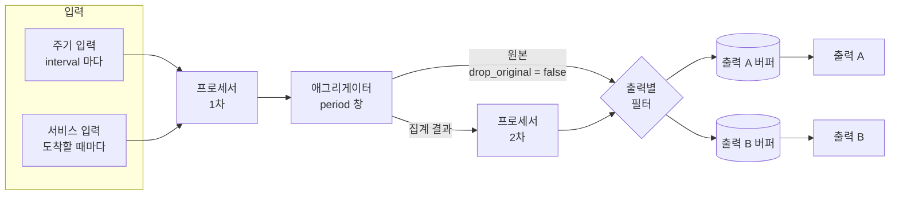
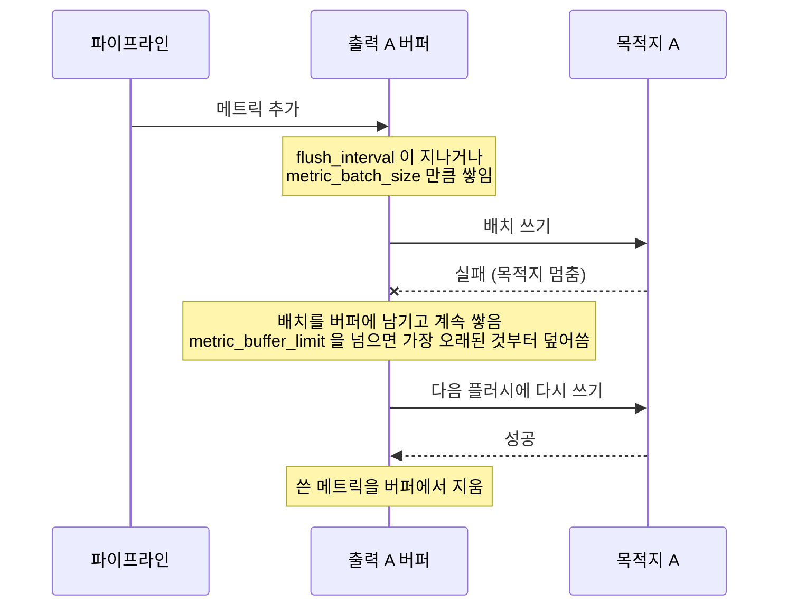
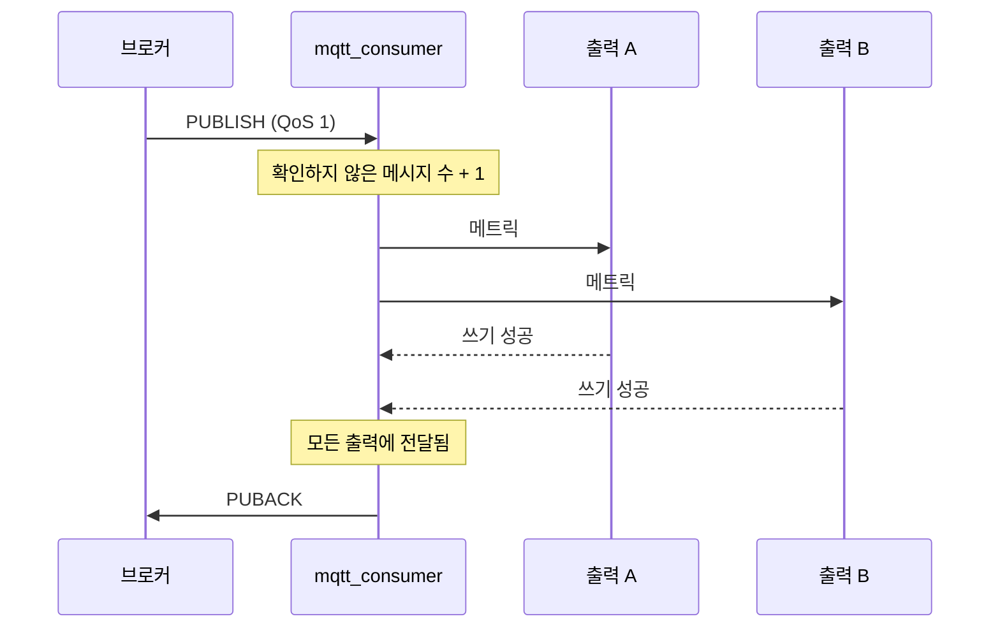

**Telegraf** 는 플러그인을 조합해 쓰는 InfluxData 의 수집 에이전트입니다. 데이터를 모으는 입력, 바꾸는 프로세서, 모아서 계산하는 애그리게이터, 내보내는 출력 플러그인을 설정 파일 하나에 적으면, 모든 데이터가 **메트릭**이라는 같은 모양으로 이 순서를 지나 출력마다 있는 **버퍼**를 거쳐 목적지에 쓰입니다. 이 글은 그 흐름과, 목적지가 멈췄을 때 버퍼가 어떻게 동작하는지를 다룹니다.

- **기준:** Telegraf v1.40.1 저장소 문서(`docs/CONFIGURATION.md`, `docs/METRICS.md`, `docs/AGGREGATORS_AND_PROCESSORS.md`, `docs/INPUTS.md`, `docs/OUTPUTS.md`)와 플러그인 README(`mqtt_consumer`, `json_v2`, `starlark`, `merge`), InfluxData 문서 "The Telegraf data pipeline"·"Telegraf agent settings"·"Telegraf metrics", Telegraf 설계 문서 TSD-005(출력 버퍼 전략), InfluxDB OSS v2 line protocol 문서. 디스크 버퍼는 v1.32.0 이상, `buffer_disk_sync` 는 v1.38.0 이상에서 쓸 수 있습니다.

## 왜 필요한가

수집기를 데이터 원천과 목적지 짝마다 따로 만들면 같은 일을 여러 번 구현하게 됩니다.

- 원천마다 형식(JSON, 텍스트, 바이너리)이 달라 파싱 코드를 따로 둡니다.
- 단위 변환, 태그 붙이기, 이름 바꾸기 같은 가공을 목적지마다 반복합니다.
- 목적지가 잠시 멈췄을 때 데이터를 들고 있다가 다시 보내는 처리를 목적지마다 만듭니다.
- 같은 데이터를 두 곳에 보내려면 수집을 두 번 하거나 코드를 복제합니다.

Telegraf 는 모든 입력이 같은 모양의 메트릭을 내놓고, 모든 출력이 그 메트릭을 받게 해 이 문제를 풉니다. 입력과 출력은 서로를 모르고, 가운데의 프로세서와 애그리게이터는 어느 입력에서 왔든 같은 방식으로 다룹니다. 목적지가 멈췄을 때의 버퍼링과 재시도는 Telegraf 가 출력마다 맡아서 합니다.

## 핵심 용어

| 용어 | 뜻 |
| :--- | :--- |
| 메트릭 | Telegraf 안에서 데이터를 나타내는 단위입니다. 이름, 태그, 필드, 타임스탬프로 이뤄집니다. |
| 측정 이름(measurement) | 메트릭의 이름이자 네임스페이스입니다(예: `cpu`). |
| 태그 | 메트릭을 식별하고 거르는 데 쓰는 문자열 키-값 쌍입니다. |
| 필드 | 측정한 값을 담는, 타입이 있는 키-값 쌍입니다. |
| 입력 플러그인 | 메트릭을 만들어 파이프라인에 넣는 플러그인입니다. |
| 주기 입력 | `interval` 마다 Telegraf 가 불러서 값을 가져오는 입력입니다. |
| 서비스 입력 | 계속 떠 있으면서 밀려 들어오는 데이터를 받을 때마다 메트릭을 내놓는 입력입니다. |
| 파서 | 원시 데이터(JSON 등)를 메트릭으로 바꾸는 부품입니다. 입력의 `data_format` 으로 고릅니다. |
| 프로세서 | 지나가는 메트릭을 하나씩 바꾸거나 거르는 플러그인입니다. |
| 애그리게이터 | 일정 시간 창(`period`) 동안의 메트릭을 모아 새 메트릭을 만드는 플러그인입니다. |
| 출력 플러그인 | 메트릭을 목적지에 쓰는 플러그인입니다. |
| 직렬화기(serializer) | 메트릭을 목적지 형식(line protocol, JSON 등)으로 바꾸는 부품입니다. |
| 메트릭 필터 | 플러그인마다 어떤 메트릭을 다룰지(선택자), 어떤 태그·필드를 남길지(수정자) 정하는 설정입니다. |
| 출력 버퍼 | 출력마다 따로 있는, 아직 목적지에 쓰지 못한 메트릭의 대기열입니다. |
| 배치와 플러시 | 버퍼에서 메트릭을 묶어(배치) 목적지에 쓰는 일(플러시)입니다. |
| 추적 메트릭(tracking metric) | 출력까지 전달된 뒤에 입력이 원천에 "받았다" 고 확인하게 해 주는 메트릭입니다. |

## 동작 방식

메트릭 하나가 지나가는 경로입니다.



1. 입력이 메트릭을 만듭니다. 파일, 메시지 큐, HTTP 응답처럼 원시 데이터를 읽는 입력은 `data_format` 으로 고른 파서로 메트릭을 만들고, 입력의 필터를 통과한 메트릭만 파이프라인에 들어갑니다.
2. 프로세서가 메트릭을 하나씩 바꿉니다. 필터에 맞지 않는 메트릭은 그 프로세서를 건너뜁니다.
3. 애그리게이터가 `period` 동안의 메트릭을 모아 집계 메트릭을 만듭니다. 기본으로 원본도 그대로 흘려보내고, `drop_original = true` 면 집계 결과만 내보냅니다.
4. 기본 설정에서는 집계 결과가 프로세서를 한 번 더 지납니다. 원본은 다시 지나지 않습니다.
5. 출력마다 필터를 통과한 메트릭이 그 출력의 버퍼에 들어가고, 배치로 묶여 목적지에 쓰입니다.

프로세서와 애그리게이터는 없어도 되고, 없으면 메트릭이 입력에서 곧바로 출력 버퍼로 갑니다. 같은 종류의 플러그인을 여러 개 두면 각각 독립적으로 동작합니다.

## 메트릭과 line protocol

메트릭은 InfluxDB 의 데이터 모델을 따릅니다.

- **측정 이름:** 메트릭의 이름입니다.
- **태그:** 출처(기기, 장소)처럼 식별하고 거르는 데 쓰는 문자열 값입니다. InfluxDB 를 비롯한 여러 목적지가 태그를 색인하므로, 문서는 거를 값은 태그에, 측정값은 필드에 두라고 권합니다.
- **필드:** 측정값입니다. 실수, 정수, 부호 없는 정수, 문자열, 불리언 타입을 가집니다.
- **타임스탬프:** 필드 값이 가리키는 시각입니다.

메트릭은 메모리 안의 표현이라, 밖으로 내보내거나 볼 때는 직렬화기가 구체적인 형식으로 바꿉니다. 기본 직렬화기는 메트릭과 일대일로 대응하는 **InfluxDB line protocol** 입니다. 한 줄이 메트릭 하나이고, 이름과 태그, 필드, 타임스탬프를 공백으로 나눕니다. 정수에는 `i`, 부호 없는 정수에는 `u` 를 붙이고, 문자열 필드 값은 큰따옴표로 감쌉니다. 타임스탬프는 기본으로 유닉스 시각 나노초이며 생략할 수 있는데, InfluxDB 는 생략되면 받은 시각을 씁니다. InfluxDB 는 측정 이름, 태그 집합, 타임스탬프가 같은 점을 같은 점으로 보고 필드를 합칩니다.

```text
[MEASUREMENT],[TAG_KEY]=[TAG_VALUE] [FIELD_A]=21.5,[FIELD_B]=87i,[FIELD_C]="ok" 1767225600000000000
```

## 주기 입력과 서비스 입력

입력은 데이터를 가져오는 방식에 따라 두 가지로 나뉩니다.

| 구분 | 주기 입력(polling) | 서비스 입력(service) |
| :--- | :--- | :--- |
| 동작 | `interval` 마다 Telegraf 가 불러 현재 값을 가져옴 | 계속 떠서 기다리다 데이터가 오면 메트릭을 내놓음 |
| 예 | CPU 사용률, 디스크 사용량, 데이터베이스 쿼리 결과 | 메시지 큐(MQTT, Kafka, AMQP) 구독, 소켓 리스너, 웹훅 |
| `interval` | 수집 주기를 정함 | 적용되지 않을 수 있음 |
| `precision`, `time_source` | 적용됨 | 적용되지 않음. 타임스탬프는 각 서비스 입력이 정함 |
| `--test`, `--once` | 결과가 나옴 | 결과가 나오지 않을 수 있음 |

MQTT 브로커를 구독하는 `mqtt_consumer` 가 대표적인 서비스 입력입니다. 받은 메시지의 토픽을 `topic` 태그로 붙이고, `topic_parsing` 으로 토픽 계층 일부를 태그나 필드로 꺼낼 수 있습니다. MQTT 자체의 동작은 [MQTT의 동작 원리](/posts/80/)에서 다룹니다.

## 파서와 타임스탬프

메시지 큐나 파일처럼 원시 데이터를 읽는 입력은 `data_format` 으로 고른 파서가 데이터를 메트릭으로 바꿉니다. 이때 메트릭의 타임스탬프를 어디서 가져오는지가 중요합니다. 페이로드에 발생 시각이 있는데도 받은 시각을 쓰면, 버퍼에 쌓였다 늦게 도착한 데이터가 도착한 순간에 몰려 기록됩니다.

JSON 을 읽는 `json_v2` 파서는 다음 설정으로 페이로드의 시각을 씁니다.

| 설정 | 뜻 |
| :--- | :--- |
| `timestamp_path` | 타임스탬프 값을 가리키는 GJSON 경로. 값 하나를 돌려주지 않으면 현재 시각을 씀 |
| `timestamp_format` | `timestamp_path` 를 쓸 때 필수. `unix`, `unix_ms`, `unix_us`, `unix_ns` 또는 Go 기준 시각 형식 |
| `timestamp_timezone` | 기본 `UTC`. TZ 데이터베이스 이름(예: `America/New_York`)이나 `Local` |

`json_v2` 의 v1.40.1 README 는 현재 구현 상태로는 특히 배열을 다룰 때 이 파서보다 XPath 파서를 쓰라고 경고합니다.

## 프로세서와 애그리게이터

**프로세서**는 지나가는 메트릭을 받자마자 결과를 내보냅니다. 이름 바꾸기, 단위 변환, 태그 붙이기, 계산에 씁니다. 여러 프로세서의 실행 순서가 중요하면 관련된 프로세서 모두에 `order` 를 줍니다.

**`starlark` 프로세서**는 파이썬과 비슷한 Starlark 언어로 가공 로직을 직접 씁니다.

- 스크립트에 `apply(metric)` 함수를 두면 메트릭마다 불리고, `None`(버림), 메트릭 하나, 메트릭 목록 가운데 하나를 돌려줍니다.
- 실행 환경은 샌드박스라 파일이나 소켓을 열 수 없고, 파이썬 패키지와 표준 라이브러리도 쓸 수 없습니다. README 가 제공하는 `json`, `logging`, `math`, `time` 라이브러리만 불러올 수 있습니다.
- 예외가 없어서 스크립트에서 오류가 나면 그 메트릭은 버려지고 로그에 오류가 남습니다. 추적 메트릭이었다면 전달되지 않은 것으로 표시됩니다.
- 전역 딕셔너리 `state` 로 호출 사이에 값을 들고 있을 수 있습니다(예: 이전 값과 비교).

**애그리게이터**는 `period`(기본 30초) 동안 들어온 메트릭을 모아 끝날 때 새 메트릭을 내보냅니다. 집계는 측정 이름, 필드, 태그 집합의 조합마다 따로 만들어집니다. 타임스탬프가 현재 `period` 밖에 있는 메트릭은 집계에 들어가지 않고, `grace` 로 그만큼 늦은 메트릭을 다음 창에 넣게 할 수 있습니다.

**`merge` 애그리게이터**는 이름과 태그 집합(시리즈)과 타임스탬프가 같은 메트릭들을 필드를 합친 메트릭 하나로 합칩니다. 필드가 여러 메트릭으로 나뉘어 들어올 때 씁니다. 시각이 조금씩 다르게 들어오면 `round_timestamp_to` 로 맞춘 뒤 합칩니다.

```text
- [MEASUREMENT],[TAG_KEY]=[TAG_VALUE] [FIELD_A]=42 1767225600000000000
- [MEASUREMENT],[TAG_KEY]=[TAG_VALUE] [FIELD_B]=7 1767225600000000000
+ [MEASUREMENT],[TAG_KEY]=[TAG_VALUE] [FIELD_A]=42,[FIELD_B]=7 1767225600000000000
```

기본 설정에서 프로세서는 **두 번** 돕니다. 애그리게이터 앞에서 한 번, 애그리게이터가 만든 집계 결과에 한 번 더입니다. 값을 배로 바꾸는 프로세서라면 집계 결과가 두 번 바뀝니다. 에이전트 설정 `skip_processors_before_aggregators`, `skip_processors_after_aggregators` 로 한쪽을 끌 수 있고, 문서는 뒤쪽의 기본값이 앞으로 바뀔 예정이며 명시하지 않으면 시작할 때 경고를 남긴다고 설명합니다.

## 메트릭 필터로 경로 나누기

메트릭 필터는 모든 입력, 프로세서, 애그리게이터, 출력에 붙일 수 있고, 두 종류가 있습니다.

| 종류 | 설정 | 동작 |
| :--- | :--- | :--- |
| 선택자 | `namepass`, `namedrop` | 측정 이름을 glob 패턴으로 골라 메트릭 전체를 통과시키거나 뺌 |
| 선택자 | `tagpass`, `tagdrop` | 태그 키마다 값의 glob 패턴 목록으로 고름. 여러 키는 OR 조건 |
| 선택자 | `metricpass` | CEL 식으로 고름. 더 자유롭지만 느림 |
| 수정자 | `fieldinclude`, `fieldexclude` | 남길 필드를 고름. 필드가 다 빠지면 메트릭이 사라짐 |
| 수정자 | `taginclude`, `tagexclude` | 남길 태그를 고름 |

같은 필터라도 붙인 플러그인 종류에 따라 결과가 다릅니다.

- **입력:** 수집한 뒤에 적용하고, 걸러진 메트릭은 버려집니다.
- **프로세서·애그리게이터:** 처리하기 전에 적용하고, 걸러진 메트릭은 버려지지 않고 그 플러그인을 건너뛰어 다음 단계로 갑니다.
- **출력:** 쓰기 전에 적용하고, 걸러진 메트릭은 그 출력에만 가지 않습니다.

출력마다 필터를 다르게 주면 한 파이프라인에서 목적지별로 다른 메트릭을 보낼 수 있습니다. 필터가 없는 출력은 파이프라인을 지난 메트릭을 모두 받습니다.

```toml
# 측정 이름이 [PREFIX] 로 시작하는 메트릭만 받는 출력
[[outputs.file]]
  alias = "[OUTPUT_A]"
  files = ["stdout"]
  namepass = ["[PREFIX]*"]

# 태그 site 가 [SITE_A] 나 [SITE_B] 인 메트릭만 받는 출력
[[outputs.file]]
  alias = "[OUTPUT_B]"
  files = ["[PATH]"]
  [outputs.file.tagpass]
    site = ["[SITE_A]", "[SITE_B]"]
```

TOML 문법 때문에 `[outputs.file.tagpass]` 처럼 표 머리글로 쓰는 `tagpass`·`tagdrop` 은 플러그인 설정의 **맨 끝**에 둬야 합니다. 뒤에 다른 설정을 쓰면 그 설정이 `tagpass` 표 안으로 들어갑니다.

## 출력 버퍼와 플러시

출력마다 버퍼가 따로 있고, 필터를 통과한 메트릭은 그 출력의 버퍼에 들어가 쓰기를 기다립니다.



| 설정 | 기본값 | 뜻 |
| :--- | :--- | :--- |
| `metric_batch_size` | 1000 | 한 번에 쓰는 최대 메트릭 수 |
| `flush_interval` | `"10s"` | 플러시 사이의 최대 간격. 실제 최대 간격은 `flush_interval + flush_jitter` |
| `flush_jitter` | `"0s"` | 플러시 간격에 더하는 무작위 시간. 많은 인스턴스가 한꺼번에 쓰는 것을 막음 |
| `metric_buffer_limit` | 10000 | 출력마다 버퍼에 둘 수 있는, 아직 쓰지 못한 메트릭 수 |

- **플러시 시점:** 마지막 플러시 뒤 `flush_interval` 에 `flush_jitter` 안의 무작위 시간을 더한 만큼 지났을 때, 버퍼에 `metric_batch_size` 이상 쌓였을 때, Telegraf 프로세스가 SIGUSR1 신호를 받았을 때입니다.
- **실패와 재시도:** 출력의 쓰기가 오류를 돌려주면 그 배치 전체가 실패로 처리되고, 메트릭은 버퍼에 남아 다음 플러시에 다시 쓰입니다.
- **넘침:** 버퍼가 `metric_buffer_limit` 에 닿으면 가장 오래된 메트릭을 새 메트릭으로 덮어씁니다. 한도를 늘리면 더 긴 중단을 견디는 대신 메모리를 더 씁니다.
- **느린 출력:** 플러시가 에이전트의 `interval` 보다 오래 걸리면 로그에 `did not complete within its flush interval` 이 남습니다. 출력이 들어오는 양을 따라가지 못한다는 뜻입니다.
- **출력별 설정:** 위 네 설정은 에이전트 기본값이고, 출력마다 따로 덮어쓸 수 있습니다.

버퍼가 출력마다 따로이므로, 한 목적지가 멈추면 그 출력의 버퍼에만 메트릭이 쌓입니다. 다만 아래의 추적 메트릭을 쓰는 입력에서는 멈춘 출력 하나가 그 입력 전체를 멈출 수 있습니다.

## 버퍼 전략: memory 와 disk

버퍼를 어디에 둘지는 에이전트 설정 `buffer_strategy` 가 정합니다. 에이전트 수준에서만 설정할 수 있어 모든 출력에 함께 적용됩니다.

| 구분 | `memory` (기본) | `disk` |
| :--- | :--- | :--- |
| 저장 위치 | 메모리 | `buffer_directory` 아래 출력마다 만든 하위 디렉터리의 WAL(write-ahead log) 파일 |
| Telegraf 가 멈추면 | 버퍼의 메트릭을 잃음 | 파일에 남음. 다시 시작하면 남은 항목을 새 메트릭보다 먼저 보냄 |
| 쓰기에 성공하면 | 버퍼에서 지움 | 로그에서 해당 항목을 지움 |
| 크기 한도 | `metric_buffer_limit` 에서 오래된 것부터 덮어씀 | Telegraf 가 디스크 사용량을 제한하지 않음. 디렉터리를 따로 감시해야 함 |
| 상태 | 원래 방식 | v1.32.0 에서 추가. v1.40.1 설정 문서도 실험적 기능으로 표시 |

- **`buffer_directory`:** `disk` 를 쓸 때 반드시 지정합니다.
- **`buffer_disk_sync`** (v1.38.0 이상, 기본 `true`): 끄면 쓰기가 빨라지는 대신, 정전 때 마지막 `flush_interval` 동안 버퍼에 들어온 메트릭을 잃을 수 있습니다.
- 공식 문서는 `disk` 모드에서 `metric_buffer_limit` 이 어떻게 적용되는지 따로 설명하지 않고, 디스크 사용량을 제한하지 않는다고만 적습니다.
- 설계 문서 TSD-005 는 디스크 버퍼가 가득 찬 메모리 버퍼 때문에 메트릭을 버리는 일을 막기 위한 것이지, 장애나 시스템 고장에서 데이터 안전을 보장하는 수단은 아니라고 적습니다. 출력 설정이 바뀌어 새 인스턴스가 이전 WAL 파일을 찾지 못하는 경우도 언급합니다.

목적지와의 연결이 오래 끊길 수 있는 구성, 예를 들어 지역에서 중앙으로 보내는 출력에 디스크 버퍼를 두는 이유는 [허브-엣지 구조와 지역 자립(오프라인 우선) 설계란 무엇인가](/posts/62/)에서 다룹니다.

## 입력 쪽 전달 확인: 추적 메트릭

버퍼는 출력 쪽 유실을 줄이지만, 입력이 원천에서 메시지를 가져온 뒤 출력에 닿기 전에 Telegraf 가 멈추면 그 메시지는 버퍼에도 원천에도 없습니다. **추적 메트릭**은 이 틈을 막습니다. 메시지 큐를 읽는 입력(MQTT, Kafka, AMQP 등)은 메시지를 읽은 뒤 바로 확인하지 않고, 그 메트릭이 출력에 전달된 뒤에 원천에 확인을 보냅니다.



- `mqtt_consumer` README 는 메트릭이 **모든 출력**에 전달되었을 때 입력이 알림을 받아 원천에 확인한다고 설명합니다. 개발 문서(`docs/INPUTS.md`)는 출력에 쓰였을 때뿐 아니라 도중에 버려졌을 때도 알림이 온다고 적습니다.
- **`max_undelivered_messages`**(`mqtt_consumer` 기본 1000)는 원천에서 읽었지만 아직 출력에 쓰이지 않은 메시지의 최대 수입니다. 여기에 닿으면 새 메시지를 더 읽지 않습니다. README 는 너무 크면 플러시 간격과 상관없이 출력에 배치가 끊임없이 쓰이고, 너무 작으면 메시지가 플러시되지 않을 수 있다며 에이전트의 `metric_batch_size` 를 함께 고려하라고 설명합니다.
- Telegraf 가 확인 전에 멈추면 원천이 그 메시지를 다시 보내 줘야 유실이 없습니다. MQTT 에서는 QoS 1 이상과 고정된 client ID, 영속 세션이 필요하며, `mqtt_consumer` 의 `qos`, `client_id`, `persistent_session` 설정이 이것입니다. README 는 영속 세션을 쓰면 client ID 를 바꾸지 않는 한 재연결이나 재시작 뒤에도 처음 연결할 때의 토픽만 쓰고 새 토픽을 구독하지 않는다고 경고합니다.
- `starlark` 프로세서에서 메트릭을 복사할 때는 추적 정보를 가진 메트릭을 모두 돌려줘야 합니다. 돌려주지 않으면 입력이 전달 알림을 받지 못해 확인하지 않은 메시지가 한도까지 찹니다.
- 외부 플러그인(`execd` 계열)은 실제 출력 결과와 상관없이 확인됩니다.

"모든 출력에 전달된 뒤" 라는 조건 때문에, 추적 메트릭을 쓰는 입력은 출력 하나가 멈추면 그 출력으로 간 메트릭이 확인되지 않은 채 남습니다. 이 수가 `max_undelivered_messages` 에 닿으면 입력이 새 메시지를 읽지 않으므로, 정상인 다른 출력에도 이 입력의 새 메트릭이 가지 않습니다. Telegraf 관리자는 이슈에서 메트릭은 모든 출력에 전달되어야 전달된 것으로 보므로 의도된 동작이라고 답했고, v1.40.1 의 `mqtt_consumer` README 에는 이를 바꾸는 설정이 없습니다.

## 흔한 오해

<details markdown="1">
<summary>출력마다 버퍼가 따로라서 출력 하나가 멈춰도 다른 출력은 영향이 없다</summary>

- **실제:** 버퍼와 재시도는 출력마다 따로 동작하지만, 추적 메트릭을 쓰는 입력(`mqtt_consumer` 등)은 모든 출력에 전달된 뒤에 확인합니다. 멈춘 출력 때문에 확인되지 않은 메시지가 `max_undelivered_messages` 에 닿으면 그 입력이 읽기를 멈추고, 다른 출력에도 새 메트릭이 가지 않습니다.
- **근거:** `mqtt_consumer` README(모든 출력에 전달되면 알림), `docs/METRICS.md`(`max_undelivered_messages`), Telegraf 이슈 #16537 의 관리자 답변

</details>

<details markdown="1">
<summary>디스크 버퍼를 쓰면 어떤 경우에도 메트릭을 잃지 않는다</summary>

- **실제:** 디스크 버퍼는 아직 실험적 기능이고, `buffer_disk_sync = false` 면 정전 때 마지막 `flush_interval` 동안의 메트릭을 잃을 수 있습니다. Telegraf 는 디스크 사용량을 제한하지 않아 디스크가 차는 것도 따로 막아야 합니다. 설계 문서도 장애 상황의 데이터 안전 보장 수단이 아니라고 적습니다.
- **근거:** `docs/CONFIGURATION.md`(`buffer_strategy`, `buffer_disk_sync`), "The Telegraf data pipeline" 의 Buffering and delivery, TSD-005 의 Is/Is-not

</details>

<details markdown="1">
<summary>프로세서는 메트릭마다 한 번만 실행된다</summary>

- **실제:** 기본 설정에서 프로세서는 애그리게이터 앞에서 한 번, 애그리게이터가 만든 집계 결과에 한 번 더 실행됩니다. 원본 메트릭은 두 번째를 건너뜁니다. 값을 바꾸는 프로세서는 집계 결과를 두 번 바꿀 수 있습니다.
- **근거:** `docs/AGGREGATORS_AND_PROCESSORS.md` 의 Ordering, "The Telegraf data pipeline" 의 Processor ordering

</details>

<details markdown="1">
<summary>애그리게이터는 늦게 도착한 메트릭도 합쳐 준다</summary>

- **실제:** 애그리게이터는 타임스탬프가 현재 `period` 안에 있는 메트릭만 집계하고, 그보다 오래된 메트릭은 무시합니다. 버퍼에 쌓였다가 한꺼번에 들어온 과거 데이터는 `merge` 같은 애그리게이터로 합쳐지지 않을 수 있습니다. `grace` 로 늦은 메트릭을 받을 여유를 줄 수 있습니다.
- **근거:** `docs/CONFIGURATION.md` 의 Aggregator Plugins(`period`, `grace`), `docs/AGGREGATORS_AND_PROCESSORS.md` 의 Aggregator

</details>

## 정리

> - 메트릭은 측정 이름, 태그, 필드, 타임스탬프로 이뤄지고, 입력 → 프로세서 → 애그리게이터 → (집계 결과만) 프로세서 → 출력 버퍼 → 출력 순서로 흐릅니다.
> - 서비스 입력은 데이터가 올 때마다 메트릭을 만들며, 발생 시각은 파서 설정(`json_v2` 의 `timestamp_path` 등)으로 페이로드에서 가져와야 합니다.
> - 메트릭 필터는 입력·출력에서는 버리고, 프로세서·애그리게이터에서는 건너뛰게 합니다. 출력별 필터로 목적지마다 다른 메트릭을 보냅니다.
> - 버퍼는 출력마다 따로이고, 배치 단위로 쓰고 실패하면 다시 쓰며, `metric_buffer_limit` 을 넘으면 오래된 것부터 버립니다. `disk` 전략은 재시작에도 남지만 실험적이고 디스크 한도가 없습니다.
> - 추적 메트릭은 모든 출력에 전달된 뒤 원천에 확인하므로, 출력 하나가 멈추면 `max_undelivered_messages` 에 닿은 입력이 읽기를 멈춥니다.
{: .prompt-tip }

## 참고 자료

- [InfluxData - The Telegraf data pipeline](https://docs.influxdata.com/telegraf/v1/concepts/data-pipeline/)
- [InfluxData - Telegraf agent settings](https://docs.influxdata.com/telegraf/v1/configuration/agent/)
- [InfluxData - Telegraf metrics](https://docs.influxdata.com/telegraf/v1/concepts/metrics/)
- [InfluxData - Telegraf concepts (Polling and service inputs)](https://docs.influxdata.com/telegraf/v1/concepts/)
- [Telegraf v1.40.1 - docs/CONFIGURATION.md](https://github.com/influxdata/telegraf/blob/v1.40.1/docs/CONFIGURATION.md)
- [Telegraf v1.40.1 - docs/METRICS.md](https://github.com/influxdata/telegraf/blob/v1.40.1/docs/METRICS.md)
- [Telegraf v1.40.1 - docs/AGGREGATORS_AND_PROCESSORS.md](https://github.com/influxdata/telegraf/blob/v1.40.1/docs/AGGREGATORS_AND_PROCESSORS.md)
- [Telegraf v1.40.1 - docs/INPUTS.md](https://github.com/influxdata/telegraf/blob/v1.40.1/docs/INPUTS.md)
- [Telegraf v1.40.1 - docs/OUTPUTS.md](https://github.com/influxdata/telegraf/blob/v1.40.1/docs/OUTPUTS.md)
- [Telegraf v1.40.1 - TSD-005 Telegraf Output Buffer Strategy](https://github.com/influxdata/telegraf/blob/v1.40.1/docs/specs/tsd-005-output-buffer-strategy.md)
- [Telegraf v1.40.1 - MQTT Consumer Input Plugin](https://github.com/influxdata/telegraf/blob/v1.40.1/plugins/inputs/mqtt_consumer/README.md)
- [Telegraf v1.40.1 - JSON Parser Version 2 Plugin](https://github.com/influxdata/telegraf/blob/v1.40.1/plugins/parsers/json_v2/README.md)
- [Telegraf v1.40.1 - Starlark Processor Plugin](https://github.com/influxdata/telegraf/blob/v1.40.1/plugins/processors/starlark/README.md)
- [Telegraf v1.40.1 - Merge Aggregator Plugin](https://github.com/influxdata/telegraf/blob/v1.40.1/plugins/aggregators/merge/README.md)
- [Telegraf v1.40.1 - CHANGELOG](https://github.com/influxdata/telegraf/blob/v1.40.1/CHANGELOG.md)
- [InfluxDB OSS v2 - Line protocol](https://docs.influxdata.com/influxdb/v2/reference/syntax/line-protocol/)
- [Telegraf issue #16537 - MQTT input sent to two different outputs completely stops reporting if one output unresponsive](https://github.com/influxdata/telegraf/issues/16537)
