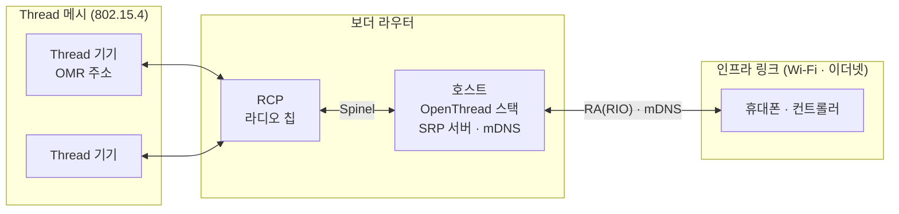
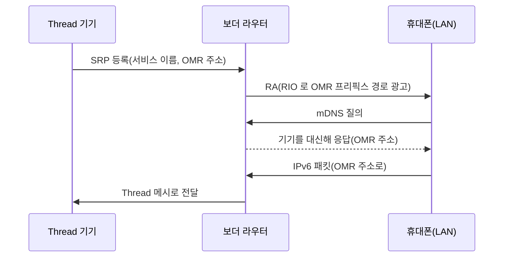
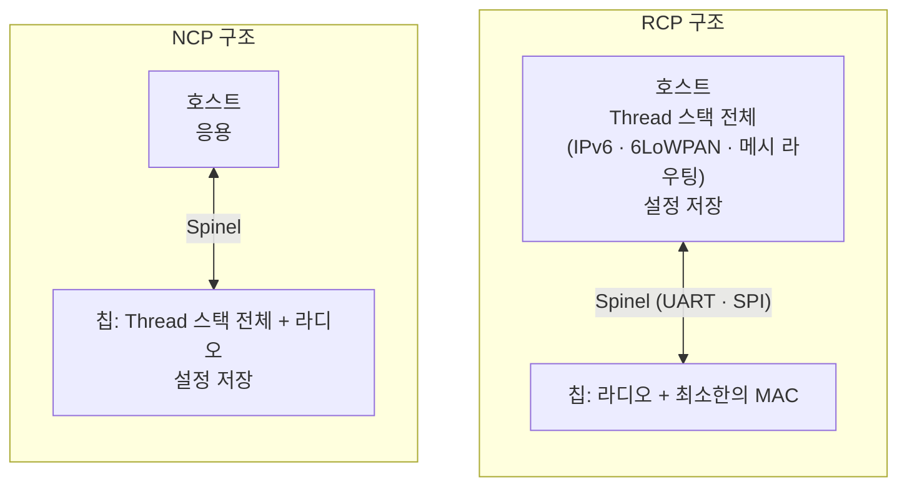
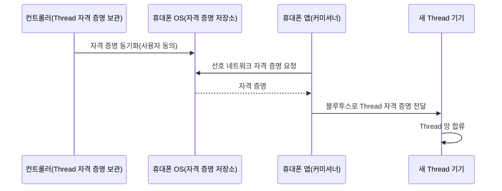

**Thread 보더 라우터**는 Thread 메시와 Wi-Fi·이더넷 같은 다른 IP 망 사이에서 IPv6 패킷을 중계하고, 양쪽의 서비스 탐색을 이어 주는 기기입니다. OpenThread 의 보더 라우터 구현인 OTBR(OpenThread Border Router)은 **RCP**(Radio Co-Processor) 구조를 지원합니다. 이 구조에서 Thread 스택 전체는 리눅스 같은 호스트에서 돌고, 802.15.4 라디오 칩에는 최소한의 MAC 기능만 남습니다. 그래서 망의 설정(운영 데이터셋)은 라디오가 아니라 호스트에 저장되고, 라디오를 바꿔도 같은 망이 이어집니다. Thread 가 Zigbee·Matter 와 어떤 층에서 다른지는 [Zigbee, Thread, Matter의 차이](/posts/77/)에서 다룹니다.

- **기준:** openthread.io 문서(Border Router, Co-Processor Designs, Thread Primer, Border Routing Manager API, CLI Operational Datasets), openthread/openthread 저장소의 POSIX 플랫폼 README 와 RadioURL 도움말(2026-09 main 브랜치), Spinel 명세 초안 draft-rquattle-spinel-unified-00(2017-05), Thread Group "Thread Border Router White Paper"(2022-07, Thread 1.3.0), RFC 9665(SRP), Home Assistant 문서(Thread, Matter), Google Home Developers Thread Network SDK

## 왜 필요한가

Thread 기기는 IPv6 로 통신하지만 802.15.4 라디오만 가집니다. Thread 라디오가 없는 휴대폰, 노트북, 서버는 같은 IPv6 를 쓰더라도 Thread 기기에 직접 닿을 수 없습니다. Thread Group 백서는 대부분의 휴대폰과 스마트 스피커, PC 에 Thread 라디오가 없으므로, Matter over Thread 기기와 통신하려면 사실상 보더 라우터가 필요하다고 설명합니다.

주소만 이어서는 부족합니다. LAN 의 기기는 mDNS 멀티캐스트로 서비스를 찾는데, 이 멀티캐스트를 저전력 메시에 그대로 흘리면 메시의 트래픽이 늘어 기기가 저전력 상태를 유지하기 어렵습니다. RFC 9665 도 멀티캐스트가 Wi-Fi 와 802.15.4 망에 알맞지 않다는 점을 SRP 를 만든 이유로 듭니다. 보더 라우터는 Thread 기기의 서비스 등록을 대신 받아 두고 LAN 의 질의에 대신 답해, 메시로 들어오는 트래픽을 줄입니다.

보더 라우터는 Zigbee 코디네이터 같은 망의 중심이 아닙니다. 한 Thread 망에 여러 대를 둘 수 있고, 모두 같은 중계 기능을 중복해서 제공하므로 한 대가 고장 나도 나머지가 연결을 이어 갑니다. 이 구조에서 망의 설정을 라디오 칩이 아니라 호스트에 두는 것이 RCP 구조입니다.

## 핵심 용어

| 용어 | 뜻 |
| :--- | :--- |
| 보더 라우터 | Thread 망과 다른 IP 망 사이에서 패킷을 중계하는 기기 |
| 인프라 링크 | 보더 라우터가 Thread 반대편에서 붙어 있는 Wi-Fi·이더넷 망(AIL, adjacent infrastructure link) |
| OMR 프리픽스 | Thread 기기가 망 밖에서 닿을 수 있는 주소(OMR 주소)를 만들 때 쓰는 IPv6 프리픽스(Off-Mesh Routable) |
| 온링크 프리픽스 | 인프라 링크의 기기들이 쓰는 IPv6 프리픽스. 없으면 보더 라우터가 ULA 프리픽스를 만들어 광고함 |
| RA | IPv6 라우터가 프리픽스와 경로를 알리는 ICMPv6 메시지(Router Advertisement) |
| RIO | RA 에 실어 "이 프리픽스는 나를 거쳐 간다" 를 알리는 옵션(Route Information Option) |
| mDNS / DNS-SD | 멀티캐스트로 이름과 서비스를 찾는 방식 / DNS 레코드로 서비스를 알리고 찾는 방식 |
| SRP | 멀티캐스트 없이 유니캐스트 DNS Update 로 서비스를 등록하는 프로토콜(Service Registration Protocol, RFC 9665) |
| RCP | Thread 스택은 호스트에서 돌고 칩은 라디오와 최소한의 MAC 기능만 맡는 구조(Radio Co-Processor) |
| NCP | Thread 스택까지 칩에서 돌고 호스트는 응용만 맡는 구조(Network Co-Processor) |
| Spinel | 호스트와 코프로세서(RCP·NCP) 사이의 제어 프로토콜 |
| HDLC-Lite | Spinel 프레임을 UART 로 보낼 때 쓰는 틀. 프레임 구분, 이스케이프, CRC 만 가져온 HDLC |
| RadioURL | OpenThread 호스트가 라디오에 붙는 방법과 경로를 적는 URL |
| 운영 데이터셋 | 채널, PAN ID, 네트워크 키 같은 Thread 망의 설정 묶음(Operational Dataset). 현재 값은 Active, 예약된 변경은 Pending |
| TLV | 종류(Type)·길이(Length)·값(Value) 순으로 값을 이어 붙인 인코딩. 데이터셋을 16진수 문자열로 주고받을 때 씀 |
| 리더 | 망(파티션)의 라우터 집합을 관리하는 라우터. 파티션마다 하나이고 스스로 선출됨 |
| 파티션 | 서로 닿는 Thread 기기의 묶음. 메시가 끊겨 나뉘면 각 부분이 따로 리더를 가짐 |
| 선호 네트워크 | 휴대폰이나 컨트롤러가 새 Thread 기기를 넣을 때 기본으로 쓰는 Thread 망(preferred network) |

## 보더 라우터가 하는 일



OpenThread 문서는 보더 라우터가 최소한 다음 네 가지를 한다고 정리합니다.

1. **양방향 IPv6 연결:** 보더 라우터는 Thread 망 데이터에 OMR 프리픽스를 올려 Thread 기기가 망 밖에서 닿을 수 있는 OMR 주소를 갖게 합니다. 인프라 링크에는 RA 를 보내면서 이 OMR 프리픽스를 RIO 로 실어, LAN 의 기기가 "이 프리픽스로 가는 패킷은 보더 라우터로 보낸다" 는 경로를 배우게 합니다. 인프라 링크에 IPv6 프리픽스가 없으면 보더 라우터가 ULA 온링크 프리픽스를 만들어 광고하고, 반대 방향 경로(Thread 기기가 LAN 으로 가는 길)는 Thread 망 데이터에 올립니다.
2. **양방향 서비스 탐색:** Thread 기기는 SRP 로 자기 서비스(예: Matter)를 망 안의 보더 라우터에 유니캐스트로 등록합니다. 보더 라우터는 이 등록을 인프라 링크에 mDNS 로 알리고, 망 밖의 질의에 망 안의 모든 기기를 대신해 답합니다. 반대 방향으로 Thread 기기가 LAN 의 서비스를 찾을 때도 보더 라우터가 중계합니다.
3. **파티션 병합:** 같은 망이 메시에서 끊겨 나뉘었어도, 보더 라우터가 IP 인프라 링크를 거쳐 파티션을 다시 합칩니다(Thread-over-infrastructure).
4. **외부 커미셔닝:** 휴대폰 같은 망 밖의 커미셔너가 새 Thread 기기를 인증해 망에 넣을 수 있게 합니다.

이 밖에 IPv4 망과 통신하기 위한 NAT64, 상위 라우터에서 프리픽스를 받아 오는 DHCPv6 프리픽스 위임을 지원하고, 망 밖에서 들어오는 패킷은 `iptables`·`ipset` 규칙으로 걸러 Thread 망을 보호합니다. Thread 1.3.0 은 양방향 IPv6 연결, 서비스 탐색, TCP 지원을 보더 라우터의 인증 항목으로 표준화했습니다.

LAN 의 휴대폰이 Thread 기기를 찾아 접속하는 흐름은 다음과 같습니다.



## RCP 와 NCP

보더 라우터는 Thread 라디오를 가진 칩(코프로세서)과 그 칩을 부리는 호스트로 나뉩니다. Thread 스택을 어디서 돌리느냐에 따라 두 구조가 있습니다.



| 구분 | RCP | NCP |
| :--- | :--- | :--- |
| Thread 스택 위치 | 호스트 | 칩 |
| 칩이 하는 일 | 무선 송수신과 최소한의 MAC 기능 | Thread 스택 전체와 무선 송수신 |
| 호스트가 하는 일 | Thread 스택 전체, 망 설정 저장, 응용 | 응용 |
| 망 설정이 저장되는 곳 | 호스트 | 칩 |
| OpenThread 문서가 드는 쓰임 | 전력 제약이 덜한 기기 | 칩이 깨어 있는 동안 호스트가 잘 수 있는 기기, 다른 처리 부담이 큰 게이트웨이나 IP 카메라 |

OpenThread 문서는 OTBR 이 RCP 구조를 지원한다고 밝힙니다. RCP 구조에서 칩은 망을 모릅니다. 채널, PAN ID, 네트워크 키를 정하고 메시 라우팅을 하는 것은 모두 호스트의 OpenThread 이고, 칩은 호스트가 시키는 대로 프레임을 보내고 받은 프레임을 넘깁니다.

## Spinel 과 HDLC 프레이밍

**Spinel** 은 호스트가 코프로세서를 제어하려고 만든 프로토콜로, RCP 와 NCP 양쪽에 쓰입니다. 명세 초안은 Spinel 을 "일반 운영 체제와 네트워크 코프로세서 사이의 단순한 직렬 연결에서 동작하는 호스트-컨트롤러 프로토콜" 로 정의합니다. 명령 수를 줄이려고 속성(property) 중심으로 설계되어, 속성 값을 읽고(`PROP_VALUE_GET`) 쓰고(`PROP_VALUE_SET`) 코프로세서가 값을 알리는(`PROP_VALUE_IS`) 명령이 중심입니다. 프레임 하나는 헤더 1바이트, 명령 1~3바이트, 선택적인 명령 페이로드로 이루어집니다.

UART 로 보낼 때는 프레임 경계를 알 수 없으므로 **HDLC-Lite** 로 감쌉니다. HDLC 에서 프레임 구분, 이스케이프, CRC 만 가져온 형식입니다.

```text
Spinel 프레임       : HEADER | CMD | PAYLOAD
HDLC-Lite 로 보낼 때: [HEADER | CMD | PAYLOAD | CRC-16] 을 이스케이프한 바이트열 + 0x7E
```

- 프레임 끝에 16비트 CRC(CRC-16/CCITT, KERMIT)를 붙임
- 프레임은 플래그 바이트 `0x7E` 로 끝남
- 데이터 안의 `0x7E`, `0x7D`, `0x11`, `0x13`, `0xF8` 은 `0x7D` 를 앞에 붙이고 값을 `0x20` 과 XOR 해 보냄
- 받는 쪽은 이스케이프를 푼 뒤 CRC 를 확인하고, 맞지 않으면 프레임을 버림
- 연속된 `0x7E` 는 오류가 아님. 연결 직후 `0x7E` 를 보내 이전에 받던 찌꺼기를 버리게 함

SPI 로 연결할 때는 SPI 전용 프레이밍을 씁니다. OpenThread 호스트는 라디오에 붙는 방법을 **RadioURL** 로 받습니다.

```text
spinel+hdlc+uart://[DEVICE_PATH]?uart-baudrate=[BAUDRATE]
spinel+spi://[SPI_DEVICE_PATH]?[SPI_OPTIONS]
spinel+hdlc+forkpty://[PROGRAM_PATH]?forkpty-arg=[ARG]
```

`spinel+hdlc+uart` 는 시리얼 장치(USB 동글 등)에 붙고, 속도를 적지 않으면 460800 을 씁니다. `spinel+hdlc+forkpty` 는 지정한 프로그램을 가상 터미널(pty)에 자식 프로세스로 띄우고 그 입출력을 시리얼 포트처럼 씁니다. OpenThread 는 이 방식으로 시뮬레이션 라디오를 붙입니다.

## 라디오를 네트워크로 잇는 경우

라디오가 호스트에 USB 로 꽂혀 있지 않고 LAN 너머의 장비에 있으면, 그 장비가 라디오의 UART 를 TCP 포트로 열어 주는 방식이 쓰입니다. OpenThread 의 RadioURL 목록에는 TCP 방식이 따로 없으므로, 호스트는 `spinel+hdlc+forkpty` 로 TCP 연결을 표준 입출력으로 이어 주는 프로그램(예: `socat`)을 띄워 그 입출력을 시리얼처럼 씁니다.


이때 TCP 위로 오가는 것은 USB 시리얼과 똑같은 HDLC-Lite 바이트열입니다. Spinel 은 원래 단순한 직렬 연결을 전제로 한 프로토콜이므로, 네트워크 구간이 끊기거나 느려지면 호스트에게는 라디오와의 직렬 연결이 끊기거나 느려진 것과 같습니다.

## 운영 데이터셋이 저장되는 곳

Thread 망의 설정은 **운영 데이터셋** 하나로 묶입니다. 망 전체가 지금 쓰는 값은 Active Operational Dataset 이고, 다음 항목을 담습니다.

| 항목 | 뜻 |
| :--- | :--- |
| Active Timestamp | 데이터셋의 타임스탬프(Unix 시각, 초) |
| Channel | 망이 쓰는 802.15.4 채널(11~26) |
| Channel Mask | 채널 번호를 비트 자리로 나타낸 마스크. 예시 값 `0x07fff800` 은 11~26번 비트가 켜진 값 |
| Network Key | 망의 보안 키. Thread Group 백서는 기기의 망 접근이 결국 이 키로 결정된다고 설명함 |
| Network Name | 사람이 읽는 망 이름 |
| PAN ID | 2바이트 망 식별자 |
| Extended PAN ID | 8바이트 망 식별자 |
| Mesh-Local Prefix | 망 안에서만 쓰는 IPv6 주소의 프리픽스 |
| PSKc | 커미셔너 패스프레이즈로 만드는 키. 커미셔너가 보더 라우터를 거쳐 기기를 넣는 Thread 자체 커미셔닝에 씀 |
| Security Policy | 망의 보안 정책 |

Pending Operational Dataset 은 여기에 지연 타이머(Delay Timer)와 Pending Timestamp 를 더한 것입니다. 채널, PAN ID, 네트워크 키처럼 바꾸는 순간 연결이 끊길 수 있는 값을 바꿀 때, 리더가 새 값을 망 전체에 먼저 나눠 주고 타이머가 끝나면 한꺼번에 Active 로 바꿉니다.

데이터셋은 TLV 로 인코딩되어 비휘발성 저장소에 저장되고, 16진수 TLV 문자열로 통째로 주고받을 수 있습니다. OpenThread CLI 에서는 `dataset active -x` 로 꺼내고 `dataset set active [DATASET_TLV_HEX]` 로 넣습니다. 기존 망에 붙는 데는 네트워크 키만 있어도 되고, 붙은 뒤 나머지 데이터셋을 받아 옵니다. 즉 망 안의 Thread 기기들도 각자 데이터셋을 가지고 있습니다.

RCP 구조에서 이 저장소는 호스트에 있습니다. OpenThread 의 POSIX 플랫폼은 설정을 호스트의 데이터 디렉터리 안 파일로 저장하고, 칩에는 망 설정이 남지 않습니다. 그래서 라디오를 바꿔도 망이 유지됩니다.

1. 호스트가 저장해 둔 데이터셋을 읽습니다.
2. 새 RCP 에 붙어 Spinel 로 채널, PAN ID, MAC 키 같은 라디오 설정을 내려보냅니다(Spinel 에는 이를 위한 `PHY_CHAN`, `MAC_15_4_PANID`, `RCP_MAC_KEY` 속성이 있습니다).
3. 라디오가 같은 채널에서 같은 PAN ID 와 키로 프레임을 주고받으므로, 망의 다른 기기와 그대로 통신합니다.

반대로 호스트의 저장소를 잃으면 라디오가 멀쩡해도 보더 라우터는 망을 잊습니다. 망 안의 기기들은 여전히 데이터셋을 가지고 있어 망 자체는 남지만, 보더 라우터를 그 망에 다시 넣으려면 적어도 네트워크 키가 필요합니다. 데이터셋 사본(Home Assistant 의 Thread 통합에 저장된 자격 증명 등)이 없으면 새 망을 만들고 기기를 다시 커미셔닝해야 하므로, 호스트의 데이터 디렉터리를 백업해 둡니다. NCP 구조나 보더 라우터가 칩 안에서 도는 제품은 반대로 설정이 칩에 남으므로, 칩을 바꿀 때 데이터셋을 옮길 방법을 따로 확인해야 합니다.

## 여러 보더 라우터가 한 망에 있을 때

같은 데이터셋을 가진 보더 라우터는 같은 망의 일부입니다.

- **중복:** 여러 보더 라우터가 같은 중계 기능을 함께 제공하므로 한 대가 고장 나도 연결이 이어짐(Thread Group 백서, Home Assistant 문서)
- **프리픽스:** 각 보더 라우터는 망 데이터에 이미 올라온 OMR 프리픽스와 자기 로컬 OMR 프리픽스 가운데 우선하는(favored) 것을 골라 씀. 온링크 프리픽스도 인프라 링크에서 발견한 것과 자기 것 가운데 고름
- **서비스 탐색:** Thread 기기는 망 안의 아무 보더 라우터에나 서비스를 등록하고, 같은 망의 보더 라우터들이 망 밖의 질의에 모든 기기를 대신해 답함
- **역할:** 보더 라우터도 Thread 메시 안에서는 하나의 기기이므로 메시 안의 역할(리더, 라우터 등)을 따로 가짐. 백서는 보더 라우터가 반드시 라우터(Mesh Extender)일 필요는 없지만 실제로는 그럴 가능성이 매우 높다고 설명함

데이터셋이 다르면 같은 LAN 에 있어도 다른 망입니다. Home Assistant 문서는 제조사마다 제품을 처음 쓸 때 자기 Thread 망을 만들기 때문에, 한 집에 Home Assistant 망, Apple 망, Google 망이 따로 생길 수 있고, 자격 증명이 달라 기기가 망 사이를 옮겨 다니지 못한다고 설명합니다. 보더 라우터는 mDNS 로 자기를 알리지만 이 알림에는 자격 증명이 들어 있지 않아, 다른 망의 보더 라우터는 보여도 그 망에 들어갈 수는 없습니다.

새 보더 라우터를 기존 망에 넣으려면 먼저 그 망의 데이터셋을 주어야 합니다. Home Assistant 문서는 Home Assistant 에 선호 네트워크가 있고 새 보더 라우터에 아직 망이 없을 때만 보더 라우터가 그 선호 네트워크에 합류한다고 설명합니다.

## 휴대폰의 Thread 자격 증명 공유

Matter over Thread 기기를 등록할 때는 휴대폰이 커미셔너가 되어, 블루투스로 기기에 Thread 망의 자격 증명을 넘깁니다. 그러니 휴대폰이 먼저 그 망의 자격 증명을 알고 있어야 합니다. Home Assistant 문서는 새로 만든 Thread 망에 Matter 기기를 추가하기 전에 휴대폰이 그 망의 자격 증명을 알아야 한다고 설명합니다.



Thread 백서는 iOS 와 Android 가 Thread Group 과 함께 만든 API 로, 앱이 사용자 동의를 받아 Thread 자격 증명을 휴대폰의 키체인에 넣고 다른 앱이 이를 읽어 자기 기기를 커미셔닝할 수 있다고 설명합니다. Android 에서는 Google Play 서비스가 이 저장소를 맡고, 자동으로 고른 선호 자격 증명(preferred credentials)을 여러 제조사의 앱이 함께 씁니다.

이 구조 때문에 **선호 네트워크**가 중요합니다. Home Assistant 문서는 Home Assistant 의 선호 네트워크를 Thread 기기를 추가할 때의 기본 망으로 두려 하지만, 컴패니언 앱으로 Matter 기기를 추가할 때는 휴대폰의 선호 네트워크가 쓰인다고 밝힙니다. 휴대폰의 선호 네트워크가 다른 제조사의 망이면 기기는 그 망에 들어가고, 휴대폰이 자격 증명을 모르는 망에는 기기를 넣을 수 없습니다. 그래서 Home Assistant 의 망을 쓰려면 컴패니언 앱의 자격 증명 동기화로 Home Assistant 의 선호 네트워크를 휴대폰에 먼저 넣습니다.

## 노드 상태

OpenThread CLI 의 `state` 명령과 API(`otDeviceRole`)가 보여 주는 기기 역할은 다섯 가지입니다.

| 상태 | 뜻 | 보더 라우터에서 보일 때 |
| :--- | :--- | :--- |
| `disabled` | Thread 스택이 꺼져 있음 | 데이터셋이 없거나 Thread 를 시작하지 않은 상태 |
| `detached` | 어느 망(파티션)에도 참여하지 않고 있음 | 데이터셋은 있지만 아직 망에 붙지 못한 상태 |
| `child` | 부모 라우터에 붙은 엔드 기기로 동작함 | 망에 막 붙은 직후. 모든 기기는 처음에 child 로 붙은 뒤 필요하면 라우터로 올라감 |
| `router` | 메시를 중계하는 라우터로 동작함 | 다른 라우터가 이미 리더인 망에 합류한 정상 상태 |
| `leader` | 파티션의 라우터 집합을 관리하는 리더로 동작함 | 망을 새로 만들었거나 리더로 선출된 정상 상태 |

망을 새로 만든 기기는 스스로 리더가 되므로, 보더 라우터 한 대로 망을 만들면 `leader` 가 됩니다. 이미 리더가 있는 망에 보더 라우터를 더하면 `router` 로 붙고, 이것도 정상입니다. 리더는 파티션마다 스스로 선출되므로 리더가 사라지면 남은 라우터 가운데 하나가 이어받습니다.

## 흔한 오해

<details markdown="1">
<summary>보더 라우터를 바꾸면 Thread 기기를 모두 다시 등록해야 한다</summary>

- **실제:** 망을 정하는 것은 데이터셋입니다. 새 보더 라우터나 새 라디오가 같은 데이터셋을 가지면 같은 망으로 동작합니다. RCP 구조에서는 데이터셋이 호스트에 있으므로 라디오만 바꿀 때는 따로 할 일이 없고, 호스트를 바꿀 때는 데이터셋(적어도 네트워크 키)을 옮기면 됩니다. 데이터셋 사본이 하나도 없을 때만 새 망을 만들고 다시 등록해야 합니다.
- **근거:** OpenThread CLI Operational Datasets 문서(비휘발성 저장, 네트워크 키만으로 합류), openthread.io Co-Processor Designs(RCP 에서 스택은 호스트에 있음)

</details>

<details markdown="1">
<summary>같은 LAN 에 보더 라우터가 있으면 휴대폰이 그 망에 기기를 넣을 수 있다</summary>

- **실제:** 보더 라우터의 mDNS 알림에는 자격 증명이 없습니다. 휴대폰은 자격 증명을 가진 망에만 기기를 넣을 수 있고, 그중 선호 네트워크를 씁니다. Home Assistant 문서는 Thread 기반 Matter 기기를 추가할 때 "this device requires a border router" 오류가 나면, 보더 라우터가 가까이 있고 휴대폰이 그 망의 자격 증명을 알고 있어야 한다고 설명합니다.
- **근거:** Home Assistant Thread 문서(mDNS 알림과 자격 증명, 선호 네트워크), Home Assistant Matter 문서(트러블슈팅)

</details>

<details markdown="1">
<summary>보더 라우터 상태가 leader 가 아니면 문제가 있다</summary>

- **실제:** 리더는 파티션마다 하나뿐이므로, 다른 기기가 이미 리더인 망에서는 보더 라우터가 `router` 인 것이 정상입니다. 문제가 되는 것은 데이터셋이 있는데도 `disabled` 나 `detached` 에 머무는 경우입니다.
- **근거:** openthread.io Node Roles and Types(파티션마다 리더 하나), OpenThread `otDeviceRole` 정의

</details>

## 정리

> - 보더 라우터는 RA(RIO)로 OMR 프리픽스 경로를 LAN 에 알리고, SRP 로 받은 서비스 등록을 mDNS 로 대신 알려 Thread 메시와 LAN 을 잇습니다. 한 망에 여러 대를 둘 수 있습니다.
> - RCP 구조에서는 Thread 스택과 운영 데이터셋이 호스트에 있고, 칩은 Spinel(UART 에서는 HDLC-Lite 프레이밍)로 명령을 받는 라디오일 뿐입니다. 라디오가 네트워크 너머에 있으면 같은 바이트열을 TCP 로 잇습니다.
> - 망을 정하는 것은 데이터셋(채널, PAN ID, Extended PAN ID, 네트워크 키, 메시 로컬 프리픽스 등의 TLV)입니다. 데이터셋이 같으면 라디오나 보더 라우터를 바꿔도 같은 망이고, 다르면 같은 LAN 에 있어도 다른 망입니다.
> - Matter over Thread 기기를 넣는 휴대폰은 그 망의 자격 증명을 알아야 하고, 휴대폰의 선호 네트워크가 쓰입니다.
{: .prompt-tip }

## 참고 자료

- [OpenThread - Border Router](https://openthread.io/guides/border-router)
- [OpenThread - Co-Processor Designs](https://openthread.io/platforms/co-processor)
- [OpenThread - Border Routing Manager API](https://openthread.io/reference/group/api-border-routing)
- [OpenThread - Thread Border Router codelab (Bidirectional IPv6 Connectivity and DNS-Based Service Discovery)](https://openthread.io/codelabs/openthread-border-router)
- [OpenThread - Node Roles and Types](https://openthread.io/guides/thread-primer/node-roles-and-types)
- [OpenThread - Network Discovery and Formation](https://openthread.io/guides/thread-primer/network-discovery)
- [OpenThread - CLI Operational Datasets](https://openthread.io/reference/cli/concepts/dataset)
- [openthread/openthread - POSIX app README](https://github.com/openthread/openthread/blob/main/src/posix/README.md)
- [openthread/openthread - RadioURL help (radio_url.cpp)](https://github.com/openthread/openthread/blob/main/src/posix/platform/radio_url.cpp)
- [draft-rquattle-spinel-unified-00 - Spinel Host-Controller Protocol](https://datatracker.ietf.org/doc/html/draft-rquattle-spinel-unified)
- [Thread Group - Thread Border Router White Paper (July 2022)](https://www.threadgroup.org/Portals/0/documents/support/ThreadBorderRouterWhitePaper_07192022_4001_1.pdf)
- [RFC 9665 - Service Registration Protocol for DNS-Based Service Discovery](https://www.rfc-editor.org/rfc/rfc9665)
- [Home Assistant - Thread](https://www.home-assistant.io/integrations/thread/)
- [Home Assistant - Matter](https://www.home-assistant.io/integrations/matter/)
- [Home Assistant - OpenThread Border Router](https://www.home-assistant.io/integrations/otbr/)
- [Google Home Developers - Thread Network SDK](https://developers.home.google.com/thread)
