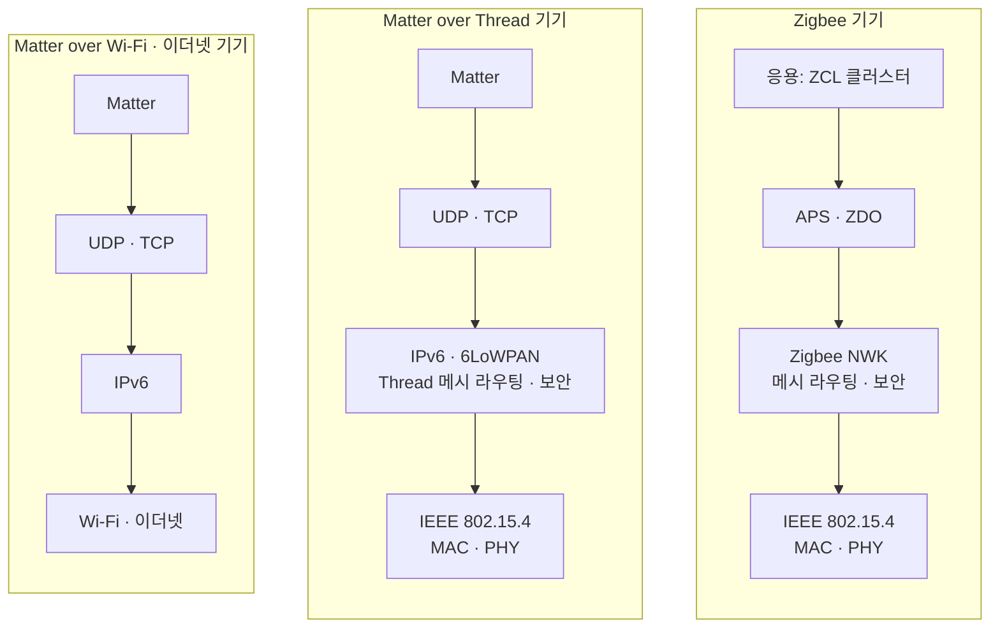
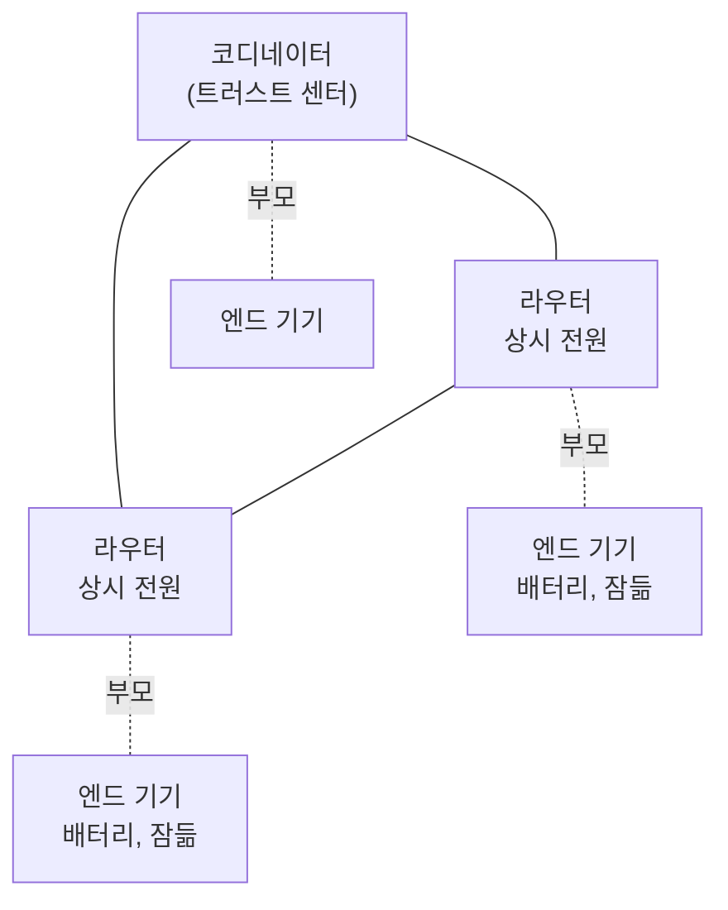
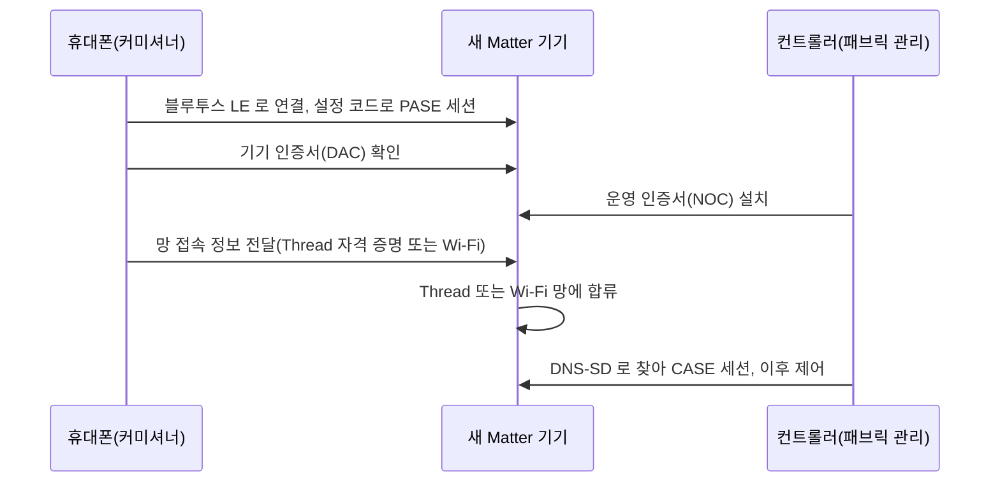

**Zigbee**, **Thread**, **Matter** 는 스마트홈 기기 상자에 나란히 찍혀 있어 서로 고르는 대상처럼 보이지만, 맡는 층이 다릅니다. Zigbee 는 **IEEE 802.15.4** 라디오 위에 네트워크 층부터 응용 층까지 모두 정의한 전체 스택입니다. Thread 는 같은 802.15.4 라디오 위에서 IPv6 메시 네트워크 층만 정의합니다. Matter 는 IP 위에서 동작하는 응용 층이라 Thread, Wi-Fi, 이더넷 어느 망 위에서도 돌아갑니다. 그래서 Zigbee 와 Matter 는 "기기 기능을 어떻게 표현하느냐" 에서 비교할 수 있지만, Thread 와 Matter 는 비교 대상이 아니라 Matter over Thread 처럼 겹쳐 쓰는 조합입니다.

- **기준:** CSA Zigbee Specification Revision 23(문서 05-3474-23, 2023-03-15), ZigBee Alliance "ZigBee and Wireless Radio Frequency Coexistence"(2007), Thread Group "Thread Border Router White Paper"(2022-07, Thread 1.3.0), openthread.io Thread Primer, RFC 4944(6LoWPAN), project-chip/connectedhomeip README(Matter 아키텍처 개요), Google Home Developers Matter Primer, Home Assistant 문서(Matter, Thread, ZHA), Zigbee2MQTT 문서

## 왜 구분해야 하는가

세 이름을 같은 층의 규격으로 보면 필요한 장비와 소프트웨어를 잘못 고르게 됩니다. 층이 다르므로 각자 요구하는 것도 다릅니다.

- Zigbee 기기: Zigbee 망을 만드는 **코디네이터**와, Zigbee 메시지를 해석해 다른 시스템에 넘기는 소프트웨어가 필요함. Zigbee 는 IP 를 쓰지 않아 LAN 의 서버나 휴대폰이 기기에 직접 닿을 수 없음
- Thread 기기: IPv6 로 통신하지만 802.15.4 라디오만 가지므로, Thread 망과 LAN 을 잇는 **보더 라우터**가 필요함
- Matter 기기: 기기를 등록하고 제어하는 Matter 컨트롤러가 필요함. Matter over Thread 기기라면 보더 라우터도 함께 필요함

Thread Group 의 보더 라우터 백서는 이 차이를 층의 결합으로 설명합니다. Zigbee 는 메시지를 보내는 방법(네트워크 층)과 메시지의 뜻(응용 층)이 강하게 묶여 있어 제조사 사이에 허브를 표준화하기 어려웠고, 한 집에 제조사마다 다른 Zigbee 망과 허브가 따로 생기기도 했습니다. Thread 는 네트워크 층만 맡고 그 위에 어떤 IP 응용이든 올릴 수 있게 해, 여러 응용이 한 Thread 망을 함께 쓰고 보더 라우터를 제조사와 무관하게 표준화할 수 있게 했습니다. Matter 는 그 위에 올라가는 응용 층 가운데 하나로, Thread·Wi-Fi·이더넷 기기가 같은 방식으로 기기 기능을 주고받게 합니다.

## 핵심 용어

| 용어 | 뜻 |
| :--- | :--- |
| IEEE 802.15.4 | 저속 저전력 무선 망의 물리 층(PHY)과 MAC 층을 정한 IEEE 표준. Zigbee 와 Thread 가 모두 이 위에서 동작함 |
| 6LoWPAN | IPv6 패킷을 802.15.4 프레임에 담기 위한 헤더 압축과 전송 방식(RFC 4944 등) |
| 코디네이터 | Zigbee 망을 만들고 채널, PAN ID, 보안 방식을 정하는 기기. 망에 하나뿐임 |
| 라우터(Zigbee) | 다른 기기의 메시지를 중계하고 새 기기의 합류를 받는 기기. 잠들지 않음 |
| 엔드 기기 | 중계하지 않고 부모 하나(코디네이터나 라우터)에만 붙는 기기. 잠들 수 있음 |
| 트러스트 센터 | Zigbee 망에서 키를 나눠 주는 기기. 중앙 집중 보안 망에서는 코디네이터와 같은 기기에 있음 |
| PAN ID | 802.15.4 프레임에 실리는 16비트 망 식별자 |
| Extended PAN ID | 망을 구별하는 64비트 식별자 |
| 네트워크 키 | 망 안의 프레임을 암호화하는 128비트 대칭 키 |
| 채널 | 802.15.4 가 2.4GHz 대역을 5MHz 간격으로 나눈 16개 채널. 번호는 11~26 |
| IEEE 주소 | 기기마다 고정된 64비트 주소(EUI-64). 명세는 긴 주소(long address)라고도 부름 |
| 짧은 주소 | 망에 합류할 때 부모가 정해 주는 16비트 네트워크 주소. 바뀔 수 있음 |
| LQI | 받은 프레임의 링크 품질을 0~255 로 나타낸 값(Link Quality Indicator) |
| permit join | 새 기기의 합류를 일정 시간 동안만 허용하는 상태 |
| 보더 라우터 | Thread 망과 Wi-Fi·이더넷 같은 다른 IP 망 사이에서 패킷을 중계하는 기기 |
| 커미셔닝 | Matter 기기에 패브릭의 자격 증명과 망 접속 정보를 주어 패브릭에 넣는 과정 |
| PASE | 설정 비밀번호로 커미셔너와 새 기기 사이에 여는 암호화 세션(Passcode Authenticated Session Establishment) |
| 기기 인증서(DAC) | 제조사가 기기에 넣어 둔, 인증된 제품임을 증명하는 인증서(Device Attestation Certificate) |
| 운영 인증서(NOC) | 커미셔닝 때 패브릭이 발급해 설치하는, 패브릭 안에서 신원을 증명하는 인증서(Node Operational Certificate) |
| CASE | 운영 인증서로 패브릭 안의 노드끼리 여는 암호화 세션(Certificate Authenticated Session Establishment) |
| 패브릭 | 같은 신뢰 루트(root of trust)를 공유해 서로 안전하게 통신하는 Matter 노드의 집합 |
| 노드 ID | 패브릭 안에서 노드 하나를 가리키는 64비트 번호 |
| 멀티 어드민 | 한 Matter 기기를 여러 패브릭(여러 컨트롤러)에 동시에 넣는 기능 |

## 세 가지가 놓인 층

1. **Zigbee:** Zigbee 명세는 IEEE 802.15.4 가 정한 PHY 와 MAC 위에 네트워크 층(NWK)과 응용 층의 틀(응용 지원 부층 APS, Zigbee 기기 객체 ZDO)을 정의합니다. 기기 기능(온도, 켜짐·꺼짐 등)을 속성과 명령으로 표현하는 공통 정의는 클러스터 라이브러리(ZCL)가 맡습니다. 라디오부터 기기 기능까지 한 계열의 명세가 모두 정하므로 Zigbee 기기끼리는 IP 없이 통신합니다.
2. **Thread:** 같은 802.15.4 라디오 위에서 6LoWPAN 으로 IPv6 패킷을 싣고, 메시 라우팅과 보안을 더해 IPv6 망을 만듭니다. openthread.io 는 Thread 를 "802.15.4 무선 메시 망에서 동작하는 IPv6 기반 네트워크 프로토콜" 로 소개합니다. 기기 기능을 표현하는 응용 층은 정의하지 않습니다.
3. **Matter:** connectedhomeip 문서는 Matter 를 IP 위에 세운 응용 층 표준으로 설명하고, 응용·데이터 모델·상호작용 모델·보안·메시지 층을 정의한 뒤 아래 IP 전송에 넘긴다고 정리합니다. 자기 라디오가 없고 Thread, Wi-Fi, 이더넷 위에서 동작합니다. 블루투스 LE 는 처음 등록(커미셔닝)할 때 쓰고 제어에는 쓰지 않습니다.

Zigbee 와 Thread 는 같은 802.15.4 라디오와 같은 2.4GHz 채널을 쓰므로, 한 집에서 함께 쓰면 두 망의 채널을 떼어 두어야 합니다.

## Zigbee 망의 구성

역할은 세 가지입니다.

- **코디네이터:** 명세상 802.15.4 의 PAN 코디네이터. 망을 만들 때 채널, PAN ID, Extended PAN ID, 보안 방식을 정함. 중앙 집중 보안 망에서는 트러스트 센터가 코디네이터와 같은 기기에 있어야 함
- **라우터:** 메시지를 중계하고 새 기기의 합류를 받으며, 자식 기기에 온 메시지를 대신 보관함. 잠들 수 없어 상시 전원 기기가 맡음
- **엔드 기기:** 중계하지 않고 부모 하나에만 붙음. 잠들 수 있어 배터리 기기에 맞음

엔드 기기가 잠든 동안 온 메시지는 부모가 들고 있다가, 엔드 기기가 깨어나 부모에게 물어볼(poll) 때 넘겨줍니다. 명세는 쉴 때 수신기를 꺼 두는 엔드 기기가 정해진 주기로 부모에게 물어보도록 정합니다. 그래서 배터리 기기는 부모의 중계에 기대고, 상시 전원 라우터가 늘어날수록 메시가 넓어집니다.

망과 기기를 가리키는 값은 다음과 같습니다.

| 값 | 크기 | 알아야 할 것 |
| :--- | :--- | :--- |
| PAN ID | 16비트 | 프레임마다 실리는 짧은 망 식별자 |
| Extended PAN ID | 64비트 | 망을 구별하는 긴 식별자. 합류한 기기는 비휘발성 저장소에 보관함 |
| 네트워크 키 | 128비트 | 트러스트 센터가 합류한 기기에 전달함. 바꾸면 모든 기기를 다시 페어링해야 함(Zigbee2MQTT 문서) |
| 채널 | 11~26 중 하나 | 2.4GHz 16개 채널, 5MHz 간격. Wi-Fi 와 대역이 겹침 |
| IEEE 주소 | 64비트 | 기기 고유의 고정 주소. 기기를 가리키는 기준 |
| 짧은 주소 | 16비트 | 합류할 때 부모가 무작위로 골라 줌. 다시 합류하거나 주소 충돌을 해결할 때 바뀔 수 있음 |
| LQI | 0~255 | 받은 프레임의 링크 품질. 명세는 경로와 부모를 고를 때 링크 품질 평가값을 쓰도록 정함 |

채널은 Wi-Fi 와 같은 2.4GHz 대역에 있어 서로 간섭합니다. ZigBee Alliance 의 공존 백서는 802.15.4 채널 가운데 적어도 15번과 20번이 흔히 쓰는 Wi-Fi 1·6·11번 채널 사이에 들어간다고 설명하고, Zigbee2MQTT 문서는 문제를 피하려면 11, 15, 20, 25번(ZLL 채널) 가운데 고르라고 권합니다. 채널을 바꾸면 일부 기기를 다시 페어링해야 할 수 있으므로 처음에 정해 두는 편이 좋습니다. Zigbee 명세는 868/915MHz 대역도 정의하지만 이 글은 2.4GHz 만 다룹니다.

새 기기는 **permit join** 이 켜진 동안에만 망에 들어옵니다. 명세는 허용 시간을 초 단위로 주고 최대 254초(0xFE)로 정하며, 더 길게 열어 두려면 요청을 다시 보내게 합니다. 기기가 합류하면 부모가 짧은 주소를 주고, 트러스트 센터가 네트워크 키를 전달합니다. Zigbee2MQTT 는 그 뒤 기기의 정보를 읽어 모델을 알아내는 인터뷰를 거쳐 페어링을 마칩니다. 합류를 받을 라우터를 골라 열 수도 있어, 특정 라우터 근처의 기기를 그 라우터에 붙일 때 씁니다.

Zigbee 는 IP 를 쓰지 않으므로, 서버나 Home Assistant 가 Zigbee 기기와 주고받으려면 코디네이터로 Zigbee 메시지를 보내고 받아 MQTT 메시지나 Home Assistant 엔티티로 옮겨 주는 브리지 소프트웨어(Zigbee2MQTT, ZHA)가 필요합니다. MQTT 는 [MQTT의 동작 원리](/posts/80/), 엔티티는 [Home Assistant의 통합·기기·엔티티·영역 구조란 무엇인가](/posts/78/), 이 소프트웨어를 기기가 있는 지역에 두어 인터넷 없이도 제어가 이어지게 하는 설계는 [허브-엣지 구조와 지역 자립(오프라인 우선) 설계란 무엇인가](/posts/62/)에서 다룹니다.

## Thread 망의 구성

Thread 도 메시를 이루지만 Zigbee 의 코디네이터 같은 고정된 중심이 없습니다.

- **라우터:** 패킷을 중계하고 새 기기의 합류를 도움. 최근 openthread.io 문서와 Thread Group 백서는 Mesh Extender 라고 부름. 한 망에 최대 32대
- **엔드 기기:** 부모 라우터 하나에 붙어 통신함. 라우터 하나에 최대 511대. 라우터가 될 수 있는 기기(REED)는 필요에 따라 라우터로 올라가고, 잠드는 엔드 기기(SED)는 가끔 깨어나 부모에게 메시지를 물어봄
- **리더:** 망의 라우터 집합을 관리하는 라우터. 망(파티션)마다 하나이고 스스로 선출되므로 고장 나면 다른 라우터가 이어받음. 새 망을 만든 기기가 첫 리더가 됨
- **보더 라우터:** Thread 망과 다른 IP 망 사이에서 패킷을 중계함. 한 망에 여러 대를 둘 수 있음

Thread 망도 PAN ID(2바이트), Extended PAN ID(8바이트), 네트워크 이름, 네트워크 키, 채널로 식별되고, 이 값들은 운영 데이터셋 하나로 묶여 저장됩니다. 보더 라우터가 LAN 과 망을 잇는 방법, 데이터셋이 저장되는 곳, 라디오(RCP)와 스택의 분리는 [Thread 보더 라우터와 RCP의 동작 원리](/posts/83/)에서 다룹니다.

## Matter 의 구성

Matter 는 망을 만들지 않고, 이미 있는 IP 망 위에서 기기를 등록하고 제어하는 방법을 정합니다.

**커미셔닝**은 새 기기를 패브릭에 넣는 과정입니다. 커미셔너(휴대폰, 허브 등)는 기기에 붙은 QR 코드나 숫자 설정 코드에 담긴 설정 비밀번호(passcode)로 **PASE** 세션을 열고, **기기 인증서(DAC)**로 인증된 제품인지 확인한 뒤, 패브릭에서 쓸 **운영 인증서(NOC)**를 설치합니다. Thread·Wi-Fi 기기에는 망 접속 정보도 이때 넘깁니다. Home Assistant 문서는 휴대폰을 기기 가까이 두면 컨트롤러가 블루투스로 망 자격 증명을 보내고, 그 뒤로 기기는 Wi-Fi 나 Thread 로만 통신한다고 설명합니다. 마지막으로 컨트롤러가 DNS-SD 로 운영 망에서 기기를 찾아 운영 인증서 기반의 **CASE** 세션을 엽니다.

**패브릭**은 같은 신뢰 루트를 공유하는 노드의 집합입니다. 보통 컨트롤러를 운영하는 생태계(Home Assistant, Google Home, Apple Home 등)가 신뢰 루트 인증 기관 역할을 하고, 그 인증 기관이 발급한 운영 인증서를 가진 노드끼리만 서로 통신합니다. Home Assistant 문서는 컨트롤러마다 자기 패브릭을 가진다고 설명합니다. Thread Group 백서는 IPv6 메시지가 Thread, Wi-Fi, 이더넷 같은 여러 물리 망을 가로질러 엮이므로 패브릭(직물)이라는 이름이 붙었다고 설명합니다.

**노드 ID**는 패브릭 안에서 노드 하나를 가리키는 64비트 번호이고, 패브릭 자체는 인증 기관 안에서 64비트 패브릭 ID 로 구별됩니다. 통신은 IPv6 주소로 하지만, 제어할 대상을 가리키는 기준은 패브릭과 노드 ID 입니다.

**멀티 어드민**(multi-fabric)은 한 기기를 여러 패브릭에 동시에 넣는 기능입니다. 기기는 패브릭마다 운영 자격 증명을 따로 가지므로, 같은 기기를 Home Assistant 와 다른 생태계의 앱에서 함께 제어할 수 있습니다. Home Assistant 문서는 명세상 기기가 적어도 5개의 패브릭을 동시에 지원해야 한다고 설명합니다. 이미 다른 컨트롤러에 등록된 기기는 초기화하지 않고, 그 컨트롤러가 만든 공유 코드를 새 컨트롤러에 입력해 새 패브릭에 추가합니다.

## 비교

| 구분 | Zigbee | Thread | Matter |
| :--- | :--- | :--- | :--- |
| 정의하는 층 | 802.15.4 위의 네트워크 층부터 응용 층까지 | 802.15.4 위의 IPv6 메시 네트워크 층 | IP 위의 응용 층 |
| 라디오 | 802.15.4 (2.4GHz, 868/915MHz) | 802.15.4 (2.4GHz) | 자기 라디오 없음. Thread, Wi-Fi, 이더넷 위에서 동작하고 커미셔닝에 블루투스 LE 를 씀 |
| 주소 | 64비트 IEEE 주소와 16비트 짧은 주소 | IPv6 주소 | 통신은 IPv6, 대상은 패브릭 안의 64비트 노드 ID |
| 기기 기능 정의 | 클러스터 라이브러리(ZCL) | 정의하지 않음 | Matter 데이터 모델 |
| 중심 역할 | 망마다 코디네이터 하나(트러스트 센터) | 고정된 중심 없음. 리더는 자동 선출 | 패브릭마다 신뢰 루트와 컨트롤러 |
| 합류 방식 | permit join 동안 합류, 트러스트 센터가 네트워크 키 전달 | 네트워크 키 등 망 자격 증명을 받아 합류 | 커미셔닝(설정 코드, 기기 인증, 운영 인증서) |
| LAN 과 잇는 것 | 코디네이터와 브리지 소프트웨어 | 보더 라우터(여러 대 가능) | Wi-Fi·이더넷 기기는 필요 없음. Thread 기기는 보더 라우터 |
| 여러 제어 주체 | 망 하나를 코디네이터 하나가 관리 | 여러 응용이 한 망을 함께 씀 | 멀티 어드민으로 여러 패브릭에 동시 등록 |

## 흔한 오해

Thread 와 Matter 는 서로 경쟁하는 규격이다

- **실제:** Thread 는 네트워크 층, Matter 는 그 위의 응용 층이라 함께 씁니다. Matter over Thread 기기는 Thread 망으로 IPv6 패킷을 주고받고, 그 안의 내용은 Matter 가 정합니다. 같은 Thread 망을 Matter 가 아닌 다른 IP 응용도 함께 쓸 수 있습니다.
- **근거:** Thread Group 보더 라우터 백서 4.1절(네트워크 층과 응용 층), 5절(Thread 와 Matter)

Thread 보더 라우터가 곧 Matter 허브다

- **실제:** 보더 라우터는 Thread 망과 LAN 사이에서 패킷을 중계할 뿐, 기기를 등록하고 제어하는 Matter 컨트롤러와는 별개입니다. 한 기기에 둘이 함께 들어 있을 수는 있지만 같은 역할이 아닙니다. Home Assistant 문서는 다른 제조사의 보더 라우터를 거쳐도 컨트롤러와 기기 사이의 통신은 암호화되어 보더 라우터가 내용을 읽을 수 없다고 설명합니다.
- **근거:** Thread Group 보더 라우터 백서 5절, Home Assistant Matter 문서

Zigbee 기기는 Matter 컨트롤러에서 쓸 수 없다

- **실제:** Zigbee 기기 자체는 Matter 를 말하지 않지만, Matter 브리지가 Zigbee 같은 다른 프로토콜의 기기를 Matter 기기로 대신 노출할 수 있습니다. 이때 Matter 컨트롤러가 보는 것은 브리지이고, Zigbee 망은 브리지 뒤에 그대로 남습니다.
- **근거:** Thread Group 보더 라우터 백서 5절 그림(Matter Bridge), Home Assistant Matter 문서(Matter 브리지)

Zigbee 기기는 짧은 주소로 가리키면 된다

- **실제:** 16비트 짧은 주소는 합류할 때 부모가 무작위로 골라 주는 값이라, 기기가 다시 합류하거나 주소 충돌이 해결될 때 바뀔 수 있습니다. 기기를 오래 가리킬 기준은 64비트 IEEE 주소입니다.
- **근거:** Zigbee Specification R23 3.6.1.10(주소 충돌과 해결), 2.4.2.1(64비트 IEEE 주소와 16비트 네트워크 주소로 기기 찾기)

## 정리

> - Zigbee 는 802.15.4 위의 전체 스택, Thread 는 802.15.4 위의 IPv6 메시 네트워크 층, Matter 는 IP 위의 응용 층입니다. Thread 와 Matter 는 겹쳐 쓰는 조합입니다.
> - Zigbee 망은 코디네이터 하나가 채널·PAN ID·Extended PAN ID·네트워크 키를 정하고, 라우터가 중계하며, 잠드는 엔드 기기는 부모에게 메시지를 물어봅니다. 기기는 64비트 IEEE 주소로 가리킵니다.
> - Zigbee 와 Thread 는 같은 2.4GHz 채널 11~26 을 쓰고 Wi-Fi 와도 겹치므로 채널을 떼어 둡니다.
> - Matter 기기는 커미셔닝으로 패브릭에 들어가고, 패브릭 안에서 노드 ID 로 불리며, 멀티 어드민으로 여러 컨트롤러에 함께 등록됩니다.
{: .prompt-tip }

## 참고 자료

- [Connectivity Standards Alliance - Zigbee Specification Revision 23 (05-3474-23)](https://csa-iot.org/wp-content/uploads/2023/04/05-3474-23-csg-zigbee-specification-compressed.pdf)
- [Connectivity Standards Alliance - Zigbee](https://csa-iot.org/all-solutions/zigbee/)
- [Connectivity Standards Alliance - Matter](https://csa-iot.org/all-solutions/matter/)
- [project-chip/connectedhomeip - What is Matter? / Architecture Overview](https://github.com/project-chip/connectedhomeip)
- [Thread Group - Thread Border Router White Paper (July 2022)](https://www.threadgroup.org/Portals/0/documents/support/ThreadBorderRouterWhitePaper_07192022_4001_1.pdf)
- [OpenThread - Thread Primer](https://openthread.io/guides/thread-primer)
- [OpenThread - Node Roles and Types](https://openthread.io/guides/thread-primer/node-roles-and-types)
- [OpenThread - Network Discovery and Formation](https://openthread.io/guides/thread-primer/network-discovery)
- [RFC 4944 - Transmission of IPv6 Packets over IEEE 802.15.4 Networks](https://www.rfc-editor.org/rfc/rfc4944)
- [ZigBee Alliance - ZigBee and Wireless Radio Frequency Coexistence (2007)](https://www.trane.com/content/dam/Trane/Commercial/global/controls/building-mgmt/Air-Fi/ZigBee%20Wireless%20Whitepaper.pdf)
- [Google Home Developers - Matter Primer: Fabric](https://developers.home.google.com/matter/primer/fabric)
- [Google Home Developers - Matter Primer: Commissioning](https://developers.home.google.com/matter/primer/commissioning)
- [Home Assistant - Matter](https://www.home-assistant.io/integrations/matter/)
- [Home Assistant - Thread](https://www.home-assistant.io/integrations/thread/)
- [Home Assistant - Zigbee Home Automation](https://www.home-assistant.io/integrations/zha/)
- [Zigbee2MQTT - Zigbee network](https://www.zigbee2mqtt.io/advanced/zigbee/01_zigbee_network.html)
- [Zigbee2MQTT - Zigbee network settings](https://www.zigbee2mqtt.io/guide/configuration/zigbee-network.html)
- [Zigbee2MQTT - Pairing devices](https://www.zigbee2mqtt.io/guide/usage/pairing_devices.html)
