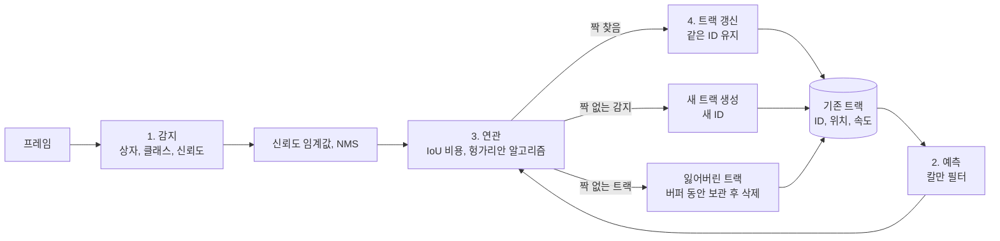
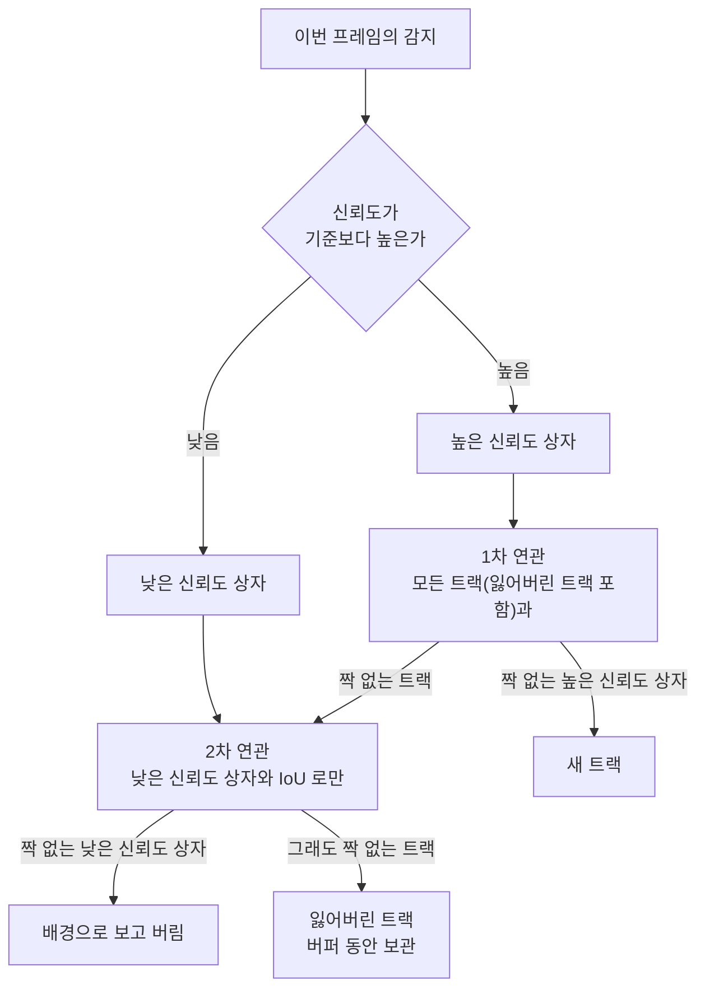

**객체 감지**(object detection)는 이미지 한 장에서 무엇이 어디에 있는지 찾는 일입니다. 결과는 대상마다 클래스, 경계 상자, 신뢰도 세 가지이고, 프레임과 프레임 사이의 관계는 모릅니다. **다중 객체 추적**(Multi-Object Tracking, MOT)은 영상의 여러 프레임에 걸쳐 같은 대상에 같은 ID 를 이어 붙이는 일입니다. 감지가 "이 프레임에 사람이 둘 있다" 를 알려 준다면, 추적은 "앞 프레임의 1번 사람이 이번 프레임의 이 상자다" 를 알려 줍니다.

- **기준:** Bewley 외 "Simple Online and Realtime Tracking"(SORT, ICIP 2016), Zhang 외 "ByteTrack: Multi-Object Tracking by Associating Every Detection Box"(ECCV 2022), Milan 외 "MOT16: A Benchmark for Multi-Object Tracking"(평가 지표 정의), Ultralytics 공식 문서(Predict, Track 모드)와 `ultralytics/trackers/byte_tracker.py` 소스

## 왜 필요한가

감지만으로는 프레임마다 상자 목록이 새로 나올 뿐, 목록의 순서나 개수가 앞 프레임과 이어진다는 보장이 없습니다. 그래서 다음과 같은 질문에 답할 수 없습니다.

- 지금 보이는 사람이 방금 전의 그 사람인가
- 한 사람이 얼마나 오래 머물렀고, 어디서 어디로 얼마나 빨리 움직였는가
- 한 사람이 잠깐 가려졌다 다시 나타났을 때 새로 들어온 사람인가, 원래 있던 사람인가

추적은 감지 결과를 시간 축으로 묶어 대상마다 한 줄의 궤적(트랙)을 만듭니다. 궤적이 있어야 머문 시간, 이동 경로, 속도처럼 시간에 걸친 값을 대상별로 구할 수 있습니다. Ultralytics 문서도 추적 ID 는 이미지 한 장으로는 만들 수 없고 연속된 프레임에 걸친 추적기 상태가 있어야 한다고 설명합니다. 추적한 상자의 화면 좌표를 방 바닥의 미터 좌표로 바꾸는 방법은 [호모그래피로 카메라 화면 좌표를 바닥 좌표로 바꾸는 원리](/posts/81/)에서 다룹니다.

## 핵심 용어

| 용어 | 뜻 |
| :--- | :--- |
| 객체 감지 | 한 프레임에서 대상의 클래스, 경계 상자, 신뢰도를 내는 일입니다. 프레임 사이 ID 는 없습니다. |
| 다중 객체 추적(MOT) | 여러 프레임에 걸쳐 같은 대상에 같은 ID 를 이어 붙여 대상별 궤적을 만드는 일입니다. |
| 경계 상자(bounding box) | 대상을 둘러싼 직사각형입니다. 보통 왼쪽 위와 오른쪽 아래 좌표로 나타냅니다. |
| 신뢰도(confidence, score) | 감지기가 그 상자가 해당 클래스라고 확신하는 정도로, 0 ~ 1 사이 값입니다. |
| 신뢰도 임계값 | 이 값보다 신뢰도가 낮은 감지를 버리는 기준입니다. |
| IoU(Intersection over Union) | 두 상자가 겹친 넓이를 두 상자를 합친 넓이로 나눈 값입니다. 0 이면 겹치지 않고 1 이면 완전히 같습니다. |
| NMS(Non-Maximum Suppression) | 한 대상에 겹쳐 나온 여러 상자 가운데 신뢰도가 가장 높은 것만 남기는 후처리입니다. |
| tracking-by-detection | 매 프레임 감지를 먼저 하고, 그 결과를 기존 트랙에 이어 붙이는 추적 방식입니다. |
| 트랙(track, tracklet) | 추적기가 한 대상에 대해 유지하는 ID, 위치, 속도 추정의 묶음입니다. |
| 칼만 필터 | 이전 위치와 속도로 다음 위치를 예측하고, 새 관측이 들어오면 예측을 보정하는 추정 방법입니다. |
| 연관(data association) | 이번 프레임의 감지와 기존 트랙을 짝짓는 일입니다. |
| 헝가리안 알고리즘 | 비용 행렬에서 전체 비용의 합이 가장 작도록 행과 열을 일대일로 짝짓는 알고리즘입니다. |
| 트랙 버퍼 | 짝을 찾지 못한 트랙을 지우지 않고 잃어버린 상태로 남겨 두는 프레임 수입니다. |
| ID 전환(ID switch) | 한 실제 대상에 붙은 추적 ID 가 도중에 다른 ID 로 바뀌는 오류입니다. |
| 단편화(fragmentation) | 한 대상의 궤적이 중간에 끊겼다가 나중에 다시 이어지는 것입니다. |

## 동작 방식

tracking-by-detection 추적기는 프레임마다 아래 순서를 되풀이합니다.



1. 감지기가 프레임에서 상자, 클래스, 신뢰도를 냅니다. 신뢰도 임계값 아래의 상자를 버리고, NMS 로 한 대상에 겹친 상자를 하나로 줄입니다.
2. 추적기는 기존 트랙마다 칼만 필터로 이번 프레임에서 상자가 있을 위치를 예측합니다.
3. 예측한 상자와 감지한 상자 사이의 IoU 로 비용 행렬을 만들고, 헝가리안 알고리즘으로 전체 비용이 가장 작은 짝을 고릅니다. 겹침이 너무 적은 짝은 버립니다.
4. 짝을 찾은 트랙은 감지 상자로 위치를 보정하고 ID 를 그대로 유지합니다. 짝이 없는 감지는 새 트랙(새 ID)이 되고, 짝이 없는 트랙은 잃어버린 상태로 두었다가 일정 프레임이 지나도 돌아오지 않으면 지웁니다.

감지기는 이 흐름에서 매 프레임 한 번 불리는 부품이고, ID 는 추적기가 가진 상태에서 나옵니다. Ultralytics 문서도 모델 가중치 파일(`.pt`)에는 감지 모델만 들어 있고 추적기는 추론할 때 만들어진다고 설명합니다.

## 감지 단계: 신뢰도 임계값, NMS, IoU

감지기는 한 대상 주위에 조금씩 다른 상자를 여러 개 내고, 배경에도 신뢰도가 낮은 상자를 냅니다. 이것을 정리하는 두 가지 기준이 신뢰도 임계값과 NMS 입니다.

- **신뢰도 임계값**: 임계값보다 신뢰도가 낮은 상자를 버립니다. 높이면 잘못된 감지가 줄지만 가려지거나 흐린 대상도 함께 버려집니다.
- **NMS**: 남은 상자를 신뢰도 순으로 정렬하고, 가장 높은 상자를 남긴 뒤 그 상자와 IoU 가 기준보다 큰 나머지 상자를 중복으로 보고 지웁니다. 이를 남은 상자가 없을 때까지 되풀이합니다. NMS 의 IoU 기준을 낮추면 조금만 겹쳐도 지우므로 상자 수가 줄어듭니다. 학습 단계에서 대상마다 상자 하나만 내도록 만들어 NMS 가 필요 없는 모델도 있습니다.

IoU 는 감지와 추적 양쪽에서 쓰이는 기본 척도입니다. 가로 4, 세로 4 인 상자 두 개가 가로로 2 만큼 어긋나 있으면 다음과 같습니다.

```text
상자 A: (0, 0) ~ (4, 4)   넓이 16
상자 B: (2, 0) ~ (6, 4)   넓이 16
겹친 넓이   = 2 × 4 = 8
합친 넓이   = 16 + 16 − 8 = 24
IoU        = 8 / 24 ≈ 0.33
```

## 단일 단계 감지기와 모델 크기

YOLO 계열은 **단일 단계 감지기**입니다. 후보 영역을 먼저 뽑고 영역마다 다시 분류하는 방식과 달리, 신경망 하나가 이미지 전체를 한 번 보고 상자와 클래스 확률을 곧바로 냅니다. 원 논문은 이 방식이 매우 빠르고, 당시 최고 성능 감지기보다 위치 오차는 많지만 배경을 대상으로 잘못 감지하는 일은 적다고 설명합니다. 같은 세대의 모델은 보통 n, s, m, l, x 처럼 크기별로 나오며, Ultralytics 공식 문서의 성능 표를 보면 크기가 커질수록 정확도(mAP)는 오르고 추론 시간은 길어집니다. 한 프레임을 처리하는 시간이 곧 초당 처리할 수 있는 프레임 수의 상한이므로, 작은 모델로 더 많은 프레임을 볼지 큰 모델로 더 정확히 볼지를 장비 성능에 맞춰 고릅니다.

## 예측과 연관: 칼만 필터와 헝가리안 알고리즘

SORT 는 트랙의 상태를 상자 중심 좌표, 넓이, 가로세로 비율과 그 변화 속도로 두고, 프레임 사이 움직임을 **등속 모델**로 근사합니다. 칼만 필터는 이 모델로 다음 프레임의 상자를 예측하고, 짝지어진 감지가 들어오면 그 감지로 예측을 보정합니다. 짝이 없으면 보정 없이 예측만 진행합니다.

연관 단계에서는 예측 상자와 감지 상자의 모든 조합에 대해 비용(보통 1 − IoU)을 계산하고, 헝가리안 알고리즘으로 비용 합이 가장 작은 일대일 짝을 찾습니다. SORT 는 여기에 최소 IoU 기준을 두어 겹침이 그보다 적은 짝은 거부합니다. 가장 겹치는 짝부터 차례로 고르는 방식과 결과가 달라지는 예시는 다음과 같습니다.

| IoU | 감지 D1 | 감지 D2 |
| :--- | :--- | :--- |
| 트랙 T1 | 0.7 | 0.6 |
| 트랙 T2 | 0.6 | 0.1 |

- 겹침이 큰 것부터 고르면 T1-D1(0.7)을 먼저 잡고 T2 에는 D2(0.1)만 남습니다. 최소 IoU 기준이 0.3 이라면 T2 는 짝을 잃습니다.
- 헝가리안 알고리즘은 전체를 보고 T1-D2(0.6), T2-D1(0.6)을 골라 두 트랙을 모두 이어 갑니다.

SORT 논문은 IoU 를 쓰면 짧은 가림도 어느 정도 견딘다고 설명합니다. 한 대상이 다른 대상 뒤로 가려지면 앞의 대상만 감지되는데, IoU 는 크기가 비슷한 상자를 선호하므로 앞의 대상 트랙만 보정되고 가려진 트랙에는 짝이 붙지 않기 때문입니다.

## 트랙의 생성·유지·삭제와 트랙 버퍼

- **생성**: 어떤 트랙과도 짝지어지지 않은 감지를 새 대상으로 보고 새 ID 로 트랙을 시작합니다. SORT 는 새 트랙이 한동안 감지와 계속 짝지어져야 인정하는 수습 기간을 두어 잘못된 감지가 트랙이 되는 것을 막습니다.
- **유지**: 짝을 찾은 트랙은 ID 를 유지한 채 위치와 속도를 보정합니다.
- **삭제**: 짝을 찾지 못한 트랙은 정해진 프레임 수 동안 돌아오지 않으면 지웁니다.

삭제까지 기다리는 프레임 수가 **트랙 버퍼**입니다. SORT 는 논문 실험에서 이 값을 1 로 두었습니다. 등속 모델이 오래 예측하기에는 부정확하고 재식별은 논문 범위 밖이라는 이유이며, 그래서 대상이 사라졌다 다시 나타나면 새 ID 가 붙는다고 밝힙니다. ByteTrack 은 잃어버린 트랙을 30 프레임 동안 남겨 두어, 그 안에 다시 나타난 대상에는 원래 ID 를 이어 붙입니다. 잃어버린 트랙의 상자는 결과로 내보내지 않습니다.

버퍼를 늘리면 가림을 더 오래 견디는 대신, 사라진 트랙의 예측 위치에 다른 대상이 들어와 엉뚱한 짝이 될 위험도 커집니다. Ultralytics 의 ByteTrack 설정 파일도 `track_buffer` 를 늘리면 가림에 강해지고 ID 전환 위험이 커진다고 적고 있습니다.

## SORT 에서 ByteTrack 으로

SORT 를 비롯한 많은 추적기는 신뢰도 임계값을 넘은 상자만 연관에 씁니다. ByteTrack 논문은 가려진 대상이 제대로 감지되고도 신뢰도가 낮게 나오는 경우가 많고, 이런 상자를 버리면 대상을 놓치고 궤적이 끊긴다는 점을 지적합니다. 그렇다고 낮은 신뢰도 상자를 모두 쓰면 배경의 잘못된 감지도 함께 들어옵니다. ByteTrack 은 이 둘을 기존 트랙과의 유사도로 가릅니다.



1. 감지를 신뢰도 기준으로 높은 상자와 낮은 상자로 나눕니다.
2. 1차 연관에서 높은 상자를 잃어버린 트랙까지 포함한 모든 트랙과 짝짓습니다.
3. 2차 연관에서 1차에 짝을 못 찾은 트랙을 낮은 상자와 짝짓습니다. 가려져 신뢰도가 떨어진 대상은 예측 위치와 많이 겹치므로 여기서 원래 트랙을 되찾습니다.
4. 2차에서도 짝이 없는 낮은 상자는 배경으로 보고 버립니다. 새 트랙은 1차에서 남은 높은 상자로만 만듭니다.

논문은 2차 연관에 외형 특징 없이 IoU 만 쓰는 것이 중요하다고 설명합니다. 낮은 신뢰도 상자는 심하게 가려지거나 흐려 외형 특징을 믿기 어렵기 때문입니다. 이 방법을 기존 추적기 9 종에 붙였을 때 IDF1 이 1 ~ 10 점 올랐다고 보고합니다.

## ID 전환, 단편화와 평가 지표

추적이 틀리는 방식은 크게 두 가지입니다.

- **ID 전환**: 한 실제 대상이 도중에 다른 트랙에 짝지어지는 것입니다. 두 사람이 엇갈려 지나가며 ID 가 서로 바뀌거나, 잠깐 사라진 사람이 새 ID 로 다시 나타나는 경우입니다.
- **단편화**: 한 대상의 궤적이 추적되다가 끊기고 나중에 다시 추적되는 것입니다. 감지를 놓친 프레임이 이어지면 생깁니다.

추적기를 비교할 때는 다음 지표를 많이 씁니다.

- **MOTA**: 놓친 대상(FN), 잘못된 감지(FP), ID 전환(IDSW)을 모두 더해 실제 대상 수로 나눈 값을 1 에서 뺍니다. FP 와 FN 이 대개 훨씬 많아 감지 성능의 영향을 크게 받습니다.
- **IDF1**: 대상마다 ID 를 얼마나 오래 올바르게 유지했는지를 봅니다. 연관 성능의 영향을 크게 받습니다.
- **HOTA**: 감지, 연관, 위치 정확도의 영향을 한 점수 안에서 균형 있게 보도록 만든 지표입니다.

```text
MOTA = 1 − Σ(FN + FP + IDSW) / Σ(실제 대상 수)    프레임마다 세어 더함
```

## 처리 프레임률과 추적 품질

추적기가 실제로 보는 프레임 수(처리 프레임률)는 카메라가 보내는 프레임 수와 다를 수 있습니다. 감지가 느리면 일부 프레임을 건너뛰기 때문입니다. 카메라가 영상을 보내는 방식은 [NVR과 RTSP 스트리밍의 동작 원리](/posts/79/)에서 다룹니다.

처리 프레임률이 낮으면 두 가지가 나빠집니다.

- **프레임 사이 이동이 커집니다.** 연관은 예측 상자와 감지 상자의 겹침에 기대므로, 한 번에 많이 움직이면 겹침이 줄어 짝을 놓치고 새 ID 가 붙기 쉽습니다. 저프레임률 추적을 다룬 연구도 인접 프레임 사이의 위치·외형 변화가 커지는 것을 기존 방법의 성능이 크게 떨어지는 원인으로 꼽습니다.
- **트랙 버퍼가 가리키는 시간이 바뀝니다.** Ultralytics 의 ByteTrack 구현은 처리한 프레임마다 프레임 번호를 하나씩 올리고, 잃어버린 뒤 지난 프레임 수가 `track_buffer` 를 넘으면 트랙을 지웁니다. 같은 30 프레임이라도 처리 프레임률에 따라 견디는 시간이 달라집니다.

가상의 수치로 보면 다음과 같습니다.

```text
폭 0.5 m 인 사람이 옆으로 1 m/s 로 걸을 때, 예측 없이 이전 상자와 비교하면

처리 10 fps: 프레임 사이 0.1 m 이동 → IoU = (0.5 − 0.1) / (0.5 + 0.1) ≈ 0.67
처리  2 fps: 프레임 사이 0.5 m 이동 → IoU = 0

track_buffer = 30 프레임일 때 잃어버린 트랙을 지우기까지
처리 30 fps → 1 초,  10 fps → 3 초,  2 fps → 15 초
```

칼만 필터 예측이 이동을 어느 정도 메워 주지만, 등속 가정에서 벗어난 움직임(방향 전환, 멈춤)은 프레임 간격이 길수록 크게 어긋납니다.

## 움직임 감지와 객체 감지의 차이

**움직임 감지**(motion detection)는 무엇이 움직였는지가 아니라 화면의 어느 픽셀이 바뀌었는지를 찾습니다. 대표적인 배경 차분은 고정된 카메라에서 현재 프레임과 배경 모델을 빼서 움직이는 물체의 픽셀을 전경으로 표시하고, 장면 변화에 맞춰 배경 모델을 계속 갱신합니다.

| 구분 | 움직임 감지 | 객체 감지 | 다중 객체 추적 |
| :--- | :--- | :--- | :--- |
| 찾는 것 | 바뀐 픽셀 영역 | 대상의 클래스와 상자 | 대상별 궤적과 ID |
| 필요한 프레임 | 현재 프레임과 배경 모델 | 한 프레임 | 연속된 프레임 |
| 움직이지 않는 사람 | 바뀐 픽셀이 없어 잡지 못함 | 보이기만 하면 잡음 | 감지가 이어지면 ID 유지 |
| 조명 변화, 흔들리는 커튼 | 움직임으로 잡힘 | 해당 클래스가 아니면 무시 | 감지에 따름 |
| 계산 비용 | 낮음 | 높음 | 감지 비용 + 연관 비용 |

움직임 감지는 계산이 가벼워 객체 감지를 돌릴지 정하는 1차 관문으로 자주 쓰입니다. Frigate 가 그런 예로, 움직임이 있는 영역을 묶어 그곳에 객체 감지를 돌립니다. 이 방식은 움직임이 있는 곳을 중심으로 감지하므로 자거나 앉아서 움직이지 않는 사람은 따로 다뤄야 하고, Frigate 도 추적 중인 대상이 멈추면 정해진 간격으로만 감지를 다시 돌리는 별도 설정을 둡니다. 움직임과 상관없이 모든 처리 프레임에 객체 감지를 돌리면 계산은 늘지만 멈춰 있는 사람도 매 프레임 감지됩니다.

## 흔한 오해

<details markdown="1">
<summary>감지 모델이 ID 까지 붙여 준다</summary>

- **실제:** 감지 모델은 프레임 하나에 대해 상자, 클래스, 신뢰도만 냅니다. ID 는 모델 밖의 추적기가 이전 프레임의 트랙 상태를 들고 있다가 연관으로 붙입니다. 같은 모델에 추적기만 바꿔 끼울 수 있는 것도 이 때문입니다.
- **근거:** Ultralytics Track 모드 문서(가중치 파일에는 감지 모델만 있고 추적기는 추론 시 생성, 추적 ID 에는 연속 프레임에 걸친 추적기 상태가 필요)

</details>

<details markdown="1">
<summary>신뢰도 임계값을 높이면 추적도 깔끔해진다</summary>

- **실제:** 잘못된 감지는 줄지만, 가려져 신뢰도가 떨어진 실제 대상도 함께 버려져 궤적이 끊기고 ID 가 바뀔 수 있습니다. ByteTrack 은 이런 낮은 신뢰도 상자를 버리지 않고 2차 연관에 써서 문제를 줄입니다.
- **근거:** ByteTrack 논문 초록과 3장

</details>

<details markdown="1">
<summary>트랙 버퍼를 길게 잡을수록 ID 가 잘 유지된다</summary>

- **실제:** 가림은 더 오래 견디지만, 사라진 트랙이 오래 남아 있으면 그 자리에 들어온 다른 대상과 잘못 짝지어져 ID 전환이 생길 수 있습니다. 버퍼는 프레임 수로 세는 구현이 많으므로 처리 프레임률을 바꾸면 버퍼가 뜻하는 시간도 함께 바뀝니다.
- **근거:** Ultralytics `bytetrack.yaml` 의 `track_buffer` 설명, `byte_tracker.py` 의 삭제 조건

</details>

<details markdown="1">
<summary>움직임 감지로도 방에 사람이 있는지 알 수 있다</summary>

- **실제:** 움직임 감지는 바뀐 픽셀만 찾으므로 움직이지 않는 사람은 잡지 못하고, 조명 변화처럼 사람이 아닌 변화는 잡습니다. 재실 여부처럼 멈춰 있는 사람까지 세야 하면 객체 감지가 필요합니다.
- **근거:** OpenCV 배경 차분 튜토리얼(움직이는 물체의 픽셀로 전경 마스크 생성), Frigate 움직임 감지 문서

</details>

## 정리

> - 객체 감지는 한 프레임에서 클래스·상자·신뢰도를 내고, 다중 객체 추적은 그 결과를 프레임 사이에 이어 대상마다 같은 ID 를 붙입니다.
> - tracking-by-detection 은 감지 → 칼만 필터 예측 → IoU 비용과 헝가리안 알고리즘으로 연관 → 트랙 생성·유지·삭제를 매 프레임 되풀이합니다.
> - ByteTrack 은 낮은 신뢰도 상자를 버리지 않고 남은 트랙과 2차로 연관해, 가려진 대상을 놓치지 않고 배경 상자는 걸러 냅니다.
> - 처리 프레임률이 낮으면 프레임 사이 이동이 커져 연관이 어려워지고, 프레임 수로 센 트랙 버퍼가 뜻하는 시간도 달라집니다.
> - 움직임 감지는 바뀐 픽셀을 찾을 뿐이라 움직이지 않는 사람은 잡지 못합니다.
{: .prompt-tip }

## 참고 자료

- [Bewley et al. - Simple Online and Realtime Tracking (arXiv:1602.00763)](https://arxiv.org/abs/1602.00763)
- [Zhang et al. - ByteTrack: Multi-Object Tracking by Associating Every Detection Box (arXiv:2110.06864)](https://arxiv.org/abs/2110.06864)
- [Milan et al. - MOT16: A Benchmark for Multi-Object Tracking (arXiv:1603.00831)](https://arxiv.org/abs/1603.00831)
- [Luiten et al. - HOTA: A Higher Order Metric for Evaluating Multi-Object Tracking (arXiv:2009.07736)](https://arxiv.org/abs/2009.07736)
- [Redmon et al. - You Only Look Once: Unified, Real-Time Object Detection (arXiv:1506.02640)](https://arxiv.org/abs/1506.02640)
- [Liu et al. - Collaborative Tracking Learning for Frame-Rate-Insensitive Multi-Object Tracking (arXiv:2308.05911)](https://arxiv.org/abs/2308.05911)
- [Ultralytics Docs - Multi-Object Tracking (Track mode)](https://docs.ultralytics.com/modes/track/)
- [Ultralytics Docs - Model Prediction (Predict mode)](https://docs.ultralytics.com/modes/predict/)
- [Ultralytics Docs - YOLO11](https://docs.ultralytics.com/models/yolo11/)
- [Ultralytics - byte_tracker.py](https://github.com/ultralytics/ultralytics/blob/main/ultralytics/trackers/byte_tracker.py)
- [Ultralytics - bytetrack.yaml](https://github.com/ultralytics/ultralytics/blob/main/ultralytics/cfg/trackers/bytetrack.yaml)
- [OpenCV - How to Use Background Subtraction Methods](https://docs.opencv.org/4.x/d1/dc5/tutorial_background_subtraction.html)
- [Frigate Docs - Motion Detection](https://docs.frigate.video/configuration/motion_detection/)
- [Frigate Docs - Stationary Objects](https://docs.frigate.video/configuration/stationary_objects/)
- [Ultralytics Glossary - Non-Maximum Suppression (NMS)](https://www.ultralytics.com/glossary/non-maximum-suppression-nms)
