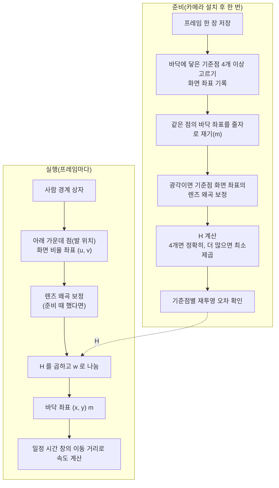

**호모그래피**(homography)는 한 평면 위의 점을 다른 평면 위의 점으로 옮기는 사영 변환으로, 3×3 행렬 하나로 나타냅니다. 고정된 카메라가 방 바닥을 비스듬히 내려다볼 때 화면(이미지 평면)과 바닥(방 평면)은 두 평면이므로, 바닥 위의 점은 호모그래피 하나로 화면 좌표에서 바닥의 미터 좌표로 바꿀 수 있습니다. 이 글은 그 변환이 어떻게 동작하고, 어떤 조건에서만 맞는지를 설명합니다.

- **기준:** Hartley & Zisserman "Multiple View Geometry in Computer Vision" 2판(2004)의 1장(공개 표본 장)과 저자들의 CVPR 1999 튜토리얼(2D 사영 변환과 DLT 추정 요약), OpenCV 4.x 문서(`findHomography`, `getPerspectiveTransform`, `perspectiveTransform`, `undistort`, `undistortPoints`, 카메라 모델, 호모그래피 튜토리얼)

## 왜 필요한가

카메라 화면의 픽셀 좌표는 방 안의 실제 위치를 곧바로 알려 주지 않습니다. 비스듬히 찍은 화면에서는 가까운 바닥이 크게, 먼 바닥이 작게 보이므로 화면에서 같은 픽셀만큼 움직여도 실제로 움직인 거리는 위치마다 다릅니다. 화면 좌표만으로는 "사람이 침대에서 몇 m 떨어져 있는가", "몇 m/s 로 걷는가" 같은 값을 구할 수 없습니다.

Hartley & Zisserman 은 평평한 물체를 찍은 사진에서 정사각형이 정사각형으로, 원이 원으로 보이지 않게 만드는 변환이 사영 변환이라고 설명합니다. 길이, 각도, 거리의 비는 보존되지 않고 직선만 직선으로 남습니다. 거꾸로 말하면, 바닥 위의 점 4개 이상에 대해 화면 좌표와 실제 바닥 좌표를 알면 이 변환을 구해 되돌릴 수 있고, 그러면 바닥 위의 어떤 점이든 미터 단위 좌표로 바꿀 수 있습니다. 카메라의 내부 값이나 설치 자세를 몰라도 됩니다.

## 핵심 용어

| 용어 | 뜻 |
| :--- | :--- |
| 호모그래피(사영 변환) | 한 평면의 점을 다른 평면의 점으로 옮기며 직선을 직선으로 보존하는 변환입니다. 3×3 행렬 `H` 로 나타냅니다. |
| 동차 좌표 | 2차원 점 `(x, y)` 를 `(x, y, 1)` 처럼 성분 하나를 더해 나타내고, `(kx, ky, k)` 를 모두 같은 점으로 보는 표기입니다. |
| 자유도 | 행렬에서 독립적으로 정할 수 있는 값의 개수입니다. 호모그래피는 9개 성분 가운데 배율을 뺀 8입니다. |
| 대응점(기준점) | 화면 좌표와 바닥 좌표를 둘 다 아는 점의 짝입니다. `H` 를 구하는 재료입니다. |
| DLT(Direct Linear Transform) | 대응점마다 나오는 선형 방정식을 쌓아 `H` 를 푸는 방법입니다. 점이 4개보다 많으면 최소제곱으로 풉니다. |
| 재투영 오차 | 기준점의 화면 좌표를 `H` 로 옮긴 결과와 실제로 잰 바닥 좌표 사이의 거리입니다. |
| 렌즈 왜곡 | 렌즈 때문에 직선이 휘어 보이는 현상입니다. 화면 가장자리로 갈수록 커지는 방사 왜곡이 대표적입니다. |
| 화면 비율 좌표 `(u, v)` | 픽셀 좌표를 화면 너비와 높이로 나눈 값입니다. 왼쪽 위가 `(0, 0)`, 오른쪽 아래가 `(1, 1)` 입니다. |
| 발 위치(바닥 접점) | 사람 경계 상자의 아래 가운데 점입니다. 사람이 바닥에 닿는 지점으로 봅니다. |

## 동작 방식

한 번 하는 준비와 프레임마다 하는 변환으로 나뉩니다.



1. 카메라를 고정한 뒤 프레임 한 장에서 방 모서리, 가구 다리, 문틀 아래처럼 바닥에 닿은 점을 고르고 화면 좌표를 적습니다.
2. 같은 점의 바닥 좌표를 방의 한 모서리를 원점으로 줄자로 잽니다.
3. 광각 렌즈라 직선이 휘어 보이면 기준점의 화면 좌표를 먼저 왜곡 보정합니다.
4. 대응점으로 `H` 를 구하고, 기준점마다 재투영 오차를 확인합니다.
5. 실행 중에는 감지·추적한 사람 상자의 아래 가운데 점을 같은 방식으로 보정하고 `H` 로 옮겨 바닥 좌표를 얻습니다. 사람 상자를 얻는 과정은 [객체 감지와 다중 객체 추적(MOT)의 차이](/posts/84/)에서 다룹니다.
6. 바닥 좌표의 시간에 따른 변화로 속도를 구합니다.

## 동차 좌표와 w 로 나누는 이유

호모그래피는 두 평면의 점을 다음 관계로 잇습니다.

```text
┌ X ┐   ┌ h11 h12 h13 ┐ ┌ u ┐
│ Y │ = │ h21 h22 h23 │ │ v │        x = X / w,   y = Y / w
└ w ┘   └ h31 h32 h33 ┘ └ 1 ┘
```

화면 점 `(u, v)` 에 1 을 붙여 `(u, v, 1)` 로 만들고 `H` 를 곱하면 세 성분 `(X, Y, w)` 가 나옵니다. 동차 좌표에서는 `(X, Y, w)` 와 `(X/w, Y/w, 1)` 이 같은 점이므로, 마지막 성분 `w` 로 나눠야 바닥의 실제 좌표 `(x, y)` 가 됩니다. OpenCV 의 `perspectiveTransform` 도 같은 계산을 합니다.

`w` 가 점마다 달라진다는 것이 핵심입니다. `H` 의 마지막 행이 `(0, 0, 1)` 이면 `w` 는 늘 1 이고 변환은 확대·회전·이동·기울임만 하는 아핀 변환이 됩니다. 마지막 행에 0 이 아닌 값이 있으면 화면 위치에 따라 나누는 값이 달라지고, 이것이 "멀리 있는 것은 작게 보인다" 는 원근을 되돌립니다.

같은 이유로 `H` 는 배율만 다른 행렬끼리 같은 변환입니다. `H` 전체에 2 를 곱해도 `X`, `Y`, `w` 가 모두 두 배가 되어 나눈 결과는 같습니다. 그래서 9개 성분 가운데 독립적인 값은 8개이고, 보통 `h33 = 1` 이 되도록 맞춰 둡니다.

가상의 예로, 폭 3 m, 깊이 4 m 인 바닥 직사각형의 네 모서리가 화면에서 사다리꼴로 보인다고 하겠습니다.

| 기준점 | 화면 (u, v) | 바닥 (x, y) m |
| :--- | :--- | :--- |
| 가까운 왼쪽 | (0.1, 0.9) | (0, 0) |
| 가까운 오른쪽 | (0.9, 0.9) | (3, 0) |
| 먼 오른쪽 | (0.7, 0.4) | (3, 4) |
| 먼 왼쪽 | (0.3, 0.4) | (0, 4) |

이 네 쌍으로 구한 `H` 와, 화면 가운데 `(0.5, 0.65)` 에 있는 발 위치를 옮기는 계산은 다음과 같습니다.

```text
    ┌ 37.5   15.0  −17.25 ┐
H = │  0.0  −40.0   36.0  │
    └  0.0   10.0    1.0  ┘

(u, v) = (0.5, 0.65)
X = 37.5×0.5 + 15.0×0.65 − 17.25 = 11.25
Y =  0.0×0.5 − 40.0×0.65 + 36.0  = 10.0
w =  0.0×0.5 + 10.0×0.65 +  1.0  =  7.5

(x, y) = (11.25 / 7.5, 10.0 / 7.5) = (1.5, 1.33) m
```

화면에서는 가까운 변(`v = 0.9`)과 먼 변(`v = 0.4`)의 딱 중간이지만, 바닥에서는 깊이 4 m 의 중간인 2 m 가 아니라 1.33 m 입니다. 먼 바닥이 화면에서 더 좁게 눌려 보이기 때문이고, `w` 로 나누는 단계가 이것을 바로잡습니다.

## 바닥 평면 위의 점에만 맞는 이유

호모그래피는 평면과 평면 사이의 변환입니다. 카메라에서 나간 광선 하나는 화면의 한 점을 지나 바닥의 한 점과 만나는데, `H` 는 화면 점을 "그 광선이 바닥과 만나는 점" 으로 옮깁니다. 바닥 위에 있는 점이면 그 교점이 곧 실제 위치입니다.

바닥 위에 있지 않은 점은 다릅니다. 사람의 머리를 지나는 광선은 머리를 지나 더 뒤쪽 바닥에 닿으므로, 머리의 화면 좌표를 `H` 로 옮기면 사람이 실제보다 카메라에서 먼 곳에 있는 것으로 나옵니다. 위 예에서 발이 `(0.5, 0.65)` 인 사람의 머리가 화면 `(0.5, 0.45)` 에 보인다면 다음과 같습니다.

```text
발   (0.5, 0.65) → (1.5, 1.33) m
머리 (0.5, 0.45) → (1.5, 3.27) m    같은 사람인데 약 2 m 뒤로 계산됨
```

그래서 사람 위치는 상자 중심이 아니라 **상자 아래 가운데**, 즉 발이 바닥에 닿는 점을 씁니다. 같은 이유로 다음 경우에는 계산값이 실제 위치와 어긋납니다.

- 침대에 누운 사람, 의자에 앉은 사람처럼 상자 아래가 바닥이 아니라 가구 위에 있는 경우
- 가구나 화면 가장자리에 발이 가려 상자 아래가 발이 아닌 다른 부위에서 끝나는 경우
- 바닥이 한 평면이 아닌 경우(단차, 계단)

기준점도 마찬가지로 모두 바닥에 닿은 점이어야 합니다. 책상 위 모서리처럼 높이가 있는 점을 섞으면 `H` 자체가 틀어집니다.

## 대응점 4개가 최소인 이유와 최소제곱

`H` 의 자유도는 8 입니다. 대응점 하나는 `x` 와 `y` 두 개의 식을 주므로, 8 개를 정하려면 대응점이 최소 4 개 필요합니다.

```text
x = (h11·u + h12·v + h13) / (h31·u + h32·v + h33)
y = (h21·u + h22·v + h23) / (h31·u + h32·v + h33)

분모를 곱해 넘기면 h 에 대한 선형 방정식 두 개가 됨
x·(h31·u + h32·v + h33) = h11·u + h12·v + h13
y·(h31·u + h32·v + h33) = h21·u + h22·v + h23

대응점 1개 → 식 2개,  미지수 8개 → 대응점 4개
```

이렇게 대응점마다 나온 선형 방정식을 쌓아 푸는 방법이 **DLT** 입니다. 점이 정확히 4 개면 해가 딱 하나로 정해지고, OpenCV 의 `getPerspectiveTransform` 이 이 경우를 계산합니다.

실제로 잰 값에는 오차가 있으므로 점을 4 개보다 많이 쓰는 편이 좋습니다. 그러면 모든 식을 동시에 만족하는 해는 없고, 오차 제곱의 합이 가장 작은 해를 찾는 **최소제곱**으로 풉니다. OpenCV 의 `findHomography` 는 기본 방법에서 모든 점으로 최소제곱 해를 구한 뒤 재투영 오차가 더 줄도록 반복 보정합니다. 잘못 잰 점(이상점)이 섞여 있을 수 있으면 RANSAC 같은 강건한 방법을 고를 수 있습니다. Hartley & Zisserman 의 튜토리얼은 좌표를 정규화하지 않고 DLT 를 풀면 수치 조건이 나빠져 잡음이 증폭되고, 좌표를 정규화한 뒤 풀면 이것이 크게 개선되는 예를 보입니다.

## 점이 일직선에 있으면 안 되는 이유

Hartley & Zisserman 은 대응점이 4 개 이상이고 **그중 어느 세 점도 일직선에 있지 않으면** `H` 가 하나로 정해진다고 설명합니다. OpenCV 의 `findHomography` 도 강건한 방법에서 4 점씩 뽑을 때 일직선에 놓인 조합은 버립니다.

직관적으로 보면, 한 직선 위의 점들은 그 직선을 어떻게 옮기는지는 알려 주지만 직선 바깥의 평면이 어떻게 기울어지는지는 거의 알려 주지 않습니다. 예를 들어 기준점을 모두 벽과 바닥이 만나는 한 줄에서만 고르면 그 줄에서 멀어지는 방향의 원근을 정할 수 없습니다. 기준점은 관심 있는 바닥 영역을 둘러싸도록 서로 다른 방향으로 넓게 고릅니다. 정확히 일직선이 아니어도 거의 일직선이면 작은 측정 오차가 결과를 크게 흔듭니다.

## 재투영 오차와 확인 방법

**재투영 오차**는 기준점의 화면 좌표를 `H` 로 옮긴 결과와 줄자로 잰 바닥 좌표 사이의 거리입니다. `findHomography` 가 최소화하는 값도 이 오차의 제곱합입니다. 바닥 쪽 좌표를 미터로 두면 오차도 미터로 나오므로 "이 변환이 몇 cm 쯤 틀리는가" 로 바로 읽을 수 있습니다.

```text
기준점   잰 좌표(m)     H 로 옮긴 좌표(m)   오차(m)
P1      (0.00, 0.00)   (0.02, 0.01)       0.02
P2      (3.00, 0.00)   (2.97, 0.02)       0.04
P3      (3.00, 4.00)   (3.05, 3.96)       0.06
P4      (0.00, 4.00)   (0.01, 4.03)       0.03
P5      (1.50, 2.00)   (1.52, 2.61)       0.61   ← 잘못 쟀거나 바닥 위 점이 아님
```

- 한 점만 오차가 크면 그 점의 측정이나 화면 좌표 기록이 틀렸거나, 바닥이 아닌 높이가 있는 점일 가능성이 큽니다. 그 점을 다시 재거나 빼고 다시 구합니다.
- 모든 점의 오차가 고르게 크면 렌즈 왜곡을 보정하지 않았거나 바닥이 한 평면이 아닐 수 있습니다.
- 기준점이 정확히 4 개면 `H` 가 네 점을 정확히 지나도록 정해지므로 재투영 오차는 늘 0 에 가깝습니다. 오차가 0 이라고 측정이 맞았다는 뜻이 아니므로, 확인하려면 점을 5 개 이상 쓰거나 `H` 계산에 쓰지 않은 점을 따로 재서 비교합니다.

## 렌즈 왜곡이 있으면 먼저 보정한다

호모그래피는 직선을 직선으로 보존하는 변환입니다. 그런데 실제 렌즈, 특히 넓은 화각의 광각 렌즈에는 **방사 왜곡**이 있어 직선이 휘어 보이고, 이 왜곡은 화면 가운데에서 멀수록 커집니다. 직선을 휘게 만드는 변형은 호모그래피로 나타낼 수 없으므로, 왜곡이 큰 화면에 `H` 를 바로 적용하면 가장자리로 갈수록 오차가 커집니다.

이때는 카메라 보정으로 내부 행렬과 왜곡 계수를 구하고, 화면 좌표를 먼저 왜곡 없는 좌표로 바꾼 뒤 `H` 를 구하고 적용합니다.

- 영상 전체를 펴려면 `undistort` 를, 발 위치처럼 점 몇 개만 바꾸려면 `undistortPoints` 를 씁니다. 점만 바꾸는 쪽이 계산이 훨씬 적습니다.
- 내부 행렬과 왜곡 계수는 체스판 같은 패턴을 여러 장 찍어 `calibrateCamera` 로 구합니다. 어안 렌즈는 별도의 어안 카메라 모델을 씁니다.
- 기준점과 실행 중의 점에 같은 보정을 적용해야 합니다. 한쪽만 보정하면 `H` 가 가리키는 좌표계가 어긋납니다.

## 화면 비율 좌표로 저장하는 이유

픽셀 좌표를 화면 너비와 높이로 나눈 비율 좌표 `(u, v)` 로 기준점과 결과를 저장하면, 같은 카메라가 같은 화각을 다른 해상도로 내보내도 같은 점은 같은 `(u, v)` 를 가집니다. 고화질 스트림으로 기준점을 찍고 저화질 스트림으로 감지하거나, 나중에 처리 해상도를 바꿔도 `H` 를 다시 구할 필요가 없습니다.

```text
1920×1080 에서 (960, 702) → (u, v) = (960/1920, 702/1080) = (0.5, 0.65)
1280× 720 에서 (640, 468) → (u, v) = (640/1280, 468/720)  = (0.5, 0.65)
```

다만 다음 경우에는 `H` 를 다시 구해야 합니다.

- 해상도와 함께 화면비나 잘라 내는 영역(크롭)이 바뀌어 화각 자체가 달라진 경우
- 카메라가 조금이라도 움직이거나 줌이 바뀐 경우

렌즈 왜곡을 보정할 때도 해상도 영향을 받습니다. OpenCV 문서는 보정 때와 다른 해상도의 영상에 쓰려면 내부 행렬의 초점 거리와 중심 좌표를 해상도 비율만큼 조정하고, 왜곡 계수는 그대로 둔다고 설명합니다.

비율 좌표와 원본 영상을 함께 남겨 두면, 나중에 기준점을 다시 재거나 `H` 를 고쳐도 지난 기록의 바닥 좌표를 다시 계산할 수 있습니다.

## 좌표로 속도를 구할 때 구간 평균을 쓰는 이유

발 위치는 프레임마다 조금씩 흔들립니다. 감지 상자의 아래 끝이 몇 픽셀씩 오르내리고, 그 흔들림이 `H` 를 거쳐 바닥 좌표의 흔들림이 됩니다. 속도는 위치 차이를 시간 간격으로 나눈 값이므로, 간격이 짧을수록 같은 위치 흔들림이 큰 속도 오차가 됩니다. 가상의 수치로 위치가 ±0.05 m 흔들리면, 0.1 초 간격으로 구한 속도는 서 있는 사람도 최대 1 m/s 로 나올 수 있지만, 2 초 동안 움직인 거리로 구하면 흔들림의 영향이 0.05 m/s 수준으로 줄어듭니다. 그래서 속도는 프레임 사이 값이 아니라 일정 시간 창의 처음과 끝 위치, 또는 창 안의 평균적인 기울기로 구합니다. 창이 길수록 값은 안정되지만 급한 방향 전환이나 짧은 움직임은 무뎌집니다.

## 흔한 오해

<details markdown="1">
<summary>호모그래피로 사람의 머리나 몸통 위치도 바닥 좌표로 바꿀 수 있다</summary>

- **실제:** 호모그래피는 한 평면 위의 점에만 맞습니다. 바닥 평면 밖의 점은 광선이 바닥과 만나는 더 먼 지점으로 옮겨져 실제보다 멀리 계산됩니다. 바닥에 닿은 발 위치(상자 아래 가운데)를 써야 합니다.
- **근거:** OpenCV 호모그래피 튜토리얼("두 평면 사이의 변환"), Hartley & Zisserman CVPR 1999 튜토리얼(평면이 유도하는 사영 변환)

</details>

<details markdown="1">
<summary>기준점 4개로 구한 H 는 재투영 오차가 0이니 정확하다</summary>

- **실제:** 4 점이면 `H` 가 그 네 점을 정확히 지나도록 정해지므로 측정이 틀려도 오차가 0 에 가깝게 나옵니다. 측정 오류를 찾으려면 점을 5 개 이상 쓰거나 계산에 쓰지 않은 점으로 검증합니다.
- **근거:** Hartley & Zisserman CVPR 1999 튜토리얼(4 점이면 `H` 가 하나로 정해짐), OpenCV `findHomography` 문서(재투영 오차 최소화)

</details>

<details markdown="1">
<summary>호모그래피가 렌즈 왜곡까지 함께 펴 준다</summary>

- **실제:** 호모그래피는 직선을 직선으로 보존하므로, 직선을 휘게 만드는 방사 왜곡은 나타낼 수 없습니다. 광각 렌즈라면 왜곡을 먼저 보정한 좌표로 `H` 를 구하고 적용합니다.
- **근거:** Hartley & Zisserman 1장(사영 변환은 직선을 보존), OpenCV 카메라 보정 튜토리얼(방사 왜곡은 직선을 휘게 함)

</details>

<details markdown="1">
<summary>처리 해상도를 바꾸면 기준점을 다시 찍어야 한다</summary>

- **실제:** 기준점을 화면 비율 좌표로 저장했고 화각(화면비, 크롭, 카메라 위치)이 같다면 `H` 를 그대로 쓸 수 있습니다. 다시 구해야 하는 것은 화각이 바뀌거나 카메라가 움직였을 때입니다.
- **근거:** 비율 좌표의 정의, OpenCV `undistort` 문서(해상도가 바뀌면 내부 행렬만 비율대로 조정)

</details>

## 정리

> - 호모그래피는 평면 사이의 사영 변환으로, 3×3 행렬에 배율을 뺀 8 자유도를 가집니다. `H` 를 곱한 뒤 `w` 로 나누는 단계가 원근을 되돌립니다.
> - 바닥 평면 위의 점에만 맞으므로 사람 위치는 경계 상자의 아래 가운데(발 위치)를 씁니다.
> - 대응점 하나가 식 두 개를 주므로 최소 4 점이 필요하고, 어느 세 점도 일직선에 있으면 안 됩니다. 점이 더 많으면 최소제곱(DLT)으로 풀고 재투영 오차로 측정 오류를 찾습니다.
> - 광각 렌즈는 먼저 왜곡을 보정하고, 좌표는 화면 비율로 저장해 해상도가 바뀌어도 같은 `H` 를 씁니다.
> - 속도는 위치 흔들림이 커지지 않도록 일정 시간 창의 이동으로 구합니다.
{: .prompt-tip }

## 참고 자료

- [Hartley & Zisserman - Multiple View Geometry in Computer Vision, 2nd ed. (sample chapters)](https://www.robots.ox.ac.uk/~vgg/hzbook/)
- [Hartley & Zisserman - Multiple View Geometry, CVPR 1999 Tutorial](https://users.cecs.anu.edu.au/~hartley/Papers/CVPR99-tutorial/tutorial.pdf)
- [OpenCV - Basic concepts of the homography explained with code](https://docs.opencv.org/4.x/d9/dab/tutorial_homography.html)
- [OpenCV - Camera Calibration and 3D Reconstruction (findHomography, undistort, undistortPoints)](https://docs.opencv.org/4.x/d9/d0c/group__calib3d.html)
- [OpenCV - Geometric Image Transformations (getPerspectiveTransform)](https://docs.opencv.org/4.x/da/d54/group__imgproc__transform.html)
- [OpenCV - Operations on arrays (perspectiveTransform)](https://docs.opencv.org/4.x/d2/de8/group__core__array.html)
- [OpenCV - Camera Calibration (Python tutorial)](https://docs.opencv.org/4.x/dc/dbb/tutorial_py_calibration.html)
