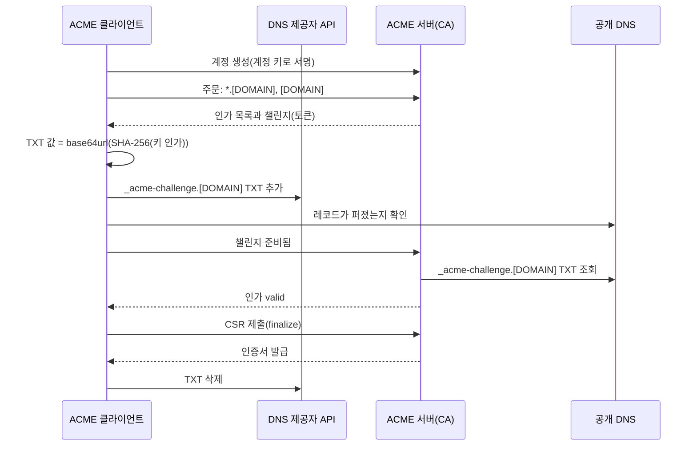
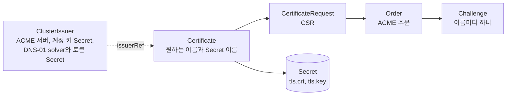

**ACME**(Automatic Certificate Management Environment)는 인증 기관(CA)에서 TLS 인증서를 받는 과정을 사람 손 없이 자동으로 처리하는 프로토콜입니다. 클라이언트는 인증서에 넣을 도메인을 자기가 다룬다는 것을 **챌린지**로 증명하고, 그중 **DNS-01** 챌린지는 도메인의 DNS 에 정해진 TXT 레코드를 올려 증명합니다. DNS-01 은 서버에 들어오는 포트를 열지 않아도 되고, 흔히 쓰는 세 챌린지 가운데 `*.example.com` 같은 **와일드카드 인증서**를 받을 수 있는 유일한 방식입니다.

- **기준:** RFC 8555(ACME), RFC 8737(TLS-ALPN-01), RFC 9773(ACME Renewal Information), CA/Browser Forum Baseline Requirements 2.3.0, Let's Encrypt 문서(2026년 9월 기준), cert-manager 문서

## 왜 필요한가

공개적으로 신뢰받는 인증서는 유효 기간이 정해져 있고, 그 기간은 계속 짧아지고 있습니다. CA/Browser Forum Baseline Requirements 는 인증서의 최대 유효 기간을 2026년 3월 15일부터 200일, 2027년 3월 15일부터 100일, 2029년 3월 15일부터 47일로 줄입니다. Let's Encrypt 의 기본 인증서는 90일이고, 이마저 45일로 줄이는 일정이 잡혀 있습니다. 이 주기로 사람이 직접 도메인을 증명하고 인증서를 바꿔 넣으면 언젠가 한 번은 놓치고, 놓치면 그 서비스는 브라우저에서 열리지 않습니다.

ACME 는 증명, 발급, 설치, 갱신을 모두 자동으로 돌려 이 문제를 풉니다. 그런데 증명 방식에 따라 쓸 수 있는 곳이 갈립니다.

- 웹 서버에 파일을 두는 방식(HTTP-01)은 CA 가 인터넷에서 그 서버의 80 포트에 닿아야 합니다. 내부망에만 있는 서비스나 80 포트를 막는 회선에서는 쓸 수 없습니다.
- 서비스마다 인증서를 따로 받으면 서비스를 늘릴 때마다 증명과 발급이 한 번씩 더 필요합니다. 와일드카드 인증서 하나면 그 아래 이름을 한꺼번에 덮지만, 와일드카드는 DNS 를 통한 증명만 허용됩니다.

DNS-01 은 CA 가 서버가 아니라 공개 DNS 만 조회하므로, 인터넷에서 닿지 않는 서버도 공개 인증서를 받을 수 있고 와일드카드도 받을 수 있습니다. 대신 클라이언트가 DNS 레코드를 바꿀 권한(DNS 제공자의 API 토큰)을 가져야 합니다.

## 핵심 용어

| 용어 | 뜻 |
| :--- | :--- |
| ACME 서버 | 인증서를 발급하는 CA 쪽 서버입니다. Let's Encrypt 가 대표적입니다. |
| ACME 클라이언트 | 계정을 만들고 인증서를 주문·증명·설치하는 프로그램입니다. cert-manager, certbot 등이 있습니다. |
| 계정 키 | 클라이언트가 만든 비대칭 키 쌍입니다. ACME 요청은 모두 이 키로 서명합니다. |
| 주문(order) | 받고 싶은 인증서의 식별자(도메인 목록)를 적은 요청입니다. |
| 인가(authorization) | 식별자 하나를 클라이언트가 다룬다는 것을 증명해야 하는 단위입니다. 주문 하나에 식별자마다 하나씩 생깁니다. |
| 챌린지(challenge) | 인가를 얻는 방법입니다. `http-01`, `dns-01`, `tls-alpn-01` 이 있습니다. |
| 키 인가(key authorization) | 챌린지 토큰과 계정 키 지문을 `.` 으로 이은 문자열입니다. 챌린지 응답은 모두 이 값에서 만듭니다. |
| CSR | 인증서에 넣을 공개 키와 이름을 담아 CA 에 보내는 서명 요청입니다. |
| 와일드카드 인증서 | 맨 왼쪽 라벨이 `*` 인 이름(`*.example.com`)을 담은 인증서입니다. `*` 는 라벨 하나에만 대응합니다. |
| ARI | ACME Renewal Information. CA 가 인증서별로 갱신하기 좋은 시간 창을 알려 주는 확장입니다(RFC 9773). |

## 동작 방식

와일드카드와 루트 이름을 함께 담은 인증서를 DNS-01 로 받는 흐름입니다.



1. 클라이언트는 계정 키를 만들고 그 키로 서명한 요청으로 ACME 서버에 계정을 만듭니다.
2. 인증서에 넣을 이름으로 주문을 냅니다. 서버는 이름마다 인가를 만들고, 각 인가에 고를 수 있는 챌린지와 토큰을 붙여 돌려줍니다.
3. `*.[DOMAIN]` 의 인가는 식별자가 `[DOMAIN]` 으로 적히고 `wildcard: true` 가 붙습니다. 그래서 `*.[DOMAIN]` 과 `[DOMAIN]` 의 챌린지는 모두 같은 이름 `_acme-challenge.[DOMAIN]` 에 TXT 를 요구합니다. 한 이름에 TXT 레코드가 여러 개 있어도 되므로 두 값을 함께 올립니다.
4. 클라이언트는 키 인가(`토큰.계정 키 지문`)의 SHA-256 을 base64url 로 인코딩한 값을 TXT 로 올립니다. 이 값은 계정 키 없이는 만들 수 없으므로, 레코드를 올린 쪽이 그 계정의 주인이라는 것까지 함께 증명합니다.
5. DNS 제공자마다 레코드가 퍼지는 데 걸리는 시간이 다르므로, 클라이언트는 공개 DNS 에서 레코드가 보이는지 먼저 확인하고 서버에 준비됐다고 알립니다.
6. 서버는 TXT 를 조회해 값이 맞으면 인가를 `valid` 로 바꿉니다. Baseline Requirements 는 CA 가 이 확인을 여러 네트워크 위치에서 교차 확인하도록 요구하므로, 한 지점의 DNS 응답만 속여서는 통과하기 어렵습니다.
7. 모든 인가가 `valid` 가 되면 클라이언트는 CSR 로 주문을 마무리하고, 발급된 인증서를 내려받습니다.
8. RFC 8555 는 챌린지가 끝나면 클라이언트가 TXT 를 지우도록 권합니다.

## 챌린지 세 가지

RFC 8555 는 `http-01` 과 `dns-01` 을, RFC 8737 은 `tls-alpn-01` 을 정의합니다.

| 구분 | HTTP-01 | DNS-01 | TLS-ALPN-01 |
| :--- | :--- | :--- | :--- |
| 증명 위치 | `http://[DOMAIN]/.well-known/acme-challenge/[TOKEN]` 에 키 인가를 둠 | `_acme-challenge.[DOMAIN]` TXT 에 키 인가의 해시를 둠 | 443 포트에서 ALPN `acme-tls/1` 로 들어온 연결에 키 인가 해시를 담은 인증서를 보여 줌 |
| CA 가 닿아야 하는 곳 | 서버의 80 포트 | 공개 DNS | 서버의 443 포트 |
| 필요한 권한 | 웹 서버에 파일을 둘 권한 | DNS 레코드를 바꿀 권한(보통 DNS 제공자 API 토큰) | 443 포트의 TLS 응답을 바꿀 권한 |
| 와일드카드 | 불가 | 가능 | 불가 |
| 내부망 서버 | 불가 | 가능 | 불가 |
| 여러 서버 | 모든 서버가 같은 파일을 내놓아야 함 | 서버 수와 무관 | 모든 서버가 같은 응답을 내놓아야 함 |

Let's Encrypt 는 HTTP-01 을 오늘날 가장 흔한 방식으로 소개하고, TLS-ALPN-01 은 TLS 를 종료하는 리버스 프록시 제작자나 큰 호스팅 업체에 맞으며 대부분의 사용자에게는 맞지 않는다고 설명합니다. DNS-01 은 와일드카드가 필요하거나 웹 서버가 여러 대이거나 서버가 인터넷에 드러나지 않을 때의 선택지입니다.

## 와일드카드에 DNS-01 이 필요한 이유

RFC 8555 자체는 와일드카드 주문에 쓸 챌린지를 제한하지 않습니다. 주문에 `*.` 로 시작하는 이름을 넣을 수 있고, 서버가 그 인가에 `wildcard: true` 를 붙인다는 것까지만 정합니다.

제한은 공개 CA 가 따라야 하는 CA/Browser Forum Baseline Requirements 에서 옵니다. BR 은 도메인 검증 방법마다 와일드카드에 쓸 수 있는지를 표로 정해 두었고, 웹사이트 변경 방식(ACME 의 HTTP-01 에 해당)과 TLS ALPN 방식은 와일드카드에 쓸 수 없습니다. ACME 챌린지 가운데 와일드카드에 쓸 수 있는 것은 DNS 레코드를 바꾸는 방식뿐이라, Let's Encrypt 도 와일드카드 발급에는 DNS-01 을 요구합니다.

이 구분은 무엇을 증명하느냐로 이해할 수 있습니다. `www.example.com` 서버에 파일을 둘 수 있다는 것은 그 이름 하나를 다룬다는 증거입니다. `example.com` 존의 레코드를 바꿀 수 있다는 것은 그 아래 어떤 이름이든 가리킬 곳을 정할 수 있다는 증거이므로, 아직 존재하지도 않는 이름까지 덮는 와일드카드의 근거가 됩니다.

와일드카드가 덮는 범위도 정해져 있습니다. RFC 9525 에 따라 `*` 는 맨 왼쪽 라벨 하나에만 대응합니다.

| 이름 | `*.example.com` 인증서로 |
| :--- | :--- |
| `app.example.com` | 덮임 |
| `example.com` | 덮이지 않음. 인증서에 따로 넣어야 함 |
| `a.app.example.com` | 덮이지 않음. `*.app.example.com` 이 따로 필요함 |

## DNS API 토큰과 최소 권한

DNS-01 을 자동으로 돌리려면 ACME 클라이언트가 DNS 제공자의 API 로 레코드를 만들고 지울 수 있어야 합니다. Let's Encrypt 는 DNS API 자격 증명 전체를 웹 서버에 두면 그 서버가 뚫렸을 때의 피해가 크게 늘어난다고 경고합니다. 토큰을 가진 사람은 존의 다른 레코드도 바꿀 수 있어, 트래픽을 다른 곳으로 돌리거나 같은 방법으로 자기 인증서를 받을 수 있기 때문입니다.

그래서 토큰의 권한을 필요한 만큼으로 줄입니다.

- 계정 전체를 다루는 API 키 대신 권한을 좁힌 API 토큰을 씁니다. cert-manager 문서도 Cloudflare 에서는 전역 API 키 대신 DNS 편집과 존 읽기 권한만 준 API 토큰을 권합니다.
- 제공자가 허용하면 토큰이 다룰 수 있는 존을 필요한 존으로 한정합니다.
- 더 좁히려면 `_acme-challenge.[DOMAIN]` 을 CNAME 이나 NS 레코드로 다른 존에 위임하고, 클라이언트에는 그 존만 바꿀 수 있는 자격 증명을 줍니다. Let's Encrypt 는 CNAME 을 따라가 위임된 곳의 TXT 를 확인하고, cert-manager 는 `cnameStrategy: Follow` 로 CNAME 을 따라가 실제로 바꿀 존을 찾습니다.
- 도메인의 CAA 레코드에 RFC 8657 의 `accounturi` 를 적으면, 레코드를 바꿀 수 있는 사람이 있더라도 지정한 CA 계정으로만 발급되게 제한할 수 있습니다.

> 갱신 때마다 DNS 를 바꾸지 않아도 되는 **DNS-PERSIST-01** 방식이 표준화되고 있습니다. `_validation-persist.[DOMAIN]` 에 CA 와 ACME 계정을 지정한 TXT 를 한 번 올려 두면 이후 갱신에는 DNS API 토큰이 필요 없고, 대신 ACME 계정 키가 가장 중요한 비밀이 됩니다. Baseline Requirements 에는 이미 방법(3.2.2.4.22)으로 들어가 있지만, Let's Encrypt 는 2026년 6월 공지에서 명세의 남은 쟁점이 풀릴 때까지 운영 환경 배포를 미룬다고 밝혔습니다.
{: .prompt-info }

## 갱신 시점과 인터넷이 끊겼을 때

인증서는 발급된 순간부터 정해진 만료 시각(`notAfter`)까지만 유효합니다. 이미 받은 인증서로 TLS 연결을 받는 데는 인터넷이 필요 없지만, 갱신에는 세 곳이 모두 닿아야 합니다.

- 클라이언트 → ACME 서버(주문, 챌린지 알림, CSR 제출)
- 클라이언트 → DNS 제공자 API(TXT 추가·삭제)
- CA → 공개 DNS(TXT 조회)

그래서 인터넷이 끊겨도 기존 인증서는 만료 시각까지 그대로 쓰이고, 끊긴 동안의 갱신 시도는 실패했다가 다시 연결되면 성공합니다. 만료 전에 다시 연결되지 않으면 클라이언트(브라우저 등)가 인증서를 거부합니다. 여유 기간은 "만료 시각 − 갱신을 시작하는 시각" 입니다.

| 인증서 유효 기간 | 유효 기간의 2/3 에 갱신할 때 여유 |
| :--- | :--- |
| 90일 | 약 30일 |
| 64일 | 약 21일 |
| 45일 | 약 15일 |

Let's Encrypt 의 유효 기간은 다음처럼 바뀝니다.

| 날짜 | 변화 |
| :--- | :--- |
| 2026-05-13 | 선택형 `tlsserver` 프로필이 45일 인증서를 발급 |
| 2027-02-10 | 기본 `classic` 프로필이 64일 인증서를 발급 |
| 2028-02-16 | 기본 `classic` 프로필이 45일 인증서를 발급 |

갱신 시점은 날짜를 고정하지 않고 유효 기간에 비례해 정합니다. Let's Encrypt 는 ARI 를 쓰거나, ARI 를 쓰지 않으면 유효 기간의 약 2/3 지점에서 갱신하라고 권하고, 60일마다 같은 간격으로 갱신하는 방식은 45일 인증서에서는 통하지 않는다고 경고합니다. ARI 를 쓰면 CA 가 인증서마다 권하는 갱신 시간 창(`suggestedWindow`)을 알려 주고, 클라이언트는 그 창 안에서 임의의 시각을 골라 갱신합니다. RFC 9773 은 대량 폐기를 앞두고 CA 가 이 창을 앞당겨 조기 갱신을 권하는 쓰임을 예로 듭니다. Let's Encrypt 에서는 ARI 로 조율된 갱신이 발급 한도(rate limit)에서도 빠집니다.

다시 연결된 뒤 갱신이 계속 실패하면 발급 한도에 걸릴 수 있습니다. Let's Encrypt 는 계정 하나가 식별자 하나에 대해 한 시간에 인가 실패를 5번까지 허용하고, 같은 이름 조합의 인증서는 7일에 5장까지 발급합니다. DNS 설정 오류로 챌린지가 되풀이해 실패하면 한동안 발급이 막히므로, 여유 기간 안에 원인을 고칠 시간이 있어야 합니다.

## cert-manager 에서의 대응

cert-manager 는 쿠버네티스 안에서 돌아가는 ACME 클라이언트이고, ACME 의 각 단계를 쿠버네티스 리소스로 나눠 둡니다.



| 리소스 | 맡는 일 |
| :--- | :--- |
| `Issuer` / `ClusterIssuer` | 어느 ACME 서버에 어떤 계정 키로 요청하고 어떤 챌린지로 증명할지 정합니다. `Issuer` 는 네임스페이스 안에서만, `ClusterIssuer` 는 모든 네임스페이스의 Certificate 에 쓰입니다. `ClusterIssuer` 가 참조하는 Secret(DNS API 토큰 등)은 cluster resource namespace(기본 `cert-manager`)에서 찾습니다. |
| `Certificate` | 받고 싶은 인증서(이름 목록, 결과를 넣을 Secret, 쓸 Issuer)를 선언합니다. 아래의 Order 와 Challenge 는 사용자가 직접 만들지 않습니다. |
| `CertificateRequest` | Certificate 가 새로 생기거나 바뀌거나 갱신할 때가 되면 자동으로 만들어지는 CSR 요청입니다. |
| `Order` | ACME 주문 하나입니다. 한 번 만들어지면 바뀌지 않고, 다시 시도하려면 새로 만듭니다. |
| `Challenge` | 이름마다 하나씩 생기는 챌린지입니다. TXT 를 올리고, 퍼졌는지 10초 간격으로 스스로 확인한 뒤 서버에 알립니다. |

와일드카드 인증서를 선언하는 Certificate 는 다음과 같은 모양입니다.

```yaml
apiVersion: cert-manager.io/v1
kind: Certificate
metadata:
  name: [CERT_NAME]
  namespace: [NAMESPACE]
spec:
  secretName: [TLS_SECRET_NAME]   # 발급된 인증서와 키가 들어갈 Secret
  issuerRef:
    kind: ClusterIssuer
    name: [ISSUER_NAME]           # DNS-01 solver 를 가진 ClusterIssuer
  dnsNames:
    - "[DOMAIN]"                  # 와일드카드는 루트 이름을 덮지 않으므로 함께 적습니다
    - "*.[DOMAIN]"
```

갱신은 cert-manager 가 알아서 합니다. 기본값은 인증서 유효 기간의 2/3 지점이고, `spec.renewBefore`(만료 전 남은 시간)나 `spec.renewBeforePercentage`(비율)로 바꿀 수 있습니다. 갱신 중에는 새 인증서가 발급된 뒤에야 Secret 을 바꾸므로, 갱신이 실패하는 동안에도 기존 인증서가 Secret 에 남아 계속 쓰입니다. ACME CA 는 요청한 유효 기간(`spec.duration`)과 관계없이 자기 기간으로 발급할 수 있으므로, 실제 갱신 시각은 Certificate 의 `status.renewalTime` 에서 확인합니다.

## 흔한 오해

<details markdown="1">
<summary>DNS-01 을 쓰려면 서버가 인터넷에서 보여야 한다</summary>

- **실제:** CA 는 서버에 접속하지 않고 공개 DNS 의 TXT 만 조회합니다. 클라이언트가 ACME 서버와 DNS 제공자 API 로 나가는 연결만 있으면 내부망 서버도 공개 인증서를 받습니다.
- **근거:** RFC 8555 8.4절, Let's Encrypt Challenge Types

</details>

<details markdown="1">
<summary>와일드카드 인증서 하나면 루트 도메인과 모든 하위 단계가 덮인다</summary>

- **실제:** `*.example.com` 은 `app.example.com` 처럼 라벨 하나만 덮습니다. `example.com` 과 `a.app.example.com` 은 인증서에 따로 넣어야 합니다.
- **근거:** RFC 9525 6.3절

</details>

<details markdown="1">
<summary>인터넷이 끊기면 HTTPS 가 바로 안 된다</summary>

- **실제:** 이미 받은 인증서는 만료 시각까지 그대로 쓰입니다. 끊긴 동안 막히는 것은 갱신이고, 여유 기간은 만료 시각에서 갱신 시작 시각을 뺀 만큼입니다.
- **근거:** cert-manager Certificate 문서(갱신 시점과 Secret 교체), Let's Encrypt FAQ

</details>

## 정리

> - ACME 는 계정 → 주문 → 챌린지로 인가 → CSR 로 마무리 → 발급 순서로 인증서를 자동으로 받습니다.
> - DNS-01 은 `_acme-challenge` TXT 로 증명하므로 인바운드 포트가 필요 없고, Baseline Requirements 상 와일드카드를 받을 수 있는 ACME 챌린지는 DNS 방식뿐입니다.
> - DNS API 토큰은 DNS 편집과 필요한 존으로 권한을 좁히고, 더 줄이려면 `_acme-challenge` 를 다른 존에 위임합니다.
> - 갱신은 유효 기간의 약 2/3 지점이나 ARI 가 알려 주는 창에서 하고, 인터넷이 끊겨도 만료 시각까지는 기존 인증서가 쓰입니다.
{: .prompt-tip }

## 참고 자료

- [RFC 8555 - Automatic Certificate Management Environment (ACME)](https://www.rfc-editor.org/rfc/rfc8555)
- [RFC 8737 - ACME TLS Application-Layer Protocol Negotiation (ALPN) Challenge Extension](https://www.rfc-editor.org/rfc/rfc8737)
- [RFC 9773 - ACME Renewal Information (ARI) Extension](https://www.rfc-editor.org/rfc/rfc9773)
- [RFC 8657 - CAA Record Extensions for Account URI and ACME Method Binding](https://www.rfc-editor.org/rfc/rfc8657)
- [RFC 9525 - Service Identity in TLS](https://www.rfc-editor.org/rfc/rfc9525)
- [CA/Browser Forum - Baseline Requirements for TLS Server Certificates](https://cabforum.org/working-groups/server/baseline-requirements/documents/)
- [Let's Encrypt - Challenge Types](https://letsencrypt.org/docs/challenge-types/)
- [Let's Encrypt - FAQ](https://letsencrypt.org/docs/faq/)
- [Let's Encrypt - Rate Limits](https://letsencrypt.org/docs/rate-limits/)
- [Let's Encrypt - Decreasing Certificate Lifetimes to 45 Days](https://letsencrypt.org/2025/12/02/from-90-to-45)
- [Let's Encrypt - DNS-PERSIST-01: A New Model for DNS-based Challenge Validation](https://letsencrypt.org/2026/02/18/dns-persist-01)
- [Let's Encrypt Community - DNS-PERSIST-01 deployment status and timeline](https://community.letsencrypt.org/t/dns-persist-01-deployment-status-and-timeline/246468)
- [cert-manager - Issuer](https://cert-manager.io/docs/concepts/issuer/)
- [cert-manager - ACME Orders and Challenges](https://cert-manager.io/docs/concepts/acme-orders-challenges/)
- [cert-manager - Certificate resource](https://cert-manager.io/docs/usage/certificate/)
- [cert-manager - DNS01](https://cert-manager.io/docs/configuration/acme/dns01/)
- [cert-manager - Cloudflare](https://cert-manager.io/docs/configuration/acme/dns01/cloudflare/)
