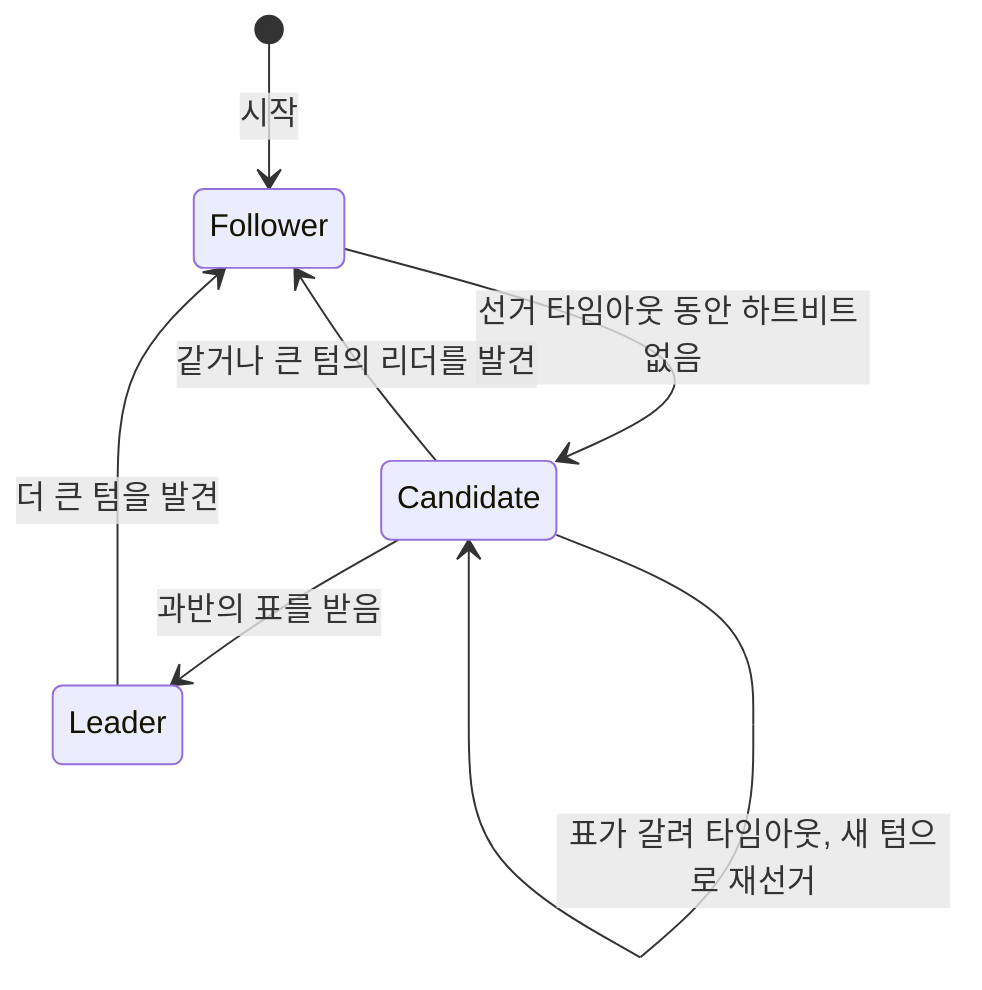
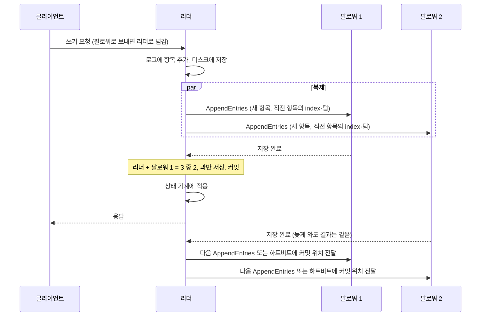
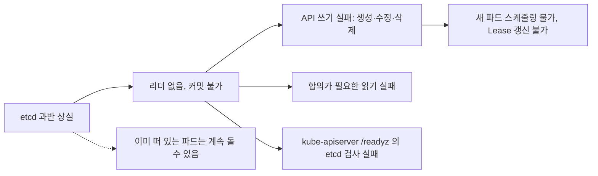
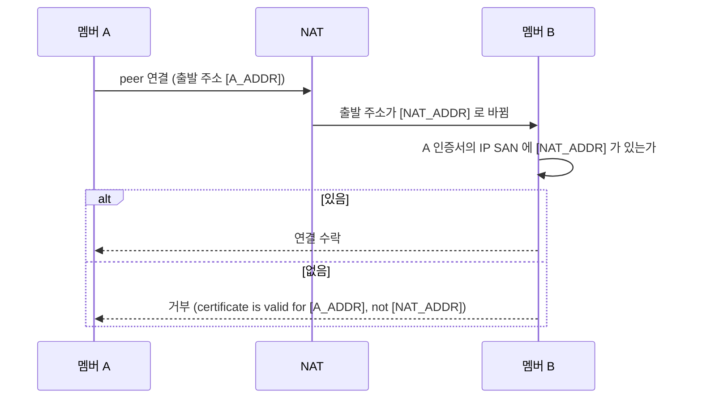

**etcd** 는 여러 서버가 같은 키-값 데이터를 나눠 갖는 분산 저장소이고, 쿠버네티스는 클러스터의 모든 상태를 여기에 저장합니다. 서버 몇 대가 죽거나 네트워크가 갈라져도 모든 멤버가 같은 순서의 같은 변경을 보도록, etcd 는 **Raft** 라는 합의 알고리즘을 씁니다. Raft 는 **리더(leader)** 한 대가 변경을 로그로 받아 다른 멤버에게 복제하고, 과반이 저장한 변경만 확정하는 방식입니다.

- **기준:** Raft 논문 확장판(Ongaro·Ousterhout, "In Search of an Understandable Consensus Algorithm (Extended Version)", 2014), etcd v3.7 문서(FAQ, Failure modes, Learner design, Tuning, Transport security model, Configuration options), Kubernetes v1.37 문서(Operating etcd clusters for Kubernetes, Kubernetes API health endpoints)

## 왜 필요한가

상태 저장소를 서버 한 대에 두면 그 서버가 죽을 때 클러스터 전체가 멈춥니다. 여러 대에 복제하면 이번에는 "누구의 값이 맞는가"가 문제가 됩니다. 두 서버가 같은 키에 서로 다른 값을 동시에 받거나, 네트워크가 갈라진 양쪽이 각자 쓰기를 받으면 복제본끼리 어긋납니다.

Raft 는 이 문제를 두 규칙으로 풉니다. 쓰기는 한 번에 한 리더만 받아 순서를 정하고, 그 변경이 멤버 과반에 저장되어야 확정합니다. 서로 겹치지 않는 두 무리가 동시에 과반일 수는 없으므로, 네트워크가 어떻게 갈라져도 쓰기를 확정할 수 있는 쪽은 하나뿐입니다. 과반으로 스플릿 브레인을 막는 원리 자체는 (/posts/64/) 에서 다룹니다. etcd 문서도 멤버를 과반 승인으로만 더하고 빼므로 etcd 에는 스플릿 브레인이 없다고 설명합니다.

## 핵심 용어

| 용어 | 뜻 |
| :--- | :--- |
| 리더(leader) | 모든 쓰기를 받아 로그에 적고 다른 멤버에게 복제하는 멤버. 한 텀에 많아야 하나입니다 |
| 팔로워(follower) | 리더와 후보의 요청에만 응답하는 멤버. 클라이언트의 쓰기 요청은 리더로 넘깁니다 |
| 후보(candidate) | 리더 소식이 끊겨 선거를 시작한 멤버 |
| 텀(term) | 선거 한 번으로 시작하는 연속 번호의 기간. 멤버는 더 큰 텀을 보면 자기 텀을 올리고 팔로워로 돌아갑니다 |
| 로그 항목(log entry) | 상태를 바꾸는 명령 하나와 그 명령을 받은 텀, 위치(index)의 묶음 |
| 커밋(commit) | 로그 항목이 확정되어 상태 기계에 적용해도 되는 상태. 리더는 자기 텀의 항목이 과반에 저장되면 커밋합니다 |
| 쿼럼(quorum) | 선거나 커밋에 필요한 과반. 멤버가 n 이면 `n / 2 + 1`(소수점 버림)입니다 |
| 하트비트(heartbeat) | 리더가 권한을 유지하려고 주기적으로 보내는, 항목이 없는 AppendEntries 요청 |
| 선거 타임아웃(election timeout) | 팔로워가 하트비트 없이 기다리다 선거를 시작하기까지의 시간 |
| learner | 로그를 받지만 투표하지 않고 쿼럼에도 세지 않는 etcd 멤버 |
| peer 통신 | etcd 멤버끼리 Raft 메시지를 주고받는 연결. 클라이언트 통신(기본 포트 2379)과 따로 기본 포트 2380 을 씁니다 |

## 리더 선출

1. 모든 멤버는 **팔로워(follower)**로 시작합니다. 리더는 주기적으로 **하트비트**를 보내고, 팔로워는 이를 받는 동안 팔로워로 남습니다.
2. 팔로워가 **선거 타임아웃** 동안 아무 소식을 못 받으면 리더가 없다고 보고, 자기 **텀**을 1 올려 **후보**가 된 뒤 자신에게 투표하고 다른 멤버에게 RequestVote 요청을 보냅니다.
3. 각 멤버는 한 텀에 한 후보에게만, 먼저 온 순서로 투표합니다. 다만 자기 로그가 후보의 로그보다 최신이면 표를 주지 않습니다. 최신 여부는 마지막 항목의 텀을 먼저 비교하고, 같으면 로그 길이를 비교합니다.
4. 전체 멤버의 과반에게 표를 받은 후보가 리더가 되고 곧바로 하트비트를 보내 다른 선거를 막습니다.
5. 여러 후보가 동시에 나와 아무도 과반을 못 받으면, 각자 타임아웃 뒤 텀을 올려 다시 선거합니다. Raft 는 선거 타임아웃을 일정 범위(논문 예시는 150–300ms)에서 무작위로 골라 동시에 후보가 되는 일을 줄입니다.

3번의 제한 덕분에 리더가 되려면 과반에게 "내 로그가 너보다 뒤처지지 않았다"고 인정받아야 합니다. 커밋된 항목은 과반에 저장되어 있고 두 과반은 반드시 한 멤버 이상 겹치므로, 새 리더는 이전에 커밋된 항목을 모두 갖고 있습니다.

etcd 는 여기에 **Pre-Vote** 를 기본으로 켭니다(`--pre-vote`, 기본 `true`). 네트워크에서 떨어져 있던 멤버가 돌아왔을 때 텀을 올린 선거로 멀쩡한 리더를 흔드는 일을 막는 기능입니다.

## 로그 복제와 커밋

1. 리더는 쓰기 요청을 자기 로그 끝에 새 **로그 항목**으로 붙이고 디스크에 저장합니다.
2. 리더는 새 항목과 함께 바로 앞 항목의 index·텀을 AppendEntries 로 모든 팔로워에게 보냅니다. 팔로워는 자기 로그의 같은 위치에 같은 텀의 항목이 없으면 거부하고, 리더는 더 앞 위치부터 다시 보내 두 로그가 일치하는 지점을 찾습니다. 그 뒤의 어긋난 항목은 리더의 것으로 덮어씁니다.
3. 리더는 자기 텀의 항목이 과반(리더 자신 포함)에 저장되면 그 항목과 그 앞의 모든 항목을 **커밋**합니다. 이전 텀의 항목은 과반에 복제되어 있어도 그것만으로 커밋하지 않고, 자기 텀의 항목이 커밋될 때 함께 커밋됩니다. 논문은 이전 텀의 항목만 보고 커밋하면 나중 리더가 덮어쓸 수 있는 경우를 예로 보입니다.
4. 커밋된 항목은 상태 기계(etcd 의 키-값 저장소)에 적용되고 클라이언트에 응답이 갑니다.
5. 팔로워는 AppendEntries 에 실려 오는 리더의 커밋 위치를 보고 자기 상태 기계에도 적용합니다.

리더가 커밋 전에 죽으면 그 항목은 사라질 수 있습니다. etcd 문서는 이전 리더에게 보냈지만 커밋되지 않은 쓰기는 잃을 수 있고 클라이언트에서는 타임아웃으로 보이지만, 커밋된 쓰기는 잃지 않는다고 설명합니다. 선거가 진행되는 동안에는 쓰기를 처리하지 못하며, 새 리더를 뽑는 데 선거 타임아웃 정도가 걸립니다.

읽기도 두 가지입니다. 합의가 필요한 읽기(linearizable)는 리더를 거치고, 합의가 필요 없는 읽기(serializable)는 아무 멤버나 자기 데이터로 답할 수 있습니다. 그래서 과반을 잃으면 쓰기와 linearizable 읽기가 함께 멈춥니다.

## learner

새 멤버를 바로 투표 멤버로 더하면 **쿼럼(quorum)** 크기가 바로 바뀝니다. 예를 들어 멤버 셋 가운데 하나가 이미 죽은 상태에서 넷째를 더하면 쿼럼이 2에서 3으로 올라가는데, 살아 있는 멤버는 둘뿐이라 곧바로 과반을 잃습니다. 새 멤버의 주소를 잘못 적어 프로세스가 뜨지 못하면, 멤버십을 되돌리는 변경도 과반 승인이 필요하므로 되돌릴 수 없습니다. 데이터가 빈 새 멤버가 리더에게서 로그를 한꺼번에 받느라 리더의 하트비트가 밀려 선거가 일어날 수도 있습니다.

etcd 는 이를 줄이려고 **learner** 상태를 둡니다(Raft 저자의 박사 논문 4.2.1절에서 온 개념).

- `etcdctl member add --learner` 로 더하면 로그는 모두 받지만 투표하지 않고 쿼럼에도 세지 않습니다. 쿼럼 크기가 바뀌지 않으므로, 설정이 틀려도 과반을 잃지 않고 멤버를 다시 뺄 수 있습니다.
- learner 에게는 리더를 넘기지 않고, serializable 읽기와 멤버 상태 조회 외의 클라이언트 요청은 거부합니다.
- 리더의 로그를 따라잡은 뒤 `etcdctl member promote` 로 투표 멤버로 올립니다. etcd 는 따라잡지 못한 learner 의 승격 요청을 거부하고, learner 가 스스로 승격하지는 않습니다.
- 한 클러스터에 둘 수 있는 learner 수는 `--max-learners`(기본 1)로 제한됩니다.

## 멤버 수와 장애 허용

etcd FAQ 의 표입니다. 과반은 `n / 2 + 1` 이고, 버틸 수 있는 장애는 `n - 과반` 입니다.

| 멤버 수 | 과반 | 버틸 수 있는 장애 |
| :--- | :--- | :--- |
| 1 | 1 | 0 |
| 2 | 2 | 0 |
| 3 | 2 | 1 |
| 4 | 3 | 1 |
| 5 | 3 | 2 |
| 6 | 4 | 2 |
| 7 | 4 | 3 |

- 홀수에서 하나를 더해 짝수로 만들면 과반만 1 늘고 버틸 수 있는 장애 수는 그대로입니다. 죽을 수 있는 서버만 하나 늘어난 셈입니다.
- 네트워크가 갈라질 때도 멤버 수가 홀수면 과반 쪽이 반드시 하나 생깁니다. 짝수면 절반씩 갈라져 양쪽 모두 멈출 수 있습니다.
- 멤버가 둘이면 과반이 2라 한 대만 죽어도 멈추므로 한 대일 때보다 나을 것이 없습니다.
- etcd 문서는 대부분의 경우 다섯 멤버(장애 2개 허용)면 충분하고 일곱을 넘기지 않기를 권합니다. 멤버가 많을수록 복제할 곳이 늘어 쓰기 성능이 떨어집니다. Kubernetes 문서도 운영 환경에 다섯 멤버를 권합니다.
- 고장 난 멤버를 바꿀 때는 먼저 빼고 새 멤버를 더합니다. 먼저 더하면 앞의 learner 절처럼 쿼럼이 커져 위험해집니다. etcd 는 기본으로 과반을 잃게 만드는 멤버십 변경을 거부합니다(`--strict-reconfig-check`, 기본 `true`).

## 과반을 잃었을 때 쿠버네티스 API

kube-apiserver 는 모든 객체를 etcd 에 쓰고 읽습니다. etcd 가 과반을 잃으면 리더를 뽑을 수 없어 커밋이 멈추고, 그 위의 쿠버네티스는 다음처럼 됩니다.

- 쿠버네티스 문서는 etcd 멤버 과반이 영구히 고장 나면 쿠버네티스가 현재 상태를 바꿀 수 없고, 이미 스케줄된 파드는 계속 돌 수 있지만 새 파드는 스케줄할 수 없다고 설명합니다.
- 객체의 생성·수정·삭제는 모두 etcd 쓰기이므로 실패합니다. 노드 상태 보고와 컨트롤러의 리더 선출에 쓰는 Lease 갱신도 API 쓰기라서 함께 실패합니다.
- kube-apiserver 의 `/readyz` 에는 etcd 검사 항목이 있어, etcd 에 닿지 못하면 준비되지 않은 상태로 보고합니다.
- 네트워크 장애처럼 일시적인 원인이면, 과반이 돌아오는 순간 etcd 가 새 리더를 뽑고 스스로 복구합니다. 과반이 영구히 돌아오지 못하면 백업 스냅숏으로 클러스터를 다시 만드는 재해 복구가 필요합니다.

## 원거리(WAN) 멤버

멤버를 다른 지역에 두면 장애 영역이 나뉘어 버틸 수 있는 장애의 종류가 늘지만, 대가가 있습니다.

- **쓰기 지연:** 커밋하려면 리더가 과반의 저장 응답을 받아야 하므로, 쓰기 지연에는 리더와 "과반을 채우는 데 필요한 가장 느린 팔로워" 사이의 왕복 시간이 들어갑니다. 예를 들어 같은 지역에 두 멤버, 먼 지역에 한 멤버를 두면 리더가 같은 지역에 있을 때는 이웃 멤버의 응답만으로 과반(3 중 2)이 차서 먼 멤버의 지연이 커밋에 끼지 않습니다. 먼 멤버가 리더가 되면 모든 커밋이 원거리 왕복을 거칩니다. 리더는 `etcdctl move-leader` 로 다른 멤버에게 넘길 수 있습니다.
- **대역폭:** 데이터는 과반만이 아니라 모든 멤버에 복제되므로 원거리 링크로도 전부 흐릅니다.
- **시간 설정:** 기본값(`--heartbeat-interval` 100ms, `--election-timeout` 1000ms)은 지연이 낮은 로컬 네트워크를 가정합니다. etcd 튜닝 문서는 하트비트 간격을 멤버 사이 평균 왕복 시간의 최댓값 정도(대략 0.5~1.5배)로, 선거 타임아웃을 왕복 시간의 10배 이상으로 두라고 합니다. FAQ 는 원거리 배포에서 선거 타임아웃을 하트비트 간격의 5배 이상으로 두라고 하고, 선거 타임아웃의 상한은 50000ms 입니다. 이 두 값은 모든 멤버가 같아야 하며, 다르면 클러스터가 불안정해질 수 있습니다.
- **디스크도 지연이다:** 리더는 로그를 디스크에 저장한 뒤에 커밋할 수 있으므로, fsync 가 느리면 네트워크가 멀쩡해도 하트비트가 밀려 리더를 잃을 수 있습니다. etcd 문서는 이를 의도된 동작으로 설명합니다.

Raft 논문은 이 관계를 `broadcastTime ≪ electionTimeout ≪ MTBF` 로 적습니다. 멤버 전체와 한 번 주고받는 시간보다 선거 타임아웃이 한 자릿수 이상 커야 하트비트가 제때 닿고, 선거 타임아웃은 서버 고장 간격보다 훨씬 작아야 리더가 죽었을 때 오래 멈추지 않습니다.

## peer TLS 와 SAN

etcd 멤버끼리의 **peer 통신**도 TLS 로 보호합니다. `--peer-client-cert-auth` 를 켜면 멤버들이 서로 인증서를 내는 상호 TLS 가 되므로, peer 인증서는 서버 용도와 클라이언트 용도(`serverAuth`, `clientAuth`)를 모두 가져야 합니다. 이 옵션의 기본값은 `false` 지만, etcd 는 위조된 peer 를 막기 위해 켜기를 권합니다.

etcd 는 v3.2.0 부터 들어오는 peer 연결의 인증서에 IP SAN 이 있으면, **연결의 원격 IP 가 그 가운데 하나와 같을 때만** 받아들입니다. 인가되지 않은 곳에서 클러스터에 붙는 것을 막기 위한 검사입니다. 인증서에 IP 없이 DNS 이름만 있으면 그 이름을 정방향 조회한 결과에 원격 IP 가 있는지 보고, 와일드카드 DNS 이름은 원격 IP 를 역방향 조회해 대조합니다.

그래서 멤버 사이에 NAT 가 끼면, 인증서에는 멤버 자신의 주소뿐 아니라 **상대 멤버가 실제로 보게 되는 출발 주소**도 넣어야 합니다. 연결 방향마다 바뀌는 주소가 다를 수 있으므로 양쪽 인증서를 따로 따져야 합니다. SAN 대신 인증서의 CN 이나 SAN 호스트 이름으로 peer 를 제한하는 `--peer-cert-allowed-cn`, `--peer-cert-allowed-hostname` 옵션도 있습니다.

## 흔한 오해

멤버를 넷으로 늘리면 셋일 때보다 장애에 강하다

- **실제:** 넷의 과반은 3이라 버틸 수 있는 장애는 셋일 때와 같은 1개입니다. 죽을 수 있는 서버만 하나 늘고, 2:2 로 갈라지면 양쪽 모두 멈춥니다.
- **근거:** etcd FAQ 의 "Why an odd number of cluster members?" 와 장애 허용 표.

learner 도 쿼럼을 채우는 데 도움이 된다

- **실제:** learner 는 투표하지 않고 쿼럼에도 세지 않습니다. 쿼럼에 들어가려면 로그를 따라잡은 뒤 승격해야 합니다.
- **근거:** etcd Learner design 문서.

과반에 복제된 항목은 모두 커밋된 것이다

- **실제:** 리더는 자기 텀의 항목이 과반에 저장될 때만 커밋을 판정합니다. 이전 텀의 항목은 과반에 복제되어 있어도, 자기 텀의 항목이 커밋될 때 함께 커밋됩니다.
- **근거:** Raft 논문 5.4.2절 "Committing entries from previous terms" 와 Figure 8.

## 정리

> - Raft 는 한 텀에 리더 하나가 쓰기를 받아 로그로 복제하고, 자기 텀의 항목이 과반에 저장되면 커밋합니다.
> - 로그가 최신이 아닌 후보는 표를 받지 못하므로, 새 리더는 커밋된 항목을 모두 갖고 있습니다.
> - 멤버 수는 홀수로 둡니다. 짝수로 늘려도 버틸 수 있는 장애 수는 늘지 않습니다. 새 멤버는 learner 로 넣고 따라잡은 뒤 승격합니다.
> - etcd 가 과반을 잃으면 쿠버네티스 API 쓰기가 멈추고 새 파드를 스케줄할 수 없지만, 떠 있는 파드는 계속 돌 수 있습니다.
> - 원거리 멤버는 하트비트·선거 타임아웃을 왕복 시간에 맞추고, NAT 가 끼면 상대가 보는 주소를 peer 인증서 SAN 에 넣습니다.
{: .prompt-tip }

## 참고 자료

- [In Search of an Understandable Consensus Algorithm (Extended Version)](https://raft.github.io/raft.pdf)
- [Raft Consensus Algorithm](https://raft.github.io/)
- [FAQ \| etcd](https://etcd.io/docs/v3.7/faq/)
- [Failure modes \| etcd](https://etcd.io/docs/v3.7/op-guide/failures/)
- [etcd learner design \| etcd](https://etcd.io/docs/v3.7/learning/design-learner/)
- [Tuning \| etcd](https://etcd.io/docs/v3.7/tuning/)
- [Transport security model \| etcd](https://etcd.io/docs/v3.7/op-guide/security/)
- [Configuration options \| etcd](https://etcd.io/docs/v3.7/op-guide/configuration/)
- [etcdctl README (etcd-io/etcd)](https://github.com/etcd-io/etcd/blob/main/etcdctl/README.md)
- [Operating etcd clusters for Kubernetes](https://kubernetes.io/docs/tasks/administer-cluster/configure-upgrade-etcd/)
- [Kubernetes API health endpoints](https://kubernetes.io/docs/reference/using-api/health-checks/)
