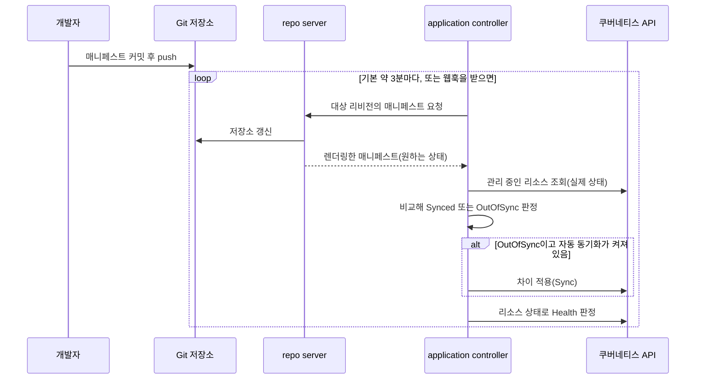
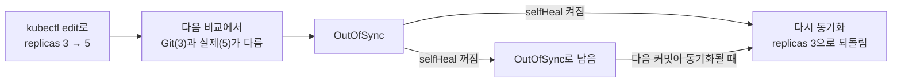
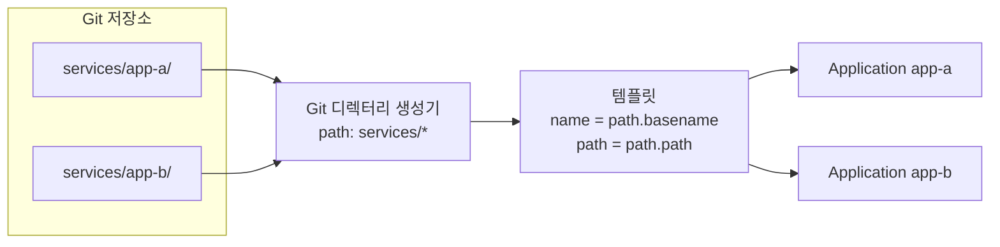

**GitOps**는 시스템이 있어야 할 모습(원하는 상태)을 선언형 파일로 Git 같은 버전 저장소에 두고, 시스템 안의 에이전트가 그 상태를 가져와 실제 상태와 계속 맞추는 운영 방식입니다. **Argo CD**는 쿠버네티스용 GitOps 도구입니다. Git의 매니페스트를 렌더링해 클러스터의 실제 리소스와 비교하고, 다르면 Git 쪽으로 동기화합니다. 이 글은 GitOps의 원칙과 Argo CD가 그 원칙을 구현하는 방식을 설명합니다.

- **기준:** OpenGitOps Principles v1.0.0, Argo CD v3.5 문서

## 왜 필요한가

흔한 CI/CD 파이프라인은 빌드가 끝나면 `kubectl apply`나 `helm upgrade`로 클러스터에 변경을 밀어 넣습니다(push 방식). 이 방식에는 세 가지 빈틈이 있습니다.

- 파이프라인이 클러스터 관리자 자격 증명을 가지고 있어야 합니다.
- 적용하는 순간에만 상태를 맞춥니다. 이후 누군가 클러스터를 직접 고치면 저장소와 클러스터가 달라지고, 아무도 알아채지 못합니다.
- 클러스터의 현재 상태가 어느 커밋에서 왔는지 알기 어렵습니다.

GitOps는 방향을 뒤집습니다. 클러스터 안의 에이전트가 저장소를 주기적으로 읽어(pull) 실제 상태와 비교하고, 다르면 맞춥니다. 배포는 저장소에 커밋하는 것으로 끝나고, 파이프라인은 클러스터에 접근할 필요가 없습니다. 맞추는 작업은 새 커밋이 들어올 때뿐 아니라 실제 상태가 저절로 달라졌을 때도 일어나므로, 저장소가 언제나 클러스터를 설명하는 원본이 됩니다. 되돌리기도 Git 커밋을 되돌리는 것으로 끝납니다.

## 핵심 용어

| 용어 | 뜻 |
| :--- | :--- |
| **원하는 상태(desired state)** | 시스템을 똑같이 다시 만들 수 있을 만큼의 설정 전체. Argo CD 문서는 target state라고 부릅니다 |
| **실제 상태(live state)** | 클러스터에 지금 존재하는 리소스의 상태 |
| **드리프트(drift)** | 실제 상태가 원하는 상태에서 벗어났거나 벗어나는 중인 상태 |
| **조정(reconciliation)** | 실제 상태를 원하는 상태에 맞추는 과정. 차이가 생길 때마다 일어납니다 |
| **Application** | Argo CD가 관리하는 단위. 저장소 경로(원본)와 대상 클러스터·네임스페이스를 묶은 CRD입니다 |
| **Sync status** | 실제 상태가 원하는 상태와 같은지(`Synced`) 다른지(`OutOfSync`) |
| **Health** | 리소스가 정상적으로 동작하는지(`Healthy`, `Progressing`, `Degraded` 등) |
| **Refresh** | Git의 최신 내용과 실제 상태를 비교해 차이를 계산하는 일 |
| **Sync** | 차이를 클러스터에 적용해 원하는 상태로 옮기는 일 |
| **prune** | Git에서 사라진 리소스를 클러스터에서 지우는 동기화 옵션 |
| **selfHeal** | 클러스터 쪽 변경으로 생긴 차이도 자동으로 되돌리는 동기화 옵션 |
| **ApplicationSet** | 생성기(generator)가 만든 매개변수로 템플릿을 채워 Application을 여러 개 만드는 CRD |

## GitOps의 네 가지 원칙

OpenGitOps가 정리한 원칙은 원하는 상태가 갖춰야 할 조건 네 가지입니다.

| 원칙 | 뜻 | Argo CD에서 |
| :--- | :--- | :--- |
| 선언형(Declarative) | 원하는 상태를 절차가 아니라 결과로 적습니다 | 쿠버네티스 매니페스트, Kustomize, Helm 차트 |
| 버전 관리·불변(Versioned and Immutable) | 원하는 상태를 바꿀 수 없는 버전으로 저장하고 전체 이력을 남깁니다 | Git 커밋 |
| 자동으로 가져옴(Pulled Automatically) | 에이전트가 원하는 상태를 스스로 가져옵니다 | repo server가 저장소를 주기적으로 읽습니다 |
| 계속 조정(Continuously Reconciled) | 에이전트가 실제 상태를 계속 관찰하고 원하는 상태를 적용하려 시도합니다 | application controller가 비교하고 동기화합니다 |

"가져온다(pull)"가 중요한 이유는 에이전트가 변경 이벤트가 없을 때도 언제든 원하는 상태를 읽을 수 있어야 계속 조정할 수 있기 때문입니다. "계속"은 즉시라는 뜻이 아니라 조정이 멈추지 않고 이어진다는 뜻입니다.

## Argo CD의 구성 요소

| 구성 요소 | 하는 일 |
| :--- | :--- |
| API server | 웹 UI, CLI, CI가 쓰는 API. 애플리케이션 관리, 저장소·클러스터 자격 증명 관리, RBAC, Git 웹훅 수신을 맡습니다 |
| repo server | Git 저장소를 로컬에 캐시하고, 저장소 URL·리비전·경로·Helm 값 같은 입력으로 쿠버네티스 매니페스트를 만들어 돌려줍니다 |
| application controller | 실행 중인 Application의 실제 상태를 원하는 상태와 계속 비교해 `OutOfSync`를 찾고, 설정에 따라 바로잡습니다 |
| ApplicationSet controller | ApplicationSet을 읽어 Application을 만들고, 고치고, 지웁니다 |

## 조정 루프



1. 개발자가 매니페스트를 고쳐 Git에 push합니다. 클러스터에는 직접 손대지 않습니다.
2. Argo CD는 기본으로 3분마다 저장소를 확인합니다. 기본 주기는 120초에 최대 60초의 무작위 지연을 더한 값입니다. Git 웹훅을 API server로 받도록 설정하면 이 지연 없이 바로 확인합니다.
3. repo server가 Application에 적힌 저장소 경로를 Kustomize나 Helm 같은 도구로 렌더링해 원하는 상태를 만듭니다.
4. application controller가 이를 클러스터의 실제 상태와 비교합니다. 다르면 `OutOfSync`입니다.
5. 자동 동기화가 켜져 있으면 controller가 차이를 적용합니다. 꺼져 있으면 `OutOfSync`로 표시만 하고 사람이 동기화하기를 기다립니다.
6. 적용한 뒤 Deployment의 롤아웃 같은 리소스 상태를 보고 Health를 판정합니다.

## 자동 동기화와 prune, selfHeal

자동 동기화(`syncPolicy.automated`)는 켜는 것만으로 모든 차이를 없애지 않습니다. 두 가지 안전장치가 기본으로 꺼져 있기 때문입니다.

| 설정 | Git이 바뀌었을 때 | Git에서 리소스를 지웠을 때 | 클러스터만 바뀌었을 때 |
| :--- | :--- | :--- | :--- |
| 자동 동기화만 | 적용합니다 | 지우지 않고 `OutOfSync`로 남깁니다 | 자동으로 되돌리지 않습니다 |
| + `prune: true` | 적용합니다 | 클러스터에서도 지웁니다 | 자동으로 되돌리지 않습니다 |
| + `selfHeal: true` | 적용합니다 | `prune` 설정을 따릅니다 | 다시 동기화해 Git 상태로 되돌립니다 |

- **자동 동기화의 규칙:** `OutOfSync`일 때만 동기화하고, 같은 커밋과 매개변수 조합에는 한 번만 시도합니다. 같은 커밋으로 이미 성공했으면 selfHeal이 없는 한 다시 하지 않고, 실패했으면 retry를 설정하지 않은 한 다시 시도하지 않습니다.
- **prune:** 기본값에서 자동 동기화가 리소스를 지우지 않는 것은 실수로 매니페스트를 빼먹었을 때를 막기 위한 안전장치입니다. prune을 켜도 대상 리소스가 하나도 남지 않는 동기화는 기본으로 막고, `allowEmpty: true`를 줘야 허용합니다. 특정 리소스만 지우지 않으려면 그 리소스에 `argocd.argoproj.io/sync-options: Prune=false` 주석을 답니다.
- **selfHeal:** 클러스터 쪽 변경으로 생긴 차이를 감지하면 self-heal 대기 시간(기본 5초)이 지난 뒤 다시 동기화합니다.

prune이 지우는 대상은 Argo CD가 추적하는 리소스입니다. Argo CD는 기본으로 `argocd.argoproj.io/tracking-id` 주석으로 자신이 적용한 리소스를 추적합니다. 그래서 클러스터에서 직접 만든 리소스는 Application에 속하지 않고 prune 대상도 아닙니다.

## 직접 고친 변경이 되돌려지는 이유



GitOps에서 저장소는 원하는 상태의 유일한 원본입니다. `kubectl edit`나 `kubectl scale`로 클러스터를 고치면 실제 상태만 바뀌고 원하는 상태는 그대로이므로, 이 변경은 조정 대상인 드리프트가 됩니다.

- selfHeal이 켜져 있으면 다음 비교에서 차이를 찾아 곧바로 Git의 값으로 되돌립니다.
- selfHeal이 꺼져 있으면 `OutOfSync`로 남아 있다가, 다음 커밋이 동기화될 때 Git의 매니페스트가 다시 적용되면서 덮어씌워집니다.
- prune이 켜져 있으면 Git에서 지운 리소스는 클러스터에서도 지워집니다. 클러스터에만 되살려 둔 리소스가 Argo CD의 추적 주석을 가지고 있으면 다음 동기화에서 다시 지워집니다.

그래서 GitOps로 관리하는 클러스터를 바꾸는 방법은 저장소를 고치는 것 하나뿐입니다. 급하게 클러스터를 직접 고쳐야 한다면 해당 Application의 자동 동기화를 먼저 끄고, 끝난 뒤 같은 변경을 저장소에 반영해 다시 켭니다. ApplicationSet이 만든 Application은 Application의 `syncPolicy.automated`를 바꿔도 효과가 없으므로, ApplicationSet 쪽에서 수정을 막는 방법(Controlling Resource Modification 문서)을 따릅니다.

비교 대상은 Git 매니페스트가 정한 필드입니다. 기본 비교 방식(Legacy)은 실제 상태, 원하는 상태, `last-applied-configuration` 주석으로 3-way 비교를 하므로, Git에 없는 필드를 직접 추가한 것은 차이로 잡히지 않을 수 있습니다. 반대로 HPA가 바꾸는 `replicas`나 변경 웹훅이 채우는 필드처럼 다른 컨트롤러가 정상적으로 바꾸는 값은 매번 `OutOfSync`를 만듭니다. 이런 필드는 `ignoreDifferences`로 비교에서 뺍니다.

## ApplicationSet과 Git 디렉터리 생성기

서비스마다 Application을 손으로 만들면 Application 자체가 GitOps 밖의 수작업이 됩니다. **ApplicationSet**은 생성기가 만든 매개변수 목록으로 Application 템플릿을 채워, Application을 여러 개 자동으로 만듭니다. 생성기는 고정 목록(List), Argo CD에 등록된 클러스터 목록(Cluster), Git 저장소의 디렉터리나 파일(Git), 둘을 조합하는 Matrix·Merge 등이 있습니다.



**Git 디렉터리 생성기**는 저장소에서 경로 패턴에 맞는 디렉터리마다 매개변수 한 벌을 만듭니다. `path.path`는 디렉터리 경로, `path.basename`은 맨 오른쪽 디렉터리 이름입니다. `.`으로 시작하는 디렉터리는 자동으로 제외되고, `exclude: true`로 특정 경로를 뺄 수 있습니다.


```yaml
apiVersion: argoproj.io/v1alpha1
kind: ApplicationSet
metadata:
  name: services
  namespace: argocd
spec:
  goTemplate: true
  generators:
    - git:
        repoURL: [REPO_URL]
        revision: HEAD
        directories:
          - path: services/*             # services/ 아래 디렉터리마다 Application 하나
  template:
    metadata:
      name: '{{.path.basename}}'         # 디렉터리 이름이 Application 이름
    spec:
      project: default
      source:
        repoURL: [REPO_URL]
        targetRevision: HEAD
        path: '{{.path.path}}'
      destination:
        server: https://kubernetes.default.svc
        namespace: '{{.path.basename}}'
      syncPolicy:
        automated:
          prune: true
          selfHeal: true
```


디렉터리를 추가하고 push하면 ApplicationSet controller가 이를 감지해 Application을 새로 만들고, 그 Application이 동기화되면서 리소스가 배포됩니다. 디렉터리를 지우면 반대 방향으로 연쇄가 일어납니다.

1. 기본 정책(`sync`)에서 ApplicationSet controller는 생성기 결과에서 사라진 Application을 지웁니다.
2. ApplicationSet이 만든 Application에는 `resources-finalizer.argocd.argoproj.io` finalizer가 붙어 있어, Application이 지워질 때 Argo CD가 그 Application이 만든 리소스도 지웁니다.
3. 리소스를 남기려면 ApplicationSet에 `syncPolicy.preserveResourcesOnDeletion: true`를 두거나, 정책을 `create-update`처럼 삭제를 막는 값으로 바꿉니다.

Application 자체를 만드는 ApplicationSet도 매니페스트이므로 저장소에 두고 Argo CD로 관리할 수 있습니다. 이렇게 하면 "무엇을 어디에 배포하는가"까지 저장소가 원본이 됩니다.

## 비밀값을 Git 밖에 두는 이유

Git은 모든 이력을 남기므로 한 번 커밋한 비밀값은 나중에 지워도 이력에 남습니다. 원하는 상태를 모두 Git에 두는 GitOps에서도 비밀값만은 평문으로 넣지 않습니다. Argo CD 문서는 비밀값을 채우는 방법을 두 가지로 나눕니다.

| 방식 | 예 | Argo CD 문서의 평가 |
| :--- | :--- | :--- |
| 대상 클러스터에서 채움 | Sealed Secrets, External Secrets Operator, Secrets Store CSI Driver | 강하게 권장합니다. Argo CD가 비밀값에 접근하지 않고, 비밀값 변경이 관계없는 배포와 섞이지 않습니다 |
| Argo CD가 매니페스트를 만들 때 주입 | argocd-vault-plugin 같은 Config Management Plugin | 강하게 말립니다. 만들어진 매니페스트가 Redis 캐시에 평문으로 남고 repo server API로도 보입니다 |

어느 방식이든 공통점은 Git에는 비밀값의 위치나 암호화된 값만 두고, 실제 값은 클러스터 안에서만 만들어진다는 것입니다. 매니페스트는 Secret을 이름으로만 참조합니다. 쿠버네티스 Secret을 저장소 밖의 스크립트로 직접 만들어 두는 방법도 있습니다. 이 Secret은 Argo CD가 추적하지 않으므로 prune으로 지워지지는 않지만, 새 클러스터에서는 그 스크립트를 다시 실행해야 같은 상태가 됩니다.

## 흔한 오해

<details markdown="1">
<summary>자동 동기화를 켜면 클러스터가 항상 Git과 같아진다</summary>

- **실제:** 자동 동기화만 켜면 Git의 변경은 적용되지만, Git에서 지운 리소스는 남고 클러스터 쪽 변경도 되돌리지 않습니다. 각각 `prune`과 `selfHeal`을 켜야 합니다.
- **근거:** Argo CD 문서 Automated Sync Policy의 Automatic Pruning, Automatic Self-Healing.

</details>

<details markdown="1">
<summary>Git에 push하면 즉시 반영된다</summary>

- **실제:** 기본으로 약 3분(120초 + 최대 60초 무작위 지연)마다 저장소를 확인합니다. 바로 반영하려면 Git 웹훅을 설정하거나 수동으로 refresh합니다.
- **근거:** Argo CD FAQ, Webhook Configuration.

</details>

<details markdown="1">
<summary>ApplicationSet의 디렉터리를 지워도 Application만 없어진다</summary>

- **실제:** ApplicationSet이 만든 Application에는 삭제 finalizer가 붙어 있어, Application이 지워지면 배포된 리소스도 함께 지워집니다.
- **근거:** Argo CD 문서 Application Pruning & Resource Deletion.

</details>

## 정리

> - GitOps는 선언형 원하는 상태를 버전 저장소에 두고, 에이전트가 이를 가져와 실제 상태와 계속 맞추는 방식입니다.
> - Argo CD는 repo server가 렌더링한 원하는 상태와 클러스터의 실제 상태를 controller가 비교해 동기화하고, `prune`은 Git에서 지운 리소스를, `selfHeal`은 클러스터 쪽 변경을 되돌립니다.
> - 클러스터를 직접 고치면 드리프트가 되어 되돌려지므로 변경은 저장소로만 합니다. ApplicationSet은 Application까지 저장소에서 만들고, 비밀값은 Git 밖에서 채웁니다.
{: .prompt-tip }

## 참고 자료

- [OpenGitOps - GitOps Principles](https://opengitops.dev/)
- [open-gitops/documents - Glossary](https://github.com/open-gitops/documents/blob/main/GLOSSARY.md)
- [Argo CD - Core Concepts](https://argo-cd.readthedocs.io/en/stable/core_concepts/)
- [Argo CD - Architectural Overview](https://argo-cd.readthedocs.io/en/stable/operator-manual/architecture/)
- [Argo CD - Automated Sync Policy](https://argo-cd.readthedocs.io/en/stable/user-guide/auto_sync/)
- [Argo CD - Sync Options](https://argo-cd.readthedocs.io/en/stable/user-guide/sync-options/)
- [Argo CD - Diff Strategies](https://argo-cd.readthedocs.io/en/stable/user-guide/diff-strategies/)
- [Argo CD - Diffing Customization](https://argo-cd.readthedocs.io/en/stable/user-guide/diffing/)
- [Argo CD - Resource Tracking](https://argo-cd.readthedocs.io/en/stable/user-guide/resource_tracking/)
- [Argo CD - FAQ](https://argo-cd.readthedocs.io/en/stable/faq/)
- [Argo CD - Webhook Configuration](https://argo-cd.readthedocs.io/en/stable/operator-manual/webhook/)
- [Argo CD - Introduction to ApplicationSet controller](https://argo-cd.readthedocs.io/en/stable/operator-manual/applicationset/)
- [Argo CD - Generators](https://argo-cd.readthedocs.io/en/stable/operator-manual/applicationset/Generators/)
- [Argo CD - Git Generator](https://argo-cd.readthedocs.io/en/stable/operator-manual/applicationset/Generators-Git/)
- [Argo CD - Application Pruning & Resource Deletion](https://argo-cd.readthedocs.io/en/stable/operator-manual/applicationset/Application-Deletion/)
- [Argo CD - Controlling if/when the ApplicationSet controller modifies Applications](https://argo-cd.readthedocs.io/en/stable/operator-manual/applicationset/Controlling-Resource-Modification/)
- [Argo CD - Secret Management](https://argo-cd.readthedocs.io/en/stable/operator-manual/secret-management/)
