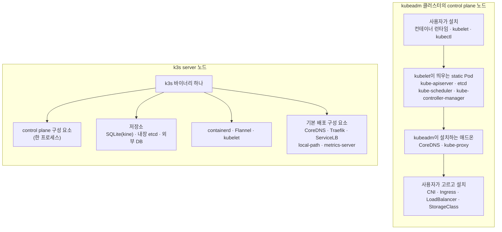

**kubeadm**은 쿠버네티스 프로젝트가 제공하는 클러스터 부트스트랩 도구입니다. 사용자가 각 노드에 미리 설치한 컨테이너 런타임과 kubelet 위에 upstream 쿠버네티스의 control plane을 띄우고 노드를 합류시키는 일만 맡습니다. **k3s**는 쿠버네티스 API를 그대로 제공하는(fully compliant) 배포판으로, control plane과 컨테이너 런타임, 파드 네트워크, 부가 기능을 100MB 미만의 바이너리 하나에 묶었습니다. 둘 다 같은 쿠버네티스 API를 제공하므로 매니페스트는 그대로 옮겨집니다. 다른 점은 클러스터를 이루는 부품을 누가 고르고 누가 관리하느냐입니다.

- **기준:** Kubernetes v1.37 문서(kubeadm 설치, kubeadm으로 클러스터 만들기, HA 토폴로지, kubeadm 인증서 관리), K3s 문서(v1.37.0+k3s1 시점)

## 왜 구분해야 하는가

쿠버네티스는 API 서버, etcd, 스케줄러, 컨트롤러 매니저, kubelet, kube-proxy 같은 구성 요소로 이루어집니다. 여기에 파드 네트워크(CNI), 클러스터 DNS, Ingress 컨트롤러, LoadBalancer 구현, 기본 StorageClass가 더해져야 서비스를 올려 외부에 열 수 있습니다. 이 부품을 고르고, 인증서를 만들고, 서로 연결하는 일이 클러스터 구성의 대부분입니다.

kubeadm은 이 중 "control plane을 모범 사례대로 띄우고 노드를 합류시키는 일"만 합니다. 공식 문서는 kubeadm을 쿠버네티스를 처음 써 보는 간단한 방법이자, 더 큰 설치 도구(Ansible, Terraform 등)의 부품으로 소개합니다. 컨테이너 런타임, kubelet, kubectl 설치와 CNI 애드온 선택은 사용자에게 남깁니다. k3s는 반대로 이 부품들을 미리 골라 한 바이너리에 넣고 기본으로 켜 둡니다.

그래서 둘의 차이는 "진짜 쿠버네티스냐 아니냐"가 아닙니다. 구성 결정을 사용자가 하느냐, 배포판이 미리 해 두느냐의 차이입니다. 이 차이가 장애 대응, 인증서 갱신, 고가용성 구성 방법까지 바꿉니다.

## 핵심 용어

| 용어 | 뜻 |
| :--- | :--- |
| upstream 쿠버네티스 | 쿠버네티스 프로젝트가 배포하는 구성 요소(kube-apiserver 등)를 그대로 쓰는 쿠버네티스 |
| 배포판(distribution) | upstream 쿠버네티스에 구성 요소 선택, 패키징, 기본값을 더해 하나의 제품으로 묶은 것 |
| **static Pod** | API 서버가 아니라 kubelet이 노드의 매니페스트 디렉터리를 읽어 직접 띄우는 파드. kubeadm은 control plane을 이 방식으로 띄웁니다 |
| **데이터 저장소(datastore)** | 클러스터의 모든 오브젝트 상태를 저장하는 곳. upstream 쿠버네티스는 etcd를 씁니다 |
| **kine** | etcd API를 SQLite, PostgreSQL, MySQL 등의 명령으로 번역하는 k3s 프로젝트의 계층(etcdshim) |
| **server / agent** | k3s에서 control plane과 저장소를 돌리는 노드 / 저장소와 control plane 없이 워크로드만 돌리는 노드 |
| **SAN** | Subject Alternative Name. 인증서가 유효한 호스트 이름과 IP 목록입니다. API 서버 인증서에 없는 주소로 접속하면 TLS 검증이 실패합니다 |
| **쿼럼(quorum)** | etcd가 쓰기를 확정하는 데 필요한 과반 멤버 수. 멤버가 n개면 (n/2)+1개입니다 |

## 구조의 차이

kubeadm으로 클러스터를 만들면 다음 순서로 부품이 채워집니다.

1. 사용자가 모든 노드에 CRI 호환 컨테이너 런타임과 `kubeadm`, `kubelet`, `kubectl`을 설치합니다. kubeadm은 kubelet과 kubectl을 설치하거나 관리하지 않으므로, 버전을 control plane과 맞추는 것도 사용자의 몫입니다.
2. `kubeadm init`이 사전 검사를 하고 CA와 인증서, kubeconfig를 만든 뒤 control plane과 etcd의 static Pod 매니페스트를 `/etc/kubernetes/manifests`에 씁니다. kubelet이 이 매니페스트를 읽어 파드를 띄웁니다.
3. kubeadm이 CoreDNS와 kube-proxy 애드온을 설치합니다.
4. 사용자가 CNI 애드온을 설치합니다. 파드 네트워크가 설치되기 전에는 CoreDNS가 뜨지 않습니다.
5. 다른 노드는 `kubeadm join`으로 bootstrap token을 써서 합류합니다.
6. Ingress 컨트롤러, LoadBalancer 구현, 기본 StorageClass는 포함되지 않으므로 필요하면 따로 설치합니다.

k3s는 한 바이너리가 이 과정을 대신합니다.

1. `k3s server`가 control plane 구성 요소를 한 프로세스 안에서 실행합니다. 저장소는 설정이 없으면 SQLite, 새 etcd 클러스터를 만들거나 합류하도록 설정했거나 디스크에 etcd 데이터가 있으면 내장 etcd, `--datastore-endpoint`를 주면 외부 DB를 씁니다.
2. 첫 server가 시작할 때 CA를 만들고, 이후 인증서 배포와 갱신을 k3s가 맡습니다.
3. server와 agent 모두 kubelet, 컨테이너 런타임(containerd), CNI(Flannel)를 실행합니다. 기본값에서는 server에도 워크로드가 올라갑니다.
4. server가 CoreDNS, Traefik, local-path-provisioner, metrics-server 매니페스트를 자동으로 배포하고, 내장 ServiceLB 컨트롤러가 LoadBalancer Service를 처리합니다. 필요 없는 구성 요소는 `--disable`로 끕니다.
5. agent는 토큰으로 server에 등록하고 웹소켓 연결을 유지합니다. agent 안의 클라이언트 측 로드밸런서가 server 목록을 들고 있어, server 하나가 꺼져도 다른 server로 붙습니다.

## 항목별 비교

| 구분 | kubeadm | k3s |
| :--- | :--- | :--- |
| 형태 | 부트스트랩 도구. 런타임과 kubelet은 별도 패키지 | 배포판. 100MB 미만의 바이너리 하나 |
| control plane 실행 | kubelet이 static Pod로 실행 | k3s 프로세스 안에서 실행 |
| 기본 저장소 | etcd | SQLite(kine) |
| 저장소 선택지 | stacked etcd, 외부 etcd | SQLite, 내장 etcd, 외부 etcd·MySQL·MariaDB·PostgreSQL |
| 파드 네트워크(CNI) | 포함하지 않음 | Flannel |
| Ingress 컨트롤러 | 포함하지 않음 | Traefik |
| LoadBalancer 구현 | 포함하지 않음 | ServiceLB |
| 기본 StorageClass | 포함하지 않음 | local-path-provisioner |
| NetworkPolicy 적용 | 설치한 CNI에 따름 | kube-router 네트워크 정책 컨트롤러 내장 |
| 인증서 유효 기간 | CA 10년, 나머지 1년 | CA 10년, 나머지 365일 |
| 인증서 자동 갱신 | control plane 업그레이드 때 | 만료 120일 이내면 k3s가 시작할 때마다 |
| HA 최소 구성 | control plane 3대(stacked etcd) + API 앞 로드밸런서 | 내장 etcd server 3대, 또는 외부 DB + server 2대 |
| 공식 최소 사양 | 머신마다 RAM 2GB, control plane은 CPU 2개 | server 2코어·RAM 2GB, agent 1코어·RAM 512MB |

## 데이터 저장소

upstream 쿠버네티스는 etcd에 상태를 저장합니다. k3s 문서도 etcd가 아닌 저장소로 쿠버네티스를 돌릴 수 있다는 점을 다른 배포판과 구별되는 특징으로 꼽습니다.

kubeadm은 두 가지 etcd 배치를 지원합니다. **stacked etcd**는 control plane 노드마다 etcd 멤버를 하나씩 두고 그 노드의 kube-apiserver와만 통신합니다. 구성과 관리가 간단하지만 노드 하나가 꺼지면 etcd 멤버와 control plane이 함께 줄어듭니다. **외부 etcd**는 etcd를 별도 호스트에 두어 이 결합을 끊는 대신 호스트가 두 배로 필요합니다.

k3s의 기본값인 SQLite는 kine을 거쳐 etcd API를 흉내 냅니다. 별도 etcd 프로세스가 없어 가볍지만, server가 여러 대인 클러스터에는 쓸 수 없습니다. server를 여러 대 두려면 내장 etcd나 외부 DB를 씁니다. SQLite로 시작한 단일 server는 `--cluster-init`을 주고 다시 시작하면 내장 etcd로 바뀌고, 그 뒤에 server를 추가할 수 있습니다.

외부 DB를 쓸 때는 두 가지를 확인해야 합니다. DB가 prepared statement를 지원해야 하므로 PgBouncer 같은 커넥션 풀러는 추가 설정이 필요할 수 있습니다. 또 kine은 revision이 0에서 시작해 1씩 늘어난다고 가정하므로, `auto_increment_increment`를 1보다 크게 두는 다중 마스터 DB(Galera 등)는 지원하지 않습니다.

> etcd는 쓰기가 많아 SD 카드나 eMMC로는 입출력을 감당하지 못합니다. k3s 문서는 라즈베리 파이 같은 장비에서도 외부 SSD를 권하고, 느린 디스크에서는 내장 etcd에 성능 문제가 생길 수 있다고 경고합니다.
{: .prompt-warning }

## 인증서와 SAN

kubeadm은 `kubeadm init` 때 CA와 인증서를 만들고, API 서버 인증서의 SAN도 이때 정합니다. 나중에 API 주소(VIP, 도메인)를 추가하려면 `ClusterConfiguration`의 `apiServer.certSANs`를 고치는 것만으로는 부족합니다. 기존 API 서버 인증서를 치우고 다시 만든 뒤 kube-apiserver를 재시작해야 합니다. 인증서는 control plane 업그레이드 때 모두 갱신됩니다. 공식 문서는 이 방식이 1년 안에 한 번씩 버전을 올리는 경우를 위한 것이라고 설명합니다. 업그레이드 간격이 1년을 넘으면 `kubeadm certs renew`로 직접 갱신해야 합니다.

k3s도 첫 server가 CA를 만듭니다. 다른 점은 SAN을 동적으로 추가할 수 있다는 것입니다. `--tls-san`으로 추가 이름과 IP를 받고, `--tls-san-security`가 켜져 있으면 쿠버네티스 apiserver 서비스, server 노드, `--tls-san` 값과 관계없는 이름은 추가를 거부합니다. HA에서 agent 등록용 고정 주소를 쓸 때는 그 주소를 `--tls-san`에 넣습니다. 만료됐거나 만료 120일 이내인 인증서는 k3s가 시작할 때마다 기존 키를 재사용해 자동으로 갱신됩니다. 120일 이내로 들어오면 `CertificateExpirationWarning` 이벤트가 생깁니다. 유효 기간 연장이 아니라 새 인증서와 키를 만들려면 `k3s certificate rotate`를 씁니다.

## 고가용성

두 방식 모두 etcd를 쓰는 HA는 쿼럼 규칙을 따릅니다. 멤버 3개는 1개, 5개는 2개까지 잃어도 버팁니다. 짝수로 늘리면 버틸 수 있는 장애 수는 그대로인데 장애가 날 수 있는 멤버만 늘어납니다. etcd 쿼럼은 (/posts/61/)에서 자세히 다룹니다.

kubeadm HA는 stacked etcd면 control plane 3대 이상, 외부 etcd면 control plane 3대와 etcd 3대 이상이 필요합니다. 두 토폴로지 모두 worker가 kube-apiserver에 로드밸런서를 거쳐 붙는다고 가정합니다. 로드밸런서나 VIP는 kubeadm이 만들어 주지 않습니다. 또 처음 `kubeadm init`을 `--control-plane-endpoint` 없이 했다면, 그 단일 control plane 클러스터를 HA로 바꾸는 것은 kubeadm이 지원하지 않습니다.

k3s HA는 내장 etcd면 server 3대 이상(홀수), 외부 DB면 server 2대 이상입니다. agent는 등록할 때만 고정 주소를 쓰고, 등록한 뒤에는 클라이언트 측 로드밸런서로 server에 직접 붙습니다. 다만 kubeconfig는 server 주소 하나를 가리키므로, kubectl 같은 클라이언트가 server 장애와 관계없이 한 주소로 붙으려면 고정 주소가 따로 있어야 합니다.

## 자원 사용

공식 최소 사양은 위 표와 같습니다. kubeadm 문서는 머신마다 RAM 2GB 이상, control plane은 CPU 2개 이상을 요구합니다. k3s는 server 2코어·2GB, agent 1코어·512MB를 최소로 적고, agent 수에 따라 server 사양을 늘리는 표를 따로 둡니다.

k3s라는 이름은 "메모리 사용량이 쿠버네티스의 절반"을 목표로 붙였습니다. 구성 요소를 한 프로세스로 묶고, 단일 server에서는 etcd 대신 SQLite를 쓰는 것이 이 목표를 위한 설계입니다. 실제 사용량은 워크로드, 켜 둔 구성 요소, 저장소 종류에 따라 달라지므로 이 글에서는 수치를 비교하지 않습니다.

## 어느 쪽을 고를까

| 상황 | 알맞은 쪽 | 이유 |
| :--- | :--- | :--- |
| CNI, Ingress, LoadBalancer, 저장소를 직접 고르고 싶음 | kubeadm | 빈 곳을 사용자가 채우는 구조라 선택에 제약이 없습니다 |
| upstream 문서와 구성을 그대로 따르고 싶음 | kubeadm | control plane이 upstream 구성 요소 그대로 static Pod로 뜹니다 |
| Ansible 같은 다른 자동화 도구의 한 단계로 씀 | kubeadm | 공식 문서가 더 큰 도구의 부품으로 쓰는 것을 전제로 합니다 |
| 작은 장비, ARM, 엣지, 에어갭 환경 | k3s | 바이너리 하나와 적은 최소 사양으로 돌도록 만들어졌습니다 |
| 단일 노드나 CI처럼 짧게 쓰는 클러스터 | k3s | SQLite 저장소와 기본 구성 요소로 바로 쓸 수 있습니다 |
| etcd를 직접 운영하지 않고 HA가 필요함 | k3s | 내장 etcd 또는 이미 운영 중인 SQL DB로 HA를 만듭니다 |
| 버전 업그레이드를 1년 넘게 미룰 수 있음 | k3s | 재시작만 해도 인증서가 갱신됩니다(kubeadm은 업그레이드나 수동 갱신이 필요) |

k3s의 기본 구성 요소를 대부분 끄고 다른 것으로 바꿀 계획이라면 두 방식의 차이가 줄어듭니다. 이때는 저장소, 인증서 관리, 업그레이드 방식처럼 끌 수 없는 부분을 기준으로 고릅니다.

## 흔한 오해

k3s는 쿠버네티스를 줄인 것이라 API가 다르다

- **실제:** k3s는 쿠버네티스 API를 그대로 제공하는 배포판입니다. 달라지는 것은 구성 요소를 패키징하고 기본값을 정한 방식입니다.
- **근거:** K3s 문서는 k3s를 "fully compliant Kubernetes distribution"으로 소개합니다.

k3s는 SQLite를 쓰므로 HA를 만들 수 없다

- **실제:** SQLite는 단일 server용 기본값일 뿐입니다. 내장 etcd(server 3대 이상)나 외부 DB(server 2대 이상)로 HA를 만듭니다.
- **근거:** K3s 문서 Cluster Datastore, High Availability Embedded etcd.

kubeadm으로 만들면 LoadBalancer Service가 바로 외부 주소를 받는다

- **실제:** 쿠버네티스는 로드밸런서 구성 요소를 직접 제공하지 않고, kubeadm도 CoreDNS와 kube-proxy 외의 애드온을 설치하지 않습니다. LoadBalancer 구현을 따로 설치해야 외부 주소가 할당됩니다.
- **근거:** Kubernetes 문서 Service의 `LoadBalancer` 설명, kubeadm으로 클러스터 만들기.

인증서는 둘 다 알아서 갱신된다

- **실제:** kubeadm은 control plane 업그레이드 때만 자동으로 갱신합니다. k3s는 시작할 때 만료 120일 이내인 인증서를 갱신하므로, 1년 넘게 재시작하지 않으면 만료될 수 있습니다.
- **근거:** Kubernetes 문서 Certificate Management with kubeadm, K3s 문서 k3s certificate.

## 정리

> - kubeadm은 upstream control plane을 static Pod로 띄우는 부트스트랩 도구이고, 런타임, CNI, Ingress, LoadBalancer, 저장소는 사용자가 채웁니다.
> - k3s는 control plane과 기본 구성 요소를 바이너리 하나에 묶은 배포판이고, 저장소로 SQLite, 내장 etcd, 외부 DB를 고를 수 있습니다.
> - 인증서는 kubeadm이 업그레이드 때, k3s가 재시작 때 갱신합니다. HA는 둘 다 etcd 쿼럼을 따르고, kubeadm은 API 앞 로드밸런서를 따로 준비해야 합니다.
{: .prompt-tip }

## 참고 자료

- [Kubernetes - Installing kubeadm](https://kubernetes.io/docs/setup/production-environment/tools/kubeadm/install-kubeadm/)
- [Kubernetes - Creating a cluster with kubeadm](https://kubernetes.io/docs/setup/production-environment/tools/kubeadm/create-cluster-kubeadm/)
- [Kubernetes - Implementation details (kubeadm)](https://kubernetes.io/docs/reference/setup-tools/kubeadm/implementation-details/)
- [Kubernetes - Options for Highly Available Topology](https://kubernetes.io/docs/setup/production-environment/tools/kubeadm/ha-topology/)
- [Kubernetes - Certificate Management with kubeadm](https://kubernetes.io/docs/tasks/administer-cluster/kubeadm/kubeadm-certs/)
- [Kubernetes - Reconfiguring a kubeadm cluster](https://kubernetes.io/docs/tasks/administer-cluster/kubeadm/kubeadm-reconfigure/)
- [K3s - Lightweight Kubernetes](https://docs.k3s.io/)
- [K3s - Architecture](https://docs.k3s.io/architecture)
- [K3s - Cluster Datastore](https://docs.k3s.io/datastore)
- [K3s - High Availability Embedded etcd](https://docs.k3s.io/datastore/ha-embedded)
- [K3s - Packaged Components](https://docs.k3s.io/installation/packaged-components)
- [K3s - k3s certificate](https://docs.k3s.io/cli/certificate)
- [K3s - k3s server](https://docs.k3s.io/cli/server)
- [K3s - Requirements](https://docs.k3s.io/installation/requirements)
- [k3s-io/kine](https://github.com/k3s-io/kine)
