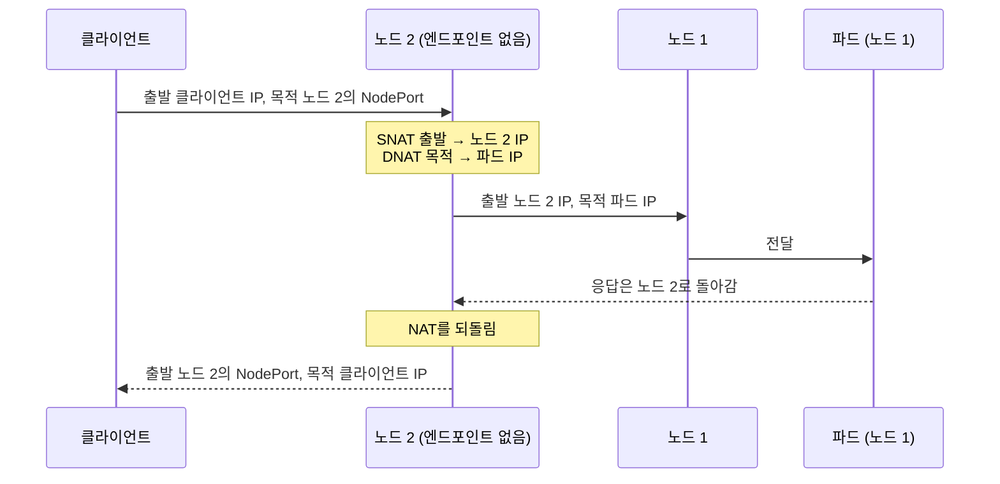
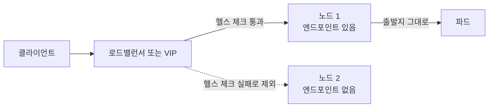

쿠버네티스 Service로 들어온 요청을 파드가 받으면, 파드가 보는 출발지 IP는 클라이언트의 실제 주소가 아니라 노드의 주소일 수 있습니다. kube-proxy가 NodePort와 LoadBalancer Service의 외부 트래픽을 다른 노드의 파드로도 보낼 수 있도록 출발지 주소를 노드 주소로 바꾸기(SNAT) 때문입니다. `externalTrafficPolicy`, hostPort, hostNetwork가 이 동작을 바꾸고, 프록시를 거칠 때는 X-Forwarded-For 같은 헤더가 원래 주소를 전달합니다.

- **기준:** Kubernetes v1.37 문서(Service, Virtual IPs and Service Proxies, Using Source IP, Create an External Load Balancer), CNI portmap 플러그인 문서, MDN X-Forwarded-For. kube-proxy는 기본 모드인 iptables 모드를 기준으로 하고, CNI가 kube-proxy를 대신하는 구성은 그 CNI 문서를 따릅니다.

## 왜 알아야 하는가

접속 로그, IP 기반 접근 제어, 요청 수 제한, 로그인 실패 차단은 모두 출발지 IP로 "누가 보냈는지"를 판단합니다. Service를 거치면서 출발지가 노드 주소로 바뀌면 이 판단이 모두 틀어집니다.

- 로그에는 모든 외부 요청이 노드 주소 몇 개에서 온 것으로 남습니다.
- 내부망 대역만 허용하는 규칙은 외부 요청도 노드 주소(내부망)에서 온 것으로 보고 통과시킵니다.
- 로그인 실패 차단은 공격자 대신 노드 주소를 막아, 그 노드를 거쳐 들어오는 모든 사용자를 함께 막습니다.

SNAT와 masquerade 자체는 (/posts/68/)에서 다룹니다. 설정은 한 줄이지만 원인은 여러 계층(kube-proxy, CNI, 프록시, 앱)에 걸쳐 있습니다. 어느 계층에서 주소가 바뀌는지 알아야 어디를 고칠지 정할 수 있습니다.

## 핵심 용어

| 용어 | 뜻 |
| :--- | :--- |
| **NAT** | 패킷의 주소를 바꿔 전달하는 것 |
| **SNAT** | 패킷의 출발지 주소를 바꾸는 것. 이 글에서는 대개 노드 주소로 바꾸는 것을 말합니다 |
| **DNAT** | 패킷의 목적지 주소를 바꾸는 것. 이 글에서는 Service 주소를 파드 주소로 바꾸는 것을 말합니다 |
| **masquerade** | 나가는 인터페이스의 주소로 SNAT하는 것. kube-proxy가 SNAT에 쓰는 방식입니다 |
| **kube-proxy** | 노드마다 돌며 Service 주소로 오는 트래픽을 파드로 보내는 규칙(iptables 등)을 관리하는 데몬 |
| **NodePort** | 모든 노드의 같은 포트로 Service를 여는 방식 |
| **LoadBalancer** | 외부 로드밸런서나 VIP를 Service에 붙이는 방식. 로드밸런서 구현은 쿠버네티스가 직접 제공하지 않습니다 |
| **externalTrafficPolicy** | 외부 트래픽을 모든 노드의 엔드포인트(`Cluster`)로 보낼지, 받은 노드의 엔드포인트(`Local`)로만 보낼지 정하는 Service 필드 |
| **healthCheckNodePort** | `Local` 정책에서 노드에 엔드포인트가 있는지 외부 로드밸런서에 알려 주는 헬스 체크 포트 |
| **hostPort** | 컨테이너 포트를 그 파드가 떠 있는 노드의 포트에 연결하는 설정 |
| **hostNetwork** | 파드가 노드의 네트워크 네임스페이스를 그대로 쓰는 설정 |
| **X-Forwarded-For** | 프록시가 원래 클라이언트 주소를 뒤에 전달하려고 덧붙이는 HTTP 헤더 |
| **신뢰할 프록시(trusted proxy)** | 앱이 X-Forwarded-For를 믿어도 되는 직전 프록시 주소 목록 |

## 동작 방식

기본값(`externalTrafficPolicy: Cluster`)에서 NodePort로 들어온 요청은 다음처럼 흐릅니다. Kubernetes 문서의 Using Source IP 예시와 같은 구조입니다.

1. 클라이언트가 노드 2의 NodePort로 요청을 보냅니다. LoadBalancer Service도 외부 로드밸런서나 VIP가 요청을 어느 노드로 넘기는 것으로 시작하므로 흐름이 같습니다.
2. 노드 2의 kube-proxy 규칙이 준비된 엔드포인트 중 하나를 고르고, 목적지를 파드 IP로 바꿉니다(DNAT).
3. 같은 규칙이 출발지를 노드 2의 IP로 바꿉니다(SNAT). 파드가 다른 노드에 있으면 응답이 NAT를 되돌릴 노드 2를 거쳐 가야 하기 때문입니다. 파드가 클라이언트에게 직접 응답하면 클라이언트는 자신이 보낸 적 없는 주소(파드 IP)에서 온 응답을 받게 됩니다.
4. 파드의 응답은 노드 2로 돌아가고, 노드 2가 주소를 되돌려 클라이언트에게 보냅니다.

iptables 모드 kube-proxy는 `Cluster` 정책이면 파드가 같은 노드에 있어도 외부 트래픽을 모두 masquerade합니다. 그래서 문서도 NodePort와 LoadBalancer로 들어온 패킷은 "기본으로 SNAT된다"고 설명합니다. 반면 클러스터 안의 파드가 ClusterIP로 보낸 요청은 SNAT되지 않아 클라이언트 파드의 IP가 그대로 보입니다.

## externalTrafficPolicy: Cluster와 Local

`Local`로 바꾸면 kube-proxy는 요청을 받은 노드의 엔드포인트로만 보내고 다른 노드로 넘기지 않습니다. 노드를 건너지 않으니 SNAT할 필요가 없어 출발지 IP가 보존됩니다. 대신 엔드포인트가 없는 노드에 도착한 요청은 버려집니다.

| 구분 | `Cluster` (기본값) | `Local` |
| :--- | :--- | :--- |
| 보내는 곳 | 모든 노드의 준비된 엔드포인트 | 요청을 받은 노드의 엔드포인트 |
| 출발지 IP | 노드 주소로 바뀜 | 보존됨 |
| 노드 간 추가 전달 | 생길 수 있음 | 없음 |
| 부하 분산 | 엔드포인트 전체에 고르게 퍼짐 | 노드별 파드 수가 다르면 치우칠 수 있음 |
| 엔드포인트가 없는 노드로 온 요청 | 다른 노드로 전달 | 버려짐 |
| 로드밸런서 쪽 조건 | 없음 | 엔드포인트가 있는 노드로만 보내야 함 |

`Local`은 로드밸런서가 협조해야 제대로 동작합니다. LoadBalancer Service를 `Local`로 두면 쿠버네티스가 `healthCheckNodePort`를 할당하고, 각 노드는 이 포트의 `/healthz`로 자신에게 엔드포인트가 있는지 알립니다. 클라우드 로드밸런서는 이 헬스 체크에 실패한 노드를 대상에서 뺍니다. VIP를 한 노드가 알리는 방식(/posts/69/)처럼 헬스 체크를 쓰지 않는 구현이라면, 엔드포인트가 있는 노드가 VIP를 가지는지를 그 구현의 문서로 확인해야 합니다. 그렇지 않으면 요청이 엔드포인트 없는 노드에 도착해 버려집니다.

## hostPort와 hostNetwork

Service를 거치지 않고 노드 포트로 직접 받으면 kube-proxy의 SNAT가 끼어들 자리가 없습니다.

- **hostPort:** CNI의 portmap 플러그인(또는 portMapping 기능을 가진 CNI)이 노드 포트로 온 연결의 목적지를 파드 주소로 바꾸는 DNAT 규칙을 만듭니다. SNAT는 노드 자신(localhost)에서 온 연결과 파드가 자기 hostPort로 되돌아오는 헤어핀 트래픽에만 적용하므로(`masqAll` 기본값 false), 외부 클라이언트의 주소는 보존됩니다. 파드가 떠 있는 노드에만 포트가 열리므로, 트래픽이 그 노드에 도착하게 하는 방법(DaemonSet과 VIP, DNS 등)이 따로 필요합니다.
- **hostNetwork:** 파드가 노드의 네트워크 네임스페이스를 그대로 쓰므로 앱이 노드 주소에서 직접 연결을 받습니다. 노드에 도착한 패킷을 NAT 없이 받으므로 출발지가 보존됩니다.

hostNetwork 파드라도 Service를 거쳐 접근하면 다시 kube-proxy 규칙을 탑니다. 예를 들어 hostNetwork 파드를 LoadBalancer Service로 열면 엔드포인트가 노드 주소일 뿐 `Cluster` 정책의 SNAT는 그대로 일어납니다. 두 방식 모두 노드 포트를 파드가 차지하고, Pod Security Standards의 Baseline 수준은 hostNetwork를 금지하고 hostPort를 금지하거나 알려진 목록으로 제한하라고 권합니다.

## 프록시를 거칠 때: X-Forwarded-For와 신뢰할 프록시

Ingress 컨트롤러, 클라우드 L7 로드밸런서, CDN처럼 연결을 끊고 새로 여는 프록시를 거치면 NAT와 관계없이 앱은 프록시의 주소를 봅니다. 이때 원래 주소는 패킷이 아니라 프록시가 붙여 주는 정보로 전달됩니다.

| 방법 | 계층 | 내용 |
| :--- | :--- | :--- |
| `X-Forwarded-For` | HTTP | 사실상의 표준 헤더. 프록시마다 직전 주소를 오른쪽에 덧붙입니다. 맨 왼쪽이 원래 클라이언트, 맨 오른쪽이 가장 최근 프록시입니다 |
| `Forwarded` | HTTP | RFC 7239의 표준 헤더. 같은 정보를 담지만 덜 쓰입니다 |
| PROXY protocol | TCP | 연결 맨 앞에 원래 주소를 적어 보내는 규약. HTTP가 아닌 트래픽에도 씁니다 |

헤더는 클라이언트도 마음대로 써 보낼 수 있습니다. 그래서 앱은 "직전 연결이 신뢰할 프록시에서 왔을 때만" 헤더를 믿어야 합니다. MDN은 보안 용도(요청 제한, 접근 제어)라면 헤더의 오른쪽부터 신뢰할 프록시 주소를 건너뛰고 처음 나오는 주소를 클라이언트로 보라고 권합니다. 맨 왼쪽 값은 위조할 수 있으므로 보안 판단에 쓰지 않습니다. 인터넷에서 앱에 직접 닿을 수 있다면 헤더의 어떤 값도 보안 용도로 믿을 수 없습니다.

SNAT와 프록시가 겹치면 두 가지를 더 확인해야 합니다.

- **첫 구간에서 주소를 잃으면 되살릴 수 없습니다.** Ingress 컨트롤러가 `Cluster` 정책의 LoadBalancer Service 뒤에 있으면, 컨트롤러가 보는 주소부터 노드 주소입니다. 컨트롤러는 그 노드 주소를 X-Forwarded-For에 적어 넘깁니다. 첫 번째로 연결을 받는 구성 요소에서 `Local`, hostPort, hostNetwork, PROXY protocol 중 하나로 주소를 지켜야 합니다.
- **신뢰 목록에 노드 주소를 넣으면 그 노드를 거친 모든 요청을 믿게 됩니다.** 프록시에서 앱으로 가는 구간이 SNAT되면 앱이 보는 직전 주소는 노드 주소이므로, 신뢰할 프록시에 노드 주소를 넣어야 합니다. 이때 프록시를 거치지 않고 같은 Service 경로로 들어온 외부 요청도 노드 주소로 보이므로, 그 요청이 위조한 헤더까지 믿게 됩니다. 앱에 닿는 경로가 프록시 하나뿐인지 먼저 확인합니다.

## IP 기반 로그인 차단에 미치는 영향

| 앱이 받는 경로와 설정 | 앱이 판단하는 주소 | 결과 |
| :--- | :--- | :--- |
| SNAT됨, 헤더를 믿지 않음 | 노드 주소 | 공격자 한 명의 실패로 노드 주소가 차단되어, 그 노드를 거치는 모든 사용자가 막힙니다 |
| SNAT됨, 모든 출처의 헤더를 믿음 | 클라이언트가 보낸 헤더 값 | 공격자가 요청마다 다른 값을 넣어 차단을 피하거나, 다른 사람의 주소를 넣어 그 사람을 차단시킬 수 있습니다 |
| SNAT됨, 노드 주소만 신뢰할 프록시로 등록 | 프록시가 적은 주소 | 프록시를 거친 요청은 정상입니다. 프록시를 거치지 않는 경로가 있으면 그 경로의 위조 헤더도 믿습니다 |
| 첫 구간에서 주소 보존, 신뢰 목록이 실제 프록시와 일치 | 실제 클라이언트 주소 | 의도대로 공격자 주소만 차단됩니다 |

앱에 따라 신뢰 목록에 없는 프록시가 X-Forwarded-For를 붙여 보낸 요청을 아예 거부하기도 합니다. Home Assistant는 X-Forwarded-For 사용과 신뢰할 프록시를 설정하지 않으면 리버스 프록시에서 온 요청을 차단합니다. 차단이 동작하는지 확인할 때는 설정 값만 보지 말고, 앱의 접속 로그나 차단 목록에 실제 클라이언트 주소가 찍히는지를 봅니다.

## 흔한 오해

LoadBalancer 타입이면 파드가 클라이언트 IP를 본다

- **실제:** LoadBalancer Service도 기본값 `Cluster` 정책에서는 SNAT되어 노드 주소가 보입니다.
- **근거:** Kubernetes 문서 Using Source IP의 `Type=LoadBalancer` 절, Create an External Load Balancer의 Preserving the client source IP.

externalTrafficPolicy를 Local로 바꾸면 항상 클라이언트 IP가 보인다

- **실제:** kube-proxy 구간의 SNAT만 없어집니다. 로드밸런서가 연결을 끊고 새로 여는 프록시라면 여전히 로드밸런서 주소가 보이고, 로드밸런서가 엔드포인트 없는 노드로 보내면 요청이 버려집니다.
- **근거:** Kubernetes 문서 Using Source IP의 Cross-platform support 절, Virtual IPs and Service Proxies의 External traffic policy.

ClusterIP로 받아도 SNAT된다

- **실제:** iptables 모드에서 클러스터 안의 파드가 ClusterIP로 보낸 요청은 SNAT되지 않고, 받는 파드는 보낸 파드의 IP를 봅니다.
- **근거:** Kubernetes 문서 Using Source IP의 `Type=ClusterIP` 절.

X-Forwarded-For의 첫 번째 값을 클라이언트 IP로 쓰면 된다

- **실제:** 맨 왼쪽 값은 클라이언트가 위조할 수 있습니다. 보안 용도라면 신뢰할 프록시가 붙인 값만 오른쪽부터 따져서 씁니다.
- **근거:** MDN X-Forwarded-For의 Security and privacy concerns, Selecting an IP address.

## 정리

> - `externalTrafficPolicy: Cluster`(기본값)에서 kube-proxy는 NodePort·LoadBalancer로 들어온 외부 트래픽을 다른 노드로도 보낼 수 있게 노드 주소로 SNAT하므로, 파드는 노드 주소를 봅니다.
> - `Local`, hostPort, hostNetwork는 kube-proxy의 SNAT를 피해 출발지를 보존합니다. `Local`은 로드밸런서가 엔드포인트 있는 노드로만 보내야 하고, hostPort와 hostNetwork는 트래픽이 파드가 있는 노드에 도착해야 합니다.
> - 프록시를 거치면 X-Forwarded-For로 원래 주소를 전달하되, 첫 구간에서 주소를 지키고 신뢰할 프록시를 정확히 정해야 IP 기반 로그인 차단이 공격자에게만 걸립니다.
{: .prompt-tip }

## 참고 자료

- [Kubernetes - Using Source IP](https://kubernetes.io/docs/tutorials/services/source-ip/)
- [Kubernetes - Create an External Load Balancer](https://kubernetes.io/docs/tasks/access-application-cluster/create-external-load-balancer/)
- [Kubernetes - Service](https://kubernetes.io/docs/concepts/services-networking/service/)
- [Kubernetes - Virtual IPs and Service Proxies](https://kubernetes.io/docs/reference/networking/virtual-ips/)
- [Kubernetes - Network Plugins](https://kubernetes.io/docs/concepts/extend-kubernetes/compute-storage-net/network-plugins/)
- [Kubernetes - Pod Security Standards](https://kubernetes.io/docs/concepts/security/pod-security-standards/)
- [kubernetes/kubernetes - kube-proxy iptables proxier](https://github.com/kubernetes/kubernetes/blob/master/pkg/proxy/iptables/proxier.go)
- [CNI - Port-mapping plugin](https://www.cni.dev/plugins/current/meta/portmap/)
- [RFC 7239 - Forwarded HTTP Extension](https://www.rfc-editor.org/rfc/rfc7239)
- [HAProxy - The PROXY protocol](https://www.haproxy.org/download/1.8/doc/proxy-protocol.txt)
- [MDN - X-Forwarded-For](https://developer.mozilla.org/en-US/docs/Web/HTTP/Reference/Headers/X-Forwarded-For)
- [Home Assistant - HTTP integration](https://www.home-assistant.io/integrations/http/)
