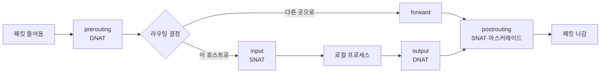
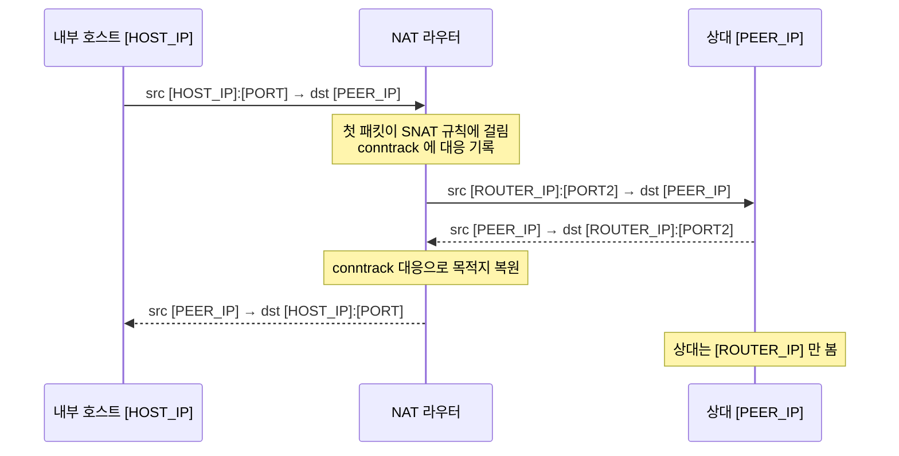
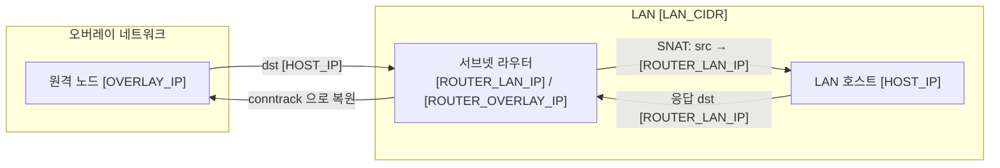
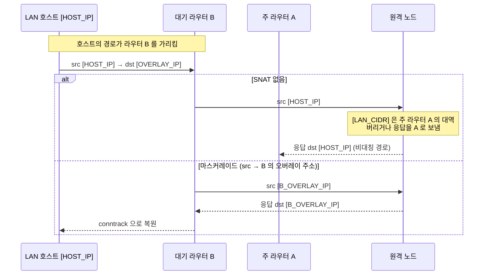
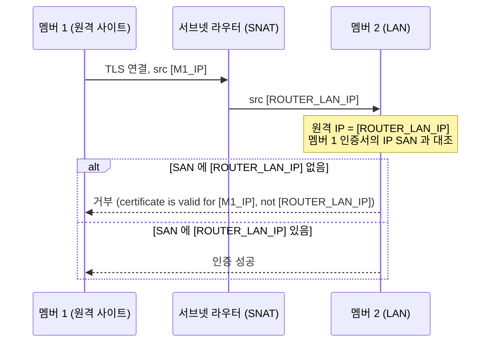

**NAT**(Network Address Translation)는 라우터가 패킷을 넘기면서 IP 헤더의 주소를 바꾸는 기능입니다. 출발지 주소를 바꾸면 **SNAT**, 목적지 주소를 바꾸면 **DNAT** 이고, 나가는 인터페이스의 주소로 출발지를 바꾸는 SNAT 의 특수한 형태를 **마스커레이드**라고 부릅니다. 받는 쪽이 모르는 주소 대역을 자기가 아는 주소로 바꿔 주어 응답이 돌아올 길을 만드는 것이 NAT 의 핵심이고, 오버레이 네트워크의 **서브넷 라우터**도 같은 이유로 SNAT 를 씁니다.

- **기준:** RFC 3022 (Traditional NAT), netfilter/nftables 위키 "Performing Network Address Translation", `iptables-extensions(8)`, WireGuard 공식 문서(Cryptokey Routing), Tailscale 문서(Subnet routers, Site-to-site networking, High availability, 2026-09 확인), etcd v3.6 보안 문서

## 왜 필요한가

패킷이 목적지에 닿는 것만으로는 통신이 되지 않습니다. 받는 쪽이 **출발지 주소로 응답을 돌려보낼 수 있어야** 합니다. 받는 쪽의 라우팅 표에 그 출발지 대역으로 가는 경로가 없으면 응답은 기본 게이트웨이로 가 버리고, 요청은 닿았는데 응답이 돌아오지 않는 상태가 됩니다.

- 사설 주소(RFC 1918)를 쓰는 가정망의 호스트가 인터넷으로 나갈 때, 인터넷의 서버는 사설 주소로 응답할 방법이 없습니다. 공유기가 출발지를 자기 공인 주소로 바꿔야 응답이 공유기로 돌아옵니다.
- 오버레이 네트워크(VPN, Tailscale 같은 메시 네트워크)에서 원격 노드가 LAN 의 호스트에 접속할 때, LAN 호스트는 오버레이 대역을 모릅니다. 서브넷 라우터가 출발지를 자기 LAN 주소로 바꾸면 LAN 호스트는 아는 주소로 응답합니다.

NAT 는 이렇게 받는 쪽의 라우팅 설정을 바꾸지 않고 응답 경로를 만듭니다. 대가는 받는 쪽이 **원래 출발지 주소를 볼 수 없다**는 점입니다. 접속 기록, IP 기반 허용 목록, 상대 주소를 인증서와 대조하는 TLS 검사가 모두 바뀐 주소를 기준으로 동작합니다.

## 핵심 용어

| 용어 | 뜻 |
| :--- | :--- |
| NAT | 라우터가 패킷의 IP 주소(와 포트)를 바꿔 넘기는 기능 |
| SNAT | 출발지 주소를 정해 둔 주소로 바꾸는 NAT |
| DNAT | 목적지 주소를 다른 주소로 바꾸는 NAT. 포트 포워딩이 대표적 |
| 마스커레이드 | 출발지를 패킷이 나가는 인터페이스의 주소로 바꾸는 SNAT |
| NAPT | 여러 주소를 한 주소로 모으면서 포트까지 바꾸는 NAT (RFC 3022) |
| conntrack | 리눅스 커널이 연결마다 상태와 NAT 대응을 기억하는 연결 추적 기능 |
| netfilter 훅 | 커널이 패킷 경로의 정해진 지점에서 규칙을 실행하는 자리 (prerouting, input, output, postrouting 등) |
| 오버레이 네트워크 | 기존 네트워크 위에 터널로 만든 가상 네트워크 |
| 서브넷 라우터 | 오버레이 네트워크에 자기 뒤의 LAN 대역을 광고하고, 그 대역으로 가는 트래픽을 LAN 으로 넘기는 노드 |
| IP SAN | TLS 인증서의 Subject Alternative Name 에 들어 있는 IP 주소 항목 |

## NAT 의 동작 방식

리눅스에서 NAT 는 netfilter 가 합니다. 규칙은 iptables 나 nftables 로 넣고, 어느 훅에서 실행되느냐에 따라 할 수 있는 일이 정해집니다.



- **DNAT 는 라우팅 전에:** 목적지를 바꾸면 패킷이 갈 곳이 달라지므로 라우팅 결정 전의 prerouting(로컬에서 만든 패킷은 output)에서 바꿉니다. `iptables-extensions(8)` 은 DNAT 가 nat 테이블의 PREROUTING·OUTPUT 체인에서만 유효하다고 적습니다.
- **SNAT 는 라우팅 뒤에:** 어느 인터페이스로 나갈지 정해진 뒤 postrouting 에서 출발지를 바꿉니다(이 호스트로 들어오는 패킷은 input). nftables 위키는 LAN 에서 인터넷으로 나가는 트래픽을 SNAT 하려면 nat 테이블의 postrouting 체인을 만들라고 안내합니다.
- **마스커레이드:** SNAT 와 같지만 바꿀 주소를 규칙에 적지 않고 나가는 인터페이스의 주소를 그때그때 씁니다. `iptables-extensions(8)` 은 인터페이스가 내려가면 그 연결들을 잊는 동작까지 포함한다고 설명하고, 주소가 고정이면 SNAT 를 쓰라고 권합니다.

## 연결 추적: 첫 패킷만 규칙을 탄다

NAT 규칙은 연결의 **첫 패킷**에만 적용됩니다. 첫 패킷이 규칙에 걸리면 conntrack 이 "원래 주소 ↔ 바뀐 주소" 대응(NAT 바인딩)을 기억하고, 이후 같은 연결의 패킷과 **응답 패킷은 규칙을 다시 찾지 않고** 이 대응대로 바꿉니다. 응답은 반대 방향으로 되돌려 바꾸므로, 응답용 규칙을 따로 적지 않아도 됩니다.



nftables 규칙으로 쓰면 다음과 같은 모양입니다(주소와 인터페이스는 자리표시자).

```text
table ip nat {
    chain postrouting {
        type nat hook postrouting priority srcnat;
        ip saddr [LAN_CIDR] oifname "[OUT_IF]" masquerade
    }
}
```

이 구조 때문에 NAT 라우터는 **연결 상태를 가진 장비**가 됩니다. 연결 도중 다른 라우터로 경로가 바뀌면 새 라우터에는 그 연결의 NAT 바인딩이 없고 상대가 보는 출발지 주소도 달라지므로, 기존 연결은 이어지지 않고 새로 맺어야 합니다.

## 서브넷 라우터의 동작 방식

오버레이 네트워크에 모든 장비를 올릴 수 없을 때(프린터, 설치 권한이 없는 장비, 가상 머신 여러 대 등) LAN 에 있는 한 노드가 **서브넷 라우터**가 되어 LAN 대역 전체를 오버레이에 광고합니다. 원격 노드는 그 대역으로 가는 패킷을 서브넷 라우터로 보내고, 서브넷 라우터는 패킷을 LAN 으로 넘깁니다. Tailscale 에서는 `--advertise-routes` 로 광고하고 관리 화면이나 `autoApprovers` 정책으로 승인합니다.



## 오버레이에서 LAN 으로: 기본 SNAT

Tailscale 서브넷 라우터는 기본으로 SNAT 를 합니다. 공식 문서에 따르면 SNAT 가 켜져 있으면 서브넷 라우터 뒤의 장비는 트래픽이 원래 장비가 아니라 **라우터에서 온 것으로** 봅니다. LAN 호스트는 자기 LAN 안의 라우터 주소로 응답하면 되므로, LAN 쪽에 아무 설정도 필요 없습니다.

리눅스에서는 `--snat-subnet-routes=false` 로 SNAT 를 끌 수 있습니다. 그러면 LAN 호스트가 원래 출발지 주소(오버레이 주소나 다른 사이트의 LAN 주소)를 보지만, 문서가 적은 대로 그 주소로 돌아가는 길은 모릅니다. 그래서 사이트 간 연결(site-to-site) 문서는 SNAT 를 끄는 대신 각 LAN 의 장비나 라우터에 "원격 대역은 서브넷 라우터로" 라는 정적 경로를 넣게 합니다.

| 구분 | SNAT 켬 (기본) | SNAT 끔 |
| :--- | :--- | :--- |
| LAN 호스트가 보는 출발지 | 서브넷 라우터의 LAN 주소 | 원래 출발지 주소 |
| LAN 쪽 추가 설정 | 없음 | 원격 대역으로 가는 경로 필요 |
| 접속 기록·허용 목록 | 라우터 주소 기준 | 원래 주소 기준 |
| 라우터가 바뀔 때 | 출발지 주소가 바뀜 | 출발지 주소는 그대로 |

## LAN 에서 오버레이로: 라우터가 여러 대일 때 SNAT 가 필요한 이유

반대 방향도 같은 원리입니다. LAN 호스트가 오버레이의 노드에 접속하려면 오버레이 대역으로 가는 패킷을 서브넷 라우터로 보내야 하고, 받는 원격 노드는 **LAN 출발지 주소로 응답을 보낼 수 있어야** 합니다.

서브넷 라우터를 여러 대 두어 이중화하면 이 조건이 까다로워집니다. Tailscale 은 같은 대역을 광고하는 서브넷 라우터가 여러 대일 때 모든 클라이언트가 **한 번에 한 대(주 라우터)** 만 쓰는 장애 조치 방식을 씁니다. 원격 노드에게 그 LAN 대역은 주 라우터 뒤에 있는 대역입니다.



- **SNAT 없이 대기 라우터로 나가면:** 원격 노드는 LAN 출발지를 가진 패킷을 대기 라우터에게서 받습니다. Tailscale 이 쓰는 WireGuard 는 받은 패킷의 출발지 주소가 보낸 피어에게 허용된 주소 목록(AllowedIPs)에 없으면 버립니다. Tailscale 이 이 경우를 정확히 어떻게 처리하는지는 공식 문서에서 확인하지 못했지만, 받아들이더라도 응답은 그 대역의 주인인 주 라우터로 가므로 경로가 비대칭이 됩니다.
- **라우터마다 마스커레이드하면:** 각 라우터가 LAN 에서 오버레이로 나가는 패킷의 출발지를 **자기 오버레이 주소**로 바꿉니다. 원격 노드는 그 라우터 자신에게 응답하고, 응답은 패킷을 내보낸 바로 그 라우터로 돌아와 conntrack 으로 원래 호스트에게 전달됩니다. 어느 라우터가 주 라우터인지와 상관없이 경로가 대칭이 됩니다.

정리하면 SNAT(마스커레이드)는 "출발지 대역의 주인" 과 "실제로 패킷을 내보낸 라우터" 가 다를 수 있는 곳에서 둘을 일치시키는 장치입니다. 대신 원격 노드가 보는 출발지는 호스트 주소가 아니라 **라우터 주소**가 되고, 라우터가 여러 대면 그중 어느 것이든 될 수 있습니다.

## 주소가 바뀌면 TLS 인증서에 무엇을 넣어야 하나

대부분의 TLS 검증은 NAT 의 영향을 받지 않습니다. 클라이언트는 자기가 접속한 이름이나 주소를 서버 인증서와 비교하고, 서버는 클라이언트 인증서가 믿는 CA 가 서명한 것인지만 봅니다. 그런데 일부 소프트웨어는 **연결의 원격 주소**를 상대 인증서의 IP SAN 과 대조합니다. 이때는 NAT 로 바뀐 주소가 기준이 됩니다.

etcd 가 대표적입니다. etcd 보안 문서에 따르면 v3.2.0 부터 서버는 peer 인증서에 IP SAN 이 하나라도 있으면 **원격 IP 가 그중 하나와 일치할 때만** peer 를 인증합니다. 인증서에 DNS 이름만 있으면 그 이름을 조회한 주소(또는 원격 IP 의 역방향 조회 결과)가 원격 IP 와 맞는지 봅니다.



그래서 NAT 를 거치는 peer 연결에서는 다음을 지킵니다.

- 인증서에는 자기 주소가 아니라 **받는 쪽이 보게 될 주소**를 넣습니다. SNAT 를 거친다면 NAT 가 바꿔 넣는 주소(서브넷 라우터의 LAN 주소나 오버레이 주소)입니다.
- 라우터가 여러 대라 어느 라우터로든 나갈 수 있다면 **모든 라우터의 바뀐 주소**를 넣습니다. 주 라우터가 바뀌면 원격 주소도 바뀌기 때문입니다.
- 방향마다 따로 봅니다. A → B 연결에서 B 가 보는 주소와 B → A 연결에서 A 가 보는 주소는 서로 다른 NAT 를 거칠 수 있으므로, 각자의 인증서에 상대가 보게 될 자기 주소를 넣습니다.

같은 이유로 IP 로 허용 여부를 정하는 설정(리버스 프록시의 신뢰 프록시 목록, DB 의 접속 허용 대역 등)도 NAT 가 바꾼 주소를 기준으로 적어야 합니다.

## 흔한 오해

<details markdown="1">
<summary>NAT 를 하면 응답 패킷에도 반대 방향 규칙을 적어야 한다</summary>

- **실제:** NAT 규칙은 연결의 첫 패킷에만 적용되고, 같은 연결의 이후 패킷과 응답은 conntrack 이 기억한 대응으로 자동으로 바뀝니다.
- **근거:** nftables 위키는 첫 패킷으로 NAT 바인딩을 만들고 이후 패킷은 규칙을 찾지 않고 그 바인딩을 쓴다고 설명합니다. `iptables-extensions(8)` 도 SNAT·DNAT 가 이 연결의 이후 패킷을 모두 바꾼다고 적습니다.

</details>

<details markdown="1">
<summary>마스커레이드와 SNAT 는 같다</summary>

- **실제:** 바꾸는 방향은 같지만, 마스커레이드는 나가는 인터페이스의 현재 주소를 쓰고 인터페이스가 내려가면 연결 대응을 잊습니다. 주소가 바뀔 수 있는 인터페이스에 알맞고, 주소가 고정이면 SNAT 가 권장됩니다.
- **근거:** `iptables-extensions(8)` 의 MASQUERADE 설명, nftables 위키의 "SNAT 의 특수한 경우" 설명.

</details>

<details markdown="1">
<summary>SNAT 를 끄면 항상 더 낫다</summary>

- **실제:** SNAT 를 끄면 원래 출발지가 보존되지만, 받는 쪽마다 그 출발지로 돌아가는 경로를 넣어야 합니다. 라우터가 여러 대라 출발지 대역의 주인과 패킷을 내보낸 라우터가 다를 수 있으면 비대칭 경로가 생깁니다.
- **근거:** Tailscale 서브넷 라우터 문서(SNAT 를 끄면 LAN 장비가 돌아갈 경로를 모름), 사이트 간 연결 문서(정적 경로 필요), 고가용성 문서(한 번에 한 라우터만 사용).

</details>

## 정리

> - SNAT 는 출발지, DNAT 는 목적지를 바꾸고, 마스커레이드는 나가는 인터페이스 주소로 바꾸는 SNAT 입니다. 리눅스에서는 netfilter 의 postrouting(SNAT)과 prerouting(DNAT)에서 동작합니다.
> - NAT 규칙은 연결의 첫 패킷에만 적용되고 conntrack 이 응답을 되돌려 바꿉니다. 그래서 NAT 라우터가 바뀌면 기존 연결은 이어지지 않습니다.
> - 서브넷 라우터는 받는 쪽이 모르는 대역을 자기 주소로 바꿔 응답 경로를 만듭니다. 라우터가 여러 대면 라우터마다 SNAT 해야 응답이 패킷을 내보낸 라우터로 돌아옵니다.
> - 원격 주소를 인증서와 대조하는 소프트웨어(etcd peer 인증 등)에서는 인증서 IP SAN 에 NAT 가 바꿔 넣는 주소, 라우터가 여러 대면 그 전부를 넣습니다.
{: .prompt-tip }

## 참고 자료

- [RFC 3022 - Traditional IP Network Address Translator (Traditional NAT)](https://www.rfc-editor.org/rfc/rfc3022)
- [RFC 1918 - Address Allocation for Private Internets](https://www.rfc-editor.org/rfc/rfc1918)
- [nftables wiki - Performing Network Address Translation (NAT)](https://wiki.nftables.org/wiki-nftables/index.php/Performing_Network_Address_Translation_(NAT))
- [iptables-extensions(8) - Linux manual page](https://man7.org/linux/man-pages/man8/iptables-extensions.8.html)
- [WireGuard - Cryptokey Routing](https://www.wireguard.com/#cryptokey-routing)
- [Tailscale - Subnet routers](https://tailscale.com/kb/1019/subnets)
- [Tailscale - Site-to-site networking](https://tailscale.com/kb/1214/site-to-site)
- [Tailscale - High availability](https://tailscale.com/kb/1115/high-availability)
- [etcd v3.6 - Transport security model](https://etcd.io/docs/v3.6/op-guide/security/)
