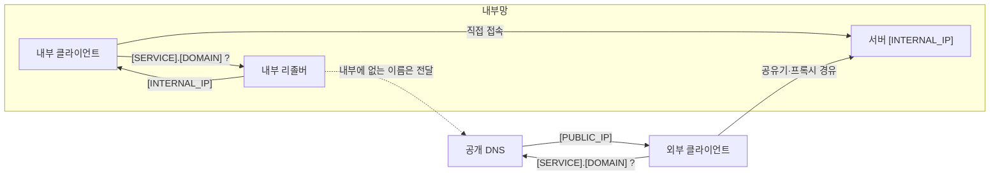
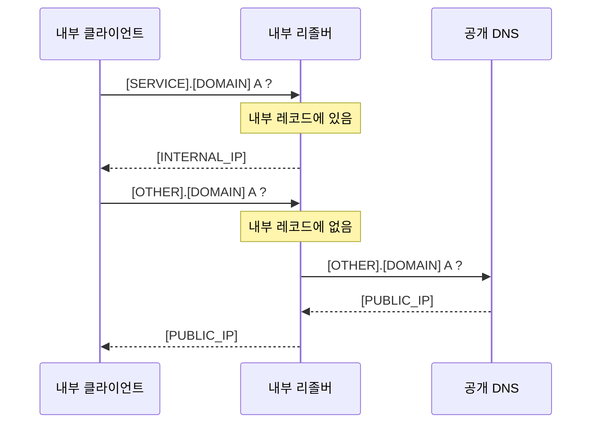
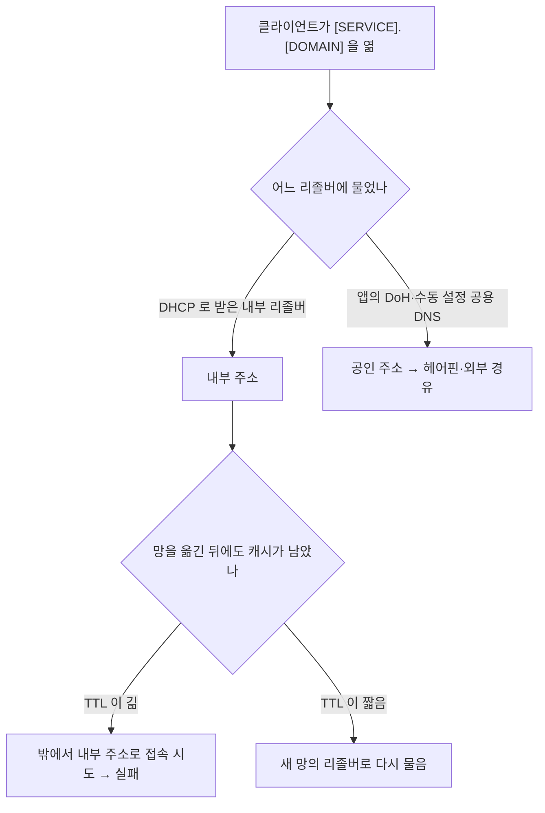

**Split-horizon DNS**(split DNS)는 같은 도메인 이름에 대해 질의가 어디서 왔는지에 따라 다른 답을 주는 DNS 구성입니다. 집이나 사무실 안에서는 `[SERVICE].[DOMAIN]` 이 내부 주소로, 인터넷에서는 공인 주소로 풀리게 해, 사용자는 어디서든 같은 이름을 쓰고 트래픽은 가장 가까운 길로 갑니다.

- **기준:** RFC 9499 (DNS 용어, 6.4절 "Split DNS"·"View"), RFC 4787 (NAT 동작 요구사항, 헤어핀), RFC 2308 (부정 응답 캐시), RFC 8375 (`home.arpa`), RFC 9525 (TLS 서비스 식별), `resolv.conf(5)`, dnsmasq 매뉴얼, Mozilla Firefox 도움말(canary domain), Let's Encrypt 문서(챌린지 종류)

## 정의

RFC 9499 는 split DNS 와 split-horizon DNS 가 오래 공식 정의 없이 쓰여 왔다고 밝히고, 대체로 특정 도메인에 대해 권한 있는 DNS 서버가 **질의의 출처에 따라** 일부 또는 전부 다른 답을 주는 상황을 가리킨다고 정리합니다. 같은 문서는 출처 IP 같은 질의의 속성에 따라 다른 응답을 주는 서버 설정을 **뷰**(view)라고 부릅니다.

실제 구성은 크게 두 가지입니다.

- **서버 하나에 뷰 여러 개:** 권한 서버가 질의의 출발 주소를 보고 내부 뷰와 외부 뷰 가운데 하나로 답합니다.
- **서버를 나누는 방식:** 공개 DNS 는 공인 주소만 알고, 내부망에는 별도의 리졸버를 두어 일부 이름만 내부 주소로 답하고 나머지는 공개 DNS 로 넘깁니다. 내부 클라이언트는 DHCP 로 이 내부 리졸버를 받습니다. dnsmasq 같은 가벼운 리졸버로 흔히 만드는 형태입니다.

## 왜 필요한가

서비스를 인터넷에 공개하면 DNS 의 공개 레코드는 공유기의 공인 주소나 앞단 프록시 주소를 가리킵니다. 내부 클라이언트가 이 공개 레코드를 그대로 쓰면 다음 문제가 생깁니다.

- **헤어핀 NAT 에 기댐:** 내부 클라이언트가 자기 공유기의 공인 주소로 접속하면, 공유기는 그 패킷을 다시 내부 서버로 돌려보내야 합니다. RFC 4787 은 이를 **헤어핀**(hairpinning)이라 부르고 NAT 가 지원해야 한다고(REQ-9) 정하지만, 가정용 공유기가 모두 지원하지는 않습니다. 지원하지 않으면 밖에서는 되는데 안에서는 안 되는 상황이 됩니다.
- **내부 트래픽이 밖으로 돎:** 공개 레코드가 클라우드 프록시(CDN, 터널 등)를 가리키면, 같은 건물 안의 서버에 붙는 트래픽이 외부 회선을 왕복합니다. 내부망보다 느린 업로드 회선이 병목이 되고, 인터넷이 끊기면 같은 건물 안의 서버에도 접속할 수 없습니다.
- **이름과 인증서를 두 벌 관리함:** 내부용 이름(`[SERVICE].lan` 등)을 따로 두면 공개 CA 가 그 이름으로 인증서를 발급하지 않으므로, 내부에서는 사설 CA 를 배포하거나 인증서 경고를 감수해야 합니다.

Split-horizon DNS 는 이름을 하나로 유지한 채 답만 바꿉니다. 내부 클라이언트는 내부 주소를 받아 서버에 직접 붙고, 서버는 공개 이름으로 발급받은 인증서를 그대로 내놓습니다. RFC 9525 에 따라 TLS 클라이언트는 자기가 연 이름을 기준으로 인증서의 이름을 확인하고 DNS 조회 결과는 검증에 쓰지 않으므로, 내부 주소로 붙어도 인증서 검증을 통과합니다. 서버가 인터넷에서 들어올 수 없는 곳에 있어도, Let's Encrypt 의 DNS-01 챌린지는 도메인의 DNS 에 TXT 레코드를 넣어 소유를 증명하므로 공개 인증서를 받을 수 있습니다((/posts/57/)).

## 핵심 용어

| 용어 | 뜻 |
| :--- | :--- |
| Split-horizon DNS | 같은 이름에 대해 질의의 출처에 따라 다른 답을 주는 DNS 구성. split DNS 라고도 함 |
| 뷰 (view) | 질의의 출발 주소 등 속성에 따라 다른 응답을 고르는 DNS 서버 설정 단위 |
| 리졸버 | 클라이언트 대신 이름을 찾아 주고 결과를 캐시하는 DNS 서버 |
| 헤어핀 (hairpinning) | 내부 호스트끼리 공인 주소로 접속할 때 NAT 가 패킷을 다시 내부로 돌려보내는 동작 |
| TTL | 응답을 캐시해도 되는 시간(초) |
| 부정 응답 캐시 | "그런 이름 없음(NXDOMAIN)"·"그 종류 레코드 없음(NODATA)" 응답을 캐시하는 것 |
| DoH (DNS over HTTPS) | DNS 질의를 HTTPS 로 보내는 방식. 앱이 OS 가 받은 리졸버 대신 자기 리졸버를 쓸 수 있음 |
| 검색 도메인 | 점이 적은 이름 뒤에 리졸버가 차례로 붙여 보는 도메인 목록 (`resolv.conf` 의 `search`) |
| 와일드카드 레코드 | `*.[DOMAIN]` 처럼 존재하지 않는 모든 하위 이름에 답하는 레코드 |

## 동작 방식

서버를 나누는 방식(내부 리졸버 + 공개 DNS)을 예로 들면 흐름은 다음과 같습니다.

1. 공유기 DHCP 가 내부 클라이언트에게 내부 리졸버 주소를 DNS 서버로 줍니다.
2. 내부 리졸버는 내부에서 다르게 답할 이름만 레코드로 가지고 있습니다. dnsmasq 에서는 `host-record` 나 `/etc/hosts`·`addn-hosts` 파일로 이름 하나하나를 넣을 수 있고, `address=/[DOMAIN]/[IP]` 처럼 도메인과 그 하위 이름 전체에 한 주소를 답하게 할 수도 있습니다.
3. 내부 레코드에 없는 이름은 공개 DNS 로 넘겨, 내부에서도 나머지 공개 이름은 공개 주소로 풀립니다.
4. 외부 클라이언트는 내부 리졸버를 모르므로 공개 DNS 의 답만 받습니다.

뷰 방식은 이 판단을 권한 서버 한 곳에서 합니다. 어느 방식이든 핵심은 "누가 물었는지에 따라 다른 답" 이고, 누가 물었는지를 주로 질의의 출발 주소나 질의가 들어온 리졸버로 가립니다.

## 함정

Split-horizon DNS 는 클라이언트가 **어느 리졸버에 물었고 그 답을 얼마나 오래 들고 있는지**에 기대는 구성입니다. 그 전제가 깨지는 곳에서 문제가 생깁니다.

- **캐시:** 노트북이나 휴대전화가 내부망에서 받은 내부 주소를 캐시한 채 밖으로 나가면, TTL 이 끝날 때까지 닿지 않는 내부 주소로 접속을 시도합니다. 반대 방향도 같습니다. 그래서 내부 응답은 TTL 을 짧게 두는 것이 안전합니다. dnsmasq 는 설정 파일과 `/etc/hosts` 에서 나온 응답의 TTL 을 기본 0 으로 보내 클라이언트가 캐시하지 않게 하고, `local-ttl` 로 바꿀 수 있습니다. "이름 없음" 같은 부정 응답도 RFC 2308 에 따라 SOA 레코드가 정한 시간만큼 캐시되므로, 레코드를 새로 만든 직후 한동안 없다고 나올 수 있습니다.
- **다른 리졸버를 쓰는 클라이언트:** 앱이나 OS 가 DHCP 로 받은 리졸버 대신 공용 리졸버를 직접 쓰면 내부 답을 받지 못합니다. 수동으로 공용 DNS 를 넣은 기기, 브라우저의 DoH 가 여기에 해당합니다. Firefox 는 기본으로 켜진 DoH 에 한해, OS 의 리졸버로 canary domain `use-application-dns.net` 을 물어 NXDOMAIN 이나 빈 응답이 오면 DoH 를 끕니다. 사용자가 직접 켠 DoH 에는 이 신호가 적용되지 않습니다. 이런 클라이언트는 공인 주소를 받으므로 헤어핀이나 외부 경유 경로로 동작하거나, 그 경로가 없으면 접속하지 못합니다.
- **와일드카드 레코드와 검색 도메인:** 내부 리졸버에 도메인 전체를 한 주소로 답하는 규칙(dnsmasq 의 `address=/[DOMAIN]/[IP]` 처럼 하위 이름 전체에 걸리는 규칙)을 두면, 내부에서 따로 답할 생각이 없던 같은 도메인의 다른 공개 이름까지 그 주소로 풀립니다. 검색 도메인과 만나면 더 넓게 깨집니다. `resolv.conf` 는 이름의 점 개수가 `ndots` 보다 적으면 검색 도메인을 먼저 붙여 봅니다. 쿠버네티스 파드는 `ndots:5` 를 쓰므로, 검색 목록에 `[DOMAIN]` 이 들어가 있으면 `github.com` 을 풀 때 `github.com.[DOMAIN]` 을 먼저 묻고, 와일드카드가 여기에 답해 버리면 외부 이름이 내부 주소로 풀립니다. 공유기가 DHCP 로 그 도메인을 검색 도메인으로 주는 환경에서 이 조합이 생깁니다. 이름을 하나씩 등록하면 이 문제가 없습니다.

## 비슷한 개념과 비교

| 구분 | Split-horizon DNS | 내부 전용 도메인 (`home.arpa` 등) | 헤어핀 NAT 에만 의존 |
| :--- | :--- | :--- | :--- |
| 이름 | 공개 이름 하나를 안팎에서 같이 씀 | 내부용 이름을 따로 씀 | 공개 이름 하나 |
| 내부에서의 경로 | 서버로 직접 | 서버로 직접 | 공유기를 돌아 들어옴 |
| 공개 CA 인증서 | 그대로 쓸 수 있음 | 발급받을 수 없어 사설 CA 가 필요 | 그대로 쓸 수 있음 |
| 인터넷이 끊겼을 때 내부 접속 | 됨 | 됨 | 공유기 동작에 따라 다름 |
| 조심할 점 | 캐시, 다른 리졸버를 쓰는 클라이언트 | 밖에서는 이름이 풀리지 않음 | 공유기가 헤어핀을 지원해야 함 |

RFC 8375 는 가정 네트워크용 이름으로 `home.arpa.` 를 정하고, 이 아래 이름은 가정 네트워크의 로컬 리졸버가 풀며 밖의 서버로 재귀 질의를 넘기지 않아야 한다고 정합니다. 내부에서만 쓰는 이름이라면 이쪽이 split-horizon 보다 단순합니다. 안팎에서 같은 이름을 써야 할 때 split-horizon 이 필요합니다.

## 흔한 오해

내부 주소로 붙으면 공개 인증서가 맞지 않는다

- **실제:** 클라이언트는 인증서의 이름을 자기가 연 이름과 비교할 뿐, 그 이름이 풀린 IP 와 비교하지 않습니다. 같은 이름으로 열면 내부 주소로 붙어도 공개 인증서가 검증을 통과합니다. 인증서 발급은 DNS-01 챌린지를 쓰면 서버를 인터넷에 열지 않아도 됩니다.
- **근거:** RFC 9525 (참조 식별자는 사용자 입력이나 설정에서 만들고 DNS 조회의 중간 결과로 만들지 않음), Let's Encrypt 챌린지 종류 문서(DNS-01 은 웹 서버가 인터넷에 열려 있지 않아도 동작).

내부 리졸버만 두면 모든 기기가 내부 주소를 받는다

- **실제:** DHCP 로 받은 리졸버를 쓰는 클라이언트만 내부 주소를 받습니다. DoH 를 켠 브라우저나 공용 DNS 를 직접 설정한 기기는 공개 DNS 의 답을 받습니다.
- **근거:** Mozilla 의 canary domain 문서는 기본 DoH 만 이 신호로 끌 수 있고 사용자가 켠 DoH 에는 적용되지 않는다고 설명합니다.

## 정리

> - Split-horizon DNS 는 같은 이름에 대해 질의의 출처에 따라 다른 답을 주는 구성이고, RFC 9499 는 이를 뷰(view)로 설명합니다.
> - 내부에서는 서버에 직접 붙어 헤어핀 NAT 와 외부 회선 왕복을 피하고, 공개 이름으로 받은 인증서를 그대로 씁니다.
> - 캐시(TTL), 다른 리졸버를 쓰는 클라이언트(DoH 등), 와일드카드 레코드와 검색 도메인의 조합이 대표적인 함정입니다. 내부 응답은 이름을 하나씩 등록하고 TTL 을 짧게 둡니다.
{: .prompt-tip }

## 참고 자료

- [RFC 9499 - DNS Terminology](https://www.rfc-editor.org/rfc/rfc9499)
- [RFC 4787 - NAT Behavioral Requirements for Unicast UDP](https://www.rfc-editor.org/rfc/rfc4787)
- [RFC 2308 - Negative Caching of DNS Queries (DNS NCACHE)](https://www.rfc-editor.org/rfc/rfc2308)
- [RFC 8375 - Special-Use Domain 'home.arpa.'](https://www.rfc-editor.org/rfc/rfc8375)
- [RFC 9525 - Service Identity in TLS](https://www.rfc-editor.org/rfc/rfc9525)
- [resolv.conf(5) - Linux manual page](https://man7.org/linux/man-pages/man5/resolv.conf.5.html)
- [dnsmasq - Man page](https://thekelleys.org.uk/dnsmasq/docs/dnsmasq-man.html)
- [Kubernetes - DNS for Services and Pods](https://kubernetes.io/docs/concepts/services-networking/dns-pod-service/)
- [Mozilla - Canary domain - use-application-dns.net](https://support.mozilla.org/en-US/kb/canary-domain-use-application-dnsnet)
- [Let's Encrypt - Challenge Types](https://letsencrypt.org/docs/challenge-types/)
