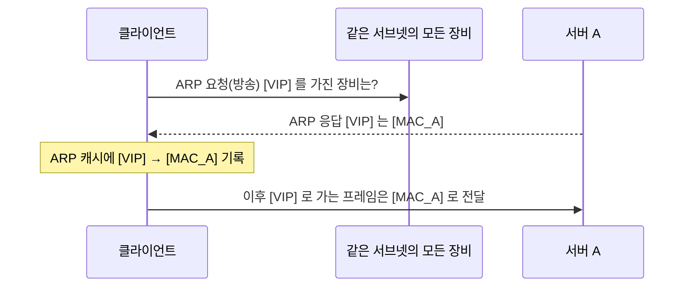
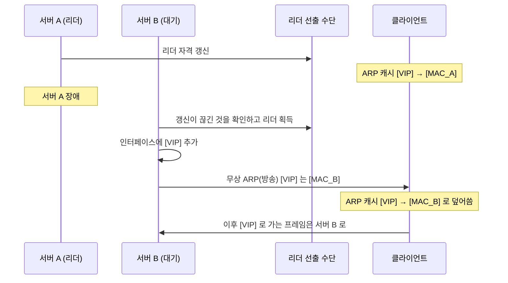
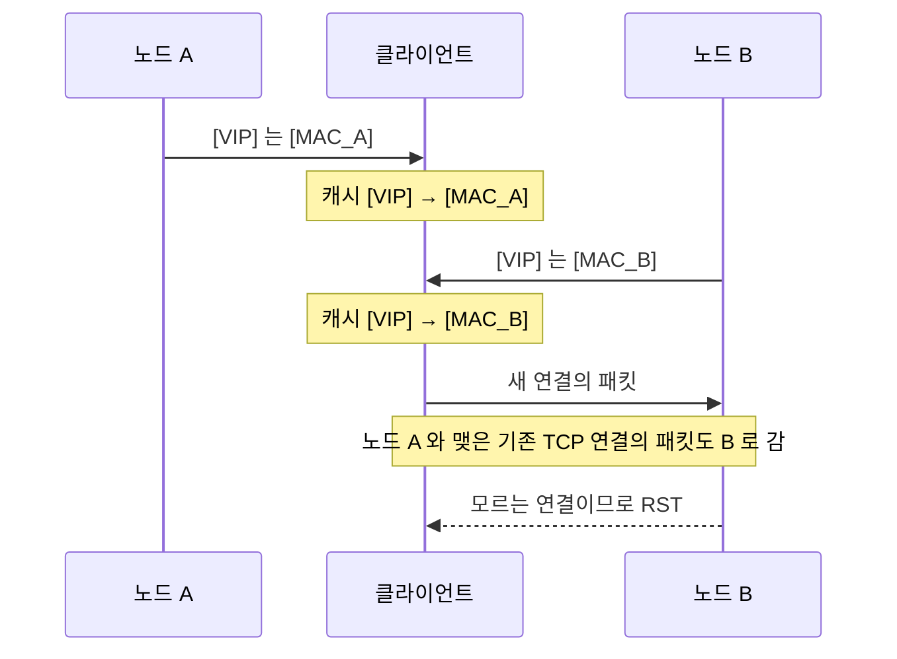
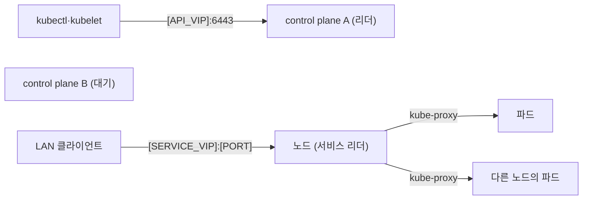

**가상 IP**(Virtual IP, **VIP**)는 특정 장비에 고정되지 않고 여러 서버 가운데 한 대가 맡아 응답하는 IP 주소입니다. 클라이언트는 늘 같은 주소로 접속하고, 그 주소를 맡은 서버가 멈추면 다른 서버가 이어받습니다. 같은 서브넷(L2) 안에서는 "이 주소는 이제 이 MAC 주소에 있다" 고 ARP 로 알리는 것만으로 이어받기가 끝나고, 누가 알릴지는 리더 선출이 정합니다.

- **기준:** RFC 826 (ARP), RFC 5227 (IPv4 주소 충돌 감지), RFC 5798 (VRRP 버전 3), kube-vip 공식 문서, keepalived 공식 문서와 `keepalived.conf(5)`, kubeadm 고가용성 문서

## 왜 필요한가

서버 여러 대로 서비스를 이중화해도 클라이언트가 서버 하나의 주소를 적어 두면, 그 서버가 꺼지는 순간 접속이 끊깁니다. 클라이언트마다 주소 목록을 넣고 실패하면 다음 주소로 넘어가게 만들 수도 있지만, 모든 클라이언트가 그런 기능을 갖추지는 않습니다. 쿠버네티스의 kubeconfig 처럼 API 서버 주소를 하나만 적는 설정도 많습니다.

앞단에 로드밸런서 장비를 두면 주소 하나로 모을 수 있지만, 그 로드밸런서도 결국 한 대이므로 같은 문제가 되풀이됩니다. VIP 는 이 문제를 추가 장비 없이 풉니다. 서버끼리 주소 하나를 나눠 맡고, 맡은 서버가 사라지면 남은 서버가 같은 주소를 자기 네트워크 인터페이스에 붙인 뒤 이웃 장비에 알립니다. 클라이언트 설정은 바뀌지 않습니다.

## 핵심 용어

| 용어 | 뜻 |
| :--- | :--- |
| 가상 IP (VIP) | 여러 서버 가운데 그때그때 한 대가 맡는, 장비에 고정되지 않은 IP 주소 |
| ARP | 같은 링크 안에서 IPv4 주소에 대응하는 MAC 주소를 알아내는 프로토콜 (RFC 826) |
| ARP 캐시 | 호스트와 라우터가 알아낸 IP → MAC 대응을 잠시 기억해 두는 표 |
| 무상 ARP (Gratuitous ARP) | 묻지 않았는데 자기 IP 와 MAC 대응을 방송으로 알리는 ARP 패킷. RFC 5227 은 ARP Announcement 라고 부름 |
| 리더 선출 | 후보 여러 대 가운데 VIP 를 맡을 한 대를 정하는 절차 |
| VRRP | 라우터나 서버 여러 대가 가상 라우터 하나를 이루어 주소를 넘겨받는 표준 프로토콜 (RFC 5798) |
| 스플릿 브레인 | 연락이 끊긴 두 노드가 서로 자기가 리더라고 믿고 같은 자원을 동시에 맡는 상태 |

## ARP 가 주소를 찾는 방식

VIP 를 이해하려면 먼저 같은 서브넷 안에서 패킷이 목적지를 찾는 방식을 알아야 합니다. 이더넷에서 프레임은 IP 주소가 아니라 MAC 주소로 전달됩니다. 그래서 호스트는 같은 서브넷의 IP 로 패킷을 보내기 전에 **ARP** 로 그 IP 의 MAC 주소를 알아내고 **ARP 캐시**에 기억해 둡니다.

RFC 826 의 수신 절차에서 눈여겨볼 점은, ARP 패킷을 받은 장비가 그 패킷이 요청인지 응답인지 보기 **전에** 보낸 쪽의 IP·MAC 대응을 먼저 반영한다는 것입니다. 이미 캐시에 있는 IP 라면 MAC 주소를 새 값으로 덮어씁니다. VIP 의 이어받기는 이 동작에 기대고 있습니다.

## 동작 방식

VIP 를 이어받는 과정은 "누가 맡을지 정한다 → 맡은 쪽이 주소를 붙인다 → 이웃에게 알린다" 세 단계입니다.

1. 후보 서버들이 **리더 선출**로 VIP 를 맡을 한 대를 정합니다. 리더는 주기적으로 자기가 살아 있다는 신호를 남깁니다.
2. 리더는 VIP 를 자기 네트워크 인터페이스에 추가해, 그 주소로 오는 패킷을 받고 그 주소에 대한 ARP 요청에 응답합니다.
3. 리더가 멈추면 신호가 끊기고, 정해진 시간이 지나면 대기 서버가 새 리더가 됩니다.
4. 새 리더는 VIP 를 인터페이스에 붙이고 **무상 ARP** 를 방송합니다. RFC 5227 의 ARP Announcement 는 보낸 쪽 IP 와 대상 IP 칸에 모두 알리려는 주소를 넣은 ARP 요청입니다.
5. 이 방송을 받은 클라이언트와 라우터는 RFC 826 의 절차대로 캐시의 MAC 주소를 새 리더 것으로 덮어씁니다. 스위치도 이 프레임을 보고 새 MAC 주소가 어느 포트에 있는지 배웁니다.

무상 ARP 를 보내지 않아도 캐시 항목은 언젠가 만료되고 다시 물어 새 리더를 찾습니다. 다만 그때까지 클라이언트는 사라진 옛 MAC 주소로 계속 보냅니다. kube-vip 문서는 무상 ARP 가 로컬 호스트에 대응이 바뀐 것을 대개 즉시 알린다고 설명하고, 리눅스 `arp(7)` 에 따르면 이웃 항목의 유효 시간은 기본 `base_reachable_time`(30초)을 중심으로 무작위로 정해집니다. 무상 ARP 는 이 대기 시간을 없애는 장치입니다.

## 리더 선출: 누가 알릴지 정하는 방식

ARP 는 누가 VIP 를 맡아야 하는지 모릅니다. 먼저 알린 쪽이 아니라 **마지막에 알린 쪽**으로 캐시가 덮어써질 뿐입니다. 그래서 VIP 구현의 핵심은 알리는 장비를 한 대로 제한하는 리더 선출이고, 방식은 구현마다 다릅니다.

| 구분 | VRRP (keepalived) | kube-vip ARP 모드 |
| :--- | :--- | :--- |
| 선출 수단 | 후보끼리 광고 패킷을 주고받음 | 쿠버네티스 API 의 Lease 객체 |
| 살아 있다는 신호 | 마스터가 멀티캐스트 `224.0.0.18` 로 주기 광고(기본 1초) | 리더가 Lease 를 주기적으로 갱신 |
| 리더가 바뀌는 조건 | 대기 쪽이 `Master_Down_Interval` 동안 광고를 받지 못함 | Lease 갱신이 끊김 |
| 우선순위 | 0~255, 높은 쪽이 마스터. 255 는 주소 소유자 | 먼저 Lease 를 잡은 쪽 |
| 전제 | 후보끼리 광고가 오가야 함 | 후보가 API 서버에 닿아야 함 |

- **VRRP:** RFC 5798 은 대기 라우터가 `(3 × Master_Adver_Interval) + Skew_Time` 동안 광고를 받지 못하면 마스터가 된다고 정합니다. `Skew_Time` 은 우선순위가 높을수록 짧아, 우선순위 높은 대기 쪽이 먼저 나섭니다. 새 마스터는 가상 라우터의 IPv4 주소마다 무상 ARP 를 방송해야 합니다. 명세상 가상 라우터의 MAC 주소는 `00-00-5E-00-01-{VRID}` 이지만, keepalived 는 `use_vmac` 을 켜야 이 가상 MAC 을 만들고 기본으로는 인터페이스 자체의 MAC 주소를 씁니다. 마스터가 된 뒤 무상 ARP 를 몇 번, 언제 다시 보낼지는 `garp_master_repeat`, `garp_master_delay` 로 정합니다(기본 각각 5번, 5초 뒤 한 번 더).
- **kube-vip:** ARP 모드에서 kube-vip 파드들이 쿠버네티스 **Lease** 로 리더를 뽑고, 리더가 VIP 를 인터페이스에 붙이고 무상 ARP 로 알립니다. 리더 자격을 잃으면 기본으로 VIP 를 인터페이스에서 즉시 뗍니다. BGP 모드에서는 리더를 뽑지 않고 모든 노드가 VIP 를 라우터에 광고합니다.

두 방식 모두 선출 수단이 끊겼을 때를 조심해야 합니다. VRRP 는 광고가 오가지 못하면(방화벽이 VRRP 패킷을 막는 경우 등) 대기 쪽도 마스터가 되어 두 대가 같은 VIP 를 맡는 **스플릿 브레인**이 됩니다. RFC 5798 의 상태 기계가 "광고가 없으면 마스터가 된다" 이기 때문입니다. 연락이 끊긴 쪽이 스스로 물러나게 하는 과반 투표 방식은 (/posts/64/) 에서 다룹니다.

## 같은 서브넷이어야 하는 이유

ARP 는 링크 안에서만 오가는 방송입니다. 라우터는 ARP 방송을 다른 서브넷으로 넘기지 않으므로, 무상 ARP 가 닿는 범위는 같은 L2 네트워크(같은 서브넷)까지입니다. VRRP 광고도 RFC 5798 이 링크 로컬 범위로 제한해 라우터가 전달하지 않습니다.

그래서 ARP 로 넘기는 VIP 는 다음 조건을 지켜야 합니다.

- VIP 를 맡을 후보 서버가 모두 **같은 서브넷**에 있어야 합니다. kubeadm 고가용성 문서도 keepalived 와 kube-vip ARP 모드 모두 이 조건을 적어 둡니다.
- VIP 자체도 그 서브넷 안의 주소여야 하고, DHCP 가 다른 장비에 나눠 주지 않는 주소여야 합니다. 같은 주소를 다른 장비가 받으면 VIP 와 충돌합니다.
- 다른 서브넷의 클라이언트는 라우터를 거쳐 들어오므로, VIP 가 바뀌었다는 사실은 그 서브넷의 라우터 ARP 캐시만 알면 됩니다.

서로 다른 서브넷이나 지역에 흩어진 서버가 한 주소를 나눠 맡으려면 ARP 대신 라우팅으로 주소를 광고해야 합니다. kube-vip 의 BGP 모드처럼 각 노드가 라우터에 "이 주소로 가는 길은 나" 라고 알리는 방식이 여기에 해당합니다.

## 두 노드가 같은 IP 를 알릴 때

리더 선출이 어긋나 두 노드가 동시에 같은 VIP 를 인터페이스에 붙이면, 두 노드가 각자 ARP 요청에 응답하고 무상 ARP 를 보냅니다. ARP 캐시는 마지막으로 받은 값으로 덮어써지므로, 클라이언트와 라우터의 캐시는 두 MAC 주소 사이를 오갑니다. 이를 흔히 **ARP 플래핑**이라고 부릅니다.

증상은 "가끔 끊긴다" 입니다.

- 캐시가 바뀔 때마다 진행 중인 TCP 연결의 패킷이 연결을 모르는 다른 노드로 가서 리셋되거나 시간 초과로 끊깁니다.
- 한쪽 노드에만 서비스가 준비되어 있으면 캐시가 그 노드를 가리킬 때만 접속됩니다.
- 어느 쪽이 이길지는 알림 순서와 캐시 만료 시각에 달려 있어 재현이 불규칙합니다.

RFC 5227 은 이런 충돌을 감지하는 방법도 정합니다. 호스트는 자기 주소를 다른 장비가 쓴다는 ARP 를 받으면 ARP Announcement 를 한 번 보내 방어할 수 있지만, `DEFEND_INTERVAL` 안에 충돌이 또 보이면 그 주소 사용을 즉시 멈춰야 합니다. 리눅스는 `arp(7)` 의 `locktime`(기본 1초) 동안은 항목을 새 대응으로 바꾸지 않아, 잘못된 설정으로 대응이 여러 개일 때 캐시가 지나치게 뒤바뀌는 것을 늦춥니다. 둘 다 증상을 줄이거나 알리는 장치일 뿐 원인을 없애지는 않습니다. 원인은 알리는 쪽이 두 대라는 것이므로, 리더 선출을 바로잡아야 합니다.

리더 선출을 잘 갖춘 구현에서도 설정에 따라 이 상태가 생길 수 있습니다. 여러 서비스가 같은 VIP 를 포트만 달리해 나눠 쓰면서 서비스마다 리더를 따로 뽑으면, 서비스 A 의 리더와 서비스 B 의 리더가 다른 노드가 될 수 있고 두 노드가 같은 IP 를 알리게 됩니다. kube-vip 문서는 같은 IP 를 나누는 서비스들이 Lease 하나를 함께 쓰게 해 VIP 가 선택된 리더 노드에만 있게 하는 방법을 안내합니다.

## control plane VIP 와 LoadBalancer 서비스 VIP

쿠버네티스에서 VIP 는 두 곳에 쓰입니다. 원리는 같지만 무엇을 가리키는 주소인지가 다릅니다.

| 구분 | control plane VIP | LoadBalancer 서비스 VIP |
| :--- | :--- | :--- |
| 가리키는 대상 | 쿠버네티스 API 서버 | `type: LoadBalancer` 서비스 |
| 누가 쓰나 | kubelet, kubectl, 컨트롤러 등 클러스터를 다루는 모든 것 | 클러스터 밖의 클라이언트 |
| 후보 노드 | control plane 노드 | 서비스를 알릴 수 있는 노드 |
| 리더 선출 단위 | 클러스터에 하나 | 모든 서비스에 하나, 또는 서비스마다 하나 |
| 받은 뒤의 경로 | 리더 노드의 API 서버가 받음. kube-vip 는 설정하면 IPVS 로 다른 control plane 에 나눔 | kube-proxy 가 NAT 로 아무 노드의 파드에 넘김 |

- **control plane VIP:** 클러스터를 만들 때부터 있어야 하는 주소입니다. kubeadm 은 control plane 엔드포인트를 이 주소로 받고, kube-vip 나 keepalived 는 control plane 노드 가운데 한 대에 이 주소를 붙입니다. kubeadm 고가용성 문서는 keepalived(VIP)와 haproxy(부하 분산)를 함께 쓰는 방법과, 두 일을 한 서비스에서 하는 kube-vip 를 선택지로 소개합니다.
- **LoadBalancer 서비스 VIP:** 쿠버네티스는 LoadBalancer 서비스를 정의만 하고 부하 분산 구성 요소를 직접 제공하지 않습니다. 클라우드에서는 클라우드 로드밸런서가, 온프레미스에서는 kube-vip 같은 구현이 주소를 맡아 `status.loadBalancer.ingress` 에 적습니다. kube-vip 의 ARP 모드는 기본으로 모든 서비스를 리더 한 대가 알리고, `svc_election` 을 켜면 서비스마다 리더를 뽑아 노드에 나눕니다. 리더가 한 대면 모든 서비스 트래픽이 그 노드로 몰리고, 서비스마다 뽑으면 부하는 나뉘지만 같은 IP 를 나누는 서비스끼리는 위 절의 문제를 피하도록 Lease 를 묶어야 합니다.

서비스 VIP 로 들어온 트래픽은 kube-proxy 가 NAT 를 거쳐 다른 노드의 파드로 넘길 수 있으므로, 파드가 보는 출발 주소는 클라이언트 주소가 아닐 수 있습니다. kube-vip 문서는 서비스별 선출과 `externalTrafficPolicy: Local` 을 함께 쓰면 파드가 있는 노드에서만 주소를 알려 출발 주소가 보존된다고 설명합니다. NAT 가 출발 주소를 바꾸는 원리는 (/posts/68/) 에서 다룹니다.

## 흔한 오해

VIP 가 있으면 부하가 여러 서버에 나뉜다

- **실제:** ARP 로 넘기는 VIP 는 한순간에 한 대만 받습니다. 이중화(장애 넘기기)이지 부하 분산이 아닙니다. 부하를 나누려면 VIP 를 받은 서버가 다시 여러 서버로 나눠 보내야 합니다(keepalived 와 함께 쓰는 haproxy, kube-vip 의 IPVS 부하 분산, kube-proxy 등). 분배 방식은 (/posts/70/) 에서 다룹니다.
- **근거:** kube-vip 문서는 ARP 모드에서 리더 한 대가 주소를 맡는다고 설명하고, kubeadm 고가용성 문서는 keepalived(VIP)와 haproxy(부하 분산)의 역할을 나눠 적습니다.

무상 ARP 를 보내면 모든 장비가 바로 새 주소를 쓴다

- **실제:** 받는 쪽이 무상 ARP 를 어떻게 처리할지는 구현과 설정에 달려 있습니다. 리눅스는 `arp_accept` 로 캐시에 없던 주소의 무상 ARP 를 새 항목으로 만들지 정하고, `locktime` 동안은 항목을 바꾸지 않습니다. 방송이 유실될 수도 있어 keepalived 는 무상 ARP 를 여러 번 보내고 일정 시간 뒤 한 번 더 보냅니다.
- **근거:** 리눅스 커널 `ip-sysctl` 문서의 `arp_accept`, `arp(7)` 의 `locktime`, `keepalived.conf(5)` 의 `garp_master_repeat`·`garp_master_delay`.

VIP 는 어느 네트워크에서나 쓸 수 있다

- **실제:** ARP 방식 VIP 는 후보 서버와 VIP 가 같은 서브넷에 있어야 합니다. 서브넷이 다르면 BGP 같은 라우팅 광고 방식을 씁니다.
- **근거:** kubeadm 고가용성 문서의 keepalived·kube-vip 설명, RFC 5798 의 링크 로컬 범위 규정.

## 정리

> - VIP 는 여러 서버 가운데 리더 한 대가 맡는 주소이고, 리더가 바뀌면 새 리더가 무상 ARP 로 "이 주소는 이제 내 MAC" 이라고 알립니다.
> - ARP 캐시는 마지막 알림으로 덮어써지므로, 알리는 장비를 한 대로 제한하는 리더 선출이 핵심입니다. 두 대가 알리면 ARP 플래핑으로 연결이 간헐적으로 끊깁니다.
> - ARP 와 VRRP 광고는 링크 밖으로 나가지 않으므로 후보 서버와 VIP 는 같은 서브넷에 있어야 합니다.
> - 쿠버네티스에서는 API 서버를 가리키는 control plane VIP 와 LoadBalancer 서비스를 가리키는 서비스 VIP 가 같은 원리로 동작하지만, 리더 선출 단위와 받은 뒤의 경로가 다릅니다.
{: .prompt-tip }

## 참고 자료

- [RFC 826 - An Ethernet Address Resolution Protocol](https://www.rfc-editor.org/rfc/rfc826)
- [RFC 5227 - IPv4 Address Conflict Detection](https://www.rfc-editor.org/rfc/rfc5227)
- [RFC 5798 - Virtual Router Redundancy Protocol (VRRP) Version 3](https://www.rfc-editor.org/rfc/rfc5798)
- [kube-vip - Architecture](https://kube-vip.io/docs/about/architecture/)
- [kube-vip - ARP](https://kube-vip.io/docs/modes/arp/)
- [kube-vip - Services](https://kube-vip.io/docs/usage/services/)
- [kube-vip - Kubernetes Load-Balancer service](https://kube-vip.io/docs/usage/kubernetes-services/)
- [Keepalived - Introduction](https://keepalived.readthedocs.io/en/latest/introduction.html)
- [keepalived.conf(5)](https://github.com/acassen/keepalived/blob/master/doc/man/man5/keepalived.conf.5.in)
- [kubeadm - High Availability Considerations](https://github.com/kubernetes/kubeadm/blob/main/docs/ha-considerations.md)
- [Kubernetes - Leases](https://kubernetes.io/docs/concepts/architecture/leases/)
- [Kubernetes - Service (type LoadBalancer)](https://kubernetes.io/docs/concepts/services-networking/service/#loadbalancer)
- [arp(7) - Linux manual page](https://man7.org/linux/man-pages/man7/arp.7.html)
- [Linux kernel - IP Sysctl](https://docs.kernel.org/networking/ip-sysctl.html)
