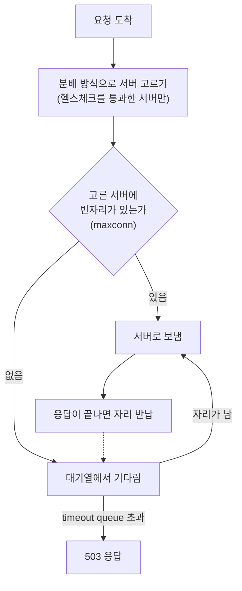

**분배 방식**(부하 분산 알고리즘)은 로드밸런서가 들어온 연결이나 요청을 뒤에 있는 여러 서버 가운데 어느 서버에 보낼지 정하는 규칙입니다. 같은 서버 묶음이라도 분배 방식에 따라 서버마다 맡는 일의 양, 느린 서버가 받는 요청 수, 서버 하나가 빠지거나 돌아올 때 요청이 옮겨 가는 범위가 달라집니다. 이 글은 HAProxy 의 용어로 라운드 로빈, 최소 연결, 소스 해시, 우선순위 채우기(`first`)를 비교하고, 분배 방식과 함께 움직이는 서버별 동시 처리 한도(`maxconn`), 대기열, 헬스체크를 설명합니다.

- **기준:** HAProxy 3.4 Configuration Manual 의 `balance`, `maxconn`, `maxqueue`, `timeout queue`, `check` 항목과 HAProxy 3.4 Starter Guide

## 왜 필요한가

로드밸런서는 여러 서버를 묶어 한 서버의 처리 능력보다 많은 일을 동시에 처리하게 합니다. HAProxy Starter Guide 가 짚듯이 요청 하나를 처리하는 속도는 빨라지지 않고, 동시에 처리하는 요청 수만 늘어납니다. 그래서 요청을 어느 서버에 보내느냐가 곧 전체 성능과 응답 시간을 정합니다.

서버를 고르는 규칙이 하나뿐이면 상황에 따라 문제가 생깁니다.

- 요청마다 처리 시간이 비슷한 짧은 요청에서는 차례대로 돌리기만 해도 고르게 나뉩니다. 하지만 처리 시간이 길고 들쭉날쭉한 요청에서는 차례대로 돌리면 한 서버에 긴 요청이 몰릴 수 있습니다.
- 로그인 세션이나 캐시처럼 같은 사용자를 같은 서버로 보내야 하는 경우가 있습니다.
- 서버 성능이 서로 다르면 느린 서버에 요청을 나눠 주는 것 자체가 응답 시간을 늘립니다.
- 서버가 감당할 수 있는 동시 요청 수를 넘겨 보내면 서버가 느려지거나 멈춥니다.

분배 방식은 이 가운데 어떤 문제를 먼저 풀지 고르는 설정입니다. 동시 처리 한도와 대기열은 서버가 넘치지 않게 막고, 헬스체크는 고를 수 있는 서버 목록에서 고장 난 서버를 빼는 역할을 합니다.

## 핵심 용어

| 용어 | 뜻 |
| :--- | :--- |
| 백엔드(backend) | 로드밸런서가 요청을 나눠 보내는 서버 묶음입니다. HAProxy 에서는 `backend` 섹션 하나가 한 묶음입니다. |
| 분배 방식 | 백엔드 안에서 요청을 받을 서버를 고르는 규칙입니다. HAProxy 는 `balance` 로 정합니다. |
| 가중치(weight) | 서버마다 받을 몫의 비율입니다. 기본값은 1 이고, 값이 클수록 더 많이 받습니다. |
| 동시 처리 한도(`maxconn`) | 한 서버에 동시에 보낼 수 있는 최대 연결 수입니다. HTTP 모드에서는 동시 요청 수를 셉니다. 기본값 0 은 무제한입니다. |
| 대기열(queue) | 한도에 걸려 바로 보낼 수 없는 요청이 자리가 날 때까지 기다리는 곳입니다. 서버별 대기열과 백엔드 전체 대기열이 있습니다. |
| 헬스체크(health check) | 로드밸런서가 서버에 주기적으로 보내는 확인 요청입니다. 실패한 서버는 분배 대상에서 빠집니다. |
| 지속성(persistence) | 같은 사용자나 세션을 계속 같은 서버로 보내는 성질입니다. 해시나 쿠키로 만듭니다. |

## 동작 방식

요청 하나가 들어와 서버에 닿기까지의 흐름입니다.



1. 로드밸런서는 헬스체크를 통과한 서버만 후보로 둡니다.
2. 분배 방식이 후보 가운데 한 서버를 고릅니다. 지속성 정보(쿠키 등)가 있으면 분배 방식보다 그 정보가 먼저입니다.
3. 고른 서버가 동시 처리 한도에 닿아 있으면 요청은 거절되지 않고 대기열에 들어갑니다.
4. 앞선 요청이 끝나 자리가 나면 대기열의 요청이 그 자리로 갑니다.
5. `timeout queue` 안에 자리가 나지 않으면 요청은 버려지고 클라이언트는 503 응답을 받습니다.

아래에서 분배 방식 네 가지를 먼저 비교하고, 동시 처리 한도와 대기열, 헬스체크를 차례로 설명합니다.

## 라운드 로빈

**라운드 로빈**(`roundrobin`)은 서버를 가중치에 따라 차례대로 돌아가며 고릅니다. HAProxy 설명서는 서버의 처리 시간이 고르게 분포할 때 가장 매끄럽고 공평한 방식이라고 설명합니다. 가중치를 실행 중에 바꿀 수 있어 서버가 막 돌아왔을 때 조금씩 늘려 주는 slow start 와 함께 쓸 수 있습니다. 가중치를 실행 중에 바꿀 수 없는 대신 서버 수 제한이 없는 `static-rr` 도 있습니다.

라운드 로빈은 서버가 지금 얼마나 바쁜지 보지 않습니다. 요청마다 처리 시간이 크게 다르면, 긴 요청을 이미 여러 개 붙잡고 있는 서버에도 차례가 오면 새 요청을 보냅니다.

## 최소 연결

**최소 연결**(`leastconn`)은 지금 연결 수가 가장 적은 서버를 고릅니다. 연결 수가 같은 서버끼리는 라운드 로빈으로 돌려 모든 서버가 쓰이게 합니다. 이미 연결된 수뿐 아니라 대기 중인 연결 수도 함께 셉니다. HAProxy 설명서는 LDAP, SQL 처럼 세션이 아주 긴 경우에 권하고, HTTP 처럼 짧은 세션에는 잘 맞지 않는다고 설명합니다.

최소 연결이 세는 것은 연결 수이지 서버의 속도가 아닙니다. 빠른 서버는 요청을 빨리 끝내 연결 수가 먼저 줄어드니 결과적으로 더 많이 받게 되지만, 두 서버가 모두 비어 있는 순간에는 둘 중 누가 빠른지 따지지 않고 차례로 고릅니다.

## 소스 해시

**소스 해시**(`source`)는 클라이언트 IP 주소를 해시해 서버를 정합니다. 서버 구성이 그대로인 동안 같은 IP 는 늘 같은 서버로 가므로, 쿠키를 넣을 수 없는 TCP 모드에서 지속성을 만드는 데 씁니다. 같은 원리로 URI(`uri`), HTTP 헤더(`hdr`), URL 파라미터(`url_param`)를 해시하는 방식도 있으며, 캐시 서버 앞에서 같은 URI 를 같은 서버로 보내 적중률을 높이는 데 씁니다.

해시 방식의 약점은 서버 수가 바뀔 때입니다. 기본 매핑 방식(`hash-type map-based`)은 해시 값을 살아 있는 서버 수로 나눠 서버를 정하므로 서버 하나가 빠지거나 돌아오면 대부분의 클라이언트가 다른 서버로 옮겨 갑니다. `hash-type consistent` 를 쓰면 바뀐 서버에 묶였던 몫만 옮겨 가지만, 분배가 완전히 고르지는 않아 가중치나 서버 ID 를 조정해야 할 수 있습니다.

## 우선순위 채우기

**우선순위 채우기**(`first`)는 빈자리가 있는 서버 가운데 첫 번째 서버를 고릅니다. 순서는 서버 ID(`id`) 가 작은 것부터이고, ID 를 적지 않으면 설정 파일에 적힌 순서입니다. 첫 서버가 `maxconn` 에 닿으면 다음 서버로 넘어갑니다. 그래서 `maxconn` 없이 쓰는 것은 의미가 없고, 가중치는 무시합니다.

```text
backend [BACKEND_NAME]
  balance first
  default-server check maxconn 1
  server [FAST_SERVER]   [FAST_ADDRESS]:[PORT]     # 비어 있으면 늘 여기부터
  server [MIDDLE_SERVER] [MIDDLE_ADDRESS]:[PORT]   # 첫 서버가 차 있을 때
  server [SLOW_SERVER]   [SLOW_ADDRESS]:[PORT]     # 앞의 두 서버가 모두 차 있을 때
```

HAProxy 설명서가 밝히는 본래 목적은 늘 가장 적은 수의 서버만 쓰게 해서, 한가한 시간에 남는 서버를 꺼 둘 수 있게 하는 것입니다. 대기열이 늘면 서버를 켜고 서버가 놀면 끄는 외부 컨트롤러와 함께 쓰라고 권합니다.

같은 동작을 거꾸로 보면 "빠른 서버부터 채우기" 가 됩니다. 서버를 빠른 순서로 적어 두면 요청은 늘 비어 있는 서버 가운데 가장 빠른 서버로 가고, 느린 서버는 앞의 서버가 모두 바쁠 때만 일합니다.

비슷해 보이는 설정으로 서버의 `backup` 표시가 있습니다. `backup` 서버는 다른 모든 서버가 쓸 수 없을 때(헬스체크 실패 등)만 요청을 받습니다. `backup` 은 장애 대비용 순서이고, `first` 는 부하가 늘 때 넘어가는 순서라는 점이 다릅니다.

## 동시 처리 한도와 대기열

`maxconn` 은 한 서버에 동시에 보낼 최대 연결 수이고, HTTP 모드에서는 동시 요청 수입니다. 이 수를 넘는 요청은 거절되지 않고 대기열에서 자리가 날 때까지 기다립니다. HAProxy Starter Guide 는 이렇게 서버를 넘치지 않게 막으면 트래픽이 몰려도 서버가 100% 로 일할 뿐 과부하에 빠지지 않고, 서버를 과부하시킬 때보다 오히려 응답이 빨라지는 경우가 많다고 설명합니다.

대기열에 관한 설정은 세 가지입니다.

| 설정 | 위치 | 동작 |
| :--- | :--- | :--- |
| `maxconn` | 서버 | 서버별 동시 연결(HTTP 는 요청) 한도. 기본값 0 은 무제한 |
| `maxqueue` | 서버 | 서버별 대기열 길이 한도. 다 차면 다음 요청은 다른 서버로 다시 보냅니다(지속성이 깨짐). 기본값 0 은 무제한 |
| `timeout queue` | 백엔드 | 대기열에서 기다릴 수 있는 최대 시간. 넘으면 요청을 버리고 503 을 돌려줍니다. 적지 않으면 `timeout connect` 값을 씁니다 |

대기열은 서버별 대기열과 백엔드 전체 대기열로 나뉩니다. HAProxy 로그 설명에 따르면 요청은 다시 보내기(redispatch)가 일어나지 않는 한 둘 중 한쪽에서만 기다립니다. 백엔드 대기열 길이를 서버 하나의 `maxconn` 으로 나누면 모자라는 서버 수를 가늠할 수 있습니다.

동시 처리 한도는 분배 방식의 결과도 바꿉니다. `first` 는 `maxconn` 이 있어야 다음 서버로 넘어가고, `leastconn` 은 대기 중인 연결까지 세어 대기열이 짧은 서버를 고릅니다.

## 헬스체크

서버 줄에 `check` 를 붙이면 헬스체크가 켜집니다. 붙이지 않으면 서버는 늘 살아 있는 것으로 취급됩니다.

| 설정 | 기본값 | 뜻 |
| :--- | :--- | :--- |
| `check` | 꺼짐 | 헬스체크를 켭니다. 다른 방법을 정하지 않으면 TCP 연결이 되는지만 봅니다 |
| `option httpchk` | 없음 | 연결 뒤 HTTP 요청을 보내 2xx·3xx 응답만 정상으로 봅니다 |
| `inter` | 2초 | 확인 간격 |
| `fall` | 3 | 연속으로 이만큼 실패하면 쓸 수 없는 서버로 표시합니다 |
| `rise` | 2 | 연속으로 이만큼 성공하면 다시 쓸 수 있는 서버로 표시합니다 |

헬스체크가 실패한 서버는 분배 후보에서 빠지고, 다시 통과하면 원래 자리로 돌아옵니다. `first` 에서 첫 서버가 빠지면 두 번째 서버가 첫 순서가 되고, 첫 서버가 `rise` 번 연속 통과하면 다시 먼저 받습니다.

HAProxy Starter Guide 는 헬스체크가 막으려는 고장을 대표해야 한다고 설명합니다. ping 은 웹 서버 프로세스가 죽은 것을 알아채지 못하고, 포트 연결은 프로세스가 죽은 것은 알아채지만 서버가 제대로 응답하는지는 모릅니다. 응답이 가벼운 HTTP 경로를 골라 `option httpchk` 로 확인하면 실제 서비스가 응답하는지까지 봅니다.

## 우선순위 채우기가 맞는 경우

`first` 가 특히 잘 맞는 것은 **요청 하나가 서버 하나를 통째로 차지하고, 서버마다 성능이 크게 다른** 백엔드입니다. 대표적인 예가 LLM 추론 서버입니다. 추론 서버는 요청 하나를 처리하는 동안 GPU 나 CPU 를 거의 다 쓰므로, 한 서버에 요청을 동시에 여러 개 보내면 서로 느려지거나 메모리가 모자랄 수 있습니다. 그리고 GPU 가 있는 서버와 CPU 만 있는 서버처럼 같은 요청의 처리 시간이 몇 배씩 차이 나는 경우가 흔합니다.

이런 백엔드에 각 방식을 쓰면 다음과 같이 됩니다.

| 방식 | 동시 요청이 서버 수보다 적을 때 | 동시 요청이 서버 수보다 많을 때 |
| :--- | :--- | :--- |
| `roundrobin` | 느린 서버도 차례대로 받습니다. 빠른 서버가 비어 있어도 느린 서버가 받는 요청이 생깁니다 | 이미 처리 중인 서버에도 차례가 오면 보냅니다. `maxconn` 이 없으면 한 서버에 요청이 겹칩니다 |
| `leastconn` | 비어 있는 서버끼리는 차례로 고르므로 빠른 서버가 비어 있어도 느린 서버가 받을 수 있습니다 | 연결이 적은 서버로 보내므로 겹침은 줄어듭니다 |
| `first` + `maxconn` | 늘 비어 있는 서버 가운데 가장 빠른 서버가 받습니다 | 모든 서버가 하나씩 처리하고 나머지는 대기열에서 기다립니다 |

`first` 와 `maxconn` 을 함께 쓸 때 알아야 할 한계도 있습니다.

- `maxconn` 은 서버가 실제로 동시에 처리하는 요청 수와 맞춰야 합니다. 서버 쪽 동시 처리 설정이 2 인데 `maxconn` 을 1 로 두면 서버 능력을 다 쓰지 못하고, 반대면 요청이 서버 안에서 겹칩니다.
- 로드밸런서는 자기가 보낸 요청만 셉니다. 클라이언트가 서버에 직접 붙거나 로드밸런서 인스턴스를 여러 개 띄우면, 각 인스턴스가 따로 세므로 서버에 실제로 들어가는 요청 수는 `maxconn` 보다 많아질 수 있습니다.
- 대기열의 요청은 먼저 자리가 난 서버로 갑니다. 곧 끝날 빠른 서버를 기다리는 편이 더 빠른 경우라도, 느린 서버가 먼저 비면 그 서버가 받습니다. `first` 는 처리 시간을 예측하지 않습니다.
- 추론처럼 요청 하나가 몇 분씩 걸리면 `timeout server` 와 `timeout queue` 를 가장 긴 요청보다 길게 잡아야 합니다. 짧으면 처리 중이거나 기다리던 요청이 끊깁니다.

## 비슷한 개념과 비교

| 구분 | `roundrobin` | `leastconn` | `source` 등 해시 | `first` |
| :--- | :--- | :--- | :--- | :--- |
| 고르는 기준 | 차례(가중치 비율) | 지금 연결 수가 가장 적은 서버 | 클라이언트 IP·URI 등의 해시 값 | 빈자리가 있는 서버 가운데 ID 가 가장 작은 서버 |
| 가중치 | 반영, 실행 중 변경 가능 | 반영, 실행 중 변경 가능 | 반영, 기본은 실행 중 변경 불가 | 무시 |
| 지속성 | 없음 | 없음 | 서버 구성이 그대로인 동안 있음 | 없음 |
| `maxconn` 필요 | 선택 | 선택 | 선택 | 필수 |
| 알맞은 곳 | 처리 시간이 고른 짧은 요청 | 길고 들쭉날쭉한 세션 | 캐시, 쿠키를 쓸 수 없는 TCP 지속성 | 서버를 최소로 쓰기, 성능이 다른 서버를 빠른 순서로 채우기 |

## 흔한 오해

<details markdown="1">
<summary>maxconn 을 넘는 요청은 거절된다</summary>

- **실제:** 대기열에 들어가 자리가 날 때까지 기다립니다. 거절(503)은 `timeout queue` 가 지날 때까지 자리가 나지 않은 경우이고, 서버별 `maxqueue` 가 다 차면 다른 서버로 다시 보냅니다.
- **근거:** HAProxy 3.4 Configuration Manual 의 `maxconn`, `maxqueue`, `timeout queue`

</details>

<details markdown="1">
<summary>최소 연결 방식이면 빠른 서버가 우선 받는다</summary>

- **실제:** 최소 연결은 연결 수만 봅니다. 연결 수가 같은 서버끼리는 라운드 로빈으로 고르므로, 모두 비어 있으면 느린 서버도 차례대로 받습니다.
- **근거:** HAProxy 3.4 Configuration Manual 의 `balance leastconn`

</details>

<details markdown="1">
<summary>소스 해시는 서버가 늘거나 줄어도 같은 클라이언트를 같은 서버로 보낸다</summary>

- **실제:** 기본 `map-based` 해시는 살아 있는 서버 수가 바뀌면 대부분의 클라이언트가 다른 서버로 옮겨 갑니다. `consistent` 해시는 바뀐 서버의 몫만 옮겨 갑니다.
- **근거:** HAProxy 3.4 Configuration Manual 의 `balance source`, `hash-type`

</details>

## 정리

> - 분배 방식은 서버를 고르는 기준이고, 동시 처리 한도와 대기열은 서버가 넘치지 않게 막으며, 헬스체크는 고장 난 서버를 후보에서 뺍니다.
> - 라운드 로빈은 처리 시간이 고른 요청, 최소 연결은 긴 세션, 해시는 지속성이 필요한 곳에 맞습니다.
> - `first` 는 빈자리가 있는 첫 서버를 고르므로 `maxconn` 과 함께 써야 하고, 요청 하나가 서버 하나를 차지하는 성능이 다른 서버를 빠른 순서로 채우는 데 맞습니다.
{: .prompt-tip }

## 참고 자료

- [HAProxy 3.4 Configuration Manual - balance](https://docs.haproxy.org/3.4/configuration.html#4.2-balance)
- [HAProxy 3.4 Configuration Manual - timeout queue](https://docs.haproxy.org/3.4/configuration.html#4.2-timeout%20queue)
- [HAProxy 3.4 Configuration Manual - maxconn](https://docs.haproxy.org/3.4/configuration.html#5.2-maxconn)
- [HAProxy 3.4 Configuration Manual - maxqueue](https://docs.haproxy.org/3.4/configuration.html#5.2-maxqueue)
- [HAProxy 3.4 Configuration Manual - check](https://docs.haproxy.org/3.4/configuration.html#5.2-check)
- [HAProxy 3.4 Starter Guide](https://docs.haproxy.org/3.4/intro.html)
