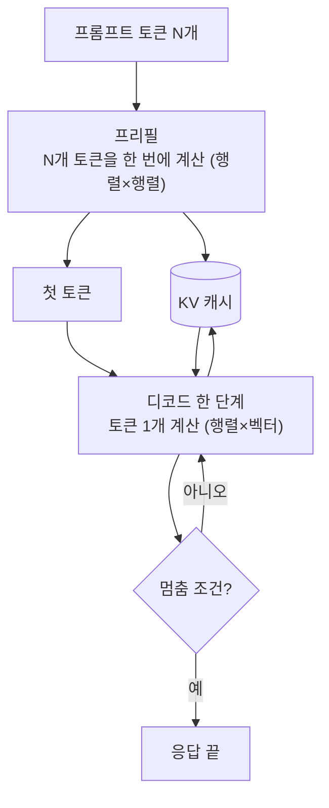
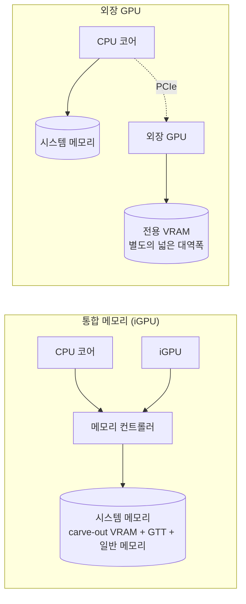

LLM 추론은 두 단계로 나뉩니다. 입력 프롬프트 전체를 한꺼번에 처리하는 **프리필(prefill)** 과, 답을 토큰 하나씩 이어 붙이는 **디코드(decode)** 입니다. 프리필은 하드웨어의 연산 성능이, 디코드는 메모리 대역폭이 속도를 정합니다. 그래서 "어느 장치가 더 빠른가" 는 단계마다 답이 다르고, 특히 CPU 와 같은 시스템 메모리를 쓰는 iGPU 에서는 이 구분을 알아야 측정 결과를 해석할 수 있습니다.

- **기준:** NVIDIA 기술 블로그 "Mastering LLM Techniques: Inference Optimization", llama.cpp 문서(`docs/build.md`, `tools/llama-bench`)와 토론 #4167, Ollama 문서 "GPU", 리눅스 커널 amdgpu 문서 "Memory Domains", ROCm 7.14 시스템 요구 사항 (모두 2026-09 기준)

## 왜 필요한가

"GPU 로 돌리면 빠르다" 는 경험칙은 전용 메모리(VRAM)를 가진 외장 GPU 에서 나왔습니다. 외장 GPU 는 연산 유닛도 많지만, 그보다 VRAM 의 대역폭이 시스템 메모리보다 훨씬 넓다는 점이 토큰 생성 속도를 끌어올립니다.

**iGPU(내장 GPU)** 는 사정이 다릅니다. CPU 와 같은 칩에 있고 같은 시스템 메모리를 같은 메모리 컨트롤러로 씁니다. 디코드가 메모리 대역폭에 묶여 있다면, iGPU 로 옮겨도 대역폭 상한은 CPU 와 같으므로 생성 속도가 크게 오르지 않을 수 있고, 구현이나 연산 유닛 규모에 따라서는 오히려 느릴 수도 있습니다. 예를 들어 연산 유닛이 적은 iGPU 가 코어가 많은 CPU 보다 토큰 생성이 느린 경우가 있습니다. 반대로 프롬프트 처리는 연산 성능이 좌우하므로 결과가 다를 수 있습니다.

두 단계를 구분하지 않고 "초당 토큰 수" 하나만 보면 이런 차이가 섞여 버립니다. llama.cpp 의 벤치마크 도구도 프롬프트 처리 속도(pp)와 텍스트 생성 속도(tg)를 따로 잽니다.

## 핵심 용어

| 용어 | 뜻 |
| :--- | :--- |
| 토큰 | 모델이 읽고 만드는 텍스트의 단위. 단어나 단어 조각 하나 |
| 프리필(prefill) | 프롬프트의 모든 토큰을 한 번의 계산으로 처리해 KV 캐시를 채우고 첫 토큰을 만드는 단계 |
| 디코드(decode) | 앞선 토큰을 바탕으로 다음 토큰을 하나씩 만드는 단계. 멈춤 조건까지 반복 |
| KV 캐시 | 이미 처리한 토큰의 어텐션 키·값을 저장해 둔 메모리. 컨텍스트 길이에 비례해 커짐 |
| 연산 바운드(compute-bound) | 계산 속도가 병목이라, 연산 유닛을 늘리면 빨라지는 상태 |
| 메모리 대역폭 바운드(memory-bound) | 메모리에서 데이터를 가져오는 속도가 병목이라, 연산 유닛이 데이터를 기다리는 상태 |
| 산술 강도 | 메모리에서 읽은 바이트당 수행하는 연산 수. 낮으면 메모리 바운드, 높으면 연산 바운드 |
| 루프라인 모델 | 산술 강도에 따라 연산 성능과 대역폭 가운데 어느 쪽이 성능 상한인지 보여 주는 분석 틀 |
| pp / tg | llama.cpp 벤치마크의 프롬프트 처리(prompt processing) 속도와 텍스트 생성(text generation) 속도 |
| iGPU | CPU 와 같은 칩에 들어 있어 시스템 메모리를 함께 쓰는 GPU |
| 통합 메모리(UMA) | CPU 와 GPU 가 한 물리 메모리를 함께 쓰는 구조 |
| carve-out VRAM | 펌웨어(BIOS)가 시스템 메모리 일부를 iGPU 전용으로 떼어 둔 영역 |
| GTT | GPU 가 페이지 변환 테이블(GART)을 거쳐 접근하는 시스템 메모리 영역 |
| 백엔드 | 추론 엔진이 GPU 를 부르는 경로. ROCm(HIP), Vulkan, CUDA 등 |
| 토큰당 에너지 | 추론에 쓴 전체 에너지를 만든 토큰 수로 나눈 값(J/token) |

## 동작 방식

프롬프트가 들어와서 답이 끝날 때까지의 흐름은 다음과 같습니다.



1. **프리필:** 프롬프트의 N개 토큰을 한꺼번에 모델에 통과시킵니다. 가중치 행렬 하나를 메모리에서 한 번 읽어 N개 토큰에 모두 곱하는 행렬×행렬 연산이므로, 읽은 바이트당 연산이 많습니다(산술 강도가 높음). 병렬 연산 유닛을 꽉 채울 수 있어 연산 성능이 속도를 정합니다.
2. **KV 캐시:** 프리필은 각 토큰의 어텐션 키·값을 계산해 KV 캐시에 저장합니다. 디코드는 이 캐시를 읽어 앞선 토큰을 다시 계산하지 않습니다.
3. **디코드:** 토큰을 하나씩 만듭니다. 한 토큰을 만들 때마다 모든 층의 가중치를 메모리에서 읽어야 하지만, 곱할 대상은 토큰 하나(벡터 하나)뿐입니다. 행렬×벡터 연산에서 가중치 하나는 곱셈·덧셈 한 번에만 쓰이므로 산술 강도가 낮고, 연산 유닛은 메모리에서 가중치가 도착하기를 기다립니다. 그래서 계산 속도가 아니라 데이터를 옮기는 속도가 지연을 좌우합니다.
4. **반복:** 새 토큰의 키·값을 KV 캐시에 더하고 멈춤 조건까지 3번을 되풀이합니다. 컨텍스트가 길어지면 매 단계 읽어야 할 KV 캐시도 커집니다.

디코드가 메모리 바운드라는 점에서 대략적인 상한을 셀 수 있습니다. 한 토큰마다 가중치 전체와 KV 캐시를 한 번씩 읽는다면, 초당 만들 수 있는 토큰 수는 다음 값을 넘지 못합니다.

```text
최대 생성 속도(token/s) ≈ [메모리 대역폭(GB/s)] / [토큰 하나당 읽는 바이트(GB) = 가중치 크기 + KV 캐시]
```

실제 속도는 이 상한보다 낮고, 얼마나 가까이 가는지는 구현(커널 최적화, 양자화 해제 비용)과 장치에 따라 다릅니다. 같은 이유로 가중치를 양자화해 바이트 수를 줄이면 생성 속도가 오릅니다. llama.cpp 의 Apple Silicon 측정 토론(#4167)에서도 pp 는 GPU 코어 수를 따라, tg 는 메모리 대역폭을 따라 올라가는 경향이 정리되어 있습니다.

## 통합 메모리 iGPU 에 적용하면

외장 GPU 와 iGPU 는 메모리 경로가 다릅니다.



- **메모리 영역:** 리눅스 amdgpu 드라이버 기준으로 iGPU 의 VRAM 영역은 BIOS 가 시스템 메모리에서 떼어 둔 carve-out 이고, GTT 영역은 GPU 가 GART 를 거쳐 접근하는 시스템 메모리입니다. 이름은 달라도 둘 다 같은 물리 메모리에 있습니다. carve-out 은 운영체제가 일반 용도로 쓸 수 있는 메모리에서 빠집니다.
- **디코드:** CPU 와 iGPU 는 같은 메모리 컨트롤러와 같은 대역폭을 씁니다. 디코드의 상한이 메모리 대역폭이라면 iGPU 로 옮겨도 상한은 그대로입니다. 실제 속도는 CPU 와 iGPU 가운데 어느 쪽이 그 상한에 더 가까이 가느냐에 달려 있고, 코어가 많은 CPU 는 이미 대역폭을 상당 부분 채우고 있을 수 있습니다.
- **프리필:** 연산 바운드이므로 iGPU 의 병렬 연산 성능이 CPU 보다 높다면 프롬프트 처리에서 이득을 볼 수 있습니다. 긴 프롬프트를 자주 넣는 작업일수록 이 차이가 커집니다.
- **동시 실행:** 같은 메모리를 쓰는 CPU 추론과 iGPU 추론을 동시에 돌리면 두 작업이 대역폭을 나눠 써서 둘 다 느려질 수 있습니다. 장치별 속도는 하나씩 따로 재고, 함께 돌 때의 속도는 별도로 확인해야 합니다.
- **모델 크기:** 외장 GPU 는 VRAM 용량이 올릴 수 있는 모델 크기를 제한하지만, 통합 메모리에서는 GTT 를 통해 시스템 메모리의 큰 부분을 GPU 가 쓸 수 있습니다. 속도보다 용량이 문제일 때 통합 메모리의 장점입니다.

## GPU 백엔드: ROCm 과 Vulkan

추론 엔진이 AMD GPU 를 쓰는 경로는 크게 두 가지입니다.

- **ROCm(HIP):** AMD 의 GPU 연산 스택입니다. ROCm 문서는 지원 표에 없는 GPU 는 공식 지원이 아니라고 밝히며, 그 표는 주로 외장 GPU 와 데이터센터 가속기로 채워져 있고 Ryzen APU 는 별도 문서("Use ROCm on Radeon and Ryzen")로 안내합니다. Ollama 도 ROCm 으로 쓸 수 있는 AMD GPU 목록을 따로 두며, 목록에 없는 GPU 는 `HSA_OVERRIDE_GFX_VERSION` 으로 비슷한 LLVM 대상인 척 시도해 볼 수 있다고 안내합니다. 어느 칩이 목록에 있는지는 버전마다 바뀌므로 해당 버전의 문서를 확인합니다.
- **Vulkan:** Khronos 의 여러 제조사 공통 그래픽·연산 API 입니다. llama.cpp 에 Vulkan 백엔드가 있고, Ollama 는 Windows 와 리눅스에서 Vulkan 으로 추가 GPU 를 지원합니다. 리눅스에서는 Mesa 나 제조사의 Vulkan 드라이버를 따로 설치해야 합니다. ROCm 지원 목록에 없는 iGPU 도 Vulkan 드라이버가 있으면 이 경로로 쓸 수 있습니다.

어느 백엔드가 더 빠른지는 GPU, 드라이버, 엔진 버전에 따라 달라서 일반화하기 어렵습니다. 같은 모델과 프롬프트로 pp 와 tg 를 각각 재서 비교합니다. 컨테이너에서 GPU 백엔드를 쓸 때는 호스트의 렌더 노드와 컨테이너 안의 사용자 공간 드라이버가 함께 필요합니다(/posts/65/).

## 토큰당 에너지

속도만 보면 전력을 많이 쓰는 장치가 늘 이깁니다. 전력 예산이 작은 서버나 엣지 장비에서는 **토큰당 에너지** 가 더 쓸모 있는 지표일 수 있습니다. 대형 언어 모델 추론의 에너지 비용을 잰 연구(Samsi 외, 2023)도 에너지를 토큰당, 응답당, 초당으로 나눠 보고하며, 토큰당 에너지를 "전체 에너지 ÷ 디코드로 만든 출력 토큰 수" 로 정의합니다.

```text
토큰당 에너지(J/token) = [평균 전력(W)] × [걸린 시간(s)] / [출력 토큰 수]
```

- 느린 장치가 전력을 훨씬 적게 쓴다면 토큰당 에너지는 오히려 적을 수 있고, 반대도 가능합니다.
- 전력을 어디서 쟀는지 밝힙니다. 장치 하나의 전력 센서 값과 시스템 전체의 벽 전원 값은 다릅니다.
- 프리필과 디코드는 병목이 달라 전력 양상도 다를 수 있으므로, 긴 프롬프트와 짧은 프롬프트를 나눠 재거나 무엇을 포함했는지 적습니다.
- 모델을 메모리에 올려 둔 채 기다리는 동안의 대기 전력도 실제 운영 비용에 들어갑니다.

## 흔한 오해

<details markdown="1">
<summary>GPU 로 옮기면 토큰 생성 속도가 항상 빨라진다</summary>

- **실제:** 디코드는 메모리 대역폭 바운드입니다. 외장 GPU 가 빠른 것은 전용 VRAM 의 대역폭이 넓기 때문이며, 시스템 메모리를 CPU 와 함께 쓰는 iGPU 는 대역폭 상한이 CPU 와 같아 생성 속도가 비슷하거나 느릴 수 있습니다.
- **근거:** NVIDIA "Mastering LLM Techniques: Inference Optimization" 의 디코드 설명, llama.cpp 토론 #4167 의 tg 와 대역폭 관계

</details>

<details markdown="1">
<summary>iGPU 에 VRAM 을 크게 잡아 주면 추론이 빨라진다</summary>

- **실제:** carve-out VRAM 도 같은 시스템 메모리에서 떼어 낸 영역입니다. 크기를 늘리면 GPU 전용으로 잡히는 용량은 늘지만 메모리 대역폭 상한은 그대로이고, 운영체제가 쓸 메모리는 그만큼 줄어듭니다.
- **근거:** 리눅스 커널 amdgpu 문서 "Memory Domains" 의 VRAM(APU 는 BIOS carve-out)·GTT 정의

</details>

<details markdown="1">
<summary>CPU 코어를 늘릴수록 생성 속도가 계속 오른다</summary>

- **실제:** 코어가 적을 때는 연산이 병목이라 코어를 늘리면 빨라지지만, 메모리 대역폭을 다 채운 뒤에는 코어를 더해도 디코드 속도가 거의 오르지 않습니다. 프리필은 연산 바운드라 코어 수의 영향을 더 오래 받습니다.
- **근거:** 디코드의 메모리 바운드 특성(NVIDIA 블로그, 루프라인 분석 서베이)

</details>

## 정리

> - 프리필은 행렬×행렬 연산이라 연산 성능이, 디코드는 행렬×벡터 연산이라 메모리 대역폭이 속도를 정합니다.
> - 디코드 속도의 상한은 대략 "메모리 대역폭 ÷ 토큰마다 읽는 바이트" 입니다.
> - iGPU 는 CPU 와 같은 메모리 대역폭을 쓰므로 토큰 생성에서 CPU 보다 빠르지 않을 수 있고, 이득은 주로 프리필과 용량에서 나옵니다.
> - AMD GPU 는 ROCm 지원 목록에 없으면 Vulkan 백엔드로 쓸 수 있고, 장치를 비교할 때는 pp, tg, 토큰당 에너지를 따로 잽니다.
{: .prompt-tip }

## 참고 자료

- [llama.cpp - Build documentation (Vulkan, HIP)](https://github.com/ggml-org/llama.cpp/blob/master/docs/build.md)
- [llama.cpp - llama-bench](https://github.com/ggml-org/llama.cpp/blob/master/tools/llama-bench/README.md)
- [llama.cpp Discussion #4167 - Performance of llama.cpp on Apple Silicon M-series](https://github.com/ggml-org/llama.cpp/discussions/4167)
- [Ollama - GPU](https://github.com/ollama/ollama/blob/main/docs/gpu.mdx)
- [ROCm - System requirements (Linux)](https://rocm.docs.amd.com/projects/install-on-linux/en/latest/reference/system-requirements.html)
- [Linux Kernel Documentation - AMDGPU Core Driver Infrastructure, Memory Domains](https://docs.kernel.org/gpu/amdgpu/driver-core.html)
- [Vulkan - Khronos Group](https://www.vulkan.org/)
- [NVIDIA Technical Blog - Mastering LLM Techniques: Inference Optimization](https://developer.nvidia.com/blog/mastering-llm-techniques-inference-optimization/)
- [Yuan et al. - LLM Inference Unveiled: Survey and Roofline Model Insights (arXiv:2402.16363)](https://arxiv.org/abs/2402.16363)
- [Samsi et al. - From Words to Watts: Benchmarking the Energy Costs of Large Language Model Inference (arXiv:2310.03003)](https://arxiv.org/abs/2310.03003)
