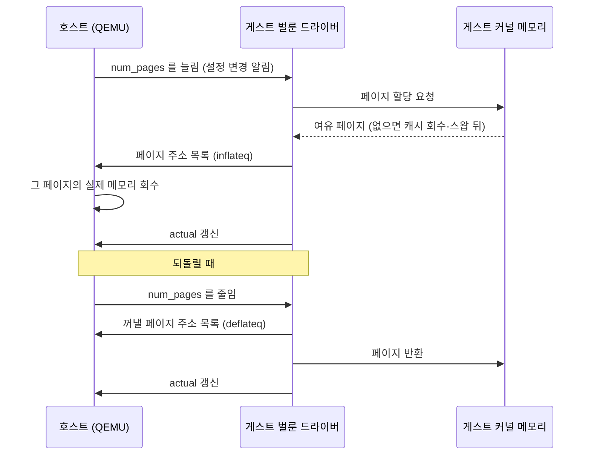
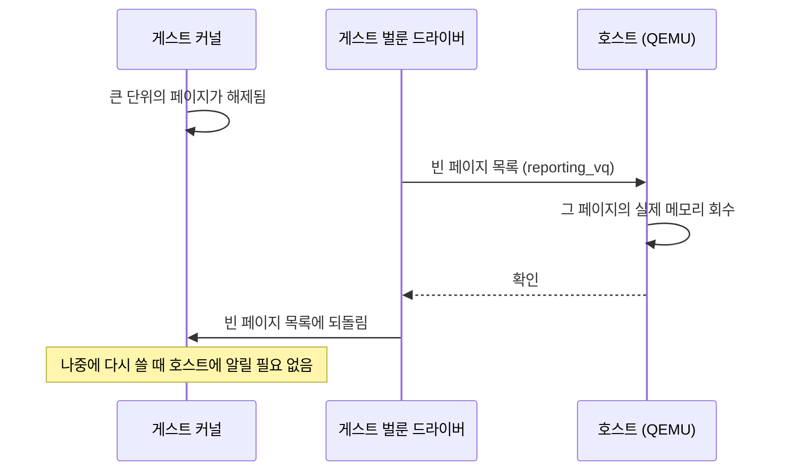
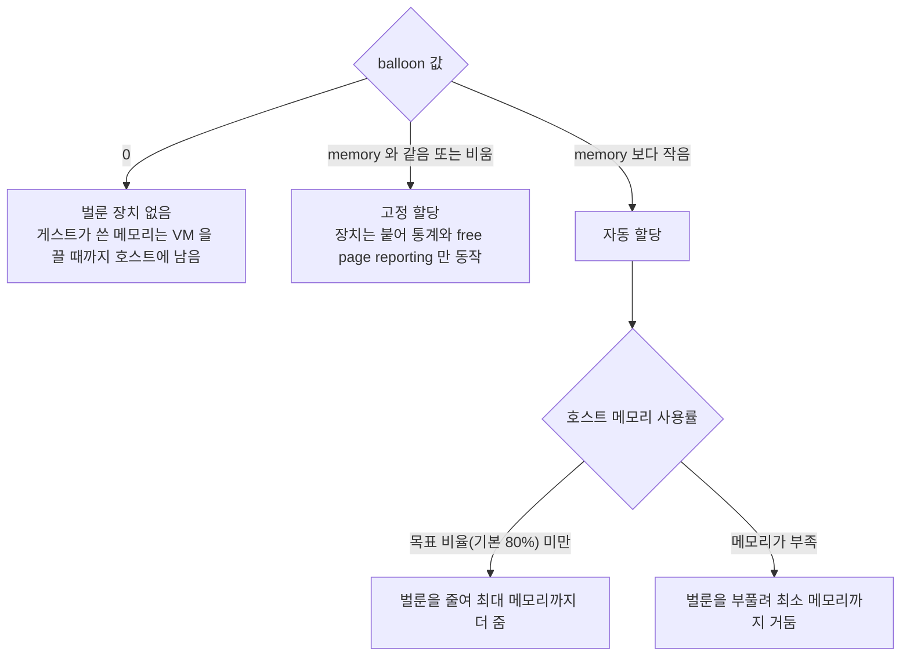

**메모리 벌루닝(memory ballooning)** 은 하이퍼바이저가 실행 중인 VM 에서 메모리를 거두거나 다시 돌려주는 방법입니다. 게스트 안의 벌룬 드라이버가 호스트의 지시에 따라 게스트 메모리를 할당해 붙잡고(풍선을 부풀리고), 붙잡은 페이지를 호스트에 넘겨 다른 게스트가 쓰게 합니다. VM 을 끄거나 재부팅하지 않고 메모리 배분을 바꿀 수 있다는 것이 핵심입니다.

- **기준:** OASIS VIRTIO 1.3 명세(Committee Specification Draft 01) 5.5절 "Traditional Memory Balloon Device", Proxmox VE 관리 가이드 "QEMU/KVM Virtual Machines" 장의 Memory 절 (문서 버전 9.2.12), 리눅스 커널 문서 "Free Page Reporting"

## 왜 필요한가

게스트 운영체제는 부팅할 때 받은 메모리 전체를 자기 물리 메모리로 여깁니다. 리눅스 게스트라면 프로세스가 쓰고 남는 메모리를 파일을 읽을 때마다 **페이지 캐시** 로 채워 두고, 필요할 때 캐시를 비워 다시 씁니다. 게스트 안에서는 합리적인 동작이지만 호스트 쪽에서 보면 문제가 됩니다.

- 게스트 메모리는 호스트에서 QEMU 프로세스의 메모리입니다. 게스트가 한 번이라도 쓴 페이지는 호스트에서 사용 중으로 남습니다.
- 게스트가 그 페이지를 다 쓰고 비웠는지는 게스트 커널만 압니다. 이를 호스트에 알릴 통로가 없으면 호스트는 페이지를 돌려받지 못합니다.
- 그래서 벌룬 장치가 없는 VM 은 게스트 안이 한가해도, 시간이 지나면 설정한 메모리 거의 전부를 호스트에서 붙들고 있게 됩니다. 여러 VM 을 올린 호스트는 실제 사용량보다 훨씬 빨리 메모리가 찹니다.

벌루닝은 게스트 안에 드라이버를 두어 이 통로를 만듭니다. 호스트는 드라이버에게 메모리를 내놓으라고 지시할 수 있고, 게스트는 어떤 페이지를 내놓을지 스스로 고릅니다. 어느 메모리를 버려도 성능에 영향이 적은지는 게스트가 가장 잘 알기 때문입니다.

## 핵심 용어

| 용어 | 뜻 |
| :--- | :--- |
| 메모리 벌루닝 | 게스트 안 드라이버가 메모리를 붙잡아 호스트에 넘기거나 되돌려 받아 VM 의 실제 메모리를 실행 중에 바꾸는 방법 |
| virtio-balloon | VIRTIO 명세의 전통적 메모리 벌룬 장치(장치 ID 5). QEMU 가 제공하고 게스트의 `virtio_balloon` 드라이버가 씀 |
| 부풀리기(inflate) | 드라이버가 게스트 메모리를 할당해 벌룬에 넣고, 그 페이지 주소를 호스트에 알려 호스트가 회수하게 하는 동작 |
| 줄이기(deflate) | 벌룬에 넣었던 페이지를 꺼내 게스트가 다시 쓰게 하는 동작 |
| `num_pages` / `actual` | 명세의 설정 필드. 장치가 원하는 벌룬 크기와 드라이버가 실제로 채운 벌룬 크기(4 KiB 페이지 수) |
| 메모리 통계 | 드라이버가 게스트의 여유 메모리, 캐시 크기, 스왑 입출력 같은 값을 호스트에 보내는 기능(`statsq`) |
| free page reporting | 게스트가 비어 있는 페이지를 주기적으로 호스트에 알려, 호스트가 그 페이지의 실제 메모리를 회수하게 하는 기능 |
| 페이지 캐시 | 운영체제가 남는 메모리에 파일 내용을 담아 두는 캐시. 비어 있는 메모리로 치지 않음 |
| 최소 메모리 | Proxmox 의 `balloon` 설정 값. 벌루닝으로 줄여도 VM 에 항상 남기는 메모리(MiB) |
| 자동 메모리 할당 | 최소 메모리가 최대 메모리보다 작을 때, 호스트 사용률에 따라 Proxmox VE 가 벌룬 크기를 조절하는 동작 |
| KSM | 내용이 같은 메모리 페이지를 찾아 물리 페이지 하나로 합치는 리눅스 커널의 중복 제거 기능 |

## 동작 방식

벌룬 장치는 설정 필드 두 개와 큐 몇 개로 움직입니다. 호스트가 `num_pages` 를 바꾸면 게스트 드라이버가 그 값에 맞춰 부풀리거나 줄이고, 결과를 `actual` 에 적습니다.

1. 호스트가 `num_pages` 를 현재 `actual` 보다 크게 바꾸면, 벌룬이 게스트에게 메모리를 더 원한다는 뜻입니다.
2. 드라이버는 게스트 커널에서 페이지를 할당받습니다. 여유 메모리가 모자라면 게스트 커널은 평소처럼 페이지 캐시를 비우고, 그래도 모자라면 스왑하고, 마지막에는 OOM killer 를 부릅니다. 벌룬 안의 페이지는 스왑되거나 회수되지 않습니다.
3. 드라이버가 페이지 주소 목록을 `inflateq` 로 보내면 호스트는 그 페이지를 게스트에서 떼어 내 실제 메모리를 회수합니다. 호스트는 이 메모리를 다른 게스트에 줄 수 있습니다.
4. 줄일 때는 반대로 드라이버가 벌룬에 있던 페이지 목록을 `deflateq` 로 보내고 게스트 커널에 돌려줍니다.
5. 메모리 통계 기능을 쓰면 드라이버가 게스트의 여유 메모리, 캐시 크기 같은 값을 `statsq` 로 보냅니다. 호스트는 이 값으로 게스트가 실제로 쓰는 메모리를 알 수 있습니다.

게스트는 벌룬을 직접 제어하지 않습니다. 크기는 호스트가 정하고 게스트는 협조만 합니다.

## free page reporting

부풀리기는 호스트가 먼저 요청해야 일어납니다. 반면 **free page reporting** 은 게스트가 스스로 빈 페이지를 알리는 별도 경로입니다.

1. 게스트 커널은 충분히 큰 단위의 페이지가 해제되면 약 2초 뒤 드라이버를 통해 빈 페이지를 모아 알립니다.
2. 호스트는 그 페이지의 실제 메모리를 회수하고 확인을 돌려줍니다.
3. 확인을 받은 페이지는 게스트의 빈 페이지 목록으로 돌아가고, 게스트는 나중에 호스트에 알리지 않고 다시 씁니다. 줄이기 큐가 따로 없는 것이 부풀리기와의 차이입니다.

알리는 대상은 게스트 커널이 **비어 있다** 고 보는 페이지뿐입니다. 페이지 캐시로 쓰이는 메모리는 비어 있는 메모리가 아니므로 이 경로로 돌아가지 않고, 게스트가 캐시를 비워야 비로소 빈 페이지가 됩니다.

Proxmox VE 는 벌룬 장치를 붙일 때 QEMU 머신 버전이 6.2 이상이면 이 기능(`free-page-reporting=on`)을 함께 켭니다. 관리 가이드가 아니라 `qemu-server` 소스와 해당 패치에서 확인한 동작이며, 게스트 커널의 벌룬 드라이버도 이 기능을 지원해야 합니다.

## Proxmox VE 의 설정

Proxmox VE 에서 VM 메모리는 `memory`(최대 메모리)와 `balloon`(최소 메모리) 두 값으로 정합니다.

- **고정 할당:** 최소 메모리를 최대 메모리와 같게 두면 Proxmox 는 지정한 만큼만 줍니다. 이때도 벌룬 장치는 붙습니다. 게스트가 실제로 쓰는 메모리 같은 유용한 정보를 주기 때문이며, 관리 가이드는 디버깅 같은 목적이 아니면 장치를 켜 두라고 권합니다.
- **자동 할당:** 최소 메모리를 최대 메모리보다 작게 두면, Proxmox VE 는 최소 메모리를 항상 보장하면서 호스트 메모리 사용률이 목표 비율(기본 80%, 노드 옵션에서 바꿈) 아래일 때 최대 메모리까지 더 줍니다. 호스트 메모리가 부족해지면 VM 이 메모리를 돌려주고, 그 과정에서 게스트는 필요하면 스왑하고 마지막에는 OOM killer 를 부릅니다.
- **shares:** 자동 할당을 쓰는 VM 이 여럿이면 `shares` 값으로 남는 호스트 메모리를 나눌 비율을 정합니다. 기본값은 1000 이고, 값이 큰 VM 이 더 많이 받습니다.
- **장치 끄기:** `balloon: 0` 이면 장치를 붙이지 않습니다. 이 VM 은 벌루닝도 free page reporting 도 하지 않으므로, 게스트가 한 번 쓴 메모리는 VM 을 끌 때까지 호스트에 남습니다.

벌룬 장치는 VM 이 시작할 때 붙습니다. `balloon` 값을 0 에서 다른 값으로 바꿨다면 게스트 안에서 재부팅하는 것으로는 부족하고, VM 을 완전히 껐다 켜야 장치가 새로 붙습니다.

## 컨테이너와 비교

LXC 컨테이너에는 벌루닝이 필요 없습니다. 게스트 커널이라는 중간 단계가 없기 때문입니다.

| 구분 | VM (벌룬 장치 사용) | LXC 컨테이너 |
| :--- | :--- | :--- |
| 메모리를 관리하는 커널 | 게스트 커널. 호스트는 게스트 안 사정을 모름 | 호스트 커널이 직접 |
| 상한을 거는 방법 | 부팅 때 정한 최대 메모리. 벌룬으로 실제 크기를 줄임 | cgroup 메모리 상한(`memory`) |
| 프로세스가 끝났을 때 | 게스트 안에서만 해제. 호스트로 돌아가려면 free page reporting 이나 부풀리기가 필요 | 호스트 커널에서 바로 해제 |
| 페이지 캐시 | 게스트 안에 남아 호스트 메모리를 계속 차지 | 호스트 커널의 캐시. 컨테이너 몫으로 집계되지만 호스트가 압박을 받으면 회수 |
| 상한을 넘으면 | 게스트 커널이 캐시 회수, 스왑, OOM killer 순으로 대응 | cgroup 안에서 회수하고, 그래도 넘으면 그 cgroup 안에서 OOM killer 가 동작 |

VM 과 컨테이너의 차이 전반은 (/posts/65/) 에서 다룹니다.

## KSM 과의 관계

**KSM(Kernel Samepage Merging)** 도 VM 메모리를 줄이는 기능이지만 원리가 다릅니다. 벌루닝이 게스트에게서 메모리를 거두는 것이라면, KSM 은 호스트 커널이 여러 VM 의 메모리를 훑어 내용이 같은 페이지를 물리 페이지 하나로 합치고 copy-on-write 로 표시합니다. 같은 운영체제를 쓰는 VM 이 많을수록 효과가 큽니다.

Proxmox VE 에서는 KSM 이 기본으로 켜져 있습니다. 다만 한 VM 이 같은 호스트의 다른 VM 정보를 추측하는 부채널 공격에 쓰일 수 있어, 남에게 VM 을 빌려주는 호스트라면 끄는 것을 검토하라고 관리 가이드가 권합니다. 노드 전체나 VM 별(`allow-ksm`)로 끌 수 있습니다. 자세한 내용은 [Proxmox VE 관리 가이드의 KSM 절](https://pve.proxmox.com/pve-docs/chapter-sysadmin.html#kernel_samepage_merging)을 참고합니다.

## 주의할 점

- **너무 공격적으로 거두면 게스트가 죽습니다.** 최소 메모리를 게스트가 실제로 필요한 양보다 작게 잡으면, 벌룬이 부풀 때 게스트 안에서 OOM killer 가 프로세스를 죽일 수 있습니다.
- **최대 메모리를 넘겨 줄 수는 없습니다.** 벌루닝은 부팅 때 정한 최대 메모리 안에서 실제 크기를 줄이고 늘릴 뿐입니다.
- **PCI 패스스루와 함께 쓸 수 없습니다.** Proxmox 위키는 패스스루 장치나 vGPU 가 호스트와 게스트의 고정된 메모리 주소에 매핑되므로 벌루닝이 동작하지 않는다고 설명합니다. 켜 두면 호스트로는 메모리가 돌아가지 않고 게스트가 쓸 수 있는 메모리만 줄어들 수 있습니다.
- **윈도우 게스트는 드라이버가 따로 필요합니다.** 2010년 이후 리눅스 배포판에는 벌룬 드라이버가 들어 있지만, 윈도우는 직접 설치해야 하고 게스트가 느려질 수 있어 관리 가이드는 중요한 시스템에는 권하지 않습니다.
- **벌룬 장치를 켜도 페이지 캐시는 남습니다.** 고정 할당에서는 free page reporting 으로 빈 페이지만 돌아가고, 자동 할당에서도 호스트 메모리가 목표 비율을 넘기 전까지는 벌룬이 부풀지 않습니다. 그 전까지 게스트가 캐시로 채운 메모리는 호스트에서 사용 중으로 보입니다.

## 정리

> - 벌루닝은 게스트 안 드라이버가 호스트 지시에 따라 메모리를 붙잡아 넘기거나 되돌려 받는 협력 방식입니다.
> - free page reporting 은 게스트가 빈 페이지를 스스로 알리는 별도 경로이며, 페이지 캐시는 돌려주지 않습니다.
> - Proxmox VE 는 `memory` 와 `balloon` 두 값으로 고정 할당과 자동 할당을 고르고, `balloon: 0` 이면 게스트가 쓴 메모리가 VM 을 끌 때까지 호스트에 남습니다.
> - 컨테이너는 호스트 커널이 메모리를 직접 관리하므로 벌루닝 없이도 쓴 만큼만 잡습니다.
{: .prompt-tip }

## 참고 자료

- [OASIS Virtual I/O Device (VIRTIO) Version 1.3 CSD01 - 5.5 Traditional Memory Balloon Device](https://docs.oasis-open.org/virtio/virtio/v1.3/csd01/virtio-v1.3-csd01.html)
- [Proxmox VE Administration Guide - QEMU/KVM Virtual Machines, Memory](https://pve.proxmox.com/pve-docs/chapter-qm.html#qm_memory)
- [Proxmox VE Administration Guide - Kernel Samepage Merging (KSM)](https://pve.proxmox.com/pve-docs/chapter-sysadmin.html#kernel_samepage_merging)
- [Proxmox VE Administration Guide - Container Memory](https://pve.proxmox.com/pve-docs/chapter-pct.html#pct_memory)
- [Linux Kernel Documentation - Free Page Reporting](https://docs.kernel.org/mm/free_page_reporting.html)
- [Linux Kernel Documentation - Control Group v2, Memory](https://docs.kernel.org/admin-guide/cgroup-v2.html#memory)
- [Proxmox VE Wiki - Dynamic Memory Management](https://pve.proxmox.com/wiki/Dynamic_Memory_Management)
- [\[pve-devel\] \[PATCH V2 qemu-server 1/2\] enable balloon free-page-reporting](https://lists.proxmox.com/pipermail/pve-devel/2022-March/052132.html)
- [Richard W.M. Jones - virtio-balloon](https://rwmj.wordpress.com/2010/07/17/virtio-balloon/)
