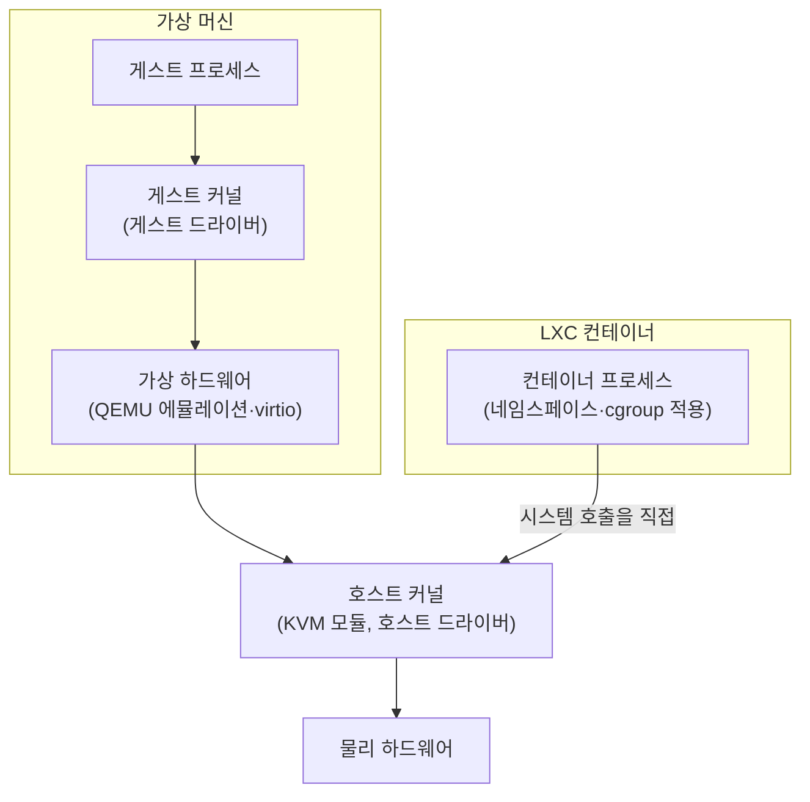
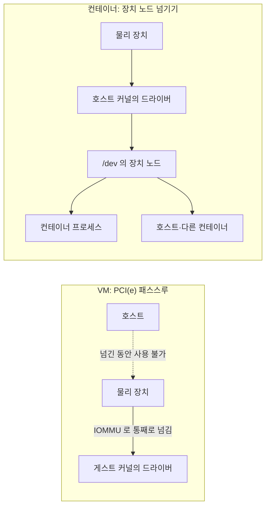

Proxmox VE 는 두 종류의 게스트를 돌립니다. **가상 머신(VM)** 은 QEMU 가 만든 가상 하드웨어 위에서 게스트 운영체제가 자기 커널을 따로 부팅하고, **LXC 컨테이너** 는 호스트 커널을 그대로 쓰면서 프로세스 묶음을 네임스페이스와 cgroup 으로 격리합니다. 두 방식의 차이는 결국 "커널을 공유하느냐" 하나에서 나오고, 격리 수준, 장치를 넘기는 방식, 자원 오버헤드, 실행 중 이전 가능 여부가 모두 여기서 갈립니다.

- **기준:** Proxmox VE 관리 가이드의 "QEMU/KVM Virtual Machines" 장과 "Proxmox Container Toolkit" 장 (문서 버전 9.2.12)

## 왜 구분해야 하는가

같은 서비스를 VM 에 올리느냐 컨테이너에 올리느냐에 따라 할 수 있는 일이 달라집니다.

- **운영체제:** VM 은 윈도우나 FreeBSD 도 돌릴 수 있지만, 컨테이너는 호스트 커널을 쓰므로 리눅스 배포판만 돌립니다.
- **보안:** 컨테이너는 호스트 커널을 공유하므로 커널이 곧 공격 면입니다. 신뢰할 수 없는 사용자에게 줄 게스트라면 VM 이 격리가 더 강합니다.
- **장치:** VM 에 GPU 같은 장치를 주려면 장치 전체를 떼어 넘겨야 하고, 그동안 호스트와 다른 게스트는 그 장치를 못 씁니다. 컨테이너는 호스트 드라이버가 만든 장치 노드만 넘기면 됩니다.
- **자원:** VM 은 게스트 커널과 게스트가 관리하는 메모리를 통째로 따로 가지지만, 컨테이너의 실행 비용은 Proxmox 문서 표현으로 "보통 무시할 만한 수준" 입니다.
- **이전:** VM 은 실행 중에 다른 노드로 옮길 수 있고(라이브 마이그레이션), 컨테이너는 껐다 켜는 재시작 이전만 됩니다.

어느 쪽이 더 낫다기보다, 위 항목 가운데 무엇이 중요한지에 따라 고릅니다.

## 핵심 용어

| 용어 | 뜻 |
| :--- | :--- |
| 가상 머신(VM) | 가상 하드웨어 위에서 게스트 운영체제와 그 커널이 따로 부팅되는 게스트 |
| QEMU | PC 하드웨어를 에뮬레이트하는 오픈 소스 하이퍼바이저. 호스트에서는 사용자 프로세스 하나로 보임 |
| KVM | CPU 의 가상화 확장 기능을 QEMU 가 쓰게 해 주는 리눅스 커널 모듈. Proxmox VE 에서는 QEMU 와 같은 뜻으로 씀 |
| virtio | 게스트가 자신이 가상 머신 안에 있다는 것을 알고 협력하는 반가상화 장치 표준 |
| LXC 컨테이너 | 호스트 커널을 공유하고 네임스페이스와 cgroup 으로 격리한 프로세스 묶음. Proxmox 는 이를 시스템 컨테이너로 다룸 |
| 네임스페이스 | 프로세스가 보는 PID, 네트워크, 마운트, 사용자 ID 같은 자원의 범위를 나누는 커널 기능 |
| cgroup | 프로세스 묶음이 쓰는 CPU, 메모리 같은 자원을 제한하고 집계하는 커널 기능 |
| 비특권 컨테이너 | 사용자 네임스페이스로 컨테이너 안 root(UID 0)를 호스트의 권한 없는 사용자에 매핑한 컨테이너 |
| 특권 컨테이너 | 컨테이너 안 root 가 호스트 root 와 같은 UID 인 컨테이너. AppArmor, seccomp, 네임스페이스로만 막음 |
| idmap | 컨테이너 안 UID/GID 와 호스트(디스크) UID/GID 사이의 대응표 |
| PCI(e) 패스스루 | 호스트의 PCI 장치 하나를 통째로 VM 에 넘겨 VM 이 직접 제어하게 하는 방식 |
| IOMMU | 장치의 메모리 접근을 주소 변환·격리하는 하드웨어. 인텔 VT-d, AMD-Vi 가 해당하고 패스스루의 전제 조건 |
| 장치 노드 | 커널 드라이버가 `/dev` 아래에 만드는 파일. 프로그램은 이 파일을 열어 장치를 씀 |

## 동작 방식

두 방식에서 게스트 프로세스가 하드웨어까지 내려가는 경로를 나란히 놓으면 차이가 드러납니다.



1. **VM:** QEMU 는 호스트에서 보면 사용자 프로세스 하나입니다. 이 프로세스가 메인보드, 디스크 컨트롤러, 네트워크 카드 같은 PC 하드웨어를 소프트웨어로 흉내 내고, KVM 모듈을 통해 CPU 의 가상화 확장을 써서 게스트 코드를 거의 그대로 실행합니다. 게스트 운영체제는 이 가상 하드웨어를 진짜로 여기고 자기 커널과 드라이버로 부팅합니다.
2. **VM 의 장치 비용:** 에뮬레이트한 장치는 하드웨어가 할 일을 호스트 CPU 가 대신하므로 느립니다. 그래서 게스트가 협력하는 virtio 장치를 쓰는 것이 권장됩니다.
3. **컨테이너:** 컨테이너 안 프로세스는 호스트 커널에서 도는 평범한 프로세스입니다. 커널이 네임스페이스로 보이는 범위를 좁히고, cgroup 으로 CPU(`cores`, `cpulimit`, `cpuunits`)와 메모리(`memory`, `swap`)를 제한합니다. 스케줄링도 호스트 스케줄러가 직접 합니다.
4. **컨테이너의 제약:** 호스트를 보호하려고 일부 시스템 호출(예: `mount`)은 AppArmor 프로필과 seccomp 필터로 막혀 있습니다.

## 격리와 보안

컨테이너는 호스트 커널을 공유하므로, 커널의 취약점은 곧 컨테이너 탈출 경로가 됩니다. Proxmox 문서도 모르는 사람에게 게스트를 줄 때는 VM 이 격리가 더 낫다고 적고, 최대 격리와 라이브 마이그레이션이 필요하면 컨테이너를 VM 안에 두는 구성을 권합니다.

컨테이너 안에서도 두 종류로 나뉩니다.

- **비특권 컨테이너(기본값):** 사용자 네임스페이스로 컨테이너 안 UID/GID 를 호스트의 다른 범위에 매핑합니다. Proxmox 위키 설명으로는 보통 컨테이너 안 root(0)가 호스트의 100000 이 되고, 1 은 100001 이 되는 식입니다. 탈출하더라도 호스트에서는 권한 없는 사용자라서, LXC 팀은 이 방식을 설계상 안전하다고 봅니다.
- **특권 컨테이너:** 컨테이너 안 root 가 호스트 root 와 같은 UID 입니다. AppArmor, seccomp, 네임스페이스로만 막으며, LXC 팀은 이 종류의 탈출 취약점을 CVE 로 다루지 않습니다. 신뢰할 수 있는 환경에서만 씁니다.

비특권 컨테이너에서는 이 매핑 때문에 호스트 디렉터리를 바인드 마운트하면 권한 문제가 생길 수 있습니다. 호스트에서 UID 1000 이 가진 파일이 컨테이너 안에서는 매핑 범위 밖이라 소유자가 `nobody` 로 보이기 때문입니다. 이때는 특정 ID 만 그대로 통과시키도록 idmap 을 바꿉니다. Proxmox 는 마운트 포인트마다 `idmap` 옵션을 받으며, 형식은 `종류:컨테이너ID:디스크ID:개수` 입니다.

```text
u:[CONTAINER_UID]:[HOST_UID]:1
```

위 예는 컨테이너 안 `[CONTAINER_UID]` 를 디스크의 `[HOST_UID]` 한 개에 대응시킵니다. 목록에 없는 ID 는 컨테이너 전체의 `lxc.idmap` 을 따릅니다.

## 장치를 넘기는 방식

GPU 처럼 게스트 안에서 하드웨어를 직접 써야 할 때 두 방식의 차이가 가장 크게 드러납니다.



- **VM 은 장치 전체를 넘깁니다.** PCI(e) 패스스루를 쓰면 VM 이 장치를 직접 제어해 지연이 낮고 기능을 온전히 쓰지만, 넘긴 장치는 호스트와 다른 VM 에서 더는 쓸 수 없습니다. CPU 와 메인보드가 IOMMU(인텔 VT-d, AMD-Vi)를 지원해야 하고, 드라이버는 게스트 운영체제 안에 설치합니다. 패스스루 장치가 붙은 VM 은 라이브 마이그레이션도 할 수 없습니다.
- **컨테이너는 장치 노드만 넘깁니다.** 커널 드라이버는 이미 호스트 커널이 올려 두었으므로, 컨테이너에는 그 드라이버가 만든 장치 노드(예: GPU 렌더 노드 `/dev/dri/renderD[N]`)만 보이게 하면 됩니다. 장치를 떼어 내지 않으므로 호스트와 다른 컨테이너도 같은 장치를 계속 쓸 수 있습니다. 여러 프로세스가 동시에 쓸 수 있는지는 장치와 드라이버에 달려 있습니다.

Proxmox 는 컨테이너 설정의 `dev[n]` 옵션으로 장치 노드를 넘기고, 노드의 소유자·그룹·권한을 `uid`, `gid`, `mode` 로 정할 수 있습니다. 비특권 컨테이너에서는 장치 노드의 그룹이 컨테이너 안에서 보이는 그룹(예: `render`)이어야 프로세스가 열 수 있으므로 `gid` 를 함께 맞춥니다.

```text
dev0: /dev/dri/renderD[N],gid=[CONTAINER_RENDER_GID]
```

커널 드라이버는 호스트의 것을 쓰지만, 그 드라이버를 부르는 사용자 공간 라이브러리(예: GPU 의 Vulkan·OpenGL 구현)는 컨테이너 안에 따로 설치해야 합니다.

## 자원 오버헤드

- **VM 의 메모리:** 게스트 운영체제는 받은 메모리를 자기 것으로 여기고 커널, 프로세스, 페이지 캐시로 채웁니다. 호스트에서 보면 이 메모리는 QEMU 프로세스가 잡고 있는 메모리라서, 게스트 안에서 비워도 그 사실을 호스트에 알리는 장치가 없으면 호스트로 돌아오지 않습니다. 이 문제를 다루는 장치가 메모리 벌루닝입니다(/posts/66/).
- **컨테이너의 메모리:** 호스트 커널이 cgroup 으로 상한만 걸어 둡니다. 컨테이너 안 프로세스가 끝나면 그 프로세스의 메모리는 호스트 커널에서 바로 해제되고, 컨테이너가 읽은 파일의 페이지 캐시도 호스트 커널의 캐시라서 호스트가 필요할 때 회수합니다.
- **CPU:** 두 방식 모두 CPU 명령을 직접 실행하지만, VM 은 장치 입출력과 게스트 커널이 추가로 드는 반면 컨테이너는 호스트 커널의 시스템 호출을 그대로 씁니다.
- **디스크:** VM 은 가상 디스크 이미지 안에 게스트 파일 시스템을 따로 둡니다. 컨테이너의 루트 파일 시스템과 마운트 포인트는 호스트 스토리지의 볼륨이나 디렉터리입니다.

## 비교

| 구분 | VM (QEMU/KVM) | LXC 컨테이너 |
| :--- | :--- | :--- |
| 커널 | 게스트가 자기 커널을 부팅 | 호스트 커널을 공유 |
| 게스트 운영체제 | 리눅스, 윈도우, BSD 등 | 리눅스 배포판만 |
| 격리 | 가상 하드웨어 경계. 더 강함 | 네임스페이스, cgroup, AppArmor, seccomp. 커널이 공격 면 |
| 장치 사용 | PCI(e) 패스스루로 장치 전체를 독점 | 호스트 드라이버의 장치 노드를 공유 |
| 드라이버 위치 | 게스트 커널 안 | 호스트 커널 (사용자 공간 라이브러리만 컨테이너 안) |
| 메모리 | 게스트가 관리. 벌루닝 없이는 호스트로 돌아오지 않음 | cgroup 상한. 프로세스가 끝나면 호스트가 바로 해제 |
| 실행 중 이전 | 라이브 마이그레이션 가능 (패스스루 장치가 없을 때) | 불가. 껐다 켜는 재시작 이전만 |
| 알맞은 상황 | 리눅스가 아닌 운영체제, 신뢰할 수 없는 사용자, 자체 커널 모듈이 필요한 서비스, 쿠버네티스 노드처럼 무중단 이전이 필요한 게스트 | 리눅스 서비스를 가볍게 여러 개 돌릴 때, 호스트 GPU 를 여러 게스트가 나눠 쓸 때, 메모리를 쓴 만큼만 잡고 싶을 때 |

## 흔한 오해

<details markdown="1">
<summary>컨테이너 안 root 는 호스트 root 와 같다</summary>

- **실제:** 비특권 컨테이너(Proxmox 기본값)에서는 컨테이너 안 root 가 호스트의 권한 없는 UID(보통 100000)에 매핑됩니다. 호스트 root 와 같은 것은 특권 컨테이너뿐입니다.
- **근거:** Proxmox VE 관리 가이드 "Unprivileged Containers", Proxmox 위키 "Unprivileged LXC containers"

</details>

<details markdown="1">
<summary>GPU 를 게스트에 주려면 항상 PCI 패스스루가 필요하다</summary>

- **실제:** 패스스루는 VM 에 장치를 넘기는 방식입니다. 컨테이너는 호스트 커널이 드라이버를 쥐고 있으므로 장치 노드만 넘기면 되고, 호스트와 다른 컨테이너도 계속 그 장치를 쓸 수 있습니다.
- **근거:** Proxmox VE 관리 가이드 "PCI(e) Passthrough", 컨테이너 설정 옵션 `dev[n]`

</details>

<details markdown="1">
<summary>컨테이너도 VM 처럼 실행 중에 다른 노드로 옮길 수 있다</summary>

- **실제:** Proxmox 의 컨테이너는 기술적 제약으로 실행 중 이전이 되지 않습니다. 컨테이너를 끄고 옮긴 뒤 다시 켜는 재시작 이전만 지원합니다.
- **근거:** Proxmox VE 관리 가이드 "Migration" (Container Toolkit 장)

</details>

## 정리

> - VM 은 게스트가 자기 커널을 부팅하고, LXC 컨테이너는 호스트 커널을 공유합니다. 나머지 차이는 모두 여기서 나옵니다.
> - 격리는 VM 이 더 강하고, 컨테이너는 비특권(사용자 네임스페이스)으로 만들어 위험을 줄입니다.
> - 장치는 VM 이면 패스스루로 통째로 독점하고, 컨테이너면 호스트 드라이버의 장치 노드를 넘겨 함께 씁니다.
> - 메모리는 VM 이 게스트 안에 붙들고, 컨테이너는 cgroup 상한 아래에서 쓴 만큼만 씁니다.
{: .prompt-tip }

## 참고 자료

- [Proxmox VE Administration Guide - Proxmox Container Toolkit](https://pve.proxmox.com/pve-docs/chapter-pct.html)
- [Proxmox VE Administration Guide - Unprivileged Containers](https://pve.proxmox.com/pve-docs/chapter-pct.html#_unprivileged_containers)
- [Proxmox VE Administration Guide - Container Mount Points](https://pve.proxmox.com/pve-docs/chapter-pct.html#pct_mount_points)
- [Proxmox VE Administration Guide - Container Security Considerations](https://pve.proxmox.com/pve-docs/chapter-pct.html#_security_considerations)
- [Proxmox VE Administration Guide - QEMU/KVM Virtual Machines](https://pve.proxmox.com/pve-docs/chapter-qm.html)
- [Proxmox VE Administration Guide - PCI(e) Passthrough](https://pve.proxmox.com/pve-docs/chapter-qm.html#qm_pci_passthrough)
- [Proxmox VE Administration Guide - VM Migration](https://pve.proxmox.com/pve-docs/chapter-qm.html#qm_migration)
- [Proxmox VE Wiki - Unprivileged LXC containers](https://pve.proxmox.com/wiki/Unprivileged_LXC_containers)
- [Linux Containers - LXC](https://linuxcontainers.org/lxc/introduction/)
