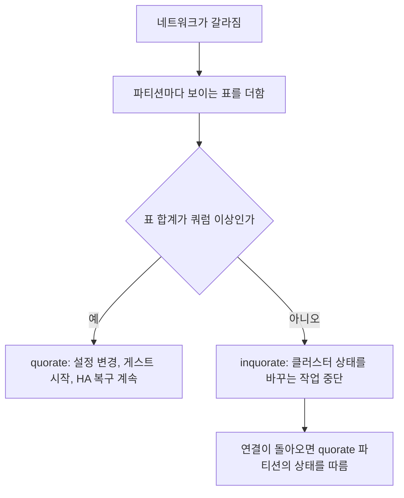
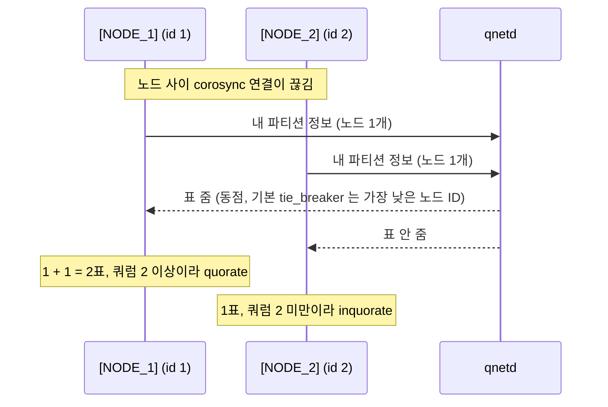

**쿼럼(quorum)**은 클러스터가 상태를 바꾸는 작업을 하려면 얻어야 하는 최소 표 수입니다. 네트워크가 끊겨 노드들이 여러 무리로 갈라져도 표의 **과반(majority)**을 가진 한 무리만 계속 상태를 바꾸게 해서, 서로 모르는 두 무리가 같은 설정이나 같은 VM 을 동시에 바꾸는 일을 막습니다. 이 글은 Proxmox VE 가 쓰는 corosync 의 투표 방식(votequorum)과 외부 투표 장치(QDevice)를 기준으로 설명합니다.

- **기준:** Proxmox VE 9.2 관리 문서(Cluster Manager, Proxmox Cluster File System, High Availability), corosync `votequorum(5)` 3.1.9, `corosync-qdevice(8)`·`corosync-qnetd(8)` 3.0.3 (Debian trixie 패키지)

## 왜 필요한가

클러스터의 노드들은 설정과 상태를 서로 복제해 같은 값을 봅니다. 그런데 노드 사이 네트워크만 끊기고 노드는 모두 살아 있으면, 각 노드는 상대가 죽었는지 연결만 끊겼는지 구별할 수 없습니다. 이때 양쪽이 모두 "상대가 죽었으니 내가 맡는다"고 판단하면 두 무리가 각자 설정을 바꾸고 같은 VM 을 각자 띄웁니다. 이 상태를 **스플릿 브레인(split-brain)**이라고 합니다. 공유 스토리지에 두 노드가 동시에 쓰면 VM 디스크가 망가질 수 있습니다.

쿼럼은 이 문제를 "표의 과반을 가진 쪽만 움직인다"는 규칙으로 풉니다. 서로 겹치지 않는 두 무리가 동시에 전체 표의 절반을 넘길 수는 없으므로, 어떻게 갈라지든 움직일 수 있는 무리는 많아야 하나입니다. 과반을 못 가진 무리는 스스로 멈추고, 연결이 돌아오면 과반 쪽의 상태를 따릅니다.

같은 원리는 etcd 같은 합의 알고리즘에도 쓰입니다. etcd 가 과반으로 리더를 뽑고 쓰기를 확정하는 과정은 (/posts/61/) 에서 다룹니다.

## 핵심 용어

| 용어 | 뜻 |
| :--- | :--- |
| 쿼럼(quorum) | 상태를 바꾸는 작업에 필요한 최소 표 수. votequorum 은 기대 표 수의 절반보다 1 많은 값(`expected_votes / 2 + 1`, 소수점 버림)을 씁니다 |
| 과반(majority) | 전체 표의 절반을 넘는 수. 쿼럼을 과반으로 잡아야 두 무리가 동시에 쿼럼을 가질 수 없습니다 |
| 스플릿 브레인(split-brain) | 갈라진 무리들이 서로 모른 채 각자 상태를 바꾸는 상황 |
| 파티션(partition) | 네트워크 장애로 서로 통신할 수 있는 노드끼리 묶인 무리 |
| 기대 표 수(expected votes) | 클러스터에 있어야 할 전체 표 수. corosync 는 `nodelist` 의 노드별 표를 더해 계산하고, `quorum.expected_votes` 로 덮어쓸 수 있습니다 |
| 쿼럼 보유(quorate) | 현재 파티션이 쿼럼 이상의 표를 가진 상태. 반대는 inquorate |
| 타이브레이커(tie-breaker) | 같은 크기의 파티션 가운데 어느 쪽이 표를 받을지 정하는 규칙이나 장치 |
| QDevice | 각 노드에서 돌며 외부 판정 서버의 결정에 따라 클러스터에 표를 더해 주는 데몬(`corosync-qdevice`) |
| qnetd | QDevice 들이 TCP 로 붙는 외부 판정 서버(`corosync-qnetd`). 한 번에 한 파티션에만 표를 줍니다 |
| 증인 노드(witness node) | 워크로드를 싣지 않고 투표만 하려고 두는 작은 클러스터 멤버 |
| 펜싱(fencing) | 장애 노드가 공유 자원에 더는 접근하지 못하게 확실히 끄는 일 |

## 동작 방식

노드마다 표가 있고(Proxmox VE 는 기본으로 노드당 1표), 각 **파티션(partition)**은 자기가 볼 수 있는 표를 더해 쿼럼과 비교합니다.

1. corosync 가 서로 통신할 수 있는 노드끼리 멤버십을 만듭니다.
2. votequorum 이 그 멤버십의 표를 더합니다.
3. 합계가 쿼럼 이상이면 그 파티션은 **quorate** 이고, 모자라면 inquorate 입니다.
4. 과반 규칙 때문에 quorate 파티션은 동시에 둘 이상 생기지 않습니다.

노드 수별 쿼럼과 버틸 수 있는 장애 노드 수는 다음과 같습니다(노드당 1표, 타이브레이커 없음).

| 노드 수 | 쿼럼 | 버틸 수 있는 장애 노드 |
| :--- | :--- | :--- |
| 1 | 1 | 0 |
| 2 | 2 | 0 |
| 3 | 2 | 1 |
| 4 | 3 | 1 |
| 5 | 3 | 2 |

노드를 짝수로 늘려도 버틸 수 있는 장애 수는 늘지 않습니다. 4 노드 클러스터가 2:2 로 갈라지면 어느 쪽도 3표를 못 가져 둘 다 멈춥니다.

## 두 노드 클러스터가 한 대만 죽어도 멈추는 이유

두 노드면 **기대 표 수(expected votes)**가 2, 쿼럼이 2입니다. 한 대가 꺼지면 남은 노드는 1표뿐이라 쿼럼에 못 미칩니다. 남은 노드 입장에서는 상대가 꺼진 것인지 연결만 끊긴 것인지 알 수 없으므로, 1표로 움직이게 두면 연결만 끊겼을 때 두 노드가 각자 움직이는 스플릿 브레인이 됩니다. 그래서 과반 규칙은 두 노드 클러스터에서 "둘 다 살아 있어야 한다"는 뜻이 됩니다. 노드를 둘로 늘린 것이 가용성을 높이지 못하고, 오히려 한 대일 때보다 멈출 원인이 하나 늘어난 셈입니다.

corosync 의 votequorum 에는 이를 위한 `two_node` 옵션도 있습니다. 켜면 쿼럼을 인위로 1로 두고, 시작할 때 두 노드가 한 번은 함께 보여야 쿼럼을 얻는 `wait_for_all` 이 같이 켜집니다. 다만 쿼럼이 1이면 두 노드가 서로 끊겼을 때 양쪽 모두 쿼럼을 가지므로, 누가 계속할지는 투표가 아닌 다른 장치(**펜싱(fencing)** 등)로 정해야 합니다. Proxmox VE 문서는 두 노드 클러스터에 가용성이 필요하면 아래의 QDevice 를 권합니다.

## 타이브레이커: QDevice 와 증인 노드

두 노드의 표 싸움을 풀려면 세 번째 표를 주는 **타이브레이커(tie-breaker)**가 필요합니다. 방법은 두 가지입니다.

- **증인 노드:** 세 번째 노드를 클러스터 멤버로 넣되 게스트를 싣지 않습니다. 다른 노드와 똑같은 멤버이므로 corosync 의 네트워크 요구(모든 노드 사이 5ms 미만의 지연)를 똑같이 받습니다.
- **QDevice:** 클러스터 밖의 서버에서 **qnetd** 를 돌리고, 각 노드의 QDevice 데몬이 TCP 로 붙습니다. Proxmox VE 문서에 따르면 QDevice 는 corosync 처럼 낮은 지연을 요구하지 않아 클러스터 LAN 밖에 둘 수 있습니다. 여러 클러스터가 qnetd 하나를 같이 쓸 수 있습니다.

두 노드에 QDevice 를 붙이면 기대 표 수가 3, 쿼럼이 2가 됩니다.

1. 한 노드가 꺼지면 남은 노드의 1표와 QDevice 의 1표로 2표가 되어 계속 움직입니다.
2. 두 노드 사이 연결만 끊기고 둘 다 qnetd 에 닿으면, qnetd 가 한쪽에만 표를 줍니다. 기본 알고리즘 `ffsplit` 은 활성 노드가 더 많은 파티션을 고르고, 같으면 휴리스틱 점수, 그다음 qnetd 에 붙은 노드 수를 보고, 그래도 같으면 `tie_breaker`(기본 `lowest`, 가장 낮은 노드 ID) 로 정합니다. 기본으로 켜진 `keep_active_partition_tie_breaker` 는 동점일 때 직전에 quorate 였던 파티션의 멤버가 있는 쪽을 먼저 고릅니다.
3. qnetd 가 멈추면 두 노드끼리 2표라 그대로 quorate 입니다. `ffsplit` 은 qnetd 연결이 살아 있을 때만 표를 주므로, qnetd 장애는 QDevice 가 없는 상태와 같습니다.
4. 한 노드와 qnetd 가 함께 멈추면 남은 표가 1이라 inquorate 입니다.

QDevice 가 주는 표 수는 알고리즘에 따라 다릅니다. `ffsplit` 은 짝수 노드 클러스터에만 의미가 있고 정확히 1표를 줍니다. `lms`(last man standing) 는 기본으로 `노드 수 - 1` 표를 주어, qnetd 에 닿는 노드가 하나만 남아도 쿼럼을 유지하게 합니다. Proxmox VE 문서는 홀수 노드 클러스터에 QDevice 를 권하지 않습니다. 홀수 클러스터에서는 QDevice 가 `N - 1` 표를 받아야 스플릿 브레인이 생기지 않는데, 그러면 qnetd 자체가 멈췄을 때 노드가 하나도 더 죽으면 안 되어 사실상 단일 장애점이 되고, 노드 하나만 남아 모든 HA 게스트를 떠안는 상황도 생길 수 있기 때문입니다.

## 기대 표 수를 손으로 바꾸기

`pvecm expected [VOTES]` 는 기대 표 수를 실행 중에 바꿉니다. 예를 들어 1로 낮추면 노드 하나만으로 쿼럼이 되어 설정을 고칠 수 있습니다. Proxmox VE 문서는 이를 쿼럼을 잃은 노드에서 설정을 고치거나 떨어져 나간 노드를 지울 때 쓰는 우회 방법으로 소개하고, 무엇을 하는지 이해할 때만 쓰라고 합니다. 꺼진 줄 알았던 다른 노드가 사실 살아서 따로 움직이고 있었다면, 양쪽이 각자 쿼럼을 가진 스플릿 브레인을 사람이 직접 만든 것이 됩니다.

## Proxmox VE 가 쿼럼을 잃으면

Proxmox VE 는 쿼럼을 잃은 노드에서 클러스터를 읽기 전용으로 바꿉니다. 문서에 나온 동작은 다음과 같습니다.

| 영역 | 쿼럼이 없을 때 |
| :--- | :--- |
| 클러스터 파일 시스템(pmxcfs, `/etc/pve`) | 읽기 전용이 됩니다. 게스트 설정, 스토리지 정의, `corosync.conf` 처럼 여기에 있는 설정을 바꿀 수 없습니다 |
| 상태 변경 | 네트워크가 갈라졌을 때 상태 변경에는 노드 과반이 필요하므로, 게스트 생성·시작·설정 변경 같은 작업을 할 수 없습니다 |
| 부팅 시 자동 시작 | `pve-guests` 서비스가 쿼럼을 기다렸다가 `onboot` 게스트를 시작합니다. 정전 뒤 노드 일부만 켜져 쿼럼이 안 되면 게스트가 뜨지 않습니다 |
| HA 서비스가 있는 노드 | LRM 이 새 쿼럼을 기다리는 동안 watchdog 을 갱신하지 못해, 활성 HA 서비스가 있으면 60초 뒤 노드가 스스로 재부팅(자가 펜싱)합니다 |
| quorate 쪽 파티션 | 쿼럼을 잃은 노드의 잠금을 얻을 수 있으면, 펜싱이 끝난 뒤 그 노드의 HA 서비스를 다른 노드에서 다시 시작합니다 |

HA 가 관리하지 않는 게스트를 쿼럼 상실 때문에 멈춘다는 설명은 문서에 없습니다. HA 가 쿼럼을 잃은 노드를 재부팅하는 것은, quorate 쪽이 그 노드의 서비스를 다른 곳에서 다시 띄울 때 같은 VM 이 두 곳에서 도는 일을 막기 위해서입니다. Proxmox VE 문서가 HA 에 노드 세 대 이상을 요구하는 것도 믿을 수 있는 쿼럼을 얻기 위해서입니다.

## 흔한 오해

쿼럼은 살아 있는 노드 수의 과반이다

- **실제:** 쿼럼은 노드 수가 아니라 기대 표 수로 계산합니다. QDevice 의 표도 기대 표 수에 들어가고, 노드별 표 수를 1이 아닌 값으로 줄 수도 있습니다. 또 기준은 지금 살아 있는 노드가 아니라 클러스터에 있어야 할 전체 표입니다.
- **근거:** `votequorum(5)` 는 `nodelist` 에서 기대 표 수를 계산하고 쿼럼을 그 50% + 1 로 둔다고 설명합니다. `pvecm status` 도 `Expected votes`, `Total votes`, `Quorum` 을 따로 보여 줍니다.

QDevice 는 노드 수와 상관없이 붙일수록 좋다

- **실제:** 짝수 노드 클러스터에서는 1표를 더해 가용성만 높이지만, 홀수 노드 클러스터에서는 `N - 1` 표를 가져 qnetd 가 거의 단일 장애점이 됩니다.
- **근거:** Proxmox VE Cluster Manager 문서의 Supported Setups 는 짝수 노드 클러스터, 특히 두 노드 클러스터에 권하고 홀수 노드 클러스터에는 권하지 않습니다.

QDevice 도 클러스터 노드처럼 낮은 지연이 필요하다

- **실제:** QDevice 는 corosync 멤버가 아니라 TCP 로 qnetd 에 붙으므로 corosync 의 낮은 지연 요구를 받지 않고, 클러스터 LAN 밖에 둘 수 있습니다. 세 번째 노드를 증인으로 두는 경우와 다른 점입니다.
- **근거:** Proxmox VE Cluster Manager 문서의 QDevice Technical Overview.

## 정리

> - 쿼럼은 상태를 바꾸는 데 필요한 표의 과반이고, 과반이라서 두 파티션이 동시에 움직이는 스플릿 브레인을 막습니다.
> - 두 노드 클러스터는 쿼럼이 2라 한 대만 꺼져도 멈추고, 세 번째 표(QDevice 나 증인 노드)가 있어야 한 대 장애를 버팁니다.
> - QDevice 의 qnetd 는 한 번에 한 파티션에만 표를 주고, 짝수 노드 클러스터에서는 멈춰도 QDevice 가 없는 상태와 같습니다.
> - Proxmox VE 는 쿼럼을 잃으면 `/etc/pve` 를 읽기 전용으로 두고, HA 서비스가 있는 노드는 watchdog 으로 스스로 재부팅합니다.
{: .prompt-tip }

## 참고 자료

- [Cluster Manager - Proxmox VE 문서](https://pve.proxmox.com/pve-docs/chapter-pvecm.html)
- [Proxmox Cluster File System (pmxcfs) - Proxmox VE 문서](https://pve.proxmox.com/pve-docs/chapter-pmxcfs.html)
- [High Availability - Proxmox VE 문서](https://pve.proxmox.com/pve-docs/chapter-ha-manager.html)
- [votequorum(5) - Debian 매뉴얼](https://manpages.debian.org/trixie/corosync/votequorum.5.en.html)
- [corosync-qdevice(8) - Debian 매뉴얼](https://manpages.debian.org/trixie/corosync-qdevice/corosync-qdevice.8.en.html)
- [corosync-qnetd(8) - Debian 매뉴얼](https://manpages.debian.org/trixie/corosync-qnetd/corosync-qnetd.8.en.html)
